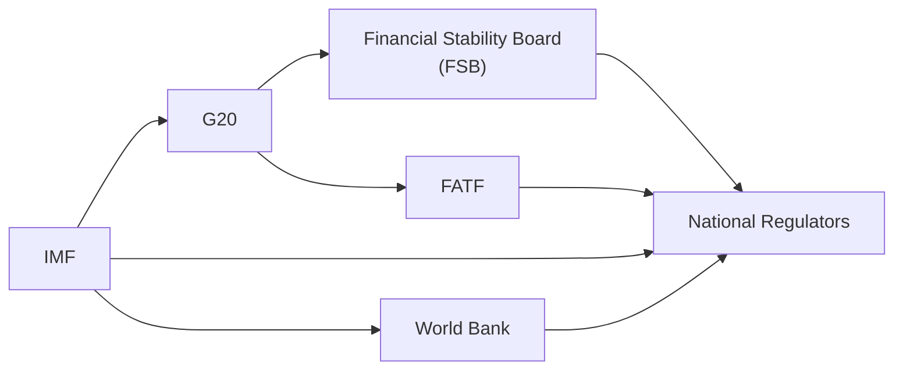

It’s easy to imagine that international financial regulation is one big tangled web—lots of acronyms, committees, high-level meetings, and shifting priorities. Um, it can feel overwhelming at first. However, these international coordinating bodies actually help align countries, regulators, and industry players around common objectives like financial stability, transparency, and ethical conduct. Let’s take a relaxed but thorough journey through the roles, responsibilities, and impacts of these global institutions. Along the way, I’ll share a personal anecdote or two and break down the concepts so that you get a solid grasp on how they all fit together—especially from an exam standpoint. And if you’re managing portfolio compliance or just want to be an all-around ethical champion in the industry, these insights will absolutely come in handy.

Global finance is not just about the movement of money across borders. It’s also about striking a balance between domestic priorities and global objectives—ensuring that markets remain stable and that ethical standards are upheld from Buenos Aires to Beijing. This section is about the coordinating bodies that tie all these threads together. We’ll look at how they operate, why they matter, and what you should keep in mind when analyzing cross-border investments or encountering real-world ethical dilemmas.

Roles of Major International Coordinating Bodies

Most of the time, you hear acronyms like IMF or FSB in the news, especially if there’s a financial crisis lurking around the corner. Some folks even joke that the G in G20 stands for “gathering,” because these forums often entail a lot of meeting and greeting. But let’s remove the mystery and see how they shape policy, issue guidelines, and sometimes provide a bit of moral—or even financial—support to nations in need.

International Monetary Fund (IMF)

The IMF is like the global central bank’s friend, working to ensure that monetary cooperation runs smoothly. In simpler terms, think of the IMF as a financial safety net and policy advisor. If you’re a novelist, you might think of them as the wise mentor figure—always there with advice and resources to help countries maintain stable exchange rates, sustainable debt levels, and robust economic structures.

• Mandate: The IMF’s mission is to stabilize international exchange rates, facilitate balanced economic growth, and provide resources (often short-term loans) to countries experiencing balance of payments woes. This is critical if a country you’re invested in is teeter-tottering on currency devaluation or facing a liquidity squeeze.

• Ethical Influence: The IMF also sets conditions for loans (often called “IMF conditionality”), which can push countries to enact reforms aimed not only at economic stability but also improved governance. These reforms can steer countries toward better compliance with global best practices, reduce corruption, and enhance accountability. From an investor standpoint, when the IMF steps in, it can reduce systemic risk and restore confidence in local markets—though sometimes policies can be controversial at home.

• Real-World Tie-In: Suppose you’re a portfolio manager holding sovereign bonds in a nation that’s on the brink of default. An IMF-led bailout or restructuring plan might be your saving grace. When the IMF steps in, we often see a short-term market bounce due to renewed investor confidence. However, keep an eye out for any conditions that might lead to austerity measures, as these can affect growth prospects down the line.

World Bank

The World Bank is sometimes conflated with the IMF, but it has a different, although complementary, mission: reducing poverty and fostering development. If the IMF is the wise mentor offering policy advice, the World Bank might be the practical teacher offering grants, low-interest loans, and technical assistance for building infrastructure and improving social services.

• Mandate: The Bank provides financial and technical assistance primarily to developing countries to fund projects—think roads, schools, and hospitals. It aims to improve economic prospects and reduce inequality, which in turn can support more stable and ethical financial systems.

• Ethical Influence: Programs funded by the World Bank often come with transparency and governance conditions. By tying funding to environmental, social, and governance (ESG) standards, the Bank essentially nudges countries toward better ethical conduct. For instance, if you see a big hydroelectric project financed by the World Bank, chances are there are also guidelines about environmental protection and community resettlement processes, which reflect broader international ethical norms.

• Practical Lesson: As an investor, projects backed by the World Bank can open the door to new opportunities in emerging markets. They also typically signal a certain threshold of regulatory and ethical oversight—important for controlling reputational risk. After all, you don’t want your portfolio returns tarnished by allegations of environmental misconduct or resource mismanagement.

G20 (Group of Twenty)

Think of the G20 as the global discussion club for the big players—19 countries plus the European Union—where top leaders and finance ministers talk shop about economic policy. If you’ve ever been part of a large group project at school, you’ll appreciate the challenges in building consensus among 20 different voices.

• Mandate: The G20’s broad aim is to achieve international financial stability and sustainable growth. They identify challenges—like the 2008 financial crisis—and coordinate solutions. They regularly issue official communiqués that set policy directions or outline key areas of concern.

• Policy and Coordination: While the G20 doesn’t create binding laws, it’s hugely influential. Its recommendations often prompt member countries to enact domestic legislation or reforms that align with those discussions. For a portfolio manager, statements from the G20 can hint at regulatory shifts—like new capital requirements, sustainability reporting obligations, or changes in cross-border investment policies.

• Consensus-Building: G20 membership is diverse, ranging from China to Brazil to the United States. Reaching a consensus on ethical standards or financial regulation can be tricky. But once the G20 signals a collective stance, non-member countries often follow suit, because aligning with G20 recommendations boosts foreign investment appeal and fosters trust.

Financial Stability Board (FSB)

Launched in the aftermath of the 2008 financial crisis, the FSB monitors the global financial system and tries to ensure no cracks slip through the policy radar. If the IMF is the wise mentor and the World Bank is the teacher, the FSB might be the engineering team making sure the system’s blueprints are robust.

• Mandate: The FSB makes recommendations for the global financial system, focusing on systemic risks and vulnerabilities—like “Too Big To Fail” banks. It’s about preventing the next financial meltdown by identifying potential trouble spots and pushing for consistent regulation across the different jurisdictions, whether in the US, Europe, or emerging markets.

• Ethical Impact: Ensuring financial stability is also about promoting transparency, accountability, and good conduct across major financial institutions. In an ideal world, stable markets and ethical behavior go hand in hand: less financial crime, reduced misconduct risks, and more sustainable growth. The FSB fosters cooperation among national regulators and standard-setters, like the Basel Committee on Banking Supervision, which has direct implications for capital adequacy rules.

• Investor Perspective: If you manage portfolios that span multiple markets, the FSB’s recommended standards—like tighter capital requirements or improved disclosure—can enhance investor confidence. It could reduce the risk premiums you demand when investing in global banks or insurance companies.

Financial Action Task Force (FATF)

Money laundering and terrorist financing are major threats to the stability and integrity of global finance, and that’s where the FATF steps in. It’s an intergovernmental body that basically polices the flow of illicit funds and sets guidelines to clamp down on criminal and terrorist activities.

• Mandate: FATF publishes a set of Recommendations—like the 40 Recommendations—outlining how countries should regulate financial institutions and other entities to detect and prevent illegal money flows.

• Compliance: Full compliance with FATF standards is a big deal. If a country is labeled as high-risk or non-compliant, foreign investors might be wary, and major banks might shun dealing with entities in that jurisdiction. In extreme cases, being on the FATF’s “blacklist” can cripple a nation’s access to global finance.

• Ethical Standards: The FATF is a prime example of how global coordinating bodies can shape ethical standards. Implementing strict anti-money-laundering (AML) and counter-terrorist financing (CFT) measures not only protects the financial system but also aligns with broader ethical obligations to prevent wrongdoing. As an investment professional, you’ll want to verify that your counterparties or investee companies aren’t flagged for suspicious activity. This isn’t just about the law; it’s about preserving your organization’s reputation.

Setting Global Standards and Consensus-Building

Policy is one thing; getting dozens of countries with very different economic and political interests to agree is quite another. This consensus-building process often involves:

• Forums and Committees: Negotiations typically happen in specialized groups, sometimes behind closed doors. For example, the G20 might set an overarching direction—like more stringent data reporting for derivative products—then pass it down to the FSB to flesh out the technical details, which eventually filters down to national regulators.

• Draft Guidelines and Public Consultations: Many global bodies release drafts of their guidelines for public comment. Industry participants, advocacy groups, and any interested parties can weigh in. This open dialogue can be pivotal for ethical standards too, as it ensures a wide range of perspectives, from consumer protection advocates to big banks.

• Implementation and Follow-Up: Once guidelines are finalized, national authorities adopt or adapt them into local laws. Then the real challenge begins—ensuring consistent enforcement across different markets.

The “Membership Perks” and Obligations

When countries join these organizations—or commit to following their recommendations—they often gain credibility, investor confidence, and sometimes direct financial or technical assistance. However, membership also means obligations: implementing reforms, disclosing accurate data, and adhering to protocols that might conflict with local norms. For example, adopting IFRS or converging to certain capital adequacy standards might upend a country’s local accounting rules, but it opens the door to global capital flows.

Here’s a quick example: A friend of mine once worked in a smaller emerging market central bank, which recently joined global transparency initiatives championed by the IMF. She told me how local staffers had to hustle to meet the new reporting deadlines and data disclosure standards. But the flipside was a massive boost in credibility—foreign investors started seeing the country as a safer bet, and that lowered borrowing costs. This illustrates the direct trade-off or synergy between obligations and benefits.

Influence on Domestic Regulations and Ethical Practices

Official communiqués, action plans, and directives from these coordinating bodies trickle down to shape local rules. For instance, an anti-money-laundering directive from the FATF can lead to new “know your customer” (KYC) rules or transaction reporting thresholds in multiple countries. A policy brief from the G20 might encourage more robust ESG disclosure, prompting local regulators to introduce new climate risk reporting requirements.

From an ethical standpoint, alignment with global standards can push local markets to raise the bar on topics like transparency, corporate governance, environmental standards, and fair market access. Investors, regulators, and professional bodies (like the CFA Institute) frequently adopt these global norms, re-enforcing the synergy between ethics and stable markets.

Challenges in Implementation

Of course, it’s not all sunshine. There are legitimate challenges:

• Cultural and Legal Clashes: In some jurisdictions, certain disclosure requirements or governance standards might conflict with traditions of secrecy or confidentiality. This can cause friction when implementing “universal” guidelines.

• Resource Constraints: Some of the recommended changes are financially or administratively burdensome—particularly for developing countries where regulatory agencies may be understaffed, and technological infrastructure is limited.

• Varying Enforcement Standards: Even when policies are adopted, enforcement might be uneven. This can create regulatory arbitrage opportunities—less scrupulous actors flock to jurisdictions where oversight is weaker.

• Political Resistance: Governments might resist certain changes if they perceive them to undermine sovereignty or reveal politically sensitive information. Recent tensions among G20 members highlight how political will can waver, slowing down policy implementation.

Practical Examples and Case Studies

Case Study: FATF and Virtual Assets  
Imagine a digital asset exchange in Country X that remains largely unregulated. FATF guidelines require that all such exchanges implement robust KYC to prevent money laundering. Yet Country X’s local laws have no framework for virtual assets, which leads to confusion and sometimes chaotic enforcement attempts. Eventually, after FATF engagement and being flagged in a mutual evaluation, Country X passes new AML legislation that covers virtual assets—improving oversight and boosting investor confidence in that region’s crypto sector. But tension arises with citizens who value anonymity, and some local officials worry about over-regulation stifling tech innovation. Sound familiar?

Case Study: IMF and Sovereign Debt Reforms  
A nation bogged down by unsustainable debt requests an IMF rescue package. The IMF conditions the loan on stricter budget discipline, anti-corruption measures, and improved tax collection. Domestically, these reforms might not be popular, especially if they involve painful subsidy cuts or wage constraints. However, from a global investor’s perspective, they demonstrate a commitment to improved governance. Over time, if the reforms succeed, the country’s bond ratings might improve, lowering its cost of capital and benefiting local capital markets.

Connecting the Dots: Why Coordinating Bodies Matter for Ethical and Professional Standards

Ethics is not just about telling the truth or avoiding fraud (though that’s certainly important!). At a higher level, ethical financial systems require consistent principles of fairness, accountability, transparency, and social responsibility. International coordinating bodies mold these principles by:

• Setting Shared Norms: When the FSB recommends stress tests for large financial institutions, it’s not just about ensuring capital buffers; it’s about ethical conduct in how institutions manage risks to protect stakeholders and taxpayers from potential bailouts.

• Promoting Stability: A stable financial environment reduces the temptation for unethical behavior, such as risky speculation, manipulation, or insider trading. If markets are consistent and transparent, malicious acts are more easily spotted and punished.

• Facilitating Accountability: Entities like the IMF and World Bank tie financing or advisory support to measures that require accountability—whether that’s reducing corruption or improving public sector transparency. This dynamic fosters a culture of trust.

Diagram: Interrelationships of Key Coordinating Bodies

Below is a simple Mermaid diagram showing how some of these organizations interact, pass on recommendations, and influence national authorities:

While somewhat simplified, this chart highlights the pattern of coordination. The G20 sets broad policy directions, which inform the FSB and FATF. Meanwhile, the IMF and World Bank engage directly with national authorities, influencing their legal frameworks, while also coordinating with the G20 on macroeconomic issues.

Strategies for Harmonizing with Global Norms

Especially if you’re working in an emerging or frontier market, or if you’re dealing with cross-border clientele, keep these strategies in mind:

• Engage with Local Regulators: If new rules stemming from FSB or FATF guidelines could disrupt your firm’s business, be proactive. Provide feedback, suggest workable solutions, and ensure compliance frameworks are in place early.

• Build Ethical Capacity: Train staff and colleagues on global standards—like AML best practices or IFRS for reporting—so that your organization can smoothly align with international norms.

• Embrace Technology: Many global standards call for improved data reporting and analytics. Deploy advanced systems for transaction monitoring, risk assessment, and compliance. Yes, there’s an upfront cost, but it pays dividends in reputational and operational efficiency.

• Watch for Cross-Border Developments: Keep an ear to the ground on G20 announcements, IMF or World Bank analyses, and FSB pronouncements—these can herald major shifts in capital requirements, corporate disclosure obligations, or accepted best practices.

Exam Relevance and Best Practices for Candidates

In a CFA exam context, you might encounter scenario-based questions where a country’s regulatory environment is in flux due to new IMF or G20 guidance. Or you could face an item set dissecting how a firm’s compliance with FATF standards affects client onboarding and KYC processes. The essential points are:

• Understand the Roles: You don’t need to memorize every detail of each body’s charter, but you should know what the IMF, World Bank, G20, FSB, and FATF basically do and how they shape finance.

• Connect Standards to Ethical Conduct: Remember that global bodies often emphasize transparency, accountability, and fairness—core pillars in the CFA Institute Code of Ethics and Standards of Professional Conduct.

• Evaluate Impact on Investment Decisions: Linking these recommendations to portfolio management or risk exposures is crucial. A question might ask you to evaluate how new global rules could affect a bank’s capital structure or a sovereign’s credit rating.

• Watch for Conflicts and Challenges: Implementation friction—especially from a local culture or resource standpoint—can appear in exam questions. Reflect on how you’d handle contradictory rules or interpret partial compliance.

• Put Yourself in the Regulator’s Shoes: The exam sometimes tests your ability to see the bigger picture. If your portfolio is heavily invested in a region ignoring FATF guidelines, how might that affect your risk assessment and ethical obligations?

Conclusion

International coordinating bodies are the glue that holds the global financial system together. They not only set standards and guidelines but also serve as catalysts that nudge governments, businesses, and professionals toward more ethical and transparent conduct. Sure, it can be messy—politics get in the way, resources are stretched, and cultural differences abound. Despite these challenges, these frameworks help ensure that the world’s financial markets don’t spin out of control and that major ethical principles like integrity, fairness, and accountability are not lost in the shuffle.

Now that we’ve explored this mosaic of international cooperation, it’s pretty clear these coordinating bodies aren’t just bureaucracies—they’re pillars that shape the investment landscape you operate in. As you move forward, keep an eye on the news from these institutions, think about how their guidelines might influence your investment strategies, and remain keenly aware of your ethical obligations. You’ll be ahead of the curve when exam day rolls around, and you’ll be a better-informed professional in the real world, too.

References for Further Exploration

• International Monetary Fund (IMF):  
  https://www.imf.org

• World Bank:  
  https://www.worldbank.org

• G20 Official Site:  
  https://g20.org

• Financial Stability Board (FSB):  
  https://www.fsb.org

• FATF Recommendations:  
  https://www.fatf-gafi.org/recommendations.html

• CFA Institute Code and Standards:  
  https://www.cfainstitute.org/ethics-standards/code-of-ethics-standards-of-conduct

• Basel Committee on Banking Supervision:  
  https://www.bis.org/bcbs

--------------------------------------------------------------------------------

## Test Your Knowledge: Global Coordinating Bodies and Financial Ethics



### Which of the following best describes the role of the IMF in global finance?

- [ ] Providing long-term development loans to reduce poverty.  
- [ ] Acting only as a forum for major economies to propose coordinated tax reforms.  
- [x] Facilitating international monetary cooperation and offering financial support to countries in crisis.  
- [ ] Functioning primarily as the enforcement arm of the FATF.  

> **Explanation:** The IMF’s core mandate is to promote international monetary cooperation, exchange rate stability, and to provide financial support (including short-term loans) to countries facing balance of payments issues.

### Which statement about the G20 is most accurate?

- [ ] It legally binds all members to adopt uniform fiscal policies.  
- [ ] It primarily enforces criminal penalties for money-laundering offenses.  
- [ ] Membership is open exclusively to developing countries looking to secure financing.  
- [x] It is a forum where major national leaders and finance ministers coordinate economic policy and address global financial challenges.  

> **Explanation:** The G20 serves as an influential forum for the world’s largest economies, but it does not pass binding legislation.

### How does the FATF influence global finance?

- [x] By issuing recommendations to prevent money laundering and terrorist financing.  
- [ ] By acting as the dispute resolution body for currency manipulation cases.  
- [ ] By setting guidelines for capital adequacy ratios in commercial banks.  
- [ ] By providing sovereign liquidity swaps during crises.  

> **Explanation:** The FATF’s primary goal is to provide comprehensive AML/CFT guidelines that member countries implement into their national frameworks.

### Consider a scenario where the World Bank funds a major infrastructure project in an emerging market. What is a likely condition tied to this funding?

- [ ] Elimination of tax incentives for foreign direct investment.  
- [x] Implementation of transparency and governance standards related to project oversight.  
- [ ] Creation of a single global currency for all transactions.  
- [ ] Direct adoption of the FATF’s list of banned banking practices.  

> **Explanation:** The World Bank typically includes conditions impacting governance and accountability, ensuring ethical and efficient use of development funds.

### In what way can the Financial Stability Board (FSB) impact portfolio management decisions?

- [x] By recommending systemic risk reforms that might influence capital requirements and regulatory oversight of large financial institutions.  
- [x] By identifying potential global financial vulnerabilities that may alter investment risk assessments.  
- [ ] By issuing direct tax regulations to reduce speculation in derivative markets.  
- [ ] By overseeing specific insider trading investigations in domestic markets.  

> **Explanation:** The FSB focuses on the stability of the global financial system, identifying significant vulnerabilities and guiding regulatory reforms that may affect how portfolio managers view systemic risks and capital adequacy in financial institutions.

### What is a common challenge in implementing guidelines from international coordinating bodies?

- [x] Conflict between global standards and local legal or cultural norms.  
- [ ] The high number of professionals already trained in global ethics.  
- [ ] Excess public enthusiasm for over-regulation.  
- [ ] Inadequate interest in cost-saving measures.  

> **Explanation:** Local norms sometimes clash with universal standards, leading to difficulties in adopting and enforcing guidelines.

### Which global body primarily focuses on reducing poverty through financial and technical assistance?

- [ ] IMF  
- [x] World Bank  
- [ ] FATF  
- [ ] Financial Stability Board  

> **Explanation:** The World Bank’s core mission is reducing global poverty and fostering economic development through loans, grants, and technical help.

### A large commercial bank in your country is in the process of complying with new AML requirements stemming from FATF guidelines. Which action is most likely part of their compliance efforts?

- [x] Implementing enhanced customer due diligence (KYC) procedures.  
- [ ] Halting foreign currency transactions above a certain threshold.  
- [ ] Restricting consumer lending programs.  
- [ ] Eliminating all cross-border transactions to avoid scrutiny.  

> **Explanation:** FATF’s AML/CFT standards usually involve rigorous KYC rules and transaction monitoring to prevent illicit fund flows.

### Which statement is correct regarding the influence of international bodies on national regulation?

- [x] International recommendations often shape local policies, even if they are not legally binding at the global level.  
- [ ] All international recommendations are strictly advisory and have zero practical effect.  
- [ ] National regulators ignore directives from institutions like the IMF or FSB.  
- [ ] There is no evidence that membership in organizations like the G20 affects domestic reforms.  

> **Explanation:** While not all global bodies can impose direct legal obligations, their recommendations and guidance frequently motivate changes in domestic legislation and policy enforcement.

### True or False: Membership in organizations such as the IMF or FATF can enhance a country’s credibility and investor confidence.

- [x] True  
- [ ] False  

> **Explanation:** Adhering to international standards and collaboration often signals stability and transparency, which typically boosts foreign investment appeal.


