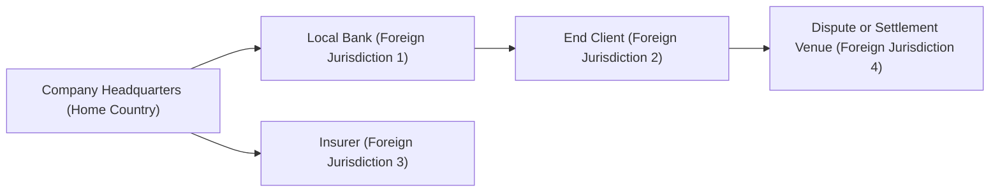

## Introduction  
Have you ever caught yourself feeling a little uneasy about navigating legal systems abroad? Maybe you were chatting with a colleague who mentioned that in Country A, paying “unofficial fees” is more or less expected, while in Country B, regulators come down hard if you so much as buy a government official a coffee. Well, it’s a reminder that when it comes to operating in multiple countries, not all legal frameworks are created equal. And that can lead to some pretty tough ethical choices for finance professionals, right?

In this section, we’ll explore how different legal environments—like civil law, common law, and religious law systems—can shape ethics in financial contexts. We’ll look at the implications of varying enforcement powers, consider how corruption might flourish in weaker governance regions, and emphasize the importance of thoroughly analyzing every jurisdiction you operate in. Our hope is that by the end, you’ll have a clearer (and maybe slightly more personal) grasp of why your next cross-border transaction demands not just a good spreadsheet but also robust moral (and legal) due diligence.

## Overview of Legal Systems in a Globalized Environment  

### Civil Law Systems  
Civil law systems are built largely on codified statutes rather than judicial precedents. This means the laws are sometimes easier to locate and interpret—everything’s “on the books,” so to speak. For finance players, this sounds straightforward because you can quickly reference a code to see what’s permitted. However, the potential downside is that codifications might not address every real-world complexity (e.g., brand-new blockchain products), making legal gray areas tricky to navigate.

Since civil law countries rely heavily on written statutes, judges often have less leeway to interpret laws creatively. As a result, the predictability of these legal systems might lull a financial institution into thinking it’s safe to follow the letter of the statute. But be careful: abiding by a strict literal reading of a code doesn’t necessarily mean you’re ethically sound. If a regulation doesn’t explicitly address certain situations—like new forms of securities or derivatives—professionals must lean on ethical principles and local expert opinions.

### Common Law Systems  
In common law systems, judicial precedents guide not only past interpretations but also current and future rulings. Think of it like building blocks: each case sets another brick that shapes how similar future cases will be judged. Because judges have more power to interpret and adapt the law, common law systems can often respond more flexibly to new financial instruments and complexities.

Ethically, though, there’s a catch. Professionals can differ in their reading of precedents, and that can spur confusion over what is “ethically acceptable.” For instance, if you’re trying to glean whether your new crypto-lending product is permissible, you might wrestle with contradictory case precedents. Does the product constitute a security under established court rulings, or is it akin to something else? Whichever route you choose, you can’t rely purely on a single case’s outcome. This is where ethical frameworks—like those championed by the CFA Institute—become so crucial. They give you a compass when the law feels ambiguous.

### Religious Law Systems  
In some regions, religious law (like Sharia law in certain Islamic jurisdictions) dictates what financial instruments are permissible. Conventional lending at interest might be forbidden, prompting the emergence of alternative structures like profit-and-loss sharing. If you’re from a Western banking background and you’re working with an entity in a religious-law jurisdiction, you might feel, at first, a bit out of your comfort zone.  

Beyond just the letter of religious law, local interpretations and cultural norms can heavily impact your ethical choices. For instance, while a partnership structure that avoids interest might satisfy the letter of Sharia law, it could still be seen as exploitative by the local community if profit-sharing terms aren’t transparent. Let’s be honest: if you’re new to these requirements, you may want to engage local counsel to ensure you’re not just checking the “compliance” box but also reflecting the moral principles behind it.

## Variations in Enforcement and Ethical Decision-Making  
It’s one thing to understand the laws on the books, but it’s another when it boils down to how—or whether—those laws are enforced. In robust legal environments, courts and regulatory agencies have real teeth. They can impose hefty fines or even criminal penalties for misconduct. This kind of enforcement environment can be a strong deterrent against unethical behavior.

Meanwhile, in jurisdictions with weaker enforcement, unscrupulous actors might bank on the assumption that regulators will look the other way. That’s where ethical decision-making can go off track. If your firm doesn’t have clear internal guidelines, employees might assume that operating in a less stringent environment frees them to bend the rules just a little. This is dangerous territory. You know what they say: “Your reputation precedes you.” And potential damage from unethical practices can linger far longer in the global markets than any short-term gains might justify.

## Facing Corruption and Weak Governance  
Corruption—defined as the abuse of entrusted power for private gain—tends to thrive where governance is weak. Picture a scenario in which you’re told, quietly, that your project approval might be “fast-tracked” for a small fee paid under the table to a government official. Or, as a more common example, local contractors might expect kickbacks in exchange for awarding sub-contracts. The moral lines can blur quickly if your firm’s survival or success in that region seems to hinge on these “local practices.”  

But employing bribery or colluding with corrupt officials is a fast way to land your firm in hot water with global regulators, especially if your home jurisdiction (or your head office’s jurisdiction) has strict anti-bribery laws. The US Foreign Corrupt Practices Act (FCPA), the UK Bribery Act, and more broadly the UN Convention against Corruption can hold you accountable for misconduct, even if it happens in a foreign country.  

### Practical Example  
A close friend of mine once worked on an infrastructure project in Southeast Asia. They were pressed by a local official to pay “facilitation fees.” They were unsure if that was simply an official administrative cost or something more dubious. Luckily, her team decided they couldn’t proceed without engaging local counsel and also cross-referencing the parent company’s compliance policy. They ended up finding out that this so-called “fee” was actually a thinly veiled bribe. They refused to pay. Sure, it delayed the project, but no major reputational harm or legal trouble ensued. Sometimes, short-term pains spare you from serious blows later.

## Jurisdictional Analysis for Cross-Border Transactions  
Whenever you have cross-border transactions, you also have layering of jurisdictions. For instance, a trade financed in your home country might be settled in one jurisdiction, insured in another, and physically shipped through a region with an entirely different system. It’s like a legal patchwork quilt. The significance of analyzing the relevant laws for each jurisdiction can’t be overstated.  

Here is a simple Mermaid diagram to illustrate how different jurisdictions might overlap during a cross-border transaction:

In this diagram:
• The transaction starts at your headquarters (A).  
• You secure funding through a local bank in a foreign jurisdiction (B).  
• The final client is in a second foreign jurisdiction (C).  
• An insurer in yet another jurisdiction (D) provides coverage.  
• If the transaction is disputed, you might end up in a completely different venue (E).  

Each link in the chain might be subject to a distinct legal framework. Without thoroughly mapping all points of contact, you risk missing crucial regulatory overlaps—or discovering them too late.

## Bilateral and Multilateral Treaties  
So, how do nations attempt to unify or at least align their regulatory regimes? Often, the answer is bilateral treaties (between two specific countries) and multilateral treaties (among multiple countries). A bilateral treaty might address cross-border taxation or reduce double taxation for investors. A multilateral treaty (like the Basel Accords affecting international banking standards) tries to standardize certain rules across a wider group of nations.

When you see large-scale initiatives such as the WTO (World Trade Organization) agreements, they aim to harmonize trade and reduce friction. On the ethical front, treaties like the UN Convention against Corruption (UNCAC) highlight global commitments to fight graft. While these treaties can’t magically eliminate local governance issues, they do provide a firm basis for your own corporate compliance protocols—basically, they lend moral and legal credence to the stance that “we do not pay bribes, no matter where we operate.”

## Engaging Local Counsel  
If you work in corporate finance, investment banking, or asset management, you’ve probably heard the mantra: “Engage local counsel early.” Honestly, it’s good advice. Local counsel are intimately familiar with the region’s letter of the law, enforcement climate, typical business practices, and cultural nuances. They can help you identify hidden red flags—maybe a standard contract clause that, ironically, is illegal in that jurisdiction or a condition that effectively violates your home-country laws.

Moreover, local counsel can provide crucial insight into whether an apparently innocuous local practice might actually be an ethical (or legal) pitfall. Since laws continually evolve, especially in financial sectors, having on-the-ground experts ensures you’re not relying on outdated or incomplete info. That said, don’t just use local counsel as a box-ticking exercise. Truly incorporate their insights into your firm’s decision-making process, including final sign-offs on major deals, new product launches, or expansions.

## Conflicts Between Home-Country Standards and Host-Country Standards  
Let’s say your home-country standards impose strict rules on privacy, transparency, and anti-money-laundering (AML) requirements. But in a host country you’re considering for expansion, the local laws might be more lax. Do you scale down your compliance to match the local norms? The short answer is no. Sticking to your highest standard is usually both an ethical and a prudent move.  

From the perspective of the CFA Institute Code of Ethics and Standards of Professional Conduct, members are directed to follow the more stringent of home-country standards or host-country laws. This principle is designed to prevent “ethics arbitrage” where professionals might exploit weaker jurisdictions for personal advantage. That means if you’re in a common law environment known for tough securities regulation, and you wander into a civil law jurisdiction with less enforcement, you’d still be expected to maintain that robust compliance. In fact, your back-home regulators could come after you if they believe you’re circumventing rules in a foreign location.

## Real-World Examples and Lessons Learned  
History is replete with examples of fraud or malpractice enabled by inconsistent legal frameworks. One classic scenario involves misrepresentations on financial statements in a low-enforcement country, which then affect investors in high-enforcement jurisdictions. The 2011 Sino-Forest case stands out as a cross-border fiasco. Sino-Forest was a Chinese-registered forestry company listed on the Toronto Stock Exchange. Discrepancies in reported timber holdings were alleged to be part of a massive fraud. Enforcement challenges arose because audits and investigations had to be conducted across borders, where local legal standards varied significantly. Ultimately, the repercussions were felt in Canada (where Sino-Forest was listed), even though the alleged wrongdoing occurred primarily in China.

These episodes underline the fundamental lesson: differing legal frameworks can create operational blind spots. But they also underscore our duty as finance practitioners to hold ourselves to rigorous ethical standards—no matter where we are or who’s watching.  

## Exam Tips and Practical Advice  
• Prioritize Stringent Standards: Always follow the higher standard when there’s a conflict between home and host requirements.  
• Conduct a Jurisdictional Map: Before initiating cross-border deals, chart out all relevant legal systems.  
• Engage Local Counsel: Don’t forget that local counsel is your first line of defense against hidden pitfalls.  
• Watch for Corruption Clues: Changes in local fees, requests for “facilitation payments,” or suspicious contract terms can all signal deeper unethical practices.  
• Document Everything: Keep thorough records of your decision-making process, especially when regulatory or ethical clarity is lacking. This will help if regulators ask tough questions.  
• Use International Treaties as a Benchmark: Familiarize yourself with major treaties on anti-corruption, AML, and cross-border trade to ensure your own compliance framework is robust.  

## References for Further Exploration  
• Transparency International: https://www.transparency.org  
• World Justice Project: https://worldjusticeproject.org  
• UN Convention against Corruption: https://www.unodc.org/unodc/en/treaties/CAC/  
• Ronald Dworkin (1986). Law’s Empire  
• CFA Institute: Research Foundation Publications on comparative financial laws  

## Test Your Knowledge: Global Legal Environments and Ethical Conduct



### Which of the following statements accurately describes a key characteristic of a civil law system?

- [x] It is primarily based on codified statutes rather than judicial precedents.
- [ ] It relies on consistent evolution of rules through judicial case decisions.
- [ ] It explicitly allows for interest-based lending in all circumstances.
- [ ] It is designed exclusively for regions with strong anti-corruption frameworks.

> **Explanation:** A civil law system focuses on written laws and codes, rather than on court rulings, which is distinct from a common law system.

### In a common law jurisdiction, how does judicial precedent most significantly impact financial regulations?

- [x] Judges interpret laws based on past rulings, potentially leading to evolving interpretations.
- [ ] Statutory codes override all past rulings, making judicial precedent irrelevant.
- [ ] Regulators have immediate power to change rulings without legal precedents.
- [ ] Religious authorities provide binding interpretations of past rulings.

> **Explanation:** Common law systems rely heavily on the body of past judicial decisions, which inform how current cases are resolved.

### In religious law jurisdictions that prohibit interest, how might a firm ethically proceed with financing?

- [ ] Offer traditional loan structures without mandatory disclosures.
- [x] Employ alternative structures like profit-and-loss sharing to comply with religious restrictions.
- [ ] Count on regulators to overlook traditional debt-based products.
- [ ] Avoid all local counsel to minimize costs.

> **Explanation:** In jurisdictions guided by religious law, using financial methods like Mudarabah (profit-sharing) or Murabaha (cost-plus financing) ensures compliance with religious doctrines.

### Which factor typically distinguishes a high-enforcement environment from a low-enforcement environment?

- [x] The respective legal power of courts and regulators to impose significant penalties for misconduct.
- [ ] A total absence of statutory law or structured regulations.
- [ ] The complete elimination of ethical dilemmas from financial operations.
- [ ] An unconditional reliance on local counsel rulings.

> **Explanation:** High-enforcement environments have robust courts and regulators that actively impose penalties, deterring unethical practices.

### When local norms suggest facilitation payments to “expedite” government services, what best practice should a finance professional follow?

- [ ] Accept them as a standard local custom.
- [ ] Outsource the issue to a subsidiary, ensuring plausible deniability.
- [x] Seek clarification from local counsel and refer to your organization's anti-corruption policies.
- [ ] Automate the payment process to obscure the transaction’s nature.

> **Explanation:** Even if such payments are common locally, professionals must align with anti-corruption frameworks and consult both company policy and local counsel.

### A finance professional is finalizing a cross-border deal involving multiple jurisdictions. What is the primary advantage of using a visual map of legal interactions (like a flowchart)?

- [x] It helps identify the various jurisdictions and specific legal frameworks involved in each step.
- [ ] It automatically substitutes for local counsel advice.
- [ ] It eliminates the need to comply with the most stringent legal standards.
- [ ] It ensures the transaction is automatically accepted under Basel Accords.

> **Explanation:** Visual mapping clarifies complex cross-border transactions, revealing each jurisdiction and relevant regulatory obligations.

### How do bilateral treaties generally differ from multilateral treaties in terms of scope?

- [x] Bilateral treaties cover agreements between two nations, while multilateral treaties involve multiple countries or parties.
- [ ] Bilateral treaties are always more restrictive than multilateral treaties.
- [ ] Multilateral treaties only apply to social and environmental issues, not finance.
- [ ] Bilateral treaties don’t require legislative ratification in any jurisdiction.

> **Explanation:** Bilateral treaties are specifically between two countries, whereas multilateral treaties can encompass a broad range of signatory nations.

### What should a firm do if there is a direct conflict between its home-country anti-corruption regulations and the host-country’s more lenient approach?

- [ ] Comply with whichever regulations minimize operational costs.
- [ ] Seek to exploit the lenient regulations without informing the home regulator.
- [ ] Cancel the project immediately without consideration.
- [x] Adhere to the more stringent home-country standard to maintain ethical integrity.

> **Explanation:** The CFA Institute encourages compliance with the most rigorous standards when there is a conflict, to uphold ethical excellence.

### What key lesson is learned from historical cross-border fraud cases like Sino-Forest?

- [ ] Fraud only occurs in common law countries.
- [ ] Fraud is easily detected by low-enforcement countries.
- [x] Inconsistent legal frameworks enable malpractice, highlighting the need for stringent oversight.
- [ ] Multilateral treaties make cross-border investigations obsolete.

> **Explanation:** The Sino-Forest case demonstrated how differing regulatory environments can create opportunities for fraud when oversight is insufficient.

### True or False: Engaging local counsel is an optional measure that most firms can ignore in complex international deals.

- [x] True
- [ ] False

> **Explanation:** While technically optional from a purely legal standpoint, ignoring local counsel is a major risk. Local counsel provides vital on-the-ground knowledge that can prevent costly mistakes. Because of the high stakes involved, prudent firms treat it like a necessity, not an option.


