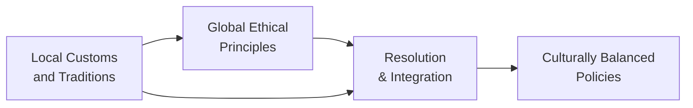

## Overview

So, let's be honest: handling ethics can be tough enough without tossing in cultural nuances. But in our increasingly globalized environment—where multinational teams, cross-border investments, and varied client bases are the norm—investment professionals must balance local customs with global standards in an ethical, transparent way. It’s easy to say “just follow the rules,” but in practice, bridging these worlds often involves navigating subtle social norms, sometimes-lax traditions, and robust global regulations. And guess what? A careful, empathetic approach can actually strengthen trust and business relationships, while a misstep can lead to reputational risk, regulatory scrutiny, and even operational breakdown.

Below, we explore some ways real-world professionals can align local practices with globally recognized ethical frameworks. We’ll also go over typical dilemma scenarios (like gift-giving and entertainment) and offer insights on how to incorporate culturally respectful yet globally consistent policies. Finally, we provide a short quiz so you can check your mastery of these key concepts. Let’s jump right in.

## The Role of Cultural Values and Local Customs

Cultural values, traditions, and norms are like the “DNA” of different societies. They dictate attitudes toward authority, perceptions of time, social hierarchies, and so much more. At times, these local norms might appear to conflict with international ethical standards—especially when it comes to business practices. For example, some cultures place heavy emphasis on personal relationships, frequent gift-giving, or elaborate social gatherings to seal business deals; others view such practices as indicators of partiality or corruption.

As a quick anecdote, I once visited a prospective client in a country where gift-giving was the norm. I knew the CFA Institute’s Code of Ethics warns against anything that could be deemed a bribe. Standing there, I worried: if I followed my global corporate policy too rigidly, my refusal to accept certain gifts might offend them; yet accepting them without limit could raise regulatory questions. That tension is basically the heart of this topic.

### Honoring Local Traditions Without Compromising Principles

In many cases, local customs are not inherently unethical; they simply reflect that region’s way of building relationships and trust. The challenge is making sure these traditions don’t overshadow your firm’s—and the broader investment profession’s—global commitments to transparency, fairness, confidentiality, and integrity.

Think of it like mixing two elements in a portfolio: you want exposure to different cultures (like new asset classes) but also want alignment with your risk-return objective (in this case, your ethical standards). By introducing guidelines, defining acceptable gift-giving thresholds, or clarifying certain local hospitality norms, you can foster stronger business relationships without violating universal principles.

## Engaging Local Stakeholders to Minimize Cultural Friction

Cultural friction often emerges when people from different backgrounds work together without mutual understanding. To reduce that friction, local stakeholder engagement is crucial. This can mean holding roundtable discussions with local partners, regulators, or community leaders to talk through potential gray areas. The maximum value is unlocked when these sessions go beyond lip service and actual input is integrated into your global ethics framework.

For example, if your firm invests in emerging markets, you might invite local experts to outline typical customs, identify sensitive areas, and propose solutions that conform both to local etiquette and your global standards. This involvement can defuse tensions before they flare—and believe me, it’s often cheaper and faster to address cultural friction early than to fix a public scandal later.

## Culturally Sensitive Training Programs

Training programs that are culturally aware not only clarify rules but also provide context for how local customs can co-exist with global ethical norms. In multinational organizations, these sessions are essential. They might include:

• Role-Playing Exercises: Simulate typical ethical dilemmas, such as deciding whether to accept a lavish gift or respond to certain hospitality gestures.  
• Local Laws and Regulations: Outline the specifics of how local laws intersect with global standards (and, of course, highlight any conflicts).  
• Real-World Case Studies: Show how other firms or individuals overcame cultural challenges ethically and provide a sense of do’s and don’ts.  

Such training also helps employees spot red flags—like lavish “gifts” that are essentially disguised kickbacks—and fosters a unified corporate culture where local representatives and global head offices are on the same page.

## Navigating Gift-Giving and Entertainment

Gift-giving is probably one of the most cited examples of how local traditions can conflict with global ethics. In many cultures, a small present symbolizes respect, genuine friendship, or gratitude. Yet in a strict global regulatory environment, gift-giving can be interpreted as bribery or an attempt to influence business decisions. That’s where a well-designed gift-giving policy steps in. Typically, such a policy might:

• Differentiate between nominal (often small or symbolic) and excessive gifts.  
• Require pre-approval for any gifts above a certain monetary threshold.  
• Prohibit gifts or hospitality that could appear to compromise objectivity.  

Remember, it’s not about eliminating courtesy or politeness; it is about preventing conflicts of interest and protecting your reputation and your clients’ best interests.

## Codes of Conduct That Adapt—But Retain Core Principles

A flexible code of conduct can guide employees on how to honor local norms without sacrificing core values. Some codes have localized appendices or sections that outline acceptable practices in certain regions. However, the overarching global principles stand firm: honesty, transparency, and respect for laws and regulations.

This approach is like an investment policy statement (IPS) for ethics: the IPS can be tailored to a client’s specific risk tolerance, but the essential rules—diversification, risk management, compliance—are universal. Similarly, your code of conduct may have region-specific guidelines that detail acceptable gift-giving thresholds or local partner protocols, but it always enforces the universal laws against corruption and unethical behavior.

## Frameworks for Resolving Conflicts Between Local and Global Standards

Even with the best intentions, conflicts will sometimes arise. Here are a few steps you might consider when faced with a cultural clash:

1. Identify the Core Values: Determine which parts of the local custom might conflict with universal principles—like the CFA Code of Ethics or other global frameworks.  
2. Evaluate the Severity: Is this a small courtesy gesture or something that could jeopardize the firm’s integrity? Understand the scale and potential impact of the conflict.  
3. Seek Guidance: Use internal guidelines and consult your organization’s Ethics Committee or compliance team. If needed, consult external experts or local cultural advisors.  
4. Adapt or Decline: Depending on the situation, you might graciously adapt the tradition (e.g., giving non-monetary tokens) or politely decline if the custom is irreconcilable with your global standards.  
5. Document the Process: This is important from a compliance standpoint. Record how and why you arrived at the decision, so you have a transparent reference for any future questions.  

Imagine this process as a risk management tool. In portfolio management, we systematically identify, measure, and address risks. Here, you’re systematically identifying and mitigating cultural or ethical risks to maintain a high level of integrity.

Below is a simple diagram illustrating how local customs intersect with global ethics to form a unified, resilient approach:

## Practical Examples

Consider a large asset management firm expanding into Southeast Asia. In some communities there, personal relationships are highly valued, and business dinners can be elaborate. To avoid misunderstandings:

• The firm’s local branch may allow employees to invite clients to dinners if they keep detailed expense records and ensure the event’s primary focus is investment-related.  
• Any gifts beyond a modest threshold—say, a small token of appreciation—must be pre-approved by compliance.  
• All staff attend annual training on local customs, with guidance on politely declining if a gift is too lavish.  

Another example might involve a Middle Eastern subsidiary where it’s customary to greet colleagues with a series of gestures that might be unfamiliar to staff from North America. Instead of discouraging employees from reciprocating local greetings, the firm can provide cultural awareness sessions so that newcomers feel comfortable and respectful while still adhering to personal boundaries or preference.

## Table: Local Practice vs. Potential Ethical Dilemma vs. Proposed Approach

| Local Practice                                  | Potential Ethical Dilemma                                                | Proposed Approach                                                                    |
|-------------------------------------------------|---------------------------------------------------------------------------|---------------------------------------------------------------------------------------|
| Exchanging lavish gifts during holidays         | Gifts may be perceived as bribery or create conflicts of interest         | Set monetary thresholds, require pre-approvals, offer modest souvenirs instead        |
| Frequent social gatherings with potential clients | Costs might be excessive, raising questions about objectivity or favoritism | Have transparency in expense reporting, ensure gatherings primarily discuss business |
| Hiring family or close acquaintances           | Nepotism concerns or conflicts of interest                                | Formalize hiring criteria, use objective evaluation panels                           |
| Using local “facilitators” or “fixers”          | Risk of corruption or illegal payments                                    | Conduct thorough due diligence, abide by FCPA/UK Bribery Act/CFA Institute standards  |

This table should give you a sense of how real practitioners handle everyday scenarios by blending sensitivity to local norms with unwavering ethical commitments.

## Best Practices and Common Pitfalls

Below are a few best practices to keep your local-global ethical strategy intact:

• Maintain Clear Written Policies: Ensure everyone at the firm understands your code of conduct and any localized addendums.  
• Foster Open Communication: Encourage employees to ask about potential grey areas. An open-door policy helps you detect issues early.  
• Active Monitoring: Keep an eye on expense reports, gift logs, and outside business activities. Provide a safe channel for whistleblower reports.  
• Leverage Cultural Advisors: Even if your principal compliance officer is well-versed, local experts can shed new light on how best to adapt policies.  

On the other hand, common pitfalls often include:

• Over-Generalizing: Vaguely stating “we abide by all cultures” without specifying boundaries or guidelines.  
• Inadequate Enforcement: Having wonderful policies that no one actually follows.  
• Failure to Update: Cultural norms and global regulations can evolve quickly. If you don’t update your policies, you risk compliance lapses.  
• Missing Transparency: Keeping policy exceptions quiet or entirely off the record can raise suspicion and undermine trust.

## Ethical Alignment Through Cultural Respect

More than just checking boxes, ethical alignment with cultural respect fosters a sense of community between your organization and local stakeholders. At the same time, it sustains the credibility of your global brand. After all, the investment profession is built on trust—trust that you’ll act in the client’s best interest, avoid conflicts of interest, and comply with laws and regulations. Integrating local customs with global ethics is a powerful way to deepen relationships in new markets without alienating home-office stakeholders or jeopardizing your professional commitments.

## Exam Tips: CFA® Relevance

In the CFA Program, especially in Ethics and Professional Standards, you’ll see scenario-based questions about cultural norms, gift-giving, or social engagements that might conflict with the fundamental responsibilities to clients, employers, or the broader market. Familiarize yourself with:

• Standard I (Professionalism), which covers knowledge of laws and regulations, and how local traditions must never override mandatory rules.  
• Standard II (Integrity of Capital Markets), reminding you that no local practice should compromise market integrity.  
• Standard III (Duties to Clients), especially regarding loyalty, fairness, and confidentiality even in culturally diverse environments.  

By learning to apply a consistent framework of ethical behavior, you can confidently tackle exam questions and real-life dilemmas, ensuring you act in a manner reflective of high professional standards everywhere you operate.

## Glossary

• Local Customs: Traditional practices and behaviors typically accepted within a community or region.  
• Cultural Sensitivity: Awareness and respect for differences in social norms, traditions, and perceptions.  
• Gift-Giving Policy: Corporate policies regulating giving or receiving gifts to avoid conflicts of interest or bribery.  
• Code of Conduct: A set of rules outlining the norms and responsibilities or proper practices for an individual or organization.  
• Cultural Friction: Tension or conflict arising from differing cultural values or practices.  
• Global Principles: Foundational ethical standards accepted as universal, such as fairness or integrity.  
• Stakeholder Engagement: The process of involving those affected by a company’s conduct in decision-making.  
• Ethical Alignment: Ensuring that local actions conform to global directives and moral standards.

## References for Further Exploration

- Hofstede Insights on Cultural Dimensions:  
  https://www.hofstede-insights.com  
- Geert Hofstede. (2001). Culture’s Consequences.  
- UNESCO Intercultural Dialogue:  
  https://en.unesco.org/themes/intercultural-dialogue  
- Erin Meyer. (2014). The Culture Map.

---

## Integrating Local Customs with Global Ethics: Practice Quiz



### 1. A major challenge when integrating local customs with global ethical standards is:

- [ ] The complete incompatibility of local laws with global principles
- [x] Balancing respect for cultural practices with universal standards
- [ ] Achieving consistent raw material supply across regions
- [ ] Avoiding any form of employee onboarding

> **Explanation:** The key difficulty lies in accommodating local traditions (such as gift-giving) without violating universal ethical guidelines. This requires a balanced, well-structured approach.

### 2. Which of the following best describes a culturally sensitive training program?

- [x] One that uses real-world scenarios, highlights local norms, and references firm policy
- [ ] A global webcast that outlines only the core global principles
- [ ] A program dedicated solely to advanced quantitative methods
- [ ] Any training devoid of ethical discussions entirely

> **Explanation:** Culturally sensitive training introduces employees to relevant local situations, fosters practical discussions on bridging local norms with universal ethics, and references the firm's guiding policies.

### 3. In a global code of conduct, localized appendices or addendums typically serve to:

- [x] Provide region-specific guidelines within a global ethical framework
- [ ] Replace the universal standards entirely
- [ ] Eliminate local customs from business dealings
- [ ] Shift all accountability to local offices

> **Explanation:** Localized sections of a code of conduct clarify how to interpret global principles in the context of regional customs, preserving a common ethical core.

### 4. When deciding whether to accept a cultural gift in a new market, which step is LEAST relevant?

- [ ] Evaluating potential conflicts with the firm’s universal code of ethics
- [ ] Consulting internal rules on accepting gifts
- [x] Searching only for local marketing opportunities
- [ ] Assessing the possible perception of bias or conflict of interest

> **Explanation:** While marketing opportunities may intersect with the local environment, it is not a primary step in an ethical decision process regarding gift acceptance.

### 5. Which of the following is a main benefit of local stakeholder engagement?

- [x] Gaining insights into cultural nuances that promote ethical harmony
- [ ] Lowering tax liabilities for international subsidiaries
- [ ] Guaranteeing that local regulators will ignore minor ethical lapses
- [ ] Replacing all global standards with local advice

> **Explanation:** Engaging local experts and stakeholders allows the firm to craft policies and procedures that resonate with the local culture while preserving global standards.

### 6. A best practice for addressing cultural friction within a multinational investment firm includes:

- [x] Conducting active monitoring and providing a safe whistleblower channel
- [ ] Restricting all cross-border business interactions
- [ ] Ignoring local customs, as they are less important
- [ ] Allowing employees to follow only local norms

> **Explanation:** Cultural friction is minimized when employees can report concerns freely and the firm maintains transparency through regular monitoring and communication.

### 7. Which scenario is most likely to raise a red flag in terms of ethics?

- [x] Accepting extravagant holiday gifts from a client in return for undisclosed benefits
- [ ] Conducting a modest social dinner with local partners to discuss strategies
- [ ] Adhering to local guidelines on gift valuations
- [ ] Engaging an internal compliance officer in training sessions

> **Explanation:** An extravagant gift that leads to special, undisclosed benefits can create conflicts of interest and undermine professional integrity.

### 8. Adapting a local gift-giving policy to fit a global standard usually involves:

- [x] Setting clear monetary thresholds and disclosure requirements
- [ ] Mandating the acceptance of any gift to avoid offending local hosts
- [ ] Ignoring compliance and focusing only on the local team’s judgment
- [ ] Forbidding employees to interact with clients socially

> **Explanation:** A thoughtful policy sets thresholds for acceptable gifts and demands transparency, thus aligning local practices with universal ethical standards.

### 9. A flexible code of conduct that respects local norms but retains universal principles resembles:

- [x] An investment policy statement (IPS) tailored to client-specific risks but preserving core rules
- [ ] A general marketing brochure that leaves decisions to local staff
- [ ] A personal blog discussing cultural anecdotes without formal standards
- [ ] A single standard text that cannot be adjusted

> **Explanation:** Like an IPS, a flexible code of conduct can mirror local practices while upholding universal ethical imperatives across the organization.

### 10. True or False: Thoroughly documenting how and why an ethical decision was made is essential for transparency and future reference.

- [x] True
- [ ] False

> **Explanation:** Proper documentation clarifies the firm’s reasoning, ensures accountability, and helps reinforce ethical guidelines if questions arise later.


