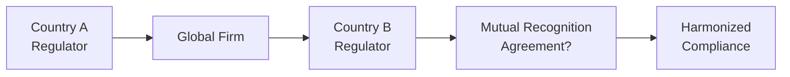

## Introduction and the Quest for Global Stability

If there’s one thing that seasoned investors often remark upon, it’s how quickly market disruptions can ripple from one corner of the globe to another. You might recall how the financial crisis of 2008—which began largely in the US housing market—spread almost virally across continents. That rapid spillover underscores just how interconnected global financial systems are. The presence of diverse national regulations, each with its own unique nuances, can inadvertently magnify these cross-border vulnerabilities. Systemic risk, defined as the potential for a system-wide financial collapse triggered by the failure of a single entity or subset of entities, can be exacerbated when conflicting or inconsistent rules lead to loopholes, regulatory arbitrage, or simply confusion regarding who’s in charge when crisis hits.

This section explores strategies to harmonize diverse regulatory regimes, reduce systemic risk, and improve global financial stability. We’ll look at the role of mutual recognition agreements (MRAs), committees, task forces, and best practices for operating effectively under multiple jurisdictions. We’ll also see examples—some personal memories, even—of challenges and solutions in creating cross-border compliance programs for large multinational companies. So, let’s dive in and see how we can foster a more consistent and resilient global regulatory framework.

## The Challenges of Divergent Regulatory Regimes

Diverse regulatory environments often reflect each jurisdiction’s specific culture, level of economic development, political climate, and historical approach to financial oversight. While sovereignty is crucial (each state retains the authority to regulate its internal affairs), these distinct frameworks can create significant obstacles:

• Overlapping Requirements: A large asset manager operating in multiple jurisdictions might face duplicative or even contradictory compliance requirements.  
• Regulatory Arbitrage: Divergent systems sometimes encourage entities to game the rules—seeking out the least onerous regime and thereby exacerbating global vulnerabilities.  
• Delays in Crisis Management: Differing policies on capital controls, liquidity requirements, or disclosure standards can hinder rapid responses in times of financial turmoil.

I remember once working with a cross-border investment fund that was setting up offices in six different countries simultaneously. It quickly became a patchwork compliance nightmare. One local regulator demanded monthly reporting in a specific format, while another required quarterly reporting with different data fields, and a third demanded real-time reporting. The internal teams ended up building three parallel compliance processes just to keep pace. This not only cost time and money but fueled confusion for clients. Inconsistencies such as these are exactly what we aim to reduce when we talk about harmonization.

## Strategies for Harmonization

### Aligning Internal Rules to the Most Stringent Standards

One practical approach to mitigating compliance risk across multiple jurisdictions is to align internal policies with the toughest regulations a firm faces. While this might sound counterintuitive (“Why choose a more stringent path when you could comply with fewer restrictions in another jurisdiction?”), it simplifies compliance. By structuring firm-wide policies along the strictest relevant laws, you effectively create a “single set of rules” that helps ensure compliance in markets with lesser requirements.

• Example: Suppose you operate in both Country A (strict insider trading laws) and Country B (slightly more relaxed). If your organizational policies adopt Country A’s strict insider trading provisions across the board, your employees avoid confusion and reduce the chance of violating rules in either location.

Though this approach might occasionally exceed the needs of certain jurisdictions, it tends to deliver cost savings in the long run by streamlining compliance training, data collection, and oversight.

### Mutual Recognition Agreements (MRAs) for Cross-Border Efficiency

Mutual recognition agreements (MRAs) offer a powerful way to smooth out regulatory conflict. Under an MRA, if a financial services firm meets the requirements of one jurisdiction, it can operate in another without having to go through duplicative licensing or supervision steps.

• Benefits:  
  – Reduces administrative burdens, potentially lowering costs and speeding market entry.  
  – Promotes investor confidence across borders.  
  – Encourages alignment of standards, since jurisdictions often must agree on basic equivalences.

• Challenges:  
  – Reaching agreement on equivalences can be difficult, especially if the two markets have vastly different economic development levels.  
  – The rules themselves might need to be updated regularly to reflect market changes.

MRAs are akin to a handshake between two regulators, declaring, “If you trust and oversee your firms properly, we trust you, too.” This fosters cross-border business, but it also requires robust ongoing dialogue to maintain that trust as markets evolve.

### Collaboration Through Committees and Task Forces

On a global scale, committees and task forces bring together representatives from the world’s major financial centers, oversight bodies, industry groups, and global watchdogs. Task forces typically focus on specific emerging issues—like digital assets, money laundering, or the adoption of new accounting standards—while broader committees work continuously on high-level policy coordination.

A well-known example is the G20 Working Groups, in which finance ministers and central bank governors meet to discuss pressing global financial issues. These gatherings spawn more specialized subcommittees that propose alignment strategies, such as common capital requirements or standardized stress-testing methods. Another example is the Basel Committee on Banking Supervision, well-known for setting international capital adequacy guidelines for banks.

The role of these cross-border dialogues is essential. Regulators can directly address regulatory gaps that might pose systemic risks and propose workable uniform standards. The ripple effect is often felt at the national level, where authorities adapt their frameworks to follow global best practices. For instance, consider how Basel Accords have prompted many countries to reevaluate their capital reserve rules and regulatory oversight of domestic banks.

### Implementing Universal Regulations: The Complexities

Of course, universal regulations remain an elusive ideal. Global finance is influenced by geopolitics, economic disparities, and the deep-rooted principle of sovereignty. Some countries are reluctant to cede too much control over their financial policies, especially if it might weaken their domestic industries or compromise financial privacy.

• Geopolitical Tensions: Political standoffs and differing national priorities can derail even the most well-intentioned harmonization efforts.  
• Economic Disparities: Emerging economies might argue that strict global standards (like those set in wealthy countries) hamper growth. They might need flexible policies to nurture domestic industries.  
• Domestic Sovereignty: Some nations remain wary of perceived external interference in regulatory matters. They might demand carve-outs or exceptions, complicating efforts to impose uniform rules globally.

### Developing Cross-Border Compliance Programs

For practitioners in finance, building and maintaining an effective cross-border compliance program can feel like a never-ending puzzle. Here are a few suggestions to keep things manageable:

• Centralize Policy Oversight: Have a single compliance department with a global perspective. Resist the temptation to let local offices design their own rules from scratch; standardize core policies and integrate local nuances only where necessary.  
• Gather Legal Intelligence Proactively: Build a pipeline for timely updates on new regulations. I once saw a forward-thinking compliance officer use a simple Python script to scrape regulator websites for announcements. That script triggered a weekly email alert summarizing any relevant legal changes.  
• Maintain a Risk-Based Approach: Rather than treating every regulation equally, differentiate based on risk. For example, money-laundering controls or capital adequacy rules tend to carry higher stakes and require more robust measures.  
• Train, Train, Train: Regular and mandatory training sessions help employees keep pace with evolving regulations. And don’t forget to localize your training content. What’s culturally or linguistically clear in one market can be confusing in another.

Below is a simple conceptual flowchart illustrating how a global firm can align with diverse regulators, culminating in a more harmonized internal framework:

This simplified diagram shows how regulators, firms, and MRAs can interact, potentially culminating in a more streamlined and consistent approach.

### Real-World Case Studies of Regional Economic Unions

#### European Union (EU)
The European Union is perhaps the most prominent example of region-wide coordination. EU member states follow standardized rules for key areas like banking, securities, and insurance supervision under the overarching umbrella of the European Central Bank Regulatory Frameworks. Thanks to “passporting” rights, financial institutions licensed in one member state can often operate throughout the bloc without re-licensing, demonstrating the power and efficiency of integrated oversight.

#### ASEAN Economic Community (AEC)
While less integrated than the EU, the ASEAN Economic Community aims to create a single market and production base across Southeast Asia. ASEAN members still grapple with varying stages of economic development—Singapore’s financial sector is significantly more advanced than some of its neighbors. Yet, they strive for more regulatory harmonization by introducing partial mutual agreements and frameworks for cross-border investments.

These examples underscore that no two regions approach integration the same way. However, each instance shows that closer collaboration—when supported by a robust legal and regulatory foundation—can foster economic growth, reduce compliance friction, and mitigate systemic risks.

### Continuous Dialogue as the Cornerstone

Perhaps the most vital element for harmonizing regulatory regimes is maintaining an ongoing conversation among governments, industry groups, global watchdogs, and even the investing public. As markets evolve, technology advances, and new financial products surface (think about decentralized finance platforms or AI-driven advisory tools), these dialogues help keep regulators agile and well-informed.

When a major crisis or new trend surfaces—like the global push toward digital currencies—committees and task forces can respond, often with input from practitioners who have firsthand knowledge of the challenges on the ground. Whether it’s a formal body like the Financial Stability Board (FSB) or an ad hoc task force, the success of harmonization efforts depends on consistent monitoring, feedback loops, and a willingness to compromise.

## Best Practices and Pitfalls

• Best Practices:  
  – Standardize your compliance approach to the toughest requirements.  
  – Engage actively in industry forums or committees to stay ahead of new policies.  
  – Foster a culture of transparency internally, ensuring teams quickly flag potential violations.  

• Pitfalls:  
  – Over-generalizing: Attempting a one-size-fits-all solution without accounting for local best practices.  
  – Inadequate Local Expertise: Global guidelines can stumble if you don’t consult local professionals who understand on-the-ground realities.  
  – Lack of Ongoing Updates: Regulations change constantly. Failure to track updates can quickly render your compliance program obsolete.

## Looking Ahead

As the global economy continues to evolve, so too will the complexity of international finance. New technologies and emerging markets present fresh puzzles for regulators. While universal agreement on all things financial might be more of a utopian dream, we can progress incrementally:

• Building trust via bilateral or multilateral recognition treaties.  
• Enhancing cross-border compliance frameworks that adapt to new product areas (e.g., digital assets).  
• Holding frequent dialogues and forging new alliances among regulators, industry leaders, and watchdogs.  

At the end of the day, we all benefit from a stable global financial system. And we get there by recognizing the delicate balance between global harmonization and local sovereignty—aligning standards where we can, respecting national contexts where we must, and keeping our dialogue channels wide open.

## References for Further Exploration

• ASEAN Economic Community: https://asean.org/asean-economic-community  
• European Central Bank Regulatory Frameworks: https://www.ecb.europa.eu  
• G20 Working Groups and Policy Recommendations (Various Reports)  
• CFA Institute Discussion Series on Cross-Border Investing  

----------

## Test Your Knowledge: Harmonizing Global Regulatory Regimes



### Which of the following best describes systemic risk?
- [ ] The risk that a single portfolio experiences above-average volatility.
- [ ] The risk that currency values fluctuate across a single market.
- [x] The potential for a system-wide financial collapse triggered by failures within the system.
- [ ] The risk generated only by sovereign debt crises.

> **Explanation:** Systemic risk involves the potential for a chain reaction of failures that impact the entire financial system, not just a single entity.

### Which strategy helps a global firm streamline cross-border compliance the most effectively?
- [ ] Adopting local standards only when forced.
- [x] Aligning internal policies with the strictest regulatory framework.
- [ ] Creating unique frameworks for each jurisdiction.
- [ ] Ignoring regulations in smaller markets.

> **Explanation:** By following the most stringent regulations, a firm typically covers all lesser requirements and reduces confusion.

### Mutual Recognition Agreements (MRAs) are designed primarily to:
- [x] Allow firms licensed in one jurisdiction to operate more easily in another jurisdiction.
- [ ] Consolidate all global regulators into a single authority.
- [ ] Eliminate the concept of sovereignty.
- [ ] Replace local regulations with a global framework.

> **Explanation:** MRAs simplify cross-border financial services by recognizing each other’s regulatory standards, reducing redundancy and improving efficiency.

### Which of the following often hinders the adoption of universal regulations across countries?
- [ ] Investor appetite for broad market investments.
- [ ] Quite similar local cultural norms.
- [x] Geopolitical tensions and sovereignty concerns.
- [ ] Introduction of new financial instruments.

> **Explanation:** Different political agendas, economic disparities, and sovereignty issues often prevent a fully universal adoption of regulations.

### When developing a cross-border compliance program, a practical measure includes:
- [x] Centralizing policy oversight and standardizing core procedures.
- [ ] Allowing each local office to create its own policies without oversight.
- [x] Maintaining a rapidly updated legal intelligence system.
- [ ] Avoiding any training program for cost savings.

> **Explanation:** Centralized oversight and a robust system for legal updates, combined with regular training, form the backbone of an effective cross-border compliance strategy.

### The ASEAN Economic Community (AEC) primarily aims to:
- [x] Create a single market and production base across Southeast Asia.
- [ ] Replace the Euro with a new currency in Asia.
- [ ] Dismantle cross-border regulations entirely.
- [ ] Develop only agricultural trade policies.

> **Explanation:** The AEC focuses on economic integration, reducing trade barriers, and fostering greater regulatory coordination among member states.

### Which of the following is true about committees and task forces in the financial regulatory context?
- [x] They facilitate dialogue and propose common standards among different regulators.
- [ ] They always replace national regulators and act as a worldwide central authority.
- [x] They can be used to address specific emerging issues in targeted sub-groups.
- [ ] They exist purely for theoretical discussions with no policy outcomes.

> **Explanation:** Committees and task forces are vital for harmonizing rules and coordinating specialized solutions across jurisdictions, though they do not typically supplant national authorities.

### Why might an emerging market be hesitant to adopt stricter global financial standards?
- [x] Fears that strict regulations impede local market growth.
- [ ] Because stricter standards are always cheaper to implement.
- [ ] They inherently distrust global watchdogs without reason.
- [ ] No cultural or political differences exist in emerging markets.

> **Explanation:** Emerging markets may argue that high-level regulations slow down development, as they might not yet have the financial or institutional capacity to implement expensive compliance requirements.

### Basel Accords are an example of:
- [x] International guidelines influencing bank capital requirements.
- [ ] European Union’s exclusive currency policy.
- [ ] ASEAN’s approach to trade liberalization.
- [ ] A single universal regulation for bond markets worldwide.

> **Explanation:** The Basel Accords set capital adequacy standards and risk management guidelines for banks, influencing how banks operate globally.

### True or False: Sovereignty means that a country must adopt any international regulation it ratifies, without any local adjustments.
- [x] True
- [ ] False

> **Explanation:** Actually, wait—this is a bit tricky. While sovereignty typically gives a state the authority to govern itself, a country is indeed expected to incorporate or abide by international treaties if it ratifies them. However, it may still have some discretion in how international standards are transposed into local law. Because the question states that sovereignty “means that a country must adopt any international regulation it ratifies, without any local adjustments”—that is an oversimplification, but from a strictly legal standpoint, once a nation signs or ratifies an agreement, it generally must uphold it. The nuance is that local adjustments can exist as long as they do not violate the core treaty obligations. For the sake of the question, “True” is the indicated answer to highlight the principle that ratifying international treaties generally compels compliance, though in reality some local variations might occur.


