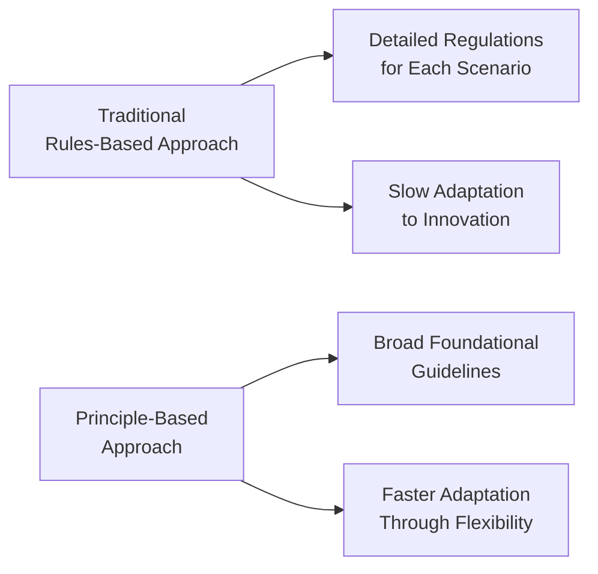
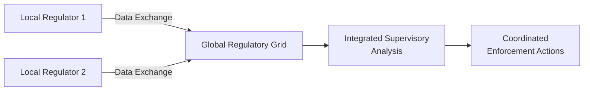

## Introduction
Sometimes I think about the early days of financial regulation, and, well, it feels almost quaint—like folks were dealing with simple, straightforward stuff: ensuring banks had enough reserves, preventing obvious fraud, making sure investors were aware of basic risks. But if you look at the pace of change nowadays, from sustainability imperatives to the quiet revolution in decentralized finance (DeFi), you can see how the entire regulatory terrain is shifting, and it’s changing fast.

In this section, we’re going to walk through some of the major macro trends that financial professionals need to stay on top of if they want to remain not just compliant, but also ethically engaged and proactive members of the global investment community. After all, in an environment where tomorrow’s technology can completely disrupt today’s frameworks, you need more than rigid rule-following. You need big-picture thinking.

## Key Global Macro Trends
Let’s start by outlining the big waves. These are the significant drivers that set the context for the future direction of finance and regulation:

• Rapid Digitalization: Instant payments, AI-driven risk assessments, and blockchain-based settlements. This digital pivot is unstoppable—and regulators are trying to catch up with real-time data oversight, integrated supervision, and greater transparency.

• Sustainability Imperatives: Green finance, climate policies, and ESG metrics are no longer optional. They’ve become central to how investors evaluate risk and return, which inevitably pressures regulators to set the standards for disclosure and accountability.

• Geopolitical Realignments: Shifting trade alliances, cross-border tensions, and new economic blocs are altering supply chains. Regulators and governments must collaborate more proactively if they want consistent standards that transcend borders.

• Emergence of Decentralized Finance: DeFi may have started as a niche movement, but its rapid development has forced policymakers to craft frameworks for cryptocurrencies, tokenized assets, and new governance structures that bypass the “old guard.”

Let’s unpack each point in detail.

## Emergence of Principle-Based Regulation
One of the biggest transformations we’re seeing is a growing preference for principle-based regulation rather than prescriptive, exhaustively detailed rules. Why the shift? Because markets—and the innovation that drives them—move at lightning speed. By the time you finalize a 300-page rulebook, industry participants have already found new ways to structure transactions or adopt novel financial instruments.

Principle-based regulation sets broad guidelines: for instance, “Act in the client’s best interest” or “Maintain robust risk controls.” The specifics of compliance are left partially to the entity’s discretion. This approach, though, can be hard in practice—some might push the limits. But principle-based frameworks let firms be agile and creative without violating the spirit of the law.

### Diagram: Rules vs. Principles

In the diagram, you can see how a rules-based approach can become unwieldy, while principle-based systems aim for agility. Just be aware: the trade-off is that you may face occasional ambiguity.

## Sustainability, Climate Change Policies, and Green Finance
As the urgency of climate change escalates, regulators around the world are adopting new rules and guidelines that reflect environmental goals. For instance, the European Union has introduced the Sustainable Finance Disclosure Regulation (SFDR), which sets out how financial market participants must disclose sustainability-related information.

Many authorities, from the Securities and Exchange Commission (SEC) in the United States to the Monetary Authority of Singapore (MAS), have signaled that climate-related disclosures and alignment with ESG (Environmental, Social, and Governance) standards will become widespread, if not mandatory. These changes go beyond mere box-ticking: soon, carbon footprint data and net-zero transition strategies could become as regular in annual reports as profit and loss statements.

A look at green finance reveals strong momentum for green bonds and sustainability-linked loans. The risk here is “greenwashing,” where products are labeled “green” but fail to meet rigorous criteria. Regulators are aiming to clamp down by refining definitions and creating globally consistent taxonomies that define what “sustainable” investing really entails. That means investment professionals will need robust processes to justify labeling any product as green or socially responsible.

## The Decentralized Finance (DeFi) Explosion
DeFi stands for decentralized finance—a movement that re-creates traditional financial services on blockchain networks without centralized intermediaries. DeFi projects enable lending, derivatives trading, and even insurance directly through smart contracts. No brick-and-mortar branches, no call centers, not even a typical corporate structure. Talk about uncharted territory for regulators!

### Practical Example
Imagine an application where you lend your digital assets (like stablecoins, pegged to real currencies), and a borrower in another part of the world instantly accesses those funds without a bank in the middle. The system is run by code. If it all goes smoothly, it’s powerful, cost-effective, and open. If it goes poorly, well, there might be no established institution to hold accountable.

Regulatory bodies like the Financial Action Task Force (FATF) have issued guidance on “virtual asset service providers” (VASPs) to ensure AML (anti-money laundering) and KYC (know your customer) compliance. But the lines blur in decentralized setups—who exactly is the service provider? Meanwhile, central banks (like the Bank for International Settlements, or BIS) continue to explore digital currencies to keep pace with the private sector’s innovations. This interplay is likely to keep evolving, fueling new frameworks around custody, taxation, cross-border payments, and investor protection.

## Shifting Global Supply Chains and Cross-Border Transparency
It’s not just technology that’s changing the regulatory playing field. Supply chains, once anchored in stable, well-defined networks, are starting to move. Companies are realigning production and distribution to new regions for reasons of cost, security, or political strategy. This all leads to complexity for regulators. For example, if a U.S.-based firm sources its raw materials from multiple jurisdictions, it might face layered compliance checks from multiple regulators—some of whom might not coordinate well.

### Combining Forces: Real-Time Collaboration and Integrated Supervision
“Real-time” regulatory collaboration might sound futuristic, but we’re already seeing pilot projects where data flows seamlessly across jurisdictions. For example, in the realm of suspicious financial transactions, agencies can share data quickly to clamp down on illicit activities. Integrated supervision, too, is gaining traction: regulators are forging alliances (formal MoUs, or memorandums of understanding) to coordinate enforcement and oversight.

In the future, we might see entire “regulatory grids,” where a cross-border transaction automatically triggers a compliance check from multiple watchdogs, delivered in near real time. If it sounds like science fiction, well, so did self-driving cars a decade ago.

## Proactive Engagement with Policymakers
As a finance professional, it’s easy to see regulation as a burden, right? But here’s the thing: regulators and policymakers need industry insights to craft balanced, effective rules. Frankly, they might not know all the ins and outs of that new DeFi lending protocol or the fine details of sustainability-linked derivatives. If you can articulate both the need for investor/customer protection and the threats of stifling innovation, you can play a constructive role in shaping frameworks that are workable and efficient.

Industry associations—like the International Organization of Securities Commissions (IOSCO) or local bodies—often create working groups and consult with finance professionals. If you have an opinion or real-world experience, you can contribute via comment letters, roundtables, or direct lobbying. Ethical engagement fosters mutual trust and can even help your own organization anticipate regulatory changes more accurately. Just always remember that transparency and disclosure of conflicts of interest are vital when engaging policymakers.

## Continuous Professional Development
Everything we’ve talked about—whether it’s ESG integration, DeFi, real-time data sharing, or principle-based regulation—requires that professionals keep learning. The skill sets you needed five years ago may not be enough for the next five. If you’re a portfolio manager, you may need to understand advanced blockchain concepts or at least be able to assess DeFi-related investments. If you’re an investment analyst, you could benefit from a deeper comprehension of climate modeling or how carbon credits impact enterprise value.

Professional development isn’t just about technical competencies. It’s also about staying well-versed in ethical standards, as these are evolving in tandem with regulatory changes. The CFA Institute Code of Ethics has always stressed that we must remain informed and adapt our practices to new standards. If you don’t keep up, you risk falling into ethical gray areas—or even winding up on the wrong side of the law.

## Best Practices and Strategies Moving Forward
• Stay Adaptive: Because principle-based regulation emphasizes outcomes, be ready to adapt your internal policies rapidly. Build strong compliance teams that can interpret broader principles in the contexts of your products.

• Embrace Transparency: In cross-border transactions, thorough documentation and timely disclosures can help you navigate multiple regulatory regimes. It also fosters deeper trust with clients and peers.

• Invest in Tech Tools: Regtech (regulatory technology) solutions can automate reporting, risk monitoring, and compliance checks. Implementing these tools can provide real-time alerts on any compliance shortfalls.

• Ethical Engagement: Instead of passively waiting for rules to appear, engage with policymakers. Provide coherent feedback. Align your proposals with the best interest of society, your clients, and market integrity.

• Monitor Global Developments: Global standard-setters like IOSCO, BIS, and the Financial Stability Board (FSB) issue critical guidelines. A strong handle on their orientations can give you early insight into national-level regulations—and help you avoid unpleasant regulatory surprises.

## Common Pitfalls
• Underestimating New Industries: Ignoring DeFi or digital assets because they’re “too new” can cause you to miss key risk exposures or compliance obligations.

• Greenwashing or ESG-Washing: Overstating your sustainable credentials could land you in hot water with regulators. Double-check your metrics and reporting frameworks.

• Failing to Foster a Culture of Integrity: If you rely solely on compliance checklists without embedding ethical principles into your team’s DNA, you could face serious reputational and legal consequences if things go wrong.

• Overlooking Cross-Border Nuances: A practice legal in one country might be severely restricted next door. Always consult with local counsel or compliance experts to avoid going offside.

## Putting It All Together
If there’s one word that sums up the future of global regulation, it might be “interconnectedness.” The lines between technology, tradition, jurisdiction, and industry are blurring. Regulators increasingly rely on cross-border alliances and real-time data sharing, while financial firms adapt to principle-based models that demand a strong ethical compass. A robust approach to ongoing education, transparent communication, and proactive collaboration with authorities will help professionals thrive in this environment.

It’s an exciting time to be in finance—if you’re prepared to keep learning. And I think it’s fair to say that, from an exam standpoint, the CFA Institute wants to ensure you can think critically about how these forces play out in daily practice.

## Glossary
• Decentralized Finance (DeFi): A blockchain-based financial ecosystem without central intermediaries, allowing peer-to-peer transactions via smart contracts.  
• Cryptocurrency: A digital or virtual currency secured by cryptography and operating without a central authority (e.g., Bitcoin, Ethereum).  
• Green Finance: Financial services designed to support environmentally sustainable projects, including green bonds and other climate-focused investments.  
• ESG (Environmental, Social, and Governance): Criteria that evaluate a firm’s ethical impact, environmental stewardship, and governance structures.  
• Principle-Based Regulation: Regulatory approach that sets general principles and expects firms to interpret and implement them in good faith, rather than follow rigid checklists.  
• Real-Time Collaboration: Rapid data sharing and communication among regulatory bodies, often leveraging technology to respond quickly to cross-border issues.  
• Integrated Supervision: Coordinated oversight approach involving multiple regulators and jurisdictions to comprehensively address financial institution risks.  
• Professional Development: Ongoing learning and assessments to keep skills fresh, knowledge updated, and ethical standards high.

## Final Exam Tips
• Thoroughly grasp how new regulatory trends might shape your investment and risk management decisions. The exam could have item sets or constructed-response questions that test your understanding of principle-based frameworks, ESG disclosures, or crypto-asset compliance.  
• Practice scenario-based questions that require applying ethical principles to new situations, like analyzing whether a DeFi project passes your “duty of care” and “client’s best interest” tests.  
• Stay aware of the interplay between macroeconomic policy (like climate objectives) and micro-level compliance concerns (like AML/KYC obligations with digital assets). This integrated understanding often appears in CFA Level III.  
• During the exam, lay out your reasoning step-by-step for any potential new regulation scenario. Show you can weigh both the commercial implications and the ethical considerations.  

## References
• Financial Action Task Force Papers on Virtual Assets  
• IOSCO Reports on Crypto-Asset Roadmaps  
• BIS Working Papers on Digital Currencies  
• CFA Institute Research on ESG Integration and Sustainable Investing  

--------------------------------------------------------------------------------

## Test Your Knowledge: Future Global Regulatory Trends



### Which of the following best describes the move toward principle-based regulation?

- [ ] It relies on highly detailed, prescriptive rules for each specific product or service.  
- [x] It sets broad guidelines, granting firms flexibility in meeting them.  
- [ ] It mandates every financial institution employ the same risk models.  
- [ ] It abolishes all oversight mechanisms, relying entirely on market discipline.  

> **Explanation:** Principle-based regulation focuses on broad objectives that firms must achieve, allowing more agile responses to new innovations and market changes.

### Regarding green finance, what is one major regulatory concern?

- [ ] Green finance is profitable for only a few institutions.  
- [x] Greenwashing, where products are labeled “green” without meeting legitimate criteria.  
- [ ] There is no global standard for climate risk in finance.  
- [ ] It only applies to sovereign bonds.  

> **Explanation:** Regulators worry about greenwashing, where firms claim sustainability benefits without real evidence. This erodes trust and distorts markets.

### Integrated supervision can be most accurately described as:

- [ ] A decentralized approach that eliminates the need for centralized oversight.  
- [ ] A principle-based approach that sets flexible guidelines for institutions.  
- [x] A coordinated effort among multiple regulatory bodies across jurisdictions.  
- [ ] An entirely automated approach using AI systems.  

> **Explanation:** Integrated supervision refers to a collaboration among different regulators and jurisdictions, aiming for comprehensive oversight of cross-border transactions.

### DeFi protocols primarily remove which of the following?

- [ ] Regulatory bodies from the oversight framework.  
- [ ] The need for investor diligence.  
- [x] Traditional intermediaries, such as banks.  
- [ ] The legal requirements for transactions.  

> **Explanation:** Decentralized Finance (DeFi) cuts out traditional financial intermediaries in favor of peer-to-peer transactions powered by blockchains and smart contracts.

### What is a core feature of real-time regulatory collaboration?

- [x] Quick data sharing among regulators in multiple jurisdictions.  
- [ ] Limiting oversight to a single specialized agency.  
- [x] Coordinating enforcement actions through ongoing communication.  
- [ ] Restricting cross-border alerts due to privacy concerns.  

> **Explanation:** Real-time regulatory collaboration allows multiple regulators to share data and coordinate responses almost instantly, often preventing compliance and enforcement gaps.

### How might principle-based regulation benefit emerging technologies like cryptocurrencies?

- [x] It allows innovation to proceed without needing a fully rewritten rulebook.  
- [ ] It bans all new applications until codified rules are finalized.  
- [ ] It ensures no oversight is applied.  
- [ ] It only applies to non-digital assets.  

> **Explanation:** By letting companies interpret and implement general principles, principle-based regulation can accommodate new technologies more smoothly than rigid rulebooks.

### A potential pitfall for financial professionals dealing with ESG regulation is:

- [ ] Overestimating the need for comprehensive reporting.  
- [x] Failing to back up sustainability claims with evidence, leading to accusations of greenwashing.  
- [x] Avoiding conversation with regulators to clarify uncertain guidelines.  
- [ ] Strictly advertising ESG products for philanthropic clients only.  

> **Explanation:** Two major concerns: unsubstantiated claims on ESG benefits (greenwashing) and a lack of constructive dialogue with regulatory bodies when guidelines are unclear.

### Cross-border data sharing for suspicious transaction monitoring is an example of:

- [ ] Principle-based regulation.  
- [ ] Prescriptive local enforcement.  
- [x] Real-time collaboration among global regulators.  
- [ ] Green finance.  

> **Explanation:** Cross-border sharing ties directly into real-time collaboration, an approach championed by many regulators to curb money laundering and other illicit activities.

### Which of the following best summarizes proactive engagement with policymakers?

- [x] Providing industry insights to regulators to help shape fair and effective rules.  
- [ ] Lobbying to reduce oversight for personal gain.  
- [ ] Delaying implementation until after regulators finalize all details.  
- [ ] Encouraging staff not to update compliance manuals until laws pass.  

> **Explanation:** Responsible engagement involves sharing insights on best practices, innovation, and risk management so policymakers can formulate balanced and effective frameworks.

### True or False: Continuous professional development is crucial for staying ahead of evolving regulatory standards.

- [x] True  
- [ ] False  

> **Explanation:** With rapid innovation in finance—from DeFi to ESG—staying current through ongoing education can help professionals adapt and uphold ethical standards.


