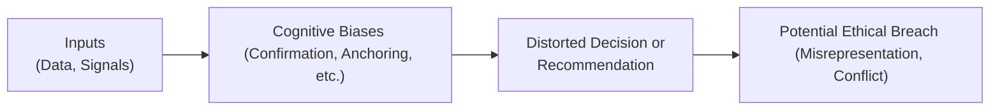

The way our minds process information can be, well, a bit tricky sometimes. Perhaps you’ve had that moment where you’re so confident in what you believe that you kind of tune out what doesn’t fit. Happens to me, too. In the world of finance—where so many critical decisions are made under pressure—this behavior can cause ethical slip-ups or unintended consequences for clients, portfolios, and the overall credibility of the investment profession. Below, we’ll explore the major cognitive biases you’ll likely see in practice, how these biases can push otherwise honest analysts and managers into unethical corners, and most importantly, what you can do about it. This discussion directly supports the CFA Institute Code of Ethics and Standards of Professional Conduct by highlighting how awareness and structured processes can guard us against some pretty sneaky thought patterns.

## Understanding the Foundations of Cognitive Bias

Cognitive biases are systematic mental shortcuts—basically, patterns our brains take when interpreting information. Think of them as timesavers that help us make decisions quickly. In a casual setting, these shortcuts might be harmless (like always ordering the same coffee drink). But in complex financial roles, especially with multiple moving parts—client objectives, regulatory constraints, market dynamics, firm policies—these mental shortcuts can inadvertently mislead us.

Interestingly, research by psychologists Amos Tversky and Daniel Kahneman (often cited in the CFA Level I and Level III curricula) shows that biases aren’t just random mistakes. They’re predictable, consistent patterns of error in judgment. And in high-stakes environments such as portfolio management or compliance investigations, those errors can produce unethical outcomes.

Here’s a quick personal story: Early in my career, I undervalued contradictory data that challenged my initial valuation model. Why? Because I was super proud of that model. That’s basically confirmation bias in a nutshell—and it was a wake-up call for me to double-check my assumptions and valuations.

## Common Biases in Ethical Decision Making

### Confirmation Bias

Confirmation bias is about seeking or favoring evidence that supports your existing beliefs and discounting what challenges them. In investment research, an analyst might selectively rely on data that makes her buy recommendation look perfect while dismissing any negative signals. Ethical trouble can start if that same analyst glosses over negative info in client presentations—essentially withholding crucial data that might change the recommendation or at least alter the risk perspective.

### Anchoring Bias

Anchoring bias refers to our tendency to rely too heavily on an initial piece of information (the “anchor”) when making subsequent judgments. Picture a portfolio manager who sets an initial price target for a stock at the beginning of the year. Even if significant new information becomes available—like major shifts in the company’s competitive environment—the manager might struggle to adjust that target meaningfully, leading them to rationalize a questionable trade that might not serve the client’s best interests.

### Overconfidence Bias

Overconfidence bias might lead professionals to overestimate their abilities, undervalue risk, or assume their clients share identical risk tolerances. We’ve all done it at some point: “I’ve been in this business for years—I know what I’m doing.” An unwavering belief in your own judgment can inadvertently lead to ignoring essential due diligence steps. This can create ethically murky territory once you fail to perform the thorough analyses that your clients deserve.

### Herding Bias (or Social Proof)

Sometimes, we look around to see what everyone else is doing and follow suit. In finance, groupthink can push otherwise skeptical analysts to adopt clearly inflated valuations if the entire department or peer group does so. Ethical lines may blur if the group ends up collectively rationalizing actions that place short-term wins ahead of long-term client interests.

### Loss Aversion Bias

Loss aversion bias means that people often prefer avoiding losses more strongly than acquiring gains. In an ethical dimension, this might push someone to “hide” negative performance or conceal underperforming segments in a composite performance report, because psychologically it feels worse to disclose a tangible loss than to reveal an unrealized gain that might not even be fully substantiated.

## Ethical Implications for Financial Professionals

Investors, clients, and regulatory bodies count on ethical decision-making to ensure that markets remain fair, trustworthy, and efficient. A little slip in rational thinking can lead to big consequences, like:

• Misleading Communication: An analyst with confirmation bias might emphasize favorable data in investor communications and understate the risks, skirting Standard V of the CFA Institute Standards (Investment Analysis, Recommendations, and Actions).  
• Conflicts of Interest: Overconfidence can lull professionals into ignoring potential conflict-of-interest red flags (Standard VI). They might be so sure they’ll never be swayed by personal incentives that they fail to implement necessary disclosures or checks.  
• Breaches of Duty: If a portfolio manager’s anchoring on historical prices causes them to retain an asset that should be divested, that could have negative ramifications for a client’s risk–return profile (violating Standard III—Duties to Clients).

In short, biases can lead to unintentional but still unethical acts, ultimately harming clients, firms, or market integrity. Even if the mistake wasn’t malicious, it’s a breach of an ethical or professional standard.  

## How Cognitive Biases Emerge in High-Pressure Situations

Ethical pressures mount when professionals face tight deadlines, volatile markets, or ambiguous guidance. Biases often rear their heads when:

• Time Constraints: Under stress, we rely more on quick judgments—quick being the prime breeding ground for mental shortcuts.  
• Group Discussions: Consensus-driven cultures can amplify herding behavior, especially if dissenting voices are not welcomed or encouraged.  
• Overexposure to Specific Data: When analysts repeatedly work with certain metrics or data sets, they can become anchored to them.  
• Personal Stakes: High compensation incentives can increase unconscious motivations to ignore contradictory evidence that might reduce short-term profits.

Because high-pressure environments are pretty common in finance, understanding these triggers is critical to staying aligned with ethical standards.

## Structured Methods to Mitigate Bias

Self-awareness about your own biases is half the battle. In the context of the CFA exam and professional practice, you’ll want to:

• Use Checklists: They’re not just for novices. In fact, checklists are an excellent way to ensure that you systematically review all relevant factors—especially those that might contradict your preferred viewpoint.  
• Conduct Peer Reviews: A supportive but challenging peer environment can surface blind spots. For example, if you present your trade rationale to a colleague who’s encouraged to question your assumptions, you can unearth contradictory evidence you’ve overlooked.  
• Stay Transparent and Document Rationale: By writing down your reasoning, along with alternative viewpoints that were considered, you ensure accountability (a direct nod to Standard IV—Duties to Employers—and Standard V—Investment Analysis).  
• Scenario Planning: Map out best-, worst-, and median-case scenarios to detach from a single anchor. By forcing an examination of multiple outcomes, you naturally combat overconfidence and anchoring.  
• Engage in Self-Reflection: Journaling or structured mindfulness can help you catch yourself in a bias. For instance, if you notice you’re ignoring client feedback about risk aversion, that’s a chance to reevaluate your approach.  

## Diagram: How Biases Influence Ethical Conduct

Below is a simple Mermaid diagram that shows how biases move from personal mindset to ethical (or unethical) behavior:

While oversimplified, this diagram captures the gist: biases inject a distortion layer between objective data and your final decision, making it that much harder to maintain ethical integrity if left unchecked.

## Applying These Concepts in Portfolio Management

To illustrate a numeric example, imagine you’re an equity analyst who picked an anchor of $50 for a stock’s fair value. Over the next quarter, you see negative earnings surprises, a new competitor emerges, and the Fed announces rate hikes. Rationally, the stock’s fair value might be around $35. However, anchoring can cause you to cling to $50. If you continue to recommend that stock based on your original anchor, you risk violating your duty of diligence and care (Standard V) because you’re ignoring new material information.

Let’s do a short calculation that might show how an analyst should weigh these negative factors:

• Original fair value: $50  
• Company’s earnings growth warranted a 15× P/E. Now, negative earnings surprises reduce growth forecasts, thereby justifying a 10× P/E.  
• New Fair Value = (Reduced Earnings) × (Lower P/E Multiple)  

If the starting earnings target was $3.50 per share with a 15× multiple, that’s $52.50. Suppose that, with the new competitor, the realistic earnings are only $2.50 and the multiple is 10×. You’d get $25 for a new fair value. If you remain anchored to $50, you might disregard a significant portion of the data, ultimately misrepresenting the stock’s potential to clients.

## Ethical Decision-Making and Regulatory Considerations

Ethical conduct is not just about being a “nice person.” Regulators like the SEC in the United States or the FCA in the United Kingdom (and many others around the globe) have set rules requiring transparent and fair communication to protect investors. In a cross-border context, IFRS or GIPS can come into play, especially if you’re presenting performance results. For instance, GIPS compliance requires consistent reporting of all composites, which should, in theory, reduce confirmation bias by forcing standardized disclosures.

Additionally, the CFA Institute’s Professional Conduct Program and its enforcement and investigation procedures revolve around ensuring members abide by both the letter and the spirit of ethical standards. Reliance on structured frameworks, continuous learning (e.g., reading updated Standards of Practice Handbooks), and participating in local CFA Society events discussing ethics can all help you remain vigilant.

## Best Practices from Real-World Observations

• Encouraging Dissent: Some investment committees intentionally assign a “devil’s advocate” role.  
• Setting Specific Time for Reflection: Before finalizing a recommendation, a mandatory pause (say, 24 hours for reflection) can help reduce impulsivity and overconfidence.  
• Designing Checklists for Ethics Reviews: Large asset managers often integrate these with compliance procedures to ensure no step is missed—particularly important in high-volume trading environments or fast-changing markets.  
• Ongoing Education: Role-playing ethical dilemmas is surprisingly effective. Firms simulate pressurized dilemmas and watch how teams react.

## Final Exam Tips: Minimizing Bias in Constructed Responses and Case Studies

• Identify Biases Early: If you see an exam vignette describing an analyst ignoring contradictory data, that’s your prompt to think “confirmation bias.”  
• Link Bias to Ethical Outcomes: The exam often tests your ability to connect a bias to a Standard of Professional Conduct violation. Practice writing concise paragraphs that do exactly that.  
• Propose Mitigation Strategies: If a scenario presents a biased officer or team, integrate practical steps like peer reviews or standardized checklists into your answer.  
• Use the “Applicable Standard” Approach: Show how the behavior might conflict with Standards I–VII, referencing them specifically. The exam graders love it when you map the scenario to the standard.  

Remember, in a portfolio management context, you might face bias challenges around asset allocation, performance measurement, or short-term performance chasing. Show exam graders you recognize the interplay between biases and your fiduciary responsibilities.

## References

• Kahneman, D. (2011). Thinking, Fast and Slow. New York: Farrar, Straus and Giroux.  
• CFA Institute. (Latest Edition). Standards of Practice Handbook.  
• Tversky, A., & Kahneman, D. (1974). Judgment under Uncertainty: Heuristics and Biases. Science, 185(4157), 1124–1131.  

## Test Your CFA Knowledge: Cognitive Biases and Ethical Conduct Quiz



### Which statement best describes confirmation bias?

- [ ] A tendency to overweigh new information and immediately discard prior assumptions.
- [x] A tendency to favor information that supports one’s initial beliefs and discount contradictory data.
- [ ] A tendency to ignore quantitative data in favor of qualitative insights.
- [ ] A tendency to rely on group opinion rather than independent judgment.

> **Explanation:** Confirmation bias leads individuals to overweight information that aligns with their preexisting beliefs.  

### A research analyst sets a stock’s target price at USD 45. Despite earning updates projecting lower annual revenues, she remains fixated on the USD 45 target. Which bias is primarily at play?

- [x] Anchoring bias
- [ ] Confirmation bias
- [ ] Herding bias
- [ ] Loss aversion bias

> **Explanation:** Anchoring bias involves overreliance on an initial reference point (in this case, the USD 45 target).  

### How can self-reflection exercises reduce unethical behavior linked to cognitive biases?

- [x] By helping individuals identify habitual thought patterns and challenging potentially biased reasoning.
- [ ] By discouraging peer review processes.
- [ ] By mandating alignment with the group’s decision.
- [ ] By promoting secrecy and preventing disclosure of investment decisions.

> **Explanation:** Self-reflection sparks awareness of internal thought processes, thereby enabling individuals to catch and correct biases before they lead to unethical decisions.  

### What is a practical method for mitigating confirmation bias when evaluating an investment recommendation?

- [ ] Relying entirely on qualitative data.
- [x] Encouraging a colleague or team member to challenge the recommendation.
- [ ] Ignoring market signals in favor of historical data only.
- [ ] Restricting all investment decisions to a single analyst.

> **Explanation:** Having an independent, challenging viewpoint can highlight overlooked contradictory evidence, mitigating confirmation bias.  

### In what scenario might overconfidence bias most likely violate the CFA Institute Code of Ethics?

- [x] When a portfolio manager disregards a client’s stated risk tolerance, believing their own judgment is superior.
- [ ] When practitioners rely on disclaimers in performance reports.
- [x] When an analyst fails to disclose personal conflicts of interest yet insists it wouldn’t affect objectivity.
- [ ] When a firm applies GIPS standards in performance presentations.

> **Explanation:** Overconfidence can lead to dismissing crucial client instructions or ignoring conflict-of-interest disclosures, both breaches of fiduciary and professional duties.  

### Which characteristic often triggers biases in financial decision-making?

- [x] High-pressure, time-sensitive environments
- [ ] Divergent, fully documented viewpoints
- [ ] An abundance of comprehensive market data
- [ ] Sufficient rest and open-mindedness

> **Explanation:** When stress is high and time is short, mental shortcuts are more likely, leading to biased judgments.  

### A group of analysts follows a senior manager’s recommendation without debate, despite conflicting data. What bias is best illustrated?

- [x] Herding bias
- [ ] Confirmation bias
- [x] Overconfidence bias
- [ ] Anchoring bias

> **Explanation:** The group’s desire for consensus or reliance on the manager’s authority leads them to conform, illustrating herding bias.  

### What is the primary purpose of documenting the rationale behind each investment decision?

- [x] To create transparency and allow for accountability, protecting against ethical missteps.
- [ ] To reduce documentation time so more trades can be executed.
- [ ] To simplify performance measurement, even if incomplete.
- [ ] To avoid regulatory oversight by presenting minimal data.

> **Explanation:** Documenting reasoning promotes consistency, transparency, and accountability. It also helps identify and correct biases over time.  

### In an ethically challenging scenario involving potential conflicts of interest, which strategy can best mitigate biased judgment?

- [x] Implementing a structured checklist that addresses common sources of conflict-of-interest issues.
- [ ] Encouraging participants to use personal experience alone.
- [ ] Suggesting participants focus solely on short-term performance goals.
- [ ] Relying fully on the local regulatory framework to make decisions.

> **Explanation:** Checklists help ensure each ethical consideration (like conflict-of-interest disclosures) is systematically addressed.  

### True or False: “Codes of Ethics by themselves completely eliminate cognitive biases.”

- [x] True
- [ ] False

> **Explanation:** Trick question: it’s actually false that codes of ethics alone can eliminate biases. Codes set standards, but individuals also must take proactive steps (e.g., self-reflection, structured decision-making) to overcome their inherent biases.


