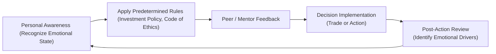

## Introduction
Have you ever made a snap investment decision just because you felt nervous about losing money? Or maybe you were so convinced you had the perfect strategy that you pushed aside others’ warnings? Well, I’ll be the first to admit I’ve been there. Emotions can creep into our financial and ethical choices, often disguised as “gut instincts,” but they can also lead us astray. In the broader context of behavioral finance—introduced in previous sections such as 7.1 on cognitive traps—this part dives deep into emotional biases, how they differ from cognitive biases, and, crucially, why they pose unique challenges in the ethical realm.

CFA candidates and financial professionals alike need a well-rounded understanding of emotional biases. Not only do these biases shape portfolio decisions and risk management, they can also trigger unethical shortcuts if left unchecked. That’s why the CFA Institute Code of Ethics (see Chapter 2 for an overview of the Code’s scope and obligations) strongly suggests ongoing self-awareness, structured decision-making processes, and clear accountability mechanisms. Let’s explore what emotional biases are, why they happen, and what steps you can take to mitigate them.

## Distinguishing Emotional Biases from Cognitive Biases
Emotional biases arise when feelings, intuitions, or deep-seated aversions override objective thinking processes. By contrast, cognitive biases relate to reasoning errors or misguided reliance on mental shortcuts—like pattern recognition gone awry. An emotional bias is less about “faulty logic” and more about “subconscious triggers.” For instance, you might intellectually know that a market dip presents a buying opportunity, but your fear of loss (a powerful emotional driver) leads you to shun the investment altogether. Cognitive biases can be tackled with more data and refined thinking routines, but emotional biases require awareness of how moods—like stress, euphoria, or anxiety—cloud your professional judgment.

This interplay between feelings and decisions isn’t inherently bad. Indeed, a healthy fear of losing money can spur thorough due diligence. Problems emerge when intense emotions block objective judgment or result in unethical “shortcuts,” such as bypassing compliance procedures just to get a trade done before markets close. As we’ll see, specific emotional biases carry significant consequences for ethical decision-making in finance.

## Key Emotional Biases in Ethical Context

### Loss Aversion
Loss aversion is the classic scenario where the pain of losing feels more severe than the pleasure of an equivalent gain. Let me throw out a quick numeric example to illustrate:

Imagine you have two options:
• Option A: A guaranteed gain of $10.
• Option B: A 50% chance of gaining $25 and a 50% chance of gaining $0.

The expected monetary value of Option B is $12.50—technically higher—yet many people still pick the guaranteed $10 because they’d rather avoid the possibility of winning nothing. That’s a mild example. Loss aversion grows more disruptive when the fear of any potential loss becomes so pronounced that professionals neglect opportunities or violate standard procedures under stress. In a portfolio context, this could mean holding onto a losing position far too long to “avoid the pain” of recognizing a real loss. From an ethical standpoint, it can induce someone to hide poor performance results or fudge risk metrics. That’s where you see the short-term desire to avoid blame overshadow the longer-term commitment to transparency (which is fundamental to Standard I of Professionalism and Standard V of Investment Analysis and Recommendations).

### Overconfidence
Overconfidence is an inflated sense of one’s own skills, knowledge, or predictive abilities. A friend of mine—I’ll call him Kyle—once believed so firmly in his “market intuition” that he tackled an equity options strategy with minimal research. He made some quick gains, fueled his sense of infallibility, and started doubling down. Eventually, Kyle overlooked basic fundamentals like volatility exposure. Let’s just say it didn’t end too well. Overconfidence can lead to ignoring red flags, skipping compliance checks, or even misrepresenting performance to keep that “I’ve got this under control” narrative alive. In advanced financial roles, overconfidence might cause you to dismiss risk management protocols, leading to unethical risk-taking. Plus, in client relationships, overconfidence can morph into a paternalistic “trust me, I know best” approach, which robs clients of transparent, balanced choices.

### Recency Bias
Recency bias is another subtle but potentially damaging emotional bias. It refers to weighting recent data or events too heavily compared to historical or fundamental trends. Suppose you’re an analyst tracking a particular fixed-income market that has just experienced a rare rally. If you succumb to recency bias, you might ignore the historical patterns of interest rate movements or systemic risk, placing disproportionate trust in the “hot hand.” If regulatory warnings or fundamental research (see Standard V in Chapter 3.5) contradict your bullish outlook, your recency bias might push you to rationalize why “this time is different.” Ethically, recency bias can lead professionals to justify precarious decisions—especially if recent market upswings overshadow due diligence. It can also fuel short-term risk-seeking to chase gains witnessed in the last quarter, potentially ignoring the client’s long-term objectives (violating Standards III and V where client interests and suitable recommendations matter).

## Impact on Ethical Decision-Making
Emotional biases carry profound ethical implications. Let’s have a quick look at how they can feed unethical conduct:

• Loss Aversion → Concealing Losses: An asset manager might underreport negative returns or smooth out performance data to avoid the “embarrassment” of acknowledging a losing streak.  
• Overconfidence → Disregarding Regulations: A proprietary trader, for instance, might be so sure of their market timing that they skip internal sign-offs or risk compliance guidelines.  
• Recency Bias → Overlooking Long-Term Duties: A financial advisor could push an investment solely because it’s performed well recently, neglecting future potential downsides or the client’s strategic goals.  

The common thread is short-sightedness. Emotional biases revolve around immediate feelings—fear of loss, thrill of being right, relief at seeing recent outperformance. These overshadow the long-range perspective that lies at the heart of ethical practice.

## Real-World Illustrations and Case Studies
In the 2008 Global Financial Crisis, elements of emotional bias contributed to risk complacency. Many believed property prices would “always rise,” reminiscent of recency bias at its strongest. At the same time, banks and hedge funds were reluctant to recognize creeping losses and kept doubling down on mortgage-backed securities—clearly a form of loss aversion. Overconfidence in risk-transfer mechanisms and rating agencies amplified the meltdown. While deeper systemic factors were at play, emotional biases among key decision-makers helped drive the mania that compromised ethical standards.

Another scenario might involve a portfolio manager who bets heavily on high-volatility tech stocks after seeing a string of strong quarterly earnings for big players in the sector. Blinded by recency bias and overconfidence, they might violate the client’s investment policy statement that sets a maximum threshold for sector concentration. Failing to adhere to guidelines is not just a performance risk but also an ethical one (breach of fiduciary duty, a direct concern of Standards III and V). We see here how ignoring rules due to emotional excitement leads to potential professional misconduct.

## Strategies for Mitigating Emotional Biases in Practice
Emotional biases can’t just be analyzed away through more data or fancy analytics—though those help mitigate typical cognitive errors. Instead, we need processes and structures that check how emotions factor into our ethical choices:

### 1. Predetermined Rules and Decision Protocols
One powerful way to limit emotional impulses is by creating stringent guidelines—think of well-structured investment policy statements, or a compliance checklist for new trades. For instance, a rule might state: “No single security shall exceed 5% of the total portfolio.” Even if you’re utterly convinced that Stock XYZ is the next blockbuster, the rule forces you to reconsider. Similarly, a code of ethics (Chapter 2’s deep dive) clarifies the boundaries of professional conduct, helping professionals identify when emotional impulses are steering them off track.

### 2. Constructive Feedback Loops
Seeking honest feedback from mentors or peers before making major decisions is hugely beneficial. Portfolio managers might schedule weekly reviews with a compliance officer to examine trades and holdings. Or an equity analyst might present their research in a cross-functional forum, inviting critiques before finalizing a recommendation. These feedback loops are especially relevant in confronting emotional biases: if you’re recency-biased or overconfident, the group environment can offer sobering perspectives. Open communication channels encourage transparency, reducing the chance that emotions flourish unchecked.

### 3. Mentorship Programs
A supportive mentor can be a reality check when emotions run hot. Suppose you’re about to take a high-leverage position based on the “feeling” that the euro is going to plunge. A mentor might calmly remind you to evaluate macroeconomic fundamentals, review existing exposure, and confirm alignment with client objectives. Mentors also share personal stories of near misses or big mistakes from emotional overreach, reinforcing the importance of caution and reflection. Mentorship fosters a culture of learning, reinforcing ethics, and bridging knowledge gaps—a theme carried throughout various sections of this volume, particularly in 10.4 on mentorship and leadership.

### 4. Stress-Management Techniques
Mindfulness, regular breaks, balanced work schedules, and mental resets can diminish emotional volatility. If you’ve pulled multiple all-nighters trying to finalize a client pitch, exhaustion can heighten your loss aversion or intensify your urge to recoup perceived losses fast. High-stress environments, common in financial industries, have a direct correlation with emotional bias, as well as ethical hazard. Incorporating mandatory “cool-off” periods before major portfolio adjustments or implementing rotating schedules can help. The big picture: a well-rested professional is less prone to snap judgments and more likely to align actions with the firm’s ethical frameworks.

### 5. Role Reconstructions
Role reconstruction is like stepping into someone else’s shoes to see a decision’s impact from multiple angles. Let’s say, as a fund manager, you’re leaning toward a risky trade that could bring a windfall or a big loss. Placing yourself in the shoes of your client, your compliance officer, or even a distant observer might reveal potential conflicts or hidden blind spots. This exercise is also a powerful way to empathize with how your emotional biases might be overshadowing the best interests of stakeholders. By mentally reversing roles—envisioning you’re the compliance officer or the investor who is risk-averse—you become more attuned to the ethical ramifications of your emotional impulses.

## Visualizing Emotional Bias Mitigation
Below is a simple Mermaid diagram showing a workflow for managing emotional biases in a typical institutional setting. It highlights the interaction between personal awareness, organizational safeguards, and external checks.

In this loop, each step feeds forward into the next, creating an ongoing cycle of awareness and ethical diligence.

## Exam Relevance and Practical Tips
For CFA candidates, emotional bias is tested in ways that blend ethics, behavioral finance, and portfolio management. You might encounter item set questions detailing a portfolio manager’s actions in an emotionally charged market scenario. A typical question could ask you to identify which bias is most likely influencing the manager’s decision, then evaluate whether the manager’s conduct violates any CFA Institute Standards.

• Constructed Response Tip: Offer precise definitions of the relevant bias and directly connect the behavior in the scenario to the elements of each standard (e.g., Standard III for Duties to Clients).  
• Multiple-Choice Tip: Look for subtle clues hinting at fear, excitement, or overshadowing recent performance. Remember, emotional biases often revolve around feelings rather than purely flawed logic.  
• Time Management: Distinguish between emotional and cognitive biases quickly. Examiners often test whether you understand that emotional biases are trickier to correct than cognitive ones.  

## Additional Case Example: Loss Aversion in Practice
Let’s say an equity analyst holds shares in a pharmaceutical firm that recently faced an FDA investigation. The stock has tanked 15%, but they cling to hope for a rebound. Their impetus? They don’t want to “book” that loss. Over time, they keep ignoring negative news updates, even as fundamentals deteriorate, hoping to break even. If that impetus leads them to misrepresent the stock’s prospects to clients or colleagues, that crosses into an ethical breach. This scenario is multi-layered for exam contexts because it might raise concerns about Standard V (Investment Analysis) and possibly Standard I(C) (Misrepresentation), if disclosures aren’t accurate.

## Integrating Mindfulness for Ethical Actions
Mindfulness—discussed more in the context of stress management—helps professionals remain present, reducing the knee-jerk reaction to fear or excitement. Something as simple as a brief breathing exercise or “mental pause” before finalizing a major trade can keep emotional bias in check. If you’re under time pressure, you might find yourself rushing. But ironically, a few moments of deliberate calm can enhance your accuracy.

In an institutional setting, such as a mid-sized hedge fund, you might see managers embedding mindfulness breaks into daily schedules. Perhaps each day includes a five-minute guided reflection after lunch to mentally reset. Yes, it sounds small, but that’s exactly the point: a bit of reflective space can keep you from crossing ethical lines when emotions flare.

## Putting It All Together
Emotional biases intertwine with everyday realities in finance. Think of them as the human side of the equation—an undercurrent to every market analysis, client pitch, or internal decision. Recognition is the first step: know your triggers (fear, overconfidence, recency illusions) and watch out for them. Then build “guardrails”—like predetermined rules, feedback loops, mentorship, role reversals, and stress management—to throttle those impulses. In advanced professional practice, especially under the pressure of real-world trading floors or big client mandates, these biases can easily resurface, which is why continuous reinforcement of ethical standards is crucial.

If you remember only one thing, let it be this: emotional biases thrive when unexamined. The more you shine a spotlight on them—through structured processes and a culture of open discussion—the lower their grip on your ethical decision-making. Ultimately, you’re setting yourself up for not just better portfolio outcomes but also a career aligned with the trust and integrity demanded by our profession.

## Final Exam Tips
• Don’t Just Memorize Bias Definitions: Understand the “why” behind each bias—are you seeing fear or an inflated sense of skill?  
• Connect Biases to Standards: Show how a bias can lead to violating specific CFA Codes or Standards.  
• Incorporate Real-World Evidence: Cite examples or hypothetical data illustrating how an emotional bias manifests in decision-making.  
• Stay Self-Aware: In scenario-style questions, consider the emotional states of the people involved—fear, excitement, or denial might be big clues.  

## References
• Loewenstein, G., & Lerner, J. (2003). “The Role of Affect in Decision Making.” In R. Davidson et al. (Eds.), Handbook of Affective Science.  
• Sunstein, C. R., & Thaler, R. H. (2009). “Nudge: Improving Decisions About Health, Wealth, and Happiness.”  
• Behavioral Finance Research from the CFA Institute: https://www.cfainstitute.org/  

Below, you’ll find a short quiz to test your understanding of emotional biases, ethical pitfalls, and real-world mitigations.

## Test Your Knowledge: Emotional Biases and Decision-Making Pitfalls



### Which statement best captures the key distinction between emotional and cognitive biases?

- [x] Emotional biases stem from feelings and mood, while cognitive biases stem from errors in logical reasoning.
- [ ] Emotional biases are always easier to fix than cognitive biases.
- [ ] Cognitive biases have no ethical implications, while emotional biases do.
- [ ] Emotional biases do not affect investment decisions, only interpersonal relationships.

> **Explanation:** Emotional biases originate from an individual’s feelings and subjective perceptions, whereas cognitive biases arise from systematic errors in logic or problem-solving approaches.

### A portfolio manager repeatedly ignores new market risks because they are confident in their predictive skills. This best illustrates which bias?

- [ ] Loss aversion
- [x] Overconfidence
- [ ] Anchoring
- [ ] Availability

> **Explanation:** Overconfidence bias is when professionals place too much faith in their own intuition or skill, often to the detriment of proper risk controls.

### How might recency bias lead to unethical decision-making?

- [x] By overvaluing recent performance data, ignoring fundamental analysis, and potentially violating suitability standards.
- [ ] By causing managers to lose focus on compliance standards they recently learned.
- [ ] By forcing a strict reliance on historical performance.
- [ ] By making a manager avoid any form of risk-taking.

> **Explanation:** Recency bias can push practitioners to base decisions disproportionately on recent events. If the bias causes ignoring a client’s long-term needs or failing to disclose known risks, it could breach CFA Institute Standards.

### In a high-pressure trading environment, which approach best mitigates emotional bias before major investing decisions?

- [ ] Relying solely on intuition and gut feeling.
- [ ] Initiating the trade immediately while the emotion is still fresh.
- [x] Taking a brief mindfulness exercise or a “cool-off” period to reconsider the facts.
- [ ] Delegating all decisions to a single risk manager.

> **Explanation:** Pausing to evaluate the emotional state, possibly through mindfulness techniques, helps prevent snap, emotion-driven choices.

### Which of the following is a practical step recommended for reducing the impact of loss aversion?

- [x] Implementing preset thresholds that trigger partial or total exit of losing positions.
- [ ] Always trying to double down on a loss to recoup quickly.
- [x] Reviewing a client’s investment policy statement to confirm objective parameters.
- [ ] Ignoring compliance sign-offs to expedite trades.

> **Explanation:** Predetermined rules, including mandatory rebalancing or maximum loss thresholds, limit emotional attachments to losing positions.

### Why might a peer review or mentor feedback be critical in combating emotional biases?

- [x] Colleagues offer external perspectives that highlight potential oversights or emotionally driven decisions.
- [ ] Mentors encourage acting on gut instincts over thorough analysis.
- [ ] Peer review fosters secrecy in decision-making, which helps reduce stress.
- [ ] It eliminates any obligation to follow the Code of Ethics.

> **Explanation:** By inviting outside opinions, professionals gain insights that temper one-sided emotional thinking, reinforcing ethical and balanced decisions.

### Role reconstruction is most helpful when:

- [x] You need to empathize with clients or colleagues, seeing how a decision affects them.
- [ ] You want to justify ignoring risk management checks.
- [x] You require a quick method of confirming your original stance without deeper analysis.
- [ ] You seek to increase your reliance on heuristics.

> **Explanation:** Role reconstruction allows viewing a decision from multiple angles, thus exposing emotional triggers and possible ethical blind spots—supportive of fair, client-focused action.

### Which of the following describes how overconfidence bias might show up in a real-world ethical violation?

- [x] Trusting your personal trading record so excessively that you omit required compliance steps.
- [ ] Always listening to your supervisor’s advice without question.
- [ ] Avoiding high-risk, high-reward trades because you feel timid.
- [ ] Relying solely on fundamental analysis and ignoring market sentiment.

> **Explanation:** Overconfidence bias can push individuals to bypass rules and regulations because they assume they “know better,” which can directly lead to unethical shortcuts.

### Under the CFA Institute Standards, a manager who falsifies performance data due to fear of client dissatisfaction is most likely driven by:

- [x] Loss aversion bias.
- [ ] Representativeness.
- [ ] Hindsight bias.
- [ ] Automation bias.

> **Explanation:** A strong fear of losses or negative feedback can trigger loss aversion, causing practitioners to hide or distort performance data to avoid the perceived “pain” of admitting a loss.

### Emotional biases can be mitigated primarily by logical analysis and more data. True or False?

- [x] True
- [ ] False

> **Explanation:** While more data can help reduce cognitive biases, emotional biases require additional interventions, such as mindfulness, structured rules, or feedback mechanisms. However, careful data analysis does also offer a supportive framework to keep emotions in check.


