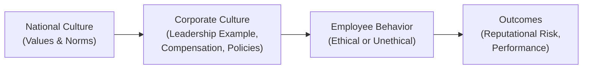
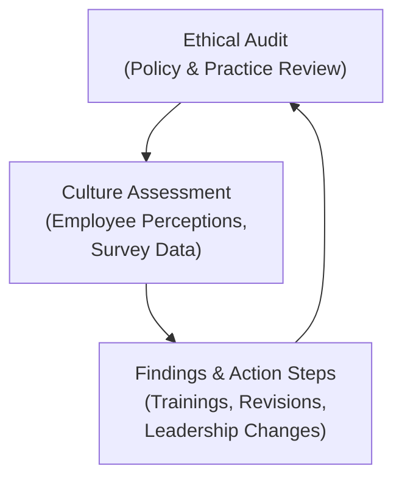

## Overview

Have you ever found yourself hesitating to speak up in a meeting because your boss was in the room, and you weren’t sure if pushing back would rock the boat? Or maybe you’ve felt pressure to adopt certain habits “because everyone else is doing it,” even though they didn’t seem entirely ethical. Well, these situations often boil down to cultural and organizational pressures.

In the finance profession—where decisions can affect millions of dollars and thousands of clients—cultural norms and company traditions can heavily shape our ethical behavior. And let’s be honest, it’s not just about legal rules or official policies. What really determines whether you speak up or stay silent often hinges on the unconscious cues you get from your workplace culture and the broader, possibly global, culture you belong to.

In this section, we’ll explore the ways that cultural and organizational factors shape ethical decision making, from national culture and corporate norms to power hierarchies and whistleblower policies. We’ll also examine how cross-cultural teams can address differences in communication styles and maintain consistency in their ethical standards. By the end, my hope is you’ll see how deeply culture influences ethics and take away a few strategies to help create a culture of integrity in your workplace.

## National Culture and Ethical Decision Making

Despite the fast-paced globalization of the financial industry, cultural traits endemic to specific regions or countries still have a significant impact on behavior. In some cultures, for instance, employees are less likely to question an authority figure because they view a high “power distance” as natural. In other cultures, deeply held collectivist values might lead teams to prioritize harmony over direct confrontation—even in the face of ethical concerns. Understanding these underlying cultural dimensions is crucial for any global financial professional aiming to navigate workplace ethics effectively.

### Power Distance

“Power distance” is the extent to which less powerful members of an organization accept and expect unequal distributions of power. In high power-distance cultures, employees typically do not challenge their superiors openly. When a subordinate spots an unethical practice, they might stay quiet rather than risk stepping out of line. This reluctance can shield wrongdoing and lead to troubling behaviors persisting unchallenged. 

In finance, where timely and accurate disclosures are essential, a high power-distance culture may allow complacency or even malpractice to go unchecked. Think of a scenario: an entry-level investment analyst notices that a senior portfolio manager is consistently biased in client reports, overstating performance metrics. If there’s a strong hierarchical divide, the junior analyst might fear repercussions more than they fear the moral implications of ignoring the issue.

### Collectivism vs. Individualism

When we talk about collectivist cultures, we often refer to societies that prize group cohesion, consensus-building, and loyalty. On the other hand, individualist cultures place greater value on personal independence and self-initiative. Neither approach is inherently more ethical, but each poses unique challenges:

• Collectivist teams might be reluctant to raise red flags or single anyone out because it breaks group harmony.  
• Individualistic environments might prioritize personal achievements so fiercely that they inadvertently encourage aggressive competition and corner-cutting.

In the investment world, collectivist attitudes might help foster consensus but could also hamper necessary dissent. Individualistic cultures might encourage innovation but run the risk of intensifying short-term success at the expense of long-term credibility.

### Uncertainty Avoidance

Uncertainty avoidance measures how comfortable a society is with ambiguity or risk. Cultures high in uncertainty avoidance usually prefer structured guidance, sampling existing templates, and placing heavy weight on official rules. Those with low uncertainty avoidance might experiment more and worry less about a plan that’s not fully formed.

Such tendencies can drive ethical behavior in unexpected ways. Highly risk-averse societies might strictly follow official policies for fear of moral or legal sanctions. However, these same cultures could become so reliant on rigid structures that employees don’t develop the critical thinking necessary to handle nuanced ethical problems. Low uncertainty-avoidance cultures, meanwhile, might be flexible and innovative but risk failing to appreciate the seriousness of certain ethical guidelines.

## Corporate Culture: The Hidden Influencer

While national culture sets a broad backdrop, everyday behavior in finance is often dictated by the subtler messaging of corporate culture. You know how you walk into some offices and immediately sense the vibe—maybe folks are openly collaborative, or maybe there’s a constant hustle for the next big deal at all costs? That intangible element is corporate culture.

But corporate culture isn’t just about the “feel” of the office; it’s shaped by leadership behavior, compensation designs, informal norms, and the stories that get told around the watercooler. If employees see that the company rewards short-term gains above all else, they may be more likely to focus on hitting quarterly targets—even if it means skimping on thorough due diligence. Or, if the CEO is downright dismissive of compliance concerns, subordinates may feel that ignoring official protocols is no big deal.

### Compensation Structures and Short-Term Pressures

Let’s talk bonuses. It’s not that bonuses or monetary rewards are inherently unethical—far from it. But if a firm ties significant rewards exclusively to short-term performance metrics, analysts and portfolio managers may feel squeezed to “make the numbers.” 

A classic example: a performance-driven hedge fund might promise staggering bonuses if a certain portfolio returns 15% in a quarter. That’s a tough goal. In my early career, I once saw a colleague who was so fixated on hitting that performance target, they ended up taking on excessive leverage, which eventually backfired. When short-term incentives overshadow risk management, employees might be tempted to overlook crucial compliance steps. This interplay can put professionals in a position where they knowingly or unknowingly engage in borderline or outright unethical behavior—like smoothing returns or selectively disclosing performance results.

### Unequal Power Hierarchies

In many established financial institutions, you’ll find hierarchical structures that can be seen from a mile away. Managing directors steer the show, and everyone else falls in line. There’s nothing inherently wrong with a hierarchy—but if the hierarchy is too rigid or fosters fear, employees might keep silent about misconduct or question instructions. 

Imagine a research associate who uncovers suspicious front-running trades by a senior manager. If the associate is worried about being blacklisted, they might rationalize or ignore it. Over time, such suppressed dissent can snowball, leaving the firm exposed to reputational and regulatory risks.

Below is a simple diagram illustrating how hierarchical pressure and corporate culture can amplify one another:

In this diagram, the broad values from the national or regional culture shape corporate norms, which in turn guide employee behavior. Ultimately, this loop produces outcomes—both for the integrity of the organization and its bottom line.

## Whistleblowing: Setting the Tone for Accountability

A reputable whistleblower policy is the bedrock of any ethical corporate environment—particularly in finance, where misconduct can be both subtle and high-stakes. If an organization fosters a culture where employees feel safe reporting unethical or illegal behavior, that transparency can nip problems in the bud.

• Whistleblower Policy: A set of procedures that protect individuals who report misconduct from retaliation or unfair treatment.  
• Key Features: Confidential reporting channels, formal investigations, and assurances against retaliation.

Even the best whistleblower policy is useless if employees sense that reporting something might carry social or professional costs. Organizational culture needs to reinforce that speaking up is not just tolerated but indeed encouraged and protected. A favorite anecdote of mine: I had a friend who worked at a big bank where the CEO personally held Q&A sessions allowing anyone to anonymously submit questions or concerns. It was nerve-wracking at first, but the signals from management were clear: “We want to hear from you.” Over time, people felt more confident about addressing ethical issues directly. As a result, the bank saw fewer compliance incidents and a stronger sense of trust among employees.

## Cross-Cultural Teams: Bridging Ethical Differences

Finance is as global as it gets. You might have an equity research team in New York collaborating daily with colleagues in Tokyo, London, and São Paulo. Each local office not only deals with its own regulatory environment but also arrives with indoctrinated cultural values regarding hierarchy, conflict, and consensus.

### Sensitivity Training and Global Ethical Standards

To bridge these gaps, cross-cultural training can be a lifesaver (some might call it “culture shock therapy” in jest). Such training can teach employees about local communication norms, ways to give feedback, and—most importantly—common pitfalls in ethical misunderstandings.

Many global finance organizations now adopt standardized ethics guidelines that transcend local differences. For example, the CFA Institute Code of Ethics and Standards of Professional Conduct is a universal yardstick that sets broad expectations. Cross-cultural teams that collectively adopt an external standard—like the CFA Institute’s—have a consistent ethical reference point, which helps them navigate tricky cultural differences more cohesively.

## Regular Ethical Audits and Culture Assessments

When’s the last time you audited your firm’s culture? Probably never, right? Yet organizations conduct financial audits all the time. An ethical audit is simply a structured review of explicit policies (like codes of conduct, internal controls) and, more subtly, the norms that drive daily decision-making. 

A “culture assessment,” on the other hand, measures the alignment between stated values and actual practices. It’s like looking in a mirror to see if you’re matching up with what you claim to be. Failure to do so can lead to cognitive dissonance within teams—when employees sense that the real daily guidelines conflict with the official “values” on the company’s website, they lose trust and are more likely to become ethically complacent.

Here’s another tiny chart to illustrate the interplay:

## Practical Case Studies

1. The Pressure-Cooker Hedge Fund  
   A hedge fund sets a monthly performance threshold for employees to retain their jobs. With the entire environment oriented toward immediate profit, employees begin using questionable tactics—like over-leveraging portfolios or selectively disclosing performance data. Ultimately, the fund faces a regulatory inquiry triggered by improbable month-end returns. The root cause? A culture that rewarded short-term gains with no balancing mechanism for ethics or risk management.

2. The Global Asset Manager  
   A multinational asset manager groups portfolio teams from different countries to pitch investment ideas. Team members from high power-distance cultures remain quiet during risk evaluations, even though they have insights. A mismatch arises: the manager’s open-door policy is overshadowed by local cultural norms that discourage challenging senior staff. The result is unvoiced concerns about an overvalued stock. When the investment underperforms, the firm restructures leadership, invests in sensitivity training, and empowers a “red flag” committee to ensure all concerns surface, regardless of hierarchy.

3. The Bold Whistleblower  
   In a large investment bank, a risk analyst notices irregular trades in derivative products. Worried about blowback, they rely on the bank’s whistleblower policy to alert compliance. Initially, higher-ups attempt to hush the issue, but the policy’s regulatory obligations kick in, forcing an investigation. The bank’s eventually transparent stance after the fact not only avoids heavier legal penalties but also signals to employees that ethical concerns are taken seriously, encouraging more vigilance.

## Exam Relevance and Final Tips

• In the context of CFA exam questions, especially those involving scenario analyses, expect to see situations highlighting ethical dilemmas shaped by corporate culture or national norms. You might have to identify the correct ethical course of action based on the CFA Institute Standards of Professional Conduct.  
• Watch for references to compensation structures, performance pressures, and hierarchical challenges that hint at real-world pressures behind unethical behavior.  
• Case study or item set questions often revolve around whether an individual recognizes “red flags,” particularly in cross-cultural settings, and how they should respond according to industry standards.  
• Pay attention to Standard I (Professionalism) and Standard IV (Duties to Employers) in the CFA Institute Code and Standards. Cultural norms do not excuse violations of the ethical foundations required by the investment profession.

### Practical Advice for Constructed-Response or Item Set Questions

1. Identify the Cultural Factor: Is the scenario referencing power distance, collectivism, or short-term reward structures?  
2. Connect to CFA Institute Standards: Determine which standard or principle is most relevant.  
3. Propose an Ethical Action Plan: Consider whether there’s a whistleblower mechanism or whether direct confrontation is feasible.  
4. Balance Cultural Sensitivity with Ethical Imperatives: Sometimes, local norms might clash with global ethical standards. The correct exam answer typically aligns with the strict ethical code.  
5. Provide Evidence and Justification: State clearly why an action is ethically valid, referencing the relevant standard or principle.

## References

- Hofstede, G. (2001). “Culture’s Consequences: Comparing Values, Behaviors, Institutions and Organizations Across Nations.”  
- Trevino, L. K., & Nelson, K. A. (2016). “Managing Business Ethics: Straight Talk About How to Do It Right.”  
- CFA Institute: “Code of Ethics and Standards of Professional Conduct.”  
- Case studies from the CFA Institute on workplace ethics and issuer–analyst relationships.

## Test Your Knowledge: Cultural and Organizational Pressures in Ethical Decision Making



### 1. Which of the following best describes power distance in the context of ethical decision making?

- [ ] A culture’s tendency to avoid uncertainties by creating strict rules.  
- [ ] A measure of whether a society is collectivist or individualist.  
- [x] A measure of how comfortable employees are with unequal distributions of power.  
- [ ] A financial reward for meeting short-term performance targets.  

> **Explanation:** Power distance is about the acceptance of hierarchical differences among members of an organization, which directly influences how comfortable lower-level employees are in challenging or questioning superiors.

### 2. In a high power-distance organization, ethical breaches may go unreported primarily due to:

- [ ] The lack of financial incentives for whistleblowers.  
- [x] Employees’ fear of challenging their superiors.  
- [ ] Overly complex transparency policies.  
- [ ] Low levels of job satisfaction.  

> **Explanation:** When employees fear retribution or believe that challenging authority is socially unacceptable, they are more likely to remain silent about unethical behaviors or practices.

### 3. Which of the following scenarios illustrates a collectivist cultural dilemma?

- [x] An analyst hesitates to raise concerns in a meeting because they do not want to break group harmony.  
- [ ] A team competes intensely to earn individual bonuses.  
- [ ] A manager openly criticizes a colleague in front of the entire department.  
- [ ] A company invests heavily in automated compliance solutions.  

> **Explanation:** Collectivist values often emphasize group harmony. In some cases, this can discourage individuals from expressing dissenting views, even when necessary for ethical considerations.

### 4. An organization offering large, immediate monetary rewards for outperforming benchmarks may inadvertently encourage:

- [ ] Greater long-term focus on client interests.  
- [ ] Stronger whistleblower participation rates.  
- [x] Manipulation of data or risky behaviors to meet targets.  
- [ ] Higher compliance with regulatory policies.  

> **Explanation:** When short-term rewards predominate, employees might be tempted to engage in ethically dubious activities to secure their bonuses, potentially disregarding risk management or compliance protocols.

### 5. What is the primary purpose of whistleblower policies in an organization?

- [ ] To punish employees who challenge corporate policies.  
- [ ] To create additional layers of bureaucracy.  
- [x] To provide safe channels for reporting unethical conduct without fear of retaliation.  
- [ ] To ensure that employees always work longer hours.  

> **Explanation:** Whistleblower policies protect individuals who report misconduct, enabling issues to be exposed early and addressed properly, without putting the reporter’s career in jeopardy.

### 6. A corporate culture heavily influenced by high power distance and short-term profitability targets is most at risk for:

- [x] Ethical blind spots and repression of dissenting opinions.  
- [ ] Over-investment in employee development programs.  
- [ ] Minimizing the pay gap between executives and juniors.  
- [ ] Encouraging whistleblowers through cultural acceptance.  

> **Explanation:** In such an environment, employees may not share concerns for fear of retribution, while short-term incentives can escalate unethical behavior.

### 7. Which of the following steps would be most effective for a global firm facing recurring cross-cultural ethical conflicts?

- [ ] Eliminating whistleblower channels to avoid confusion.  
- [ ] Only hiring employees from one cultural background.  
- [x] Adopting universal ethical standards, like the CFA Institute Code, combined with sensitivity training.  
- [ ] Restricting employees’ communication with other offices.  

> **Explanation:** When cross-cultural differences lead to misunderstandings about ethics, adopting a universal standard and offering training on cultural nuances can help maintain consistent ethical practices.

### 8. How can regular ethical audits benefit an organization’s culture?

- [ ] By reducing the need for financial audits.  
- [ ] By eliminating dissenting voices within the team.  
- [x] By identifying gaps between stated values and actual behavior, allowing for corrective measures.  
- [ ] By increasing the company’s marketing budget.  

> **Explanation:** Ethical audits uncover discrepancies between formal policies and everyday practices, guiding leadership to implement reforms that reinforce consistent ethical behavior.

### 9. In a situation where an employee in a collectivist setting notices repeated conflict-of-interest violations, the biggest challenge is likely:

- [x] Fear of disrupting group harmony if they escalate the issue.  
- [ ] Lack of personal ambition to correct the problem.  
- [ ] Excessive reliance on robust whistleblower policies.  
- [ ] Overwhelming support from peers to challenge superiors.  

> **Explanation:** Collectivist values can make individuals hesitant to raise ethical concerns, as it may disrupt the unity and consensus within the group.

### 10. True or False: Employees from low power-distance cultures are always more ethical than those from high power-distance cultures.

- [x] True
- [ ] False

> **Explanation:** While low power-distance cultures might empower employees to speak up more readily, being from a low power-distance culture does not automatically ensure higher ethical standards. Ethical behavior ultimately depends on organizational policies, leadership examples, and individual integrity.


