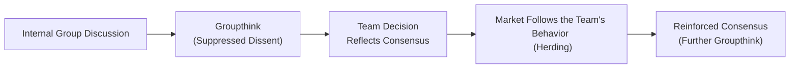

## Introduction

I remember once I was in this meeting—ah, maybe about five years ago—where everyone seemed so sure they had the perfect investment strategy. You know how it goes: the charts were all pointing up, the backtests looked pristine, and the team felt impatient to get started. But something felt off to me. The problem was, I didn’t speak up because the group was so enthusiastic, and I didn’t want to be that negativity magnet (the “spoiler,” so to speak). Not surprisingly, about six months later, we realized we’d overlooked some crucial market signals. That right there was my personal run-in with groupthink.

Groupthink and herding behavior can be serious pitfalls for any finance professional, from budding analysts to seasoned portfolio managers. Both phenomena can undermine the critical evaluation of facts, leading entire teams, entire firms, or sometimes entire markets toward suboptimal or even blatantly risky decisions. The results can be costly and, in extreme cases, damaging to clients, markets, and reputations.

Below, let’s break down the nuances of groupthink and herding, reflect on how they arise in financial contexts, and identify effective ways to guard against these biases in daily practice.

## Understanding Groupthink

Groupthink is that bias where a group values harmony or conformity over critical examination. Often, a team might collectively disregard alternative viewpoints because pushing for consensus just feels easier or more comfortable. This can be especially prevalent in high-pressure financial settings where managers want to deliver results—fast.

But how does groupthink relate to ethical issues in finance? Well, let’s say an investment committee is evaluating whether to pitch a new structured product to a client. If the group decides too quickly—maybe because one or two charismatic leaders dominate the conversation—the team might ignore key risk factors. Critical voices might stay quiet to maintain the group’s unity, or because, you know, you don’t want to alienate your boss or your colleagues. Ultimately, the group might present an overly rosy recommendation that doesn’t truly serve client interests.

### Characteristics of Groupthink
• Unquestioned Belief in the Group’s Inherent Morality: The group assumes it is “doing right” by default.  
• Rationalization of Warnings: Members might discount or ignore red flags to preserve consensus.  
• Stereotyping Outgroups or Dissenters: Those raising concerns could be viewed as troublemakers.  
• Direct Pressure to Conform: Members who question the group may sense hostility or rejection.

### Real-World Examples of Groupthink

1. Subprime Mortgage Crisis: In the early 2000s, teams at various financial institutions underwrote risky mortgage products, often ignoring signs of deteriorating credit quality. Many participants assumed, “Hey, we’re all doing this, so it must be fine,” and nobody wanted to be the one to rock the boat during a booming market.  
2. Corporate Takeover Errors: Large organizations sometimes push for mergers and acquisitions at inflated valuations. Because everyone in the boardroom is excited about potential market share gains and synergy illusions, a few dissenters often stay silent rather than going against the enthusiasm.

## Understanding Herding Behavior

Herding occurs when individuals mimic the actions of a larger group, often making decisions based on the collective trend rather than their independent analysis. If you’ve ever seen a large crowd rushing into a stock, only for that same stock to crash later, that’s a textbook example of herding.

In financial markets, herding can manifest in many ways. Think about momentum-based trading strategies: if a price trend looks like it’s going up, people just jump aboard, fueling even greater price appreciation. The problem arises when the underlying fundamentals no longer support that elevated price. Once the market mood shifts, everyone rushes for the exits. The dotcom bubble is a classic illustration of herding, with investors chasing internet stocks simply because “everyone else was doing it.”

### Consequences of Herding
• Mispricing of Assets: Overvalued securities can become wildly overpriced; undervalued securities can remain overlooked.  
• Increased Market Volatility: Herding can intensify both bull markets and crashes, making the market environment more unpredictable.  
• Ethical Dilemmas in Product Recommendations: Financial professionals might advise products or strategies purely because they are popular, rather than objectively suitable for clients.

## Why These Biases Persist in Finance

It’s human nature to want to fit in. Additionally, the financial world often rewards short-term results. If you generate quick returns by aligning with the crowd, you get praised—even if the strategy might prove unsustainable in the long run. On the flip side, independent thinkers can look “wrong” for a while, even if they’re eventually proven correct. This short-term pressure can encourage teams to stick to the consensus.

Moreover, organizations themselves can inadvertently encourage groupthink and herding by emphasizing harmony in team settings or by punishing dissenting voices. Junior analysts may fear losing out on career advancement if they consistently question senior professionals. The tension between independent thought and organizational loyalty can be tricky to navigate, but ignoring contrarian viewpoints is a sure recipe for group-driven mistakes.

## Strategies to Combat Groupthink

### Foster Constructive Dissent

Leaders should encourage—even require—disagreement. That may sound counterintuitive, but a culture where constructive conflict is embraced is often a culture that obviates groupthink. One approach is to designate or rotate a “devil’s advocate”: someone who is explicitly tasked with challenging the majority’s viewpoint and providing an opposing perspective. Doing so normalizes dissent, removing the stigma of being the lone critic.

### Implement Structured Decision-Making

Formalizing rules around major decisions is powerful. You might, for instance, require:  
• Multiple Sign-offs: At least two or three separate individuals with distinct vantage points need to approve a decision.  
• Rotating Committee Leadership: Committees that change leadership responsibilities avoid a single dominating voice.  
• Explicit Risk Assessments: Mandate a thorough risk review, including a worst-case scenario analysis before making a final call.

By instituting a procedure, you essentially force the group to slow down, check all angles, and give more voices a chance to be heard.

### Encourage Transparency about Past Errors

A “lessons learned” session each month (or each quarter) can do wonders. In these sessions, the team revisits both successes and failures, focusing on how the decision-making process unfolded. Was there a missed red flag? Did the team blindly trust certain data? Was conflicting data too easily dismissed? Bringing these questions to the forefront fosters a learning culture that actively minimizes the likelihood of repeating the same mistakes.

### Promote Diversity in Hiring

When teams are diverse—whether in cultural background, academic training, professional experience, or even personality type—the likelihood of groupthink diminishes. Why? Because individuals from different backgrounds tend to ask different questions, challenge assumptions differently, and bring fresh angles that might never occur to a more homogeneous team. This is one of the lesser-discussed but extremely potent methods of combating consensus bias.

## Strategies to Mitigate Herding

### Independent Analysis Requirements

Every investment recommendation should pass a basic test: “Did we analyze it thoroughly ourselves, or are we just copying someone else?” Formal guidelines that require fundamental analysis, due-diligence checklists, and scenario testing can help. For each proposed asset or strategy, an analyst might be mandated to produce an independent research note. The note should explicitly address whether the decision is driven by external trends (i.e., “everyone else’s picks”) or genuine conviction from in-house analysis.

### Long-Term Performance Incentives

Short-term incentives create a fertile ground for herding. If a fund manager’s bonus is heavily tied to immediate quarterly returns or if a trader’s success is measured in daily profits alone, the impulse to follow the crowd intensifies. However, if compensation is partially linked to long-term success metrics like client satisfaction, risk-adjusted returns over multiple years, or alignment with the firm’s strategic mission, people will presumably be more cautious about chasing the bandwagon.

### Regular Market Sentiment Checks

Sometimes, taking a step back to ask, “What is the prevailing market sentiment, and am I simply echoing it?” can provide clarity. An internal market-sentiment dashboard might help, tracking fundamental indicators and comparing them to prevailing investor sentiment. If your own analysis flags concerns but the market grows ever more euphoric, that might be a red flag you’re heading into herding territory.

## Case Study: The Dotcom Bubble

Let’s step back a couple of decades to the late 1990s. As internet-related stocks skyrocketed, numerous fund managers found themselves under pressure. If your peers produced astronomical gains by holding dotcom equities, you’d look subpar by avoiding them. Some managers, worried about near-term performance comparisons, joined the frenzy. Even though many had doubts about profitability or business viability, the group narrative was that the internet would change everything overnight, paving the way for indefinite upward growth.

That fervor was a breeding ground for both groupthink (“everyone in the firm is sure technology is unstoppable”) and herding (“all the top funds are overweight in tech, so we should be too”). Of course, when the bubble burst in the early 2000s, many investors realized that they had followed the herd without sufficient scrutiny of core business fundamentals.

## Diagram: Stages of Groupthink Leading to Herding

Below is a simplified diagram illustrating how a team-level groupthink can expand into broader herding behavior in the market:

In this loop, groupthink at a micro-level (within a firm) ultimately contributes to a macro-level phenomenon (the broader market herding). The market’s subsequent “validation” of the initial group decision, even if misguided, can further entrench the group into believing their original assumption was correct.

## Table: Common Symptoms vs. Mitigation Tactics

| Symptom of Bias                                  | Mitigation Tactic                                               |
|--------------------------------------------------|-----------------------------------------------------------------|
| Overconfidence in Group’s Morality               | Assign a rotating “devil’s advocate”                            |
| Dismissing Contrarian Data                        | Require a thorough structured decision review                   |
| Fear of Appearing Contradictory                  | Encourage open conflict and constructive disagreements          |
| Blind Following of Market Leaders (Herding)       | Institute mandatory independent research and analysis           |
| Short-Term Returns Focus                          | Align incentives with long-term performance and risk management |

## Tips for Effective Implementation

• Create psychological safety: Team members shouldn’t fear losing standing if they question decisions.  
• Celebrate contrarian views: Shine a light on when dissenting insights prevent costly mistakes.  
• Document rationale: Keeping a record of each argument for (and against) decisions helps teams learn from history.  
• Provide training: Offer workshops or simulations demonstrating how groupthink and herding cause real financial damage.  
• Leverage technology mindfully: Tools that summarize group input anonymously can reduce hierarchy-induced intimidation.

## Best Practices for Ethical and Professional Standards

From a CFA Institute Code of Ethics standpoint, professionals must place client interests above personal or organizational gains. Groupthink and herding undermine this principle by encouraging decisions based on peer pressure rather than objective client benefits. Therefore, in line with both Standard II (Integrity of Capital Markets) and Standard III (Duties to Clients), it’s crucial for analysts and portfolio managers to maintain a healthy skepticism. Paying attention to potential group endorsements for questionable strategies helps ensure transparent and client-centric decisions.

## Final Exam Tips

• Expect scenario-based items: The exam might present a situation where an investment committee is leaning into a singular viewpoint. You could be asked where the potential groupthink is lurking.  
• Practice short-answer critiques: Be prepared to articulate how you’d challenge the group’s assumptions and what steps you’d take to uncover alternative perspectives.  
• Apply ethics: Know how to connect your analysis back to the CFA Institute Code of Ethics and Standards of Professional Conduct. Likely, the question will require you to identify how ignoring contrarian data violates your duty to clients or capital markets.  
• Time management: On written (constructed response) portions, be succinct, yet thorough. Outline clear steps to root out groupthink or herding, referencing how you would systematically address each bias.

## Additional References for Further Exploration

• Janis, I. (1982). “Groupthink: Psychological Studies of Policy Decisions and Fiascoes.”  
• Malmendier, U., & Shanthikumar, D. (2007). “Are Small Investors Naive About Incentives?” Journal of Financial Economics, 85(2), 457–489.  
• Scharfstein, D., & Stein, J. (1990). “Herd Behavior and Investment.” The American Economic Review, 80(3), 465–479.  
• Sunstein, C., & Hastie, R. (2015). “Wiser: Getting Beyond Groupthink to Make Groups Smarter.”  
• CFA Institute Code of Ethics and Standards of Professional Conduct (Latest edition).  

If you’re interested in more deep dives, explore additional academic articles on the psychological underpinnings of groupthink and herding, as well as resources from the Behavioral Finance arena. Hands-on learning—like discussing real cases with peers in a workshop—can make these ideas come alive.

Anyway, the bottom line is this: groupthink and herding can jeopardize the integrity of your decisions, your client outcomes, and the stability of the marketplace. By nurturing a work environment that values frank discourse, independent analyses, and diverse viewpoints, you help ensure robust, ethical, and sustainable decision-making in finance.

## Mastering Groupthink and Herding Behavior: Quiz



### Which key factor drives groupthink in financial teams?

- [ ] A deficit of ambition in decision-making
- [x] A desire for harmony and consensus over critical evaluation
- [ ] Excessive reliance on advanced technology solutions
- [ ] Overemphasis on short-term compensation structures

> **Explanation:** Groupthink is primarily fueled by the desire to preserve harmony and avoid conflict, leading teams to disregard dissenting views.

### What is the main risk of herding in investment decisions?

- [ ] Improved transparency of underlying assets
- [ ] Enhanced consensus on risk management
- [x] Mispricing assets due to follow-the-crowd behavior
- [ ] Higher liquidity in small-cap markets

> **Explanation:** When too many market participants rush toward the same trades, they can inflate or deflate prices without regard to fundamentals, causing mispricing.

### A designated devil’s advocate in a meeting is meant to do which of the following?

- [ ] Provide additional funding for projects
- [x] Challenge the group’s assumptions and highlight risks
- [ ] Enforce regulatory constraints
- [ ] Summarize policy changes

> **Explanation:** The devil’s advocate role encourages debate and critical thinking, helping the group consider alternative viewpoints.

### Which of the following statements best describes the outcome of groupthink?

- [x] A suboptimal decision that is not questioned within the group environment
- [ ] A decision that always benefits clients in the long term
- [ ] A transparent reporting of all conflicting opinions and data
- [ ] A formalized dissent mechanism within the firm’s protocol

> **Explanation:** By definition, groupthink often leads to a consensus decision that goes unchallenged, even if it’s flawed.

### Which technique is most effective in reducing groupthink risk?

- [x] Rotating committee leadership and requiring multiple sign-offs
- [ ] Increasing the team’s workload to avoid overthinking
- [x] Encouraging disagreements at each stage
- [ ] Restructuring all compensation schemes toward short-term metrics

> **Explanation:** Structured decision-making (including rotating leadership and carefully managed sign-off processes) and genuine encouragement of dissenting views both mitigate the pressure for conformity.

### Herding behavior can most directly lead to which phenomenon?

- [ ] Lower market volatility
- [x] Speculative bubbles or crashes
- [ ] Constant pricing efficiencies
- [ ] A major focus on fundamental analysis

> **Explanation:** Herding easily inflates market bubbles or hastens crashes, as many participants rush in or out together.

### Which of the following can strengthen independent thinking in a financial setting?

- [x] A requirement that each analyst performs an independent research note
- [ ] Strictly following the decisions of senior colleagues
- [x] Incentives tied to long-term rather than short-term performance
- [ ] Focusing only on recent market trends

> **Explanation:** Demanding individual, fundamental-based research and offering long-term incentives both promote independent thinking over copycat habits.

### What is a practical benefit of conducting regular “lessons learned” sessions?

- [x] Identifying past mistakes to avoid repeating them
- [ ] Allocating more time for social bonding among peers
- [ ] Reducing the emphasis on thorough research
- [ ] Ensuring every team member has the same opinion

> **Explanation:** Reviewing previous decisions, whether successful or not, helps team members see how and why certain errors occurred, encouraging a proactive approach to risk management.

### How does group diversity help combat groupthink?

- [x] Creates different viewpoints that reduce the chance of uniform thinking
- [ ] Automatically solves any interpersonal conflicts
- [ ] Guarantees unanimous decisions and faster outcomes
- [ ] Focuses entirely on hierarchical structures

> **Explanation:** Diverse backgrounds bring multiple perspectives, which can challenge prevailing assumptions and minimize the risk of uncritical consensus.

### True or False: Groupthink always leads to profitable but unethical decisions.

- [x] True
- [ ] False

> **Explanation:** Groupthink can result in decisions that may be profitable temporarily, but they often ignore ethical or long-term considerations, posing risks to clients and firms.


