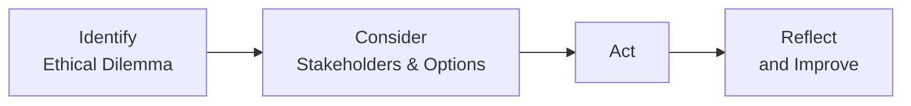

## Overview of Ethical Decision-Making Frameworks

Ethical decision-making frameworks help us slow down—especially in fast-paced financial environments—and ensure we consider the full range of important issues before taking action. Within the investment profession, cognitive biases (like confirmation bias and anchoring) and emotional biases (like fear or overconfidence) can cloud good judgment. By standardizing how we think through ethical dilemmas, frameworks reduce the risk of making hasty or shortsighted decisions. 

I once worked with a colleague—let’s call him Tom—who felt torn between reporting an accounting irregularity and not wanting to upset his project team. He recognized a discrepancy but kept hesitating. By methodically applying a decision framework, he finally found the confidence to act in the best interest of his clients and stakeholders. Years later, Tom said that following a structured process helped him override the fear of conflict and focus on doing the right thing.

Frameworks, like the “Identify-Consider-Act-Reflect” (ICAR) model or “Making Ethical Decisions” (MED), encourage professionals to align with not only the letter of the law but also the spirit of ethical standards. They systematically integrate stakeholder analysis (a fancy term for “Who does this decision affect?”), relevant regulations, and the investment firm’s Code of Ethics. 

The good news is that these frameworks aren’t all talk. They actually offer a repeatable process for addressing tricky scenarios—like conflicts of interest, potential misrepresentations of performance, or undisclosed relationships with external partners. Let’s explore these frameworks in detail, then see how we can embed them in routine practice.

## Common Frameworks in Ethical Decision Making

### ICAR: Identify, Consider, Act, Reflect

The ICAR model provides a concise four-step structure that helps you keep your bearings when things get murky.

• Identify: Recognize the ethical dilemma. This might sound obvious, but it’s surprisingly easy to miss the bigger picture if you’re under pressure or if the dilemma isn’t crystal clear at first.

• Consider: Evaluate your options and think about relevant stakeholders—clients, the firm, the broader market, or even society at large. Also, weigh any applicable regulations, professional standards, or firm policies.

• Act: Pick the course of action that best meets your ethical obligations. In the heat of the moment, it can be tempting to pick the “least painful” path, but proper consideration helps you do the right thing—even if it’s uncomfortable.

• Reflect: After reaching a decision, reflect on the outcome. Did it turn out as expected? Could you have done better? Reflection ensures continuous improvement.

Below is a simple flowchart showing the ICAR model:

Something as simple as a reminder or a chart on your desk can prompt you to walk through these steps before finalizing any major ethical judgment.  

### MED: Making Ethical Decisions

Another approach used in various professional training programs is the “Making Ethical Decisions” (MED) process. While details can vary, its core structure involves:

• Defining the dilemma.  
• Gathering information and ensuring you understand all perspectives.  
• Evaluating potential courses of action against standards (legal, regulatory, firm, and personal moral values).  
• Making a decision and then documenting your rationale.  
• Monitoring the aftermath and learning from the outcome.  

Each of these steps encourages you to slow down and ensure you aren’t letting biases run the show. Maybe your best friend at the firm is pressuring you to sign off on an investment recommendation that’s missing crucial disclosure. MED reminds you to gather all the facts, think carefully about ethical standards, then make a decision that can withstand scrutiny regardless of personal relationships.

## Practical Implementation Strategies

Talking about frameworks is one thing; using them daily is quite another. So, how do we make these processes second nature?

• Practice, practice, practice. Just like how traders rehearse market simulations, we can run through “ethical scenarios” in team meetings or roleplaying exercises.  
• Use checklists. A quick “compliance checklist” or an “ethical-decision cheat sheet” can guide you to systematically evaluate conflicts of interest or potential violations of the CFA Code and Standards.  
• Encourage group input. Sometimes, the best antidote to individual bias is a diverse set of opinions. If possible, set up a sounding-board group or an ethics committee.  
• Seek real-time advice. Tools like pop-up alerts in trading software or integrated compliance systems can remind you that an action might need extra scrutiny (for instance, disclosing material nonpublic information).  

If we make these frameworks a mandatory part of the job—like you must sign off that you used them—it becomes normal to systematically consider ethical implications. Some firms even build these frameworks into performance reviews to emphasize organizational values.

## Using Decision Trees and Flowcharts

Especially for new or complex situations, a visual decision tree can help you methodically ask the right questions:

• Is this action compliant with local regulations?  
• Does it conflict with the Code of Ethics?  
• Have I disclosed potential conflicts?  
• Are client interests put first?

You can imagine a web of yes/no questions, where each path leads to a recommended action or a reevaluation of the prior steps. Visual aids can keep you from missing crucial checks—like confirming whether the capital markets would be misled by a certain press release or if your client’s best interests truly come first. 

When you’re facing high stakes, it’s helpful to see everything laid out in a clean, graphical flow. Plus, a standardized tree is easier to recall under pressure than a text-heavy manual.

## Consistent Follow-Up and Feedback

One of the most neglected steps in ethical decision making is follow-up. In my own experience, it’s easy to congratulate yourself for choosing the “right” decision, but reviewing how it all played out can reveal new insights:

• Did the outcome align with your initial ethical objective?  
• Did you discover any blind spots or biases afterward?  
• Would you approach a similar scenario differently now?

This reflection can be formal (like post-decision reviews in risk committees) or informal (like chatting in a weekly meeting). The key is to learn from mistakes and replicate successes. 

## The Role of Technology

In today’s finance world, technology can deliver real-time prompts or checklists. For instance:

• Compliance software: Might auto-flag unusual trading activity or prompt you to confirm disclaimers on marketing materials before sending them.  
• Expert systems: Could ask you a series of questions if a potential conflict is detected, guiding you through an ethical framework step by step.  
• Workflow automation: This can ensure that at certain touchpoints—like finalizing an investment recommendation—you confirm that all relevant stakeholders are considered.

Of course, all these gadgets and gizmos mean nothing if you simply bypass them under time pressure. That’s why building an ethical culture—where ignoring these prompts is a big deal—matters a lot.

## Managing Bias Through Structured Processes

The main purpose of these frameworks is to address biases that might otherwise slip under the radar:

• Confirmation Bias: By methodically collecting input from multiple sources, you’re less likely to cherry-pick data that confirms your preconceived notions.  
• Overconfidence Bias: Following structured steps forces you to acknowledge the possibility you might be wrong. It’s humbling but valuable.  
• Emotional Bias: Breaking down a situation into steps can defuse sudden anger or excitement, letting cooler heads prevail.  

When everyone on the team uses the same structured approach, it becomes much easier to spot inconsistent reasoning or a step that someone skipped “just because they’re so sure.” The framework essentially says, “Slow down. Let’s do this step by step to avoid pitfalls.”

## Case Example: A Potential Misrepresentation

Picture a junior analyst, Kim, who is preparing a marketing brochure for a new investment product. Under a strict timeline, she’s tempted to highlight only the product’s best performance years and exclude the worst to make it look more appealing. She can:

1. Identify the Dilemma: She’s misrepresenting performance by omission.  
2. Consider Stakeholders: The firm’s reputation, potential clients, and existing investors if the product is oversold. She references the CFA Institute’s Standard on Misrepresentation (Standard V(B)).  
3. Act: She adjusts the brochure to show a balanced view of returns, includes a summary of GIPS-compliant metrics, and gets compliance to sign off.  
4. Reflect: She notes that while the marketing piece might look less eye-catching, it is now transparent and honest. She documents the process to remind herself—and her team—why full disclosure is crucial.

This scenario is straightforward, but it shows how a professional can use a simple ethical framework to overcome the bias toward “window dressing” results.

## Best Practices for Exam Day and Professional Life

• Read each scenario carefully. On exams, they often test whether you can detect subtle conflicts of interest or misrepresentation of data.  
• Apply the framework step by step. Even if you think you know the “right” answer, double-check it with the process.  
• Cite the relevant standard or principle. Whether it’s the PF (Performance) standard or the Objectivity section of the Code, bring in the appropriate references.  
• Reflect on real-world outcomes. Ethical standards are tested not just by knowledge but by applying them in messy, nuanced situations.  

## Conclusion and Final Thoughts

Frameworks like ICAR and MED are powerful because they provide clarity and structure amid the complexity of finance. They help strip away the mental shortcuts and emotional fog that can lead us into questionable territory. By integrating these frameworks into everyday practice—through roleplays, checklists, or technology-based prompts—you develop a sturdy ethical muscle. And that matters, because trust is currency in our industry.  

Just remember: An ethical decision might not always be the easiest or the most profitable in the short term. But the long-term impact on your integrity, reputation, and the well-being of your clients and stakeholders is immeasurable. If you find yourself on the fence, take a deep breath, flex that decision-making framework, and trust that your methodical approach will point you in the right direction.

## References

• Rest, J. (1986). “Moral Development: Advances in Research and Theory.”  
• CFA Institute. (Latest Edition). “Global Body of Investment Knowledge.”  
• Decision-making models available at:  
  - https://www.ethicsweb.ca/resources/decision-making  
• CFA Institute Code of Ethics and Standards of Professional Conduct.  

--------------------------------------------------------------------------------

## Test Your Knowledge: Frameworks to Overcome Ethical Biases



### Which step in the ICAR framework emphasizes learning from past decisions?

- [ ] Identify the ethical dilemma
- [ ] Consider stakeholders
- [ ] Act
- [x] Reflect

> **Explanation:** The Reflect stage is about reviewing the outcome of your decision and applying lessons learned to future scenarios, ensuring a continuous improvement loop.

### In the Making Ethical Decisions (MED) process, which of the following is LEAST likely to be part of “Gathering Information”?

- [ ] Reviewing relevant regulations
- [ ] Collecting stakeholder viewpoints
- [x] Submitting final marketing material
- [ ] Checking alignment with firm policies

> **Explanation:** “Gathering Information” focuses on fact-finding and clarifying the ethical dilemma. Submitting marketing material is typically an action step that occurs after you’ve completed your evaluation.

### What is a key advantage of using checklists to guide ethical decision making?

- [x] They ensure important considerations aren’t overlooked.
- [ ] They completely eliminate all possible biases.
- [ ] They replace the need for stakeholder analysis.
- [ ] They avoid the possibility of conflict of interest.

> **Explanation:** Checklists prevent forgetting crucial steps or questions but cannot guarantee the total elimination of bias. They are meant to complement stakeholder analysis, not replace it.

### Which bias is MOST directly mitigated by actively seeking diverse perspectives during the “Consider” stage?

- [x] Confirmation bias
- [ ] Anchoring bias
- [ ] Availability bias
- [ ] Loss aversion

> **Explanation:** Confirmation bias involves looking for or emphasizing information that supports your existing beliefs. Consulting diverse perspectives challenges your assumptions and reduces the likelihood of confirmation bias.

### Which of the following actions best illustrates the “Act” step in ICAR, within a potential conflict-of-interest scenario?

- [x] Disclosing your personal holdings to a compliance officer before making a recommendation
- [ ] Considering how various stakeholders might perceive your decision
- [x] Documenting each potential course of action
- [ ] Organizing a post-decision reflection activity

> **Explanation:** “Act” involves implementing the chosen ethical solution. Disclosing your personal holdings is a direct action that addresses potential conflicts.

### After applying an ethical decision-making framework, a team holds a retrospective to identify process improvements. This BEST reflects:

- [ ] Stakeholder analysis
- [x] Feedback loop
- [ ] Immediate corporate reporting
- [ ] The Define step in MED

> **Explanation:** A retrospective or “post-mortem” discussion is a form of a feedback loop. It helps refine future decisions by evaluating past outcomes.

### Why might technology-based alerts be particularly useful in ethical decision-making?

- [ ] They remove the need for professional discretion.
- [x] They provide reminders or prompts in time-sensitive environments.
- [ ] They ensure that market returns always favor honest advisors.
- [ ] They only matter in manual trade execution processes.

> **Explanation:** Technology alerts can prompt a review or compliance check when the environment is fast-paced, helping professionals integrate ethical frameworks even when under significant time pressure.

### When applying the MED process, which step focuses on harmonizing the decision with both regulations and your personal moral values?

- [ ] Defining the dilemma
- [x] Evaluating potential courses of action
- [ ] Gathering basic information
- [ ] Monitoring outcomes

> **Explanation:** The evaluation phase in MED explicitly asks you to weigh each alternative against legal, regulatory, professional, and personal ethical standards.

### Which scenario best demonstrates stakeholder analysis?

- [x] Considering how different parties, such as a client or the broader community, are affected by a new investment strategy
- [ ] Validating that your personal trading system is robust
- [ ] Checking your marketing department’s brand guidelines
- [ ] Deciding to use or not use GIPS-compliant data

> **Explanation:** Stakeholder analysis involves systematically examining how various parties (clients, society, firm) are impacted by the decision to ensure all viewpoints are considered.

### True or False: Ethical decision-making frameworks guarantee outcomes that benefit shareholders the most.

- [x] True
- [ ] False

> **Explanation:** Strictly speaking, ethical frameworks do not always lead to maximizing shareholder returns in the short run. However, they promote decision-making aligned with stakeholder interests, regulatory standards, and professional principles—factors that often foster long-term trust and sustainability.


