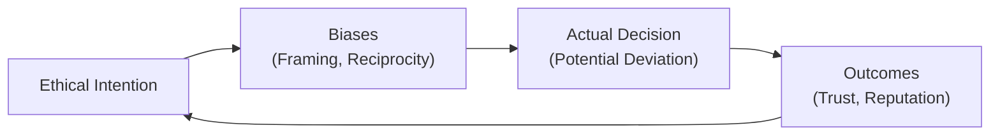

## Introduction
Behavioral ethics is not just another theoretical buzzword; it’s about unpacking how we actually behave when moral stakes are on the line. And—if we’re being honest with ourselves—many of us occasionally step into ethical “grey areas” in negotiations, sometimes without even realizing it. We like to think we’ll be impeccably honest and fair, but real life throws in stress, bias, and those classic what-if scenarios that can lure us off our moral high ground. This is especially true in finance, where negotiations with clients, supervisors, vendors, or even regulators can become fraught with situational pressures.

In this discussion, we’ll explore how real-world behaviors sometimes diverge from our ideal ethical intentions—specifically in the context of negotiation and ongoing client relations. We’ll talk about the sneaky biases that might trip you up, look at ways to keep negotiations transparent yet successful, and highlight the big payoff of a consistent ethical stance: reputation and trust.

## Bridging the Gap Between “Should” and “Do”
Early theories of ethics tended to be prescriptive (“this is how people should behave”). But the field of behavioral ethics highlights an intriguing mismatch: people’s stated intentions (be honest, be fair) and their real actions can differ dramatically. You might be familiar with that voice that says, “I should be transparent,” followed by the nudge that whispers, “But maybe this detail can wait for later.” It’s that second voice—perhaps driven by fear of losing a deal, or the temptation to appear more competent—that can push negotiations into questionable territory.

Recognizing this gap is your first step toward bridging it. Acknowledging that biases—like the framing effect, reciprocity norms, or self-serving interpretations—can intervene is a powerful way to guard against moral blind spots.

## Core Behavioral Biases in Negotiation
Below is a quick reference table of key biases and the implications they might have in typical financial negotiations:

| Behavioral Bias       | Definition                                                                                                                                               | Possible Implications in Negotiation                                                                                 |
|-----------------------|----------------------------------------------------------------------------------------------------------------------------------------------------------|----------------------------------------------------------------------------------------------------------------------|
| Framing Effect        | Decisions can be swayed by how an option is presented (e.g., as a “loss” or a “gain,” or as a “safe option” vs. “risky bet”).                             | Parties might overemphasize losses or gains and become more risk-averse or risk-seeking than rational analysis suggests.                        |
| Reciprocity Effect    | The tendency to reciprocate positive or negative actions.                                                                                                | One party making concessions might lead the other to concede more. Or negative behavior can lead to escalation of conflict.                     |
| Anchoring             | Relying too heavily on the first piece of information offered (“the anchor”) when making decisions.                                                      | In a negotiation, an initially proposed price or return projection can unduly skew subsequent discussion.                                        |
| Ethical “Grey Areas”  | Situations in which the morally “correct” course of action is ambiguous or open to interpretation.                                                        | Negotiators might justify small misrepresentations or omissions to secure perceived advantages, eroding trust over time.                        |
| Self-Serving Bias     | The inclination to interpret information in ways that support existing interests, beliefs, or desired outcomes.                                           | Professionals might overrate their own contributions or fairness, justifying outcomes that could be detrimental to clients or third parties.     |

### Behavioral Ethics Feedback Loop

Below is a simple Mermaid diagram to illustrate how ethical intentions, biases, actions, and outcomes can influence one another in a continuous cycle:

This loop stresses that every decision you make influences your future ethical mindset (positively or negatively), making consistent ethical accountability crucial.

## Emotions in Negotiation and Client Relations
I remember a time early in my career when I was nervous about losing a big client—honestly, I could barely sleep. It was this anxious mindset that nearly influenced me to oversell in a negotiation. My intentions were good (I wanted to keep a valuable client happy), but fear and pressure were pushing me toward a questionable path: I considered glossing over some important downside risks. Eventually, I realized that if the client discovered any omission later, it could irreversibly rupture trust. I took a breath, spelled out the key risks, and accepted the conversation might be tough. The outcome actually improved our relationship. The client respected my honesty and ended up being more receptive to future recommendations.

That story might sound familiar to you. Emotions such as fear, excitement, or even empathy can dramatically influence negotiation behavior. A fear of “losing face” or losing a deal can lead to exaggerated claims, withheld information, or subtle misrepresentations. Meanwhile, empathy can nudge you to compromise more than you intended—sometimes beneficial, sometimes detrimental if it leads to unbalanced scenarios.

## Transparent Communication to Build Trust
Transparent communication is like the bedrock of strong client relations. When people suspect that you’re holding something back—or worse, outright misleading them—they’ll likely respond by withholding trust (and possibly business). Here are some top-line ways to keep communication transparent and ethical:

• State Objectives and Agenda: Outline the purpose of the negotiation or meeting in clear terms.  
• Use Plain Language: Avoid jargon that might confuse or obscure the real message.  
• Actively Listen: Encourage your counterpart to voice concerns and clarify their priorities.  
• Verify Understanding: Summarize each segment of the discussion to ensure mutual comprehension before moving on.  

Transparency also reduces the probability that you’ll fall victim to your own biases. If you commit to directness and clarity from the outset, it’s much harder to rationalize “white lies” or strategic omissions.

## Win-Win Solutions Through Ethical Negotiation
If your counterpart (be it a client or colleague) senses that your approach is grounded in fair dealing, collaboration, and mutual respect, it paves the way for creative, cooperative solutions. Techniques to frame negotiations as joint problem-solving include:

• Establish Shared Goals: Aim to define a common target—like a particular portfolio return or a strategic milestone.  
• Emphasize “We” Language: Removing the “me vs. you” mindset can align interests.  
• Brainstorm Multiple Options: Generate ideas together, focusing on balanced outcomes rather than one-sided wins.  

By framing negotiations as a search for a “win-win,” both parties stay more attuned to ethical considerations. The mindset shifts from “I must get as much as I can” to “We want a sustainable, equitable deal.” It might sound a bit idealistic, but in finance—where reputation is everything—an equitable approach can pay dividends in client loyalty over your entire career.

## Real-World Case Examples
Below are two brief scenarios that showcase how behavioral ethics can play out in negotiation and client discussions:

• The Subtle Omission: A portfolio manager pitched a new structured product to a client. Eager to demonstrate high returns, they glossed over certain fees and early-withdrawal penalties. The client later discovered these fees after signing. Initially, the manager might have rationalized this omission as “I’ll explain it fully once the client’s on board,” but the client interpreted it as a betrayal of trust. The result? The client closed their account, even though the final product was generally aligned with their risk tolerance.

• The Reciprocal Concession: A private equity team and a venture capitalist began negotiations with fairly high demands on both sides. One party made a small but genuine concession on the equity stake. This reciprocal goodwill encouraged the other side to reduce some onerous contractual clauses. They reached an agreement that felt “balanced.” This scenario highlights how reciprocity can be harnessed ethically—as opposed to using it as a manipulative tactic.

## Preventing Behavioral Traps and Encouraging Ethical Culture
Even well-intentioned professionals can slip up under stress. However, consistent awareness and organizational support can go a long way in preventing ethical lapses. Here are a few strategies:

• Regular Ethics “Refreshers”: Periodic training or reading on ethical standards (e.g., the CFA Institute’s Code and Standards) ensures that ethical guidelines remain top-of-mind.  
• Mentorship and Open Forums: Offering a safe space for juniors (and seniors too!) to discuss tricky negotiation dilemmas fosters a more thoughtful and democratic culture.  
• Clear Escalation Channels: If you sense a negotiation is crossing ethical lines, knowing exactly where to go for guidance can be a lifesaver.  
• Accountability Systems: Implementing checks and balances—like a second review on major client communications—can help catch unintentional misrepresentations.

## Long-Term Advantages of Ethical Negotiation
Gaining clients, forging partnerships, or boosting that bottom line through questionable means might work in the short run, but it’s almost never sustainable. Word about unethical practices travels fast (especially in the close-knit finance world). Conversely, building a reputation for treating clients fairly, honoring promises, and owning up to mistakes fosters trust that can yield bigger gains over time. Think about it: a client who sees you as honest and reliable will happily offer repeat business and recommend you to peers. That trust, once established, is one of the most valuable assets you can have in an industry built on relationships.  

## Exam Relevance and Final Thoughts
For your CFA exam—and certainly for your real-world financial career—knowing these biases and tactics is only the start. You’ll also need to practice the mindset of stepping back from your autopilot responses and asking, “Am I acting consistently with the CFA Institute Code of Ethics and Standards of Professional Conduct?” The more you can pause, reflect, and stay transparent, the less likely you are to rationalize gains at the expense of your principles. Many scenario-based questions in the CFA curriculum revolve around identifying ethical pitfalls in negotiations or client relationships. Demonstrating that you can spot and manage these biases in real time can make all the difference in both exam performance and day-to-day credibility.

## References and Further Exploration
- Bazerman, M., & Tenbrunsel, A. (2011). Blind Spots: Why We Fail to Do What’s Right and What to Do About It.  
- Fisher, R., Ury, W., & Patton, B. (2011). Getting to Yes: Negotiating Agreement Without Giving In.  
- The University of Texas Ethics Unwrapped. http://ethicsunwrapped.utexas.edu/  

---

## High-Level Negotiation and Behavioral Ethics Quiz



### Which of the following best describes the framing effect in negotiation settings?
- [ ] Adjusting your negotiation position based strictly on cost-benefit analysis.
- [ ] Tailoring communication to a specific audience using professional jargon.
- [x] Influencing decision-making by shaping how outcomes are presented (e.g., gains vs. losses).
- [ ] Reducing bias by consulting multiple sources for information.

> **Explanation:** The framing effect refers to the powerful influence that different presentations or “frames” can have on how individuals evaluate outcomes, often triggering irrational decision-making.

---

### A negotiation counterpart who perceives your consistent transparency is more likely to:
- [x] Extend similar levels of openness and trust in return.
- [ ] Provide concessions only when pressured legally.
- [ ] Assume you are naïve and capitalize on your sincerity.
- [ ] Terminate negotiations to seek another party.

> **Explanation:** The reciprocity effect suggests that individuals tend to respond in kind. Transparent, fair tactics often invite a similar approach from the counterpart.

---

### Which bias is most closely associated with negotiators over-relying on an initial piece of information?
- [ ] Framing effect
- [x] Anchoring
- [ ] Reciprocity effect
- [ ] Risk aversion

> **Explanation:** Anchoring occurs when the first figure or statement introduced in a discussion exerts a disproportionate influence on subsequent decisions, potentially overshadowing other rational considerations.

---

### Why might rationalizing ethical “grey areas” in negotiations be especially tempting?
- [ ] Grey areas reduce the risk of personal liability.
- [ ] Grey areas usually provide higher profit margins.
- [ ] Many parties appreciate a more flexible approach to ethics.
- [x] Pressure and personal incentives skew one’s moral compass and justify small misrepresentations.

> **Explanation:** Even slight situational pressures like financial incentives or fear of losing a client can override strong personal morals, causing rationalized ethical slips.

---

### Which of the following describes a useful strategy for promoting an ethical win-win approach?
- [x] Establishing shared goals early and focusing on joint problem-solving.
- [ ] Encouraging each party to exaggerate demands for better leverage.
- [x] Using “we” language to reduce adversarial tone.
- [ ] Splitting the difference on every point, regardless of logic.

> **Explanation:** Win-win negotiation often involves open, collaborative communication. Emphasizing collective goals and “we” language fosters alignment, rather than zero-sum thinking.

---

### An effective way to prevent unethical behavior from subtle omissions is to:
- [x] Implement regular accountability checks (e.g., a second review of client documents).
- [ ] Rely solely on personal moral conviction.
- [ ] Trust that clients will read all fine print.
- [ ] Assume that minor details will not affect the overall agreement.

> **Explanation:** Accountability mechanisms, such as having a colleague cross-check negotiations or documents, reduce the likelihood that minor—but significant—omissions slip by.

---

### Which statement is true about emotional bias in negotiation?
- [x] Anxiety or fear can lead to withholding critical information to close a deal.
- [ ] Emotions never affect ethical judgment in high-stakes finance.
- [x] Empathy sometimes causes negotiators to overcompromise without strategic thought.
- [ ] Only positive emotions like excitement result in biased outcomes.

> **Explanation:** Negative emotions such as stress and anxiety can prompt misrepresentations to secure a deal, while strong empathy can also distort objectivity if it leads to excessive concessions.

---

### A key advantage of consistent ethical behavior in negotiations is:
- [x] Building a trustworthy reputation leading to long-term business gains.
- [ ] Eliminating the need for formal documents or compliance.
- [ ] Reducing negotiation time to a few minutes.
- [ ] Guaranteeing you will always get the highest price.

> **Explanation:** Ethical consistency doesn’t guarantee the highest short-term profit but does foster loyalty, repeat business, and a respected reputation across the professional community.

---

### Which measure best helps finance professionals recognize and manage blind spots?
- [x] Participating in regular ethical “refreshers” and open discussions.
- [ ] Relying on high commissions to motivate fairness.
- [ ] Keeping second opinions out of negotiations to maintain confidentiality.
- [ ] Studying only the sections of the CFA Code of Ethics that focus on compliance technicalities.

> **Explanation:** Continuous engagement with ethical training and having open dialogue about real scenarios promotes awareness and clearer moral judgment.

---

### Engaging in minor misrepresentation for a “greater good” strategy is:
- [x] True
- [ ] False

> **Explanation:** While some rationalize small ethical compromises, these can escalate over time and compromise trust. A “greater good” rationale seldom justifies deception.


