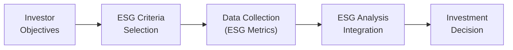

## Introduction
So, you’ve probably heard the buzz around ESG—Environmental, Social, and Governance—and wondered how it ties into modern-day investing. Maybe you’ve asked: “How do I know if a company is ‘ethical?’” or “Why is everyone suddenly concerned about carbon footprints and board diversity?” Let me tell you, these questions aren’t going away. In fact, ESG analysis has become front and center in finance over the past couple of decades. 

At a high level, ESG factors give us a way to measure not just the immediate financial returns of a company but also its broader impact on society and the environment. This approach helps investors like you and me see beyond current earnings. We assess whether a firm is using its resources responsibly, respecting human rights, fostering diversity in the workplace, and making decisions that promote long-term value rather than chasing quick wins at the expense of stakeholders. 

For CFA® candidates, understanding ESG standards is increasingly crucial: it’s not just “nice to do” anymore; it’s a requirement in many professional and regulatory contexts. This article walks you through the historical context of ethical investing, the role of major standard-setters, ways to integrate ESG into your analysis, and the emerging trends shaping the future of sustainable finance.

## Historical Evolution: From SRI to ESG
To appreciate the current momentum around ESG adoption, it helps to know where we’ve been. Some of the earliest attempts at ethics-based investing date back to religious organizations that avoided “sin stocks” (think tobacco, gambling, or alcohol). This approach was known as Socially Responsible Investing (SRI). If you recall, SRI strategies often used negative screening—basically a no-go list of sectors deemed unethical. For instance, a fund might exclude companies engaged in weapons manufacturing or those with poor environmental practices.

Over time, SRI frameworks evolved into a more sophisticated system that tries to integrate multiple dimensions of corporate impact—this is where ESG enters the picture. Rather than solely excluding companies, many fund managers started analyzing issues like carbon intensity, worker safety, and board diversity, aiming to identify leaders and laggards within each sector.

In my early days on an investment committee, our team debated whether to divest from a high-pollution energy firm. Initially, we considered simply excluding them. But digging deeper, we noticed the company was actively investing in greener tech—setting tangible targets to reduce emissions. So we ended up staying invested, using our shareholder influence (through engagements and proxy voting) to push for improved environmental performance. This shift from simple negative screening to proactive engagement and ESG integration captures how the field has progressed.

## The Three Pillars: Environmental, Social, and Governance
A crucial piece of ESG is recognizing that business success and social/environmental responsibility don’t have to be at odds. Indeed, many arguments suggest that ESG factors can help firms avoid costly legal issues, consumer boycotts, or regulatory fines. Let’s break each pillar down.

### Environmental Factors
Companies face growing scrutiny over how responsibly they source raw materials, manage waste, and consume energy. Environmental metrics include:
• Carbon footprint and greenhouse gas (GHG) emissions.  
• Resource efficiency (e.g., water usage, renewable energy adoption).  
• Climate change resilience and policies against deforestation.  

A big question these days is how companies prepare for a future that might impose carbon taxes or stricter energy regulations. Firms with strong environmental policies can reduce their operational risks and even gain a competitive advantage if they adopt cleaner technologies early.

### Social Factors
This pillar focuses on how a company impacts people—employees, consumers, communities, and broader stakeholders. Key social factors include:
• Human rights policies and labor conditions.  
• Diversity and inclusion efforts at all organizational levels.  
• Consumer protection and product safety.  
• Data protection and privacy.  

A personal anecdote from a recent conference: I spoke with an asset manager who realized her portfolio included a company known for unfair labor practices in its overseas factories. Beyond the morality issue, it turned out that poor working conditions were also leading to high staff turnover, low morale, and delays in production. Once that news went public, the share price took a major hit. Moral of the story? Social factors can have a substantial financial impact.

### Governance Factors
Even the best environmental and social strategies might fall flat if a company’s governance structure is weak. Governance looks at leadership effectiveness and transparency. Common governance metrics include:
• Board independence and composition.  
• Executive compensation practices.  
• Shareholder rights (e.g., voting rights, anti-takeover provisions).  
• Quality and transparency of financial and operational disclosures.  

Good governance often signals that management acts in shareholders’ best interests. If a company’s board is packed with members lacking relevant expertise or dominated by insiders, you might start questioning its capacity to manage ESG risks effectively—or any risks at all.

## Levels of ESG Integration
Let’s reflect on how investors actually “do” ESG—there are multiple approaches, each with its own pros and cons. Many firms begin with simpler strategies and gradually move toward deeper integration.

### Negative Screening
Negative screening is like the oldest trick in the book. If a client says, “I refuse to invest in tobacco,” you simply sieve out all tobacco companies. This straightforward approach has historically been associated with SRI. It can be easy to implement but might inadvertently exclude companies working to improve. You’d also lose diversification if large segments of the market are removed.

### Best-in-Class Approach
If negative screening is the blunt tool, best-in-class is more of a precision instrument. Here, you rank firms within a sector based on ESG criteria—like their carbon intensity or board diversity—and then choose to invest in only the top performers. This method is popular among investors who want to stay in certain industries (like energy or chemicals) but prefer leaders rather than laggards.

### Thematic Investing
With thematic investing, you pick a particular ESG theme—like clean energy, gender equality, community development, or water sustainability—and direct your capital to companies or projects supporting that cause. These strategies can be compelling but sometimes narrower in scope. For instance, a thematic investing strategy focusing on wind and solar might skip out on other crucial environmental solutions or large swathes of the broader market.

### Full ESG Integration
Full ESG integration is the holy grail for many professionals. This is where you embed ESG metrics into the core of your fundamental analysis—right alongside price-to-earnings ratios, dividend discount models, or credit risk assessments. Instead of just screening out “bad” elements, you weigh ESG performance as intrinsic to the firm’s valuation, considering future financial impacts of poor ESG practices or the long-term upside of strong ESG strategies. Implementation can be complex, but the potential for a more holistic, forward-looking portfolio is substantial.

Below is a simple diagram that illustrates how ESG considerations can flow into traditional investment analysis.

## The Role of Standards and Regulatory Bodies
You might be wondering how all these ESG metrics are standardized. Isn’t it tricky to compare one firm’s “carbon neutral” claims to another’s “net-zero” goals? Indeed, reliable ESG disclosures hinge on standardization frameworks that are recognized worldwide. A few major organizations have stepped up to the task:

### Sustainability Accounting Standards Board (SASB)
SASB develops industry-specific standards to guide corporate ESG disclosures. These frameworks are designed to be financially material—that is, focusing on ESG metrics that significantly affect a company’s financial performance. For example, water usage might be more material for a beverage company than for a software firm. By signaling what is financially relevant, SASB helps unify reporting standards and reduce “greenwashing.”

### Global Reporting Initiative (GRI)
GRI is often considered the granddaddy of sustainability reporting. It offers a broader set of guidelines that encourage transparency around economic, environmental, and social impacts. While SASB emphasizes financial materiality, GRI focuses on the broader stakeholder perspective. Many companies end up using both SASB and GRI to satisfy different investor bases.

### Task Force on Climate-related Financial Disclosures (TCFD)
One of the biggest concerns with climate change is that it can introduce massive uncertainties for businesses—think supply chain disruptions, property damage from extreme weather, or regulatory shifts. The TCFD has developed consistent guidelines for companies to disclose climate-related financial risks, including scenario analyses and strategies to manage transition risks. 

Companies that adopt TCFD recommendations make it easier for investors to gauge potential climate-related disruptions or costs. As global regulators begin to mandate stronger climate disclosures, TCFD-inspired frameworks are rapidly becoming standard practice.

## The Influence of Regulators and Investors
Regulators worldwide are shaping ESG requirements as well. In the European Union, for instance, the Sustainable Finance Disclosure Regulation (SFDR) has introduced a new wave of ESG reporting obligations for financial market participants. Meanwhile, the U.S. Securities and Exchange Commission (SEC) has been stepping up oversight of climate risk disclosures. If you’ve been following the news, you know the conversation is nowhere near final—regulations are still evolving in many jurisdictions.

Institutional investors—especially pension funds and large asset managers—also have a major hand in promoting ESG. Groups like the UN-supported Principles for Responsible Investment (PRI) encourage asset owners and managers to integrate ESG considerations. You might have seen statements from major global asset managers vowing to reduce their portfolios’ carbon emissions or engage actively with boards about diversity.

In my own experience, once a few high-profile pension funds decide that climate change is “material” and start demanding robust ESG disclosures, entire industries get in line. That’s business reality—when big players talk, companies listen.

## Practical Example of ESG Research Integration
Picture a large consumer electronics company that heavily relies on rare-earth metals. An ESG analysis might weigh:
• Environmental: Where do these metals come from? How are they extracted? Is the supply chain environmentally sustainable?  
• Social: Are there any labor disputes or child labor concerns in the mining regions? Has the firm addressed product safety or customer privacy in its devices?  
• Governance: Does the board have a diverse set of expertise to oversee these complex operations? Do executives tie compensation to ESG performance targets?

Let’s say your due diligence finds that the company’s board has minimal oversight of its supply chain, leading to poor labor practices in some mines. Financially, that’s a risk—think legal liabilities, consumer backlash, and potential supply interruptions. Incorporating these ESG insights, you might lower the firm’s fair value estimate or apply a risk premium. Conversely, if the company is investing in more sustainable extraction methods, you might see a competitive advantage, especially if upcoming regulations or consumer sentiment shift strongly in favor of ethical sourcing.

## Common Pitfalls and Best Practices
• Over-Reliance on External Ratings: Many investors rely too heavily on third-party ESG scoring systems. It’s important you investigate the underlying methodology.  
• Inconsistent Data and Greenwashing: Firms might tout their “net-zero” pledges without credible roadmaps. Be sure to look for science-based targets or third-party verifications.  
• Ignoring Sector Nuances: A “one-size-fits-all” approach can be misleading. Material ESG risks vary significantly by industry and geography.  
• Lack of Engagement: Even if companies appear poor in ESG ranking, an active ownership approach—voting proxies, meeting with management—can sometimes improve outcomes.  

Best practices typically involve carefully combining qualitative judgment with quantitative measures, staying current with evolving standards, and collaborating with cross-functional teams (e.g., CFOs, sustainability officers, risk managers) to build a holistic view of a company’s long-term prospects.

## Challenges and the Road Ahead
Implementing comprehensive ESG analysis is not always straightforward. The cost of data collection, potential biases in ESG rating agencies, and the ongoing debate over standardization are all potential hurdles. Plus, as new topics like biodiversity loss or supply-chain resilience come to the forefront, frameworks will need to keep evolving.

Nevertheless, the momentum is clear. Investors increasingly demand robust sustainability data, governments around the world are tightening regulatory requirements, and we’re witnessing more advanced analytical tools that can integrate ESG with traditional models.

## Glossary
• ESG (Environmental, Social, and Governance): A set of criteria used to evaluate a company’s ethical impact and sustainability practices.  
• Socially Responsible Investing (SRI): An investment strategy that excludes companies based on specific ethical or moral criteria, commonly involving negative screening.  
• SASB (Sustainability Accounting Standards Board): An organization that creates sector-specific standards to help public corporations disclose material sustainability information.  
• GRI (Global Reporting Initiative): An independent organization providing a comprehensive framework for sustainability reporting, emphasizing stakeholder concerns.  
• TCFD (Task Force on Climate-related Financial Disclosures): A body that develops climate-related financial risk disclosures, emphasizing how companies approach climate change scenario analyses.  
• Negative Screening: An investment approach that excludes industries or companies based on certain ESG risk factors or ethical concerns.  
• ESG Integration: The process of incorporating ESG metrics into traditional financial analysis and valuation.  
• Best-in-Class Approach: Selecting only companies that rank highest on ESG metrics within an industry, often aiming to reward positive ESG behavior.

## References
- CFA Institute. (Latest Edition). CFA Program Curriculum, Volume 10: Ethical and Professional Standards.  
- Global Reporting Initiative: [https://www.globalreporting.org](https://www.globalreporting.org)  
- Sustainability Accounting Standards Board: [https://www.sasb.org](https://www.sasb.org)  
- Task Force on Climate-related Financial Disclosures: [https://www.fsb-tcfd.org](https://www.fsb-tcfd.org)

## Exam Relevance and Tips
For the CFA® Level I exam (and beyond), practicing ESG-integration scenarios can be immensely helpful. You might see item set questions or short-answer questions that test your understanding of how to account for ESG considerations in portfolio decisions. Be ready to:
• Use ESG metrics to adjust valuation models or discount rates.  
• Discuss conflicts of interest that might arise when trying to implement ESG criteria.  
• Evaluate the strengths and weaknesses of third-party ESG ratings.  
• Recognize how regulation can shape corporate disclosures and risk management.  

Time management is key; these topics often appear alongside ethics, professional standards, and risk considerations. Keep an eye out for the synergy between ESG dimensions and areas like risk assessment, financial modeling, or performance measurement. The exam might throw you a curveball, asking you to factor in a company’s potential carbon tax liability when calculating future cash flows.

-----

## Test Your Knowledge: ESG Standards and Ethical Investing Quiz



### In ESG analysis, which of the following is an example of an environmental factor?
- [ ] Board independence
- [ ] Executive compensation
- [x] Greenhouse gas emissions
- [ ] Product safety

> **Explanation:** Board independence and executive compensation are governance factors, while product safety is a social factor. Greenhouse gas emissions are a key environmental metric.

### A fund that excludes tobacco and firearms companies from its portfolio is primarily engaging in:
- [x] Negative screening
- [ ] Thematic investing
- [ ] Best-in-class selection
- [ ] Full ESG integration

> **Explanation:** Excluding certain industries or companies based on ethical or moral concerns is a classic negative-screening approach.

### Which organization is best known for providing industry-specific ESG disclosure standards that focus on financial materiality?
- [ ] GRI
- [x] SASB
- [ ] TCFD
- [ ] IMF

> **Explanation:** The Sustainability Accounting Standards Board (SASB) emphasizes industry-specific, financially material ESG metrics.

### If an asset manager identifies only the top quartile of firms in each industry based on ESG ratings and invests exclusively in these leaders, this approach is known as:
- [ ] Negative screening
- [ ] Thematic investing
- [x] Best-in-class
- [ ] Impact investing

> **Explanation:** The best-in-class strategy selects companies that excel in ESG performance relative to their industry peers, rather than simply excluding entire industries.

### According to TCFD recommendations, companies should:
- [ ] Only disclose their philanthropic activities.
- [x] Provide climate scenario analyses and detail their strategies for managing climate-related risks.
- [ ] Disclose only greenhouse gas emissions data.
- [ ] Seek a “net-zero” pledge without explaining how it will be achieved.

> **Explanation:** TCFD specifically emphasizes scenario analyses and risk management strategies to address climate-related financial exposures.

### When approaching ESG integration, which is a potential pitfall?
- [x] Over-reliance on third-party ESG scores without understanding methodologies
- [ ] Using a combination of SASB and GRI standards for corporate reporting
- [ ] Considering financial and ESG metrics together
- [ ] Engagement with corporate boards and management

> **Explanation:** Over-reliance on external ESG ratings can be risky if you don’t understand the underlying assumptions and possible biases in rating methodologies.

### One challenge associated with thematic ESG funds is:
- [ ] They actively ignore stakeholder concerns.
- [ ] They avoid adjusting portfolio allocations over time.
- [ ] They require negative screening for all investments.
- [x] They might concentrate on a narrow set of companies focused on a single theme.

> **Explanation:** Thematic investing focuses on one particular ESG issue (like clean energy), which can reduce diversification and focus too narrowly on certain market segments.

### In evaluating corporate governance factors, an investor might look at:
- [ ] Supply chain labor standards
- [ ] Carbon footprint
- [x] Executive compensation and board composition
- [ ] Community engagement and philanthropy

> **Explanation:** Governance factors include aspects such as board composition, executive pay structures, and shareholder rights.

### A company’s social dimension under ESG primarily involves:
- [ ] Accurate accounting and financial disclosure
- [ ] Reduction of toxic emissions
- [x] Worker safety, diversity, and human rights policies
- [ ] Anti-takeover defenses in corporate bylaws

> **Explanation:** Social factors focus on employees, consumers, and communities, including worker conditions, diversity, and human rights.

### An integrated ESG approach primarily seeks to:
- [x] Incorporate ESG metrics into fundamental analysis and valuation models
- [ ] Exclude all “sin” stocks from the portfolio
- [ ] Invest in climate-friendly technologies only
- [ ] Focus on philanthropic contributions

> **Explanation:** Full ESG integration means embedding ESG data directly into traditional investment analysis, rather than solely screening or narrowly targeting themes.


