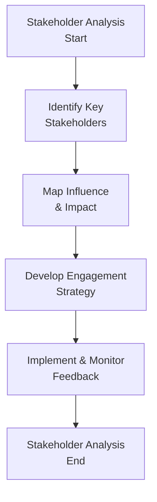

## Introduction

So, let me start by saying: if someone had told me years ago that sustainability wasn’t just about slapping solar panels on your roof, I’d have nodded politely and moved on blissfully unaware. But wow, as I dug deeper into the topic (and trust me, I was skeptical at first), it became clear that sustainability touches everything. It’s not just the environmental stuff—like carbon footprints, water usage, or conserving biodiversity. It’s also about fairness in labor practices, transparency in supply chains, building a supportive corporate culture, and engaging with local communities and governments. In the investment profession, this holistic approach to sustainability is closely tied to ethics and professional standards. 

In this section, we’re going to expand on how sustainability revolves around real, meaningful engagement with everyone from your shareholders to your next-door neighbors. We’ll talk about why that’s important, offer some frameworks, and share stories from companies that nailed it (and from those that maybe flopped big time). 

## Expanding the Concept of Sustainability

Modern conversations about sustainability routinely go beyond environmental protection. While reducing greenhouse gas emissions and managing scarce resources are crucial, sustainability must also include social equity and ethical governance. In many of today’s investment decisions, the big question is: “How do we account for the broader long-term impacts of a firm’s operations on society and future generations?”

• Environmental sphere involves managing natural resources responsibly, reducing pollution, and tackling climate change.  
• Social dimension means fair labor treatment, inclusive hiring practices, community development, and the well-being of employees, customers, and local residents.  
• Governance dimension includes transparent policies, fair executive compensation, strong risk management, and aligning business objectives with stakeholder values.

This triple-pronged view—often called the “Triple Bottom Line,” championed by folks like John Elkington—has become a backbone for how organizations integrate sustainability into their goals.

## Defining Stakeholder Engagement

People sometimes believe that stakeholder engagement is fancy jargon for coddling shareholders (read: those with a financial stake). But that barely scratches the surface. “Stakeholder engagement” refers to the dynamic relationship a firm maintains with all parties that can be affected by, or who can influence, its operations. These parties include:

• Shareholders and bondholders.  
• Employees and labor unions.  
• Customers, potential or existing.  
• Suppliers and distributors.  
• Regulatory bodies and governmental organizations.  
• Local communities and NGOs.  
• The environment, in a more indirect sense.  

In short, stakeholder engagement means proactively seeking dialogue with everyone who matters to your business. You might be thinking, “All that extra effort must cost a fortune!” Possibly. But failing to invite these voices can lead to reputational damage, regulatory fines, or even complete operational shutdowns (especially if communities push back against a polluting factory). 

## Why Stakeholder Engagement Matters

We all know that ignoring major risk factors is a surefire way to invite trouble. Well, ignoring your stakeholders is exactly that. Here’s why meaningful engagement truly matters:

• Improved Decision Making: When you broaden your lens, you see new opportunities and uncover hidden risks.  
• Enhanced Reputation: People judge companies not just by products and profits, but by how they treat employees, customers, and the planet.  
• Long-Term Growth: Firms that build strong stakeholder relationships often benefit from loyalty, constructive feedback loops, and brand equity—a trifecta that’s hard to replicate.  

Additionally, from a finance standpoint, research increasingly shows that companies with robust stakeholder engagement strategies can exhibit superior risk-adjusted returns. It’s like having a risk radar system that picks up on social or environmental red flags before they blow up into full-fledged controversies.

## Identifying and Mapping Stakeholders

One helpful framework for identifying and prioritizing stakeholders is stakeholder mapping. Suppose you run a large retail chain with an online and physical presence. You’d list out all the possible groups that influence or are influenced by your operation. Then you evaluate them in terms of:

• Influence (Can they enact changes in your course of action?).  
• Impact (How critical are they to your day-to-day operations?).  

Many organizations use a 2×2 matrix to rank stakeholders—“High Influence vs. Low Influence” and “High Impact vs. Low Impact.” High-influence, high-impact stakeholders—like major institutional investors or a local government—often demand more engaged, frequent, and high-touch interaction.

Here’s a flowchart to visualize the typical stakeholder mapping process:

From here, you plan how to communicate and collaborate with each group, whether that’s via employee town halls, investor briefings, or community open-house sessions.

## Sustainable Supply Chains: Real-World Examples

Now, supply chain practices might sound dry (I used to nod off at the phrase “logistics optimization”), but they can be a game-changer for sustainability. If you want a real “wow” moment, consider Patagonia, a company that meticulously audits its supply chain to ensure fair labor practices, minimized environmental damage, and transparency from raw materials to final products. They’re consistently recognized for ethical sourcing, and guess what? Their brand loyalty is off the charts.

Another household name is Starbucks. Like them or not, they’ve made strides in ethical sourcing of coffee beans, setting up local partnerships that ensure farmers get fair prices. By engaging suppliers early, Starbucks gains better visibility into potential vulnerabilities, from environmental issues such as soil erosion to social issues like child labor. This improves not just their brand image, but also the reliability and quality of their supply.

Of course, supply chain ethics can get complicated when you source from multiple countries with different labor and environmental regulations. But ignoring those complexities invites scandal—just think of apparel or footwear brands that faced boycotts over child labor or sweatshop conditions. Thorough stakeholder engagement helps you get ahead of these controversies.

## The Intersection of Sustainability and Corporate Culture

I’ve seen firms proclaim, “We’re going green!” while treating employees like disposable resources. Employees see the shallowness, and it often leads to high turnover and a cynical workforce. True sustainability must be reflected in a company’s culture. That means leadership must embody sustainable values:

• Setting policies that reflect social and environmental responsibility.  
• Leading by example—no big talk about “carbon offsets” while taking a private jet to short-distance meetings.  
• Empowering employees to share ideas, voice concerns, and suggest sustainable innovations.

When employees genuinely feel they’re part of a bigger mission—and not just cogs in a system—companies often see improved morale, increased productivity, and stronger retention. “Culture eats strategy for breakfast,” as the expression goes—and nowhere is this truer than in the domain of sustainability and stakeholder engagement.

## Measuring Progress with Key Performance Indicators (KPIs)

All right, so you embrace sustainability, you have these great stakeholder engagement programs—but how do you measure results? Enter Key Performance Indicators (KPIs), quantifiable metrics tracking progress. Common sustainability KPIs include:

• Carbon emissions: total (in metric tons) and intensity (emissions per unit of output).  
• Water usage: total amount and efficiency improvements.  
• Diversity and inclusion: workforce composition across gender and ethnic groups.  
• Supply chain audits: percentage of suppliers that adhere to specified labor or environmental standards.  
• Employee engagement scores: capturing morale, retention, and alignment with corporate values.

Financial analysts increasingly integrate these KPIs into valuation models. For instance, if a company’s track record shows successful stakeholder engagement (leading to consistent community support and stable operations), it may lower the firm’s risk profile. Conversely, failing these criteria often results in a higher cost of capital and potential discount on company valuations due to reputational or operational risks.

## Technology and Transparency: The Role of Blockchain

You might be thinking, “Is tech actually relevant to sustainability, or is that just a weird hype cycle?” Let’s be honest: technology can sometimes add complexity. But there’s an interesting twist—blockchain or distributed ledger technology (DLT) can provide end-to-end traceability in supply chains. 

Imagine you’re sourcing raw materials from ten different countries. Blockchain can track each batch of materials from origin to final product, recording transactions in a tamper-proof ledger that’s visible to all permissioned stakeholders. If there’s a question about whether a certain shipment was ethically sourced, the blockchain offers transparency. 

Companies seeking public trust can open parts of their blockchain records so customers can verify claims about, say, “organic cotton” or “fair trade coffee.” Just like that, technology flips from being a potential risk to an enabler of trust and accountability.

## Practical Implementation: Best Practices and Challenges

Sustainability frameworks, from the United Nations Global Compact to the Global Reporting Initiative (GRI), offer detailed guidelines on how organizations can structure and disclose their sustainability efforts. Here’s a quick (ish) guide:

• Start at the Top: Leadership buy-in is crucial. If senior leadership sees sustainability as an afterthought, your programs aren’t going far.  
• Identify Material Issues: Focus on areas that are genuinely “material” to your business, whether that’s water usage (in beverage industries), data privacy (in tech), or labor standards (in retail).  
• Engage Stakeholders Continuously: Don’t just do a one-time survey and call it a day. Open forums, ongoing feedback loops, transparent reporting—these build trust over time.  
• Integrate into Strategy: Sustainability can’t be next year’s project. It’s a continuous, evolving process embedded in everyday operations.  
• Track and Report: Use relevant KPIs, compare results over time, and pivot strategies based on the data.  
• Communicate Outcomes: Internal staff, external stakeholders, regulators—everyone should understand how you’re progressing.  

Certainly, there are challenges: scaling up changes across multiple facilities, meeting (sometimes conflicting) stakeholder demands, and remaining profitable amid all of it. But the alternative—risky, short-term practices that ignore social and environmental repercussions—often ends up costing far more in the long run.

## Exam Tips: Integrating Sustainability into Ethical Decision Making

For the CFA exams, and especially for Level I where foundational ethics are key, you’ll want to connect sustainability to the broader context of ethical standards. Think about parallels to the CFA Institute Code of Ethics—like integrity, client interests, and the potential for conflicts of interest. In your practice questions:

• Consider scenario-based items where a company faces reputational risk due to poor labor practices. How would a moral, stakeholder-driven approach mitigate that risk?  
• Be able to define the key terms (stakeholder engagement, KPI, etc.) and demonstrate knowledge of frameworks for measuring and reporting sustainability metrics.  
• Understand how a robust corporate culture influences employee behavior and fosters ethical decision making.

A top tip? If you see a question about the link between sustainability practices and long-term financial performance, remember that they’re often positively correlated when implemented effectively. Companies investing in stakeholder engagement typically reduce risk, gain brand loyalty, and create intangible value.

## Glossary

• Stakeholder Engagement: The process by which an organization involves people who may be affected by the decisions it makes or can influence how those decisions are carried out.  
• Sustainability Reporting: Corporate disclosure of social, environmental, and governance performance data to stakeholders.  
• Corporate Culture: The beliefs and behaviors that determine how a company’s employees and management interact.  
• Stakeholder Mapping: A method for systematically identifying key stakeholder groups and assessing their influence and interests.  
• Supply Chain Ethics: Standards and measures ensuring suppliers follow responsible, transparent, and fair labor and environmental practices.  
• Blockchain: A distributed ledger technology that can increase traceability and transparency in supply chains.  
• KPI (Key Performance Indicator): A measurable value that demonstrates how effectively a company is achieving key business and sustainability objectives.  
• Community Relations: Organizational policies and programs aimed at building positive interactions with the local community.

## References & Further Reading

• Freeman, R. E. (1984). Strategic Management: A Stakeholder Approach.  
• Elkington, J. (1997). Cannibals with Forks: The Triple Bottom Line of 21st Century Business.  
• United Nations Global Compact: https://www.unglobalcompact.org  
• Global Reporting Initiative (GRI): https://www.globalreporting.org  

--------------------------------------------------------------------------------

## Test Your Knowledge: Sustainable Engagement & Responsibility



### In stakeholder engagement, who typically falls under the category of "stakeholder"?  
- [x] Individuals or groups that stand to influence or be influenced by an organization's decisions.  
- [ ] Only a company’s shareholders and bondholders.  
- [ ] The Board of Directors only.  
- [ ] Customers who are actively buying the product.  

> **Explanation:** Stakeholders include anyone affected by or capable of affecting a company’s operations—employees, community members, regulators, etc.—not just financial investors.

### Which of the following best describes stakeholder mapping?  
- [ ] A method to quantify only the environmental impact of a firm.  
- [x] A systematic approach to identify and classify stakeholders by their influence and impact.  
- [ ] A process of isolating secondary stakeholders from decision making.  
- [ ] An internal auditing mechanism for board members.  

> **Explanation:** Stakeholder mapping identifies each group’s relative importance and ability to shape outcomes, helping a company tailor engagement strategies.

### What is a primary advantage of incorporating sustainability KPIs into investment analysis?  
- [ ] They reduce the need for annual financial statements.  
- [x] They highlight long-term risk factors and opportunities not visible in standard financial metrics.  
- [ ] They replace profitability metrics completely.  
- [ ] They are only relevant if a company has major environmental impacts.  

> **Explanation:** Sustainability metrics often reveal operational risks or intangible assets (like brand loyalty) that typical financial statements can miss.

### A company that adopts supply chain ethics policies would most likely:  
- [ ] Maintain the same suppliers without changes to contractual obligations.  
- [ ] Focus primarily on reducing short-term costs.  
- [x] Verify that suppliers comply with labor and environmental standards.  
- [ ] Ignore the environmental footprint of upstream processes.  

> **Explanation:** Supply chain ethics emphasizes responsible sourcing and consistent auditing of suppliers’ labor, environmental, and governance practices.

### Why might an engaged corporate culture be crucial for sustainability initiatives?  
- [x] It ensures employees feel ownership and contribute positively to sustainability goals.  
- [ ] It makes it easier to ignore stakeholder demands.  
- [x] It helps leadership communicate the importance of responsible practices effectively.  
- [ ] It lowers compliance costs by eliminating internal controls.  

> **Explanation:** An engaged workforce that believes in the company’s sustainability mission often drives innovation and supports ethical decision making at all levels.

### Which of the following is a valid KPI related to stakeholder engagement?  
- [x] Percentage of surveyed employees satisfied with workplace culture.  
- [ ] Number of unrelated holdings in a portfolio.  
- [ ] Interest rates on corporate bonds.  
- [ ] Stock price fluctuations in a single trading day.  

> **Explanation:** Tracking employee satisfaction is one way to measure stakeholder welfare and engagement. Stock price volatility or portfolio composition aren’t direct engagement metrics.

### How does blockchain technology aid in sustainable supply chain management?  
- [x] By creating a transparent ledger that traces materials from source to final product.  
- [ ] By automatically implementing national labor laws.  
- [x] By offering tamper-proof records visible to all permissioned stakeholders.  
- [ ] By eliminating the need for community engagement altogether.  

> **Explanation:** Blockchain technology can provide end-to-end transparency, making it easier to confirm ethical and environmental compliance in the supply chain.

### Which of the following obstacles might a global company face in implementing stakeholder engagement worldwide?  
- [x] Different cultural norms and regulatory environments across countries.  
- [ ] Lack of any interest from employees in multiple regions.  
- [ ] Complete congruence of rules and views among all stakeholders.  
- [ ] Consistent global enforcement of policies without the need for adaptation.  

> **Explanation:** A large multinational must tailor engagement strategies to diverse cultures, local laws, and stakeholder expectations.

### Why is ongoing feedback important after identifying stakeholder groups?  
- [x] It fosters continuous improvement and helps the firm respond to evolving concerns.  
- [ ] It only matters for regulatory compliance.  
- [ ] It completely replaces the need for further engagement.  
- [ ] It diminishes trust in the organization.  

> **Explanation:** Regular feedback loops keep the dialogue alive, address issues proactively, and reinforce mutual trust between the company and its stakeholders.

### In considering sustainable business practices, which statement is most accurate?  
- [x] They often correlate with better risk management and brand loyalty.  
- [ ] They are purely philanthropic endeavors without financial benefits.  
- [ ] They apply only to the environmental sector.  
- [ ] They are a short-term strategy to boost quarterly earnings.  

> **Explanation:** Sustainability strategies often help companies manage long-term risks, build stronger reputations, and achieve greater brand loyalty, which can translate into financial benefits.


