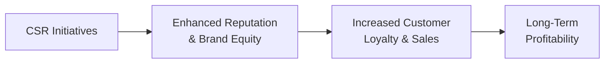

## Introduction
I remember chatting with a friend of mine who used to be skeptical about “doing good” in business. She told me, with a slight shrug, that social responsibility was just “philanthropy wrapped in marketing.” Well, turns out she had a change of heart a few years later, after reading about how ethical supply chain practices can significantly impact brand loyalty and, more importantly, the bottom line. Sometimes, you know, it just takes one powerful example—like higher consumer trust or a more engaged workforce—to realize that social responsibility isn’t just a nice add-on: it can form the backbone of a resilient, profitable enterprise.

In the investment world, the idea that “doing well by doing good” was once dismissed as naïve or overly idealistic. Now, it’s a major consideration for portfolio managers, asset owners, and corporate leaders who aim to balance short-term market pressures with long-term viability. In this section, we’ll explore why social responsibility has moved beyond simple acts of philanthropy to become a strategic driver of sustainable growth and profitability.

## Social Responsibility as a Strategic Imperative
In corporate and investment contexts, social responsibility refers to how companies manage their relationships with society—often aligned with the concept of Corporate Social Responsibility (CSR). It’s the recognition that business decisions have far-reaching consequences which can’t be isolated from communities, the environment, or future generations of stakeholders. When seen this way, CSR becomes less of a discretionary choice and more of a strategic imperative.

• Better Risk Management: Firms with robust social responsibility initiatives often face less reputational risk. Negative headlines—be it environmental damage or poor labor conditions—undermine trust and, by extension, shareholder value.  
• Alignment with Stakeholder Values: Customers, employees, and investors increasingly seek organizations that resonate with their personal ethics. By embracing social concerns, a company finds it easier to attract and retain socially conscious consumers, talent, and capital.  
• Sustainable Growth Trajectory: CSR initiatives, when integrated thoughtfully, encourage long-term planning and innovation (e.g., energy savings, waste reduction, or community engagement), all of which bolster sustainable profitability.

## Corporate Reputation, Trust, and Investor Confidence
Ever had that moment where you just don’t trust a brand anymore because of some scandal or controversy? The modern corporate landscape is hyper-connected, so reputational damage spreads quickly. For instance, a data breach or an environmental mishap can result in clients pulling out their investments in what feels like an instant. The link between reputation, trust, and financial success is direct: once a company’s reputation is tarnished, creditor confidence may drop, investor appetite can fade, and vendor relationships could sour.

By contrast, companies that consistently demonstrate ethical behavior and social responsibility accumulate goodwill. This goodwill translates into something we might call “reputation capital”: a buffer that helps an organization weather crises or market volatility far more effectively than a firm with questionable ethics or no track record of contributing to community well-being. From an investor’s perspective, a positive corporate reputation reduces risk perceptions and promotes a sense of stability, often leading to a lower cost of capital and a more robust share price over time.

## The Triple Bottom Line (TBL)
You might hear seasoned executives mention TBL—the triple bottom line that evaluates organizational performance through three pillars: people, planet, and profit. Traditional accounting focuses almost exclusively on the financial bottom line, but TBL expands the definition of performance to encompass social and environmental outcomes as well.

• People: This dimension addresses how a firm affects the communities it operates in—through fair labor practices, health and safety standards, community development, and equitable wages.  
• Planet: This pillar deals with environmental impact, such as carbon emissions, resource usage, waste management, and compliance with environmental regulations.  
• Profit: Ultimately, companies must still deliver profit to survive. Integrating the social and environmental dimensions, though, clarifies that short-term profit should not come at the expense of long-term sustainability or reputational credibility.

When companies emphasize TBL, they often innovate in unexpected ways. For example, they might pioneer new recycling methods (reducing costs in the long run) or improve working conditions (boosting employee morale and productivity). These improvements can circle back to enhance profitability. In effect, TBL thinking nudges companies to holistically optimize performance rather than chase short-term gains.

## Attracting Socially Conscious Investors and Enhancing Brand Equity
In recent years, ESG (Environmental, Social, and Governance) investing has surged in popularity, and guess what? It’s not just millennials championing these funds. Institutional investors like pension plans or sovereign wealth funds increasingly screen portfolios to ensure that the companies they invest in meet certain social or environmental criteria. This shift reflects growing awareness that sustainable and responsible companies often present more stable, lower-risk opportunities over the long haul.

When a firm is perceived as socially responsible—whether for using green energy sources, upholding labor rights, or advocating for community well-being—it accumulates brand equity. Brand equity, in turn, translates to higher customer loyalty and possibly premium pricing power. It can also reduce costs by retaining employees who feel proud to work for a positive, ethical employer. All these factors reinforce the idea that CSR isn’t an optional moral stance but a viable path to financial resilience.

## Real-World Examples and Positive ROI
Let’s get concrete. Some critics remain unconvinced, saying that social responsibility is a “cost” without a commensurate benefit. But multiple studies and case analyses show otherwise. Here’s a quick highlight reel:

• Unilever’s Sustainable Living Plan: By reducing environmental impact and sourcing responsibly, Unilever reported stronger brand loyalty and consistent revenue growth. Its focus on sustainable packaging also cut materials costs and boosted consumer goodwill.  
• Patagonia’s Transparency and Activism: Patagonia’s ethos revolves around ethical production and promoting environmental causes. Impressively, the company’s activism led to an ultra-loyal customer base willing to pay premium prices for eco-friendly gear.  
• Starbucks’ Ethical Sourcing and Community Engagement: Starbucks invests in coffee bean supply chain programs and community development projects. Its brand reputation for social responsibility supports higher product margins and fosters a dedicated group of repeat customers.

In each case, social responsibility measures didn’t just generate warm, fuzzy feelings; they contributed to measurable top-line gains, cost savings, brand differentiation, and, ultimately, enhanced shareholder value. Indeed, philanthropic activities like local community projects often also lead to reputational boosts—even more so if they are aligned with a company’s core business model.

## Balancing Short-Term Pressures with Long-Term Goals
Sure, when quarterly earnings are on the line, it can feel tempting to take shortcuts that inflate short-term results—maybe skimp on certain labor standards, reduce training budgets, or defer big investments in green technologies. Yet such moves carry hidden costs: they can spark reputational damage, regulatory fines, or workforce dissatisfaction. Over time, these repercussions tend to erode profit margins and hinder a company’s competitiveness.

Balancing short-term pressures with long-term social responsibility strategies often requires:
• Educating shareholders on the strategic value of sustainability and CSR.  
• Setting governance structures that incorporate social and environmental metrics into executive performance reviews.  
• Maintaining open, transparent communication with stakeholders, emphasizing how current investments lay groundwork for future gains.

The tension between immediate outcomes and visionary CSR planning can be managed when leadership stays consistent and transparent about the overarching mission. In other words, it’s crucial to articulate why the big-picture, long-term payoff outshines any short-term quarter-to-quarter trade-off.

## Frameworks for Measuring Social Return on Investment (SROI)
Companies often rely on numerical metrics to gauge how well they’re doing. So the question is: how do we measure social impact and parse its link to financial performance? The concept of Social Return on Investment (SROI) emerges as a powerful tool. In short, SROI attempts to quantify the value of social and environmental outcomes relative to the resources invested.

A simplified formula for SROI can look like this (adapted from commonly used frameworks):


\text{SROI} = \frac{\text{Net Present Value of Social Outcomes}}{\text{Net Present Value of Resources Invested}}


But this is no easy math problem—it often requires robust data collection, stakeholder engagement to understand intangible benefits, and well-reasoned assumptions about the monetization of social or environmental outcomes. When done correctly, measuring SROI helps a company:

• Prioritize initiatives that deliver the highest social and business returns.  
• Demonstrate accountability to stakeholders.  
• Refine its strategies to improve both social and financial metrics.

## Emerging Trends and Corporate Activism
One emerging (and sometimes controversial) trend is corporate activism, where companies openly advocate for social, political, or environmental causes. You’ve probably seen social media campaigns or press releases from big brands that take a stance on climate policy or diversity and inclusion—a big shift from the days when corporations remained neutral. This shift correlates with consumer demand; many expect organizations to be active participants in societal dialogue.

While corporate activism can bolster brand loyalty among certain demographics, it can also alienate other groups. Companies thus need to carefully align activism with their core mission and stakeholder values. If the stance is perceived as inauthentic or purely opportunistic, it can backfire, resulting in a swift reputational blow.

## Visualization: CSR Initiatives Leading to Profitability

In this diagram, corporate social responsibility initiatives feed into an enhanced reputation and stronger brand equity. These factors encourage higher customer loyalty, which can translate into increased sales, culminating in stronger long-term profitability. It’s a simplified view, of course, but it helps visualize the typical sequence in which a well-executed CSR strategy can yield financial benefits.

## Best Practices, Common Pitfalls, and Critical Observations
• Best Practices:  
  – Align CSR with Core Competencies: If you’re a tech company, focus on bridging digital divides or ensuring data privacy.  
  – Set Measurable Goals: Define quantifiable CSR objectives—like carbon reduction targets—and track progress publicly.  
  – Stakeholder Engagement: Communicate openly with customers, employees, and community members to refine initiatives.

• Common Pitfalls:  
  – Superficial “Greenwashing”: Claiming to care about social or environmental issues without real action.  
  – Overextension: Attempting too many CSR programs without adequate resources or alignment.  
  – Ignoring Employee Perspectives: Failing to get internal buy-in can sabotage even the most well-intentioned programs.

• Critical Observations:  
  – Trade-Off Realities: Not all socially responsible actions produce immediate financial returns. Some produce intangible benefits that pay off in the longer run.  
  – Cultural Nuances: CSR expectations vary in different cultural or regulatory contexts, so a global CSR strategy needs adaptability.  
  – Continuous Improvement: Social responsibility is dynamic, requiring ongoing re-evaluation and innovation.

## Conclusion
So, there we have it: social responsibility has evolved far beyond feel-good philanthropic gestures. It’s now widely recognized as a strategic catalyst for building trust, enhancing brand equity, securing loyal customer bases, and, yes, reaping long-term profitability. The synergy between people, planet, and profit resonates with today’s investors, who weigh reputational and environmental risks alongside traditional financial statements. By thoughtfully integrating CSR into a broader corporate vision, companies can strengthen their competitive position and contribute to a more sustainable future.

## Glossary
• Corporate Social Responsibility (CSR): A management concept whereby companies integrate social and environmental concerns into their business operations.  
• Value Creation: The process by which a company increases its stock price, market share, and profitability by effectively allocating resources.  
• Triple Bottom Line (TBL): A sustainability framework that examines a company’s social, environmental, and financial performances.  
• Social Return on Investment (SROI): A methodology for measuring and accounting for the social and environmental value created relative to the resources invested.  
• Brand Equity: The value that a brand adds to a product or service, beyond the functional benefits.  
• Corporate Activism: When companies take a stand on social, political, or environmental issues in alignment with their brand values.  
• Philanthropy: The act of promoting the welfare of others, typically through charitable donations.  
• Reputation Risk: The potential loss in perceived trustworthiness resulting from negative public opinion or stakeholder sentiment.

## References & Further Reading
• Porter, M. E., & Kramer, M. R. (2006). “Strategy & Society: The Link Between Competitive Advantage and Corporate Social Responsibility.” Harvard Business Review.  
• Orlitzky, M., Schmidt, F. L., & Rynes, S. L. (2003). “Corporate Social and Financial Performance: A Meta-Analysis.” Organization Studies.  
• The Triple Bottom Line and Corporate Governance:  
  https://www.corporatefinanceinstitute.com  

## Test Your Knowledge: Social Responsibility and Long-Term Profitability Quiz



### Which of the following best describes a primary driver behind the strategic importance of social responsibility in modern corporations?

- [x] Reducing reputational and financial risk for long-term growth
- [ ] Increasing short-term sales through a philanthropic platform
- [ ] Keeping business practices fully independent of societal norms
- [ ] Avoiding compliance with global standards on sustainability

> **Explanation:** Effective CSR strategies help mitigate reputational risk and enhance brand equity, leading to stronger long-term prospects.

### A company that considers "people, planet, and profit" in its profitability model is applying which framework?

- [x] The Triple Bottom Line
- [ ] The Weighted Cost of Capital
- [ ] The Corporate Growth Index
- [ ] The Global Reporting Initiative (GRI)

> **Explanation:** The Triple Bottom Line framework evaluates performance based on social, environmental, and financial components.

### In measuring Social Return on Investment (SROI), which formula component is most essential?

- [x] Net Present Value of Social Outcomes
- [ ] Market share of direct competitors
- [ ] Employee productivity metrics
- [ ] Percentage of philanthropic donations

> **Explanation:** SROI emphasizes the monetization of social and environmental benefits, calculated relative to the resources invested.

### Why might CSR efforts sometimes face internal resistance within an organization focused on quarterly earnings?

- [x] Short-term financial pressures may conflict with long-term societal goals.
- [ ] Employees dislike better working conditions and training opportunities.
- [ ] Customers prefer purely profit-driven initiatives.
- [ ] Regulators ban any form of socially responsible project investment.

> **Explanation:** Investing in socially responsible projects can bring longer-term gains but might temporarily lower short-term profits, creating tension.

### Which outcome is commonly associated with robust corporate social responsibility initiatives?

- [x] Improved brand equity
- [ ] Immediate spike in all stock prices
- [x] Greater employee engagement
- [ ] Guaranteed regulatory leniency

> **Explanation:** Strong CSR can increase brand equity and boost employee morale, though it doesn't guarantee instant share price jumps or regulatory leniency.

### When a company is accused of “greenwashing,” it generally means:

- [x] Its claims of environmental responsibility are superficial or misleading
- [ ] It has made an honest effort to reduce emissions
- [ ] It invests heavily in eco-focused processes
- [ ] It supports philanthropic donations with quantifiable outcome data

> **Explanation:** Greenwashing occurs when an organization touts environmentally friendly practices primarily as marketing or PR, without real substance.

### Corporate activism can be an effective strategy if:

- [x] It aligns with the firm’s core brand values
- [ ] It directly opposes the beliefs of the CEO
- [x] It reflects the views of key stakeholders
- [ ] It is kept secret from employees

> **Explanation:** Authentic alignment with the company’s values and stakeholder expectations is crucial for successful activism efforts.

### Which of the following is a potential pitfall in implementing social responsibility programs?

- [x] Overextending resources across numerous unaligned initiatives
- [ ] Measuring outcomes and refining strategies continuously
- [ ] Setting long-term goals tied to societal needs
- [ ] Transparently communicating results to stakeholders

> **Explanation:** Poorly planned or overextended programs often fail, unlike focused, well-communicated, and synergistic initiatives.

### Aside from reputational benefits, a well-structured CSR strategy often yields:

- [x] Cost savings from efficiency improvements
- [ ] Immediate elimination of all market risks
- [ ] Exemption from financial reporting requirements
- [ ] Lower demands from regulatory bodies

> **Explanation:** CSR measures often drive process and operational efficiencies, even though they can’t eliminate normal market risks or reporting obligations.

### Social responsibility is primarily about maximizing short-term profit.

- [x] True
- [ ] False

> **Explanation:** Social responsibility strategies generally focus on sustainable, long-term value creation, blending financial goals with societal impact.


