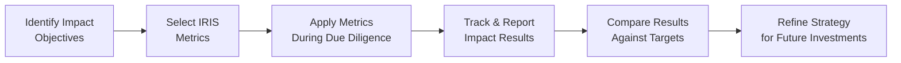

## Introduction
Sometimes, when I talk to close friends or family about investing, we end up discussing how nice it would be to use our money in a way that actually helps the planet or improves people’s lives—rather than just seeking profit alone. That’s essentially the spirit behind impact investing. It’s an investment strategy where you aim to create positive, measurable social or environmental impacts alongside a risk-adjusted financial return. Maybe you’ve heard about microfinance institutions giving tiny loans to small business owners in developing countries, or about funds that invest in renewable energy installations. All of these can fall under the umbrella of impact investing. 

In the investment profession, ethical standards are crucial, and it’s no different in the realm of impact investing. This article explores how to practice impact investing ethically and responsibly, focusing on transparency, accountability, and genuine positive outcomes for stakeholders.

## Understanding Impact Investing
At its core, impact investing tries to blend two traditionally separate worlds: social good and financial gain. Investors don’t necessarily sacrifice profits—that’s a common misconception—but they do take a more holistic approach to value creation, looking at returns through both financial and non-financial lenses.

By definition:
• Impact Investing: Investing with the intention of generating positive, measurable social and environmental impact alongside a financial return.

Some of the major categories of impact investing include:
• Private equity funds dedicated to social enterprises.  
• Microfinance programs that lend small amounts to entrepreneurs with limited credit history.  
• Renewable energy projects, from solar farms to small-scale off-grid solutions in rural areas.  

Impact investing resonates with many because it aligns well with ethical finance principles, tapping into a desire to do good while still earning a fair return.

## Approaches to Impact Investing
Well, you might be wondering, “How exactly do impact investors pick their targets?” Let’s walk through some typical approaches:

• Specialized Private Equity: Large private equity funds sometimes focus on high-growth social enterprises, such as startups that provide low-cost healthcare devices in underserved markets. Fund managers use standard private equity techniques—like thorough due diligence—but also incorporate an impact assessment that evaluates a company’s potential for measurable social benefit.

• Microfinance: This is the classic example. Microfinance institutions (MFIs) offer small loans to individuals or cooperatives in communities lacking traditional banking services. The idea is to support self-sufficiency—someone can purchase livestock, seed supplies, or set up a local grocery kiosk—and repay the loan plus interest over time. From an ethical standpoint, due diligence here also involves ensuring fair lending rates and avoiding exploitative practices.

• Project Finance for Renewable Energy: Several funds target large-scale solar or wind projects. Some aim to bring clean energy infrastructure to rural communities that never had reliable electricity. The financial analysis might look similar to other project finance scenarios (e.g., you project future cash flows from selling electricity to the grid), but layered on top is the goal of reducing carbon footprints and fostering sustainable local development.

• Social Impact Bonds (SIBs): These innovative debt-like instruments are sometimes used to finance public projects with social outcomes—reduced recidivism among formerly incarcerated individuals, for example. Investors earn returns contingent on whether specific impact benchmarks are met. This structure can tie the investor’s upside to an improvement in social metrics.

## Ethical Principles Shaping Impact Investing
Now, any time you talk about “doing good,” it’s easy to slip into marketing hype. That’s where ethical considerations come in—investors, fund managers, and entrepreneurs alike need to remain transparent and accountable:

• Transparency: Clear disclosures on both financial and non-financial objectives reduce the risk of “impact washing.” For instance, if a solar energy project claims to reduce carbon dioxide emissions, the methodology and data behind those claims should be reported clearly.

• Accountability: Investors and fund managers must follow through on commitments. If a microfinance fund says it only invests in programs providing fair interest rates, then rigorous oversight and third-party verification should confirm that. Accountability means that everyone in the chain is responsible for results—both successes and setbacks.

• Measurable Outcomes: Vague statements like “we help the environment” tend to raise eyebrows (or at least they should!). Impact investments should define—and measure—key performance indicators (KPIs). These can include the number of individuals served by a healthcare initiative, kilowatt-hours of renewable energy generated, or gallons of clean water delivered to a community.

• Stakeholder Engagement: Engaging local communities, employees, suppliers, and governments can uncover potential ethical issues early—like displacement of communities for a new solar farm or the exclusion of certain social groups from microloans. The best impact investors communicate openly with the communities they affect.

## Evaluating Impact Opportunities
Performing due diligence for an impact investment can be pretty involved. It goes beyond analyzing financial statements and forecasts. Let’s break down a typical process:

1. Preliminary Desk Research  
   Investors gather data on the potential venture’s market, regulatory environment, and past performance. Social or environmental goals are assessed.  

2. Stakeholder Interviews  
   If you’re looking to fund a healthcare clinic in rural areas, you might talk to local residents and medical staff to see if the venture is truly addressing an unmet need.  

3. Site Visits  
   Nothing beats seeing an operation in person. Observing local conditions can confirm or contradict what’s stated in a pitch deck.  

4. Third-Party Verification  
   Independent certifications—like IRIS-aligned metrics or specialized “green” accreditations—can add an extra layer of assurance that the venture’s claims aren’t merely marketing fluff.  

5. Risk Analysis  
    • Financial Risks: Like any investment, assess potential default risk, operational risk, etc.  
    • Impact Risks: There’s a chance an intervention might fail to deliver on promised social outcomes (e.g., a microfinance program might not reduce poverty if other local infrastructure is lacking).  

When I once visited a microfinance institution in Southeast Asia, I was struck by how crucial it was to physically see the day-to-day interactions between loan officers and small vendors. That site visit revealed how trained staff were carefully assessing individual borrowers’ needs—reducing default risk and ensuring that the funds were actually being used for small business expansions, not for other unintended purposes. This kind of on-the-ground perspective is invaluable in understanding the reality behind the figures.

## Performance Metrics & IRIS
Assessing impact calls for standardized metrics, otherwise comparisons and accountability become challenging. That’s where frameworks such as the Impact Reporting and Investment Standards (IRIS) come into play:

• IRIS: A widely recognized catalog of standardized metrics to track social, environmental, and financial performance.  
• Tailored KPIs: Many funds or enterprises customize these metrics for their specific sector (e.g., the number of solar panels installed, the number of microloans disbursed to women entrepreneurs, or the percentage drop in local waterborne diseases).

A simplified flow diagram of how IRIS metrics might factor into the broader impact investing process could look like this:

Ultimately, consistent use of these metrics supports transparency and comparability. Investors can see how different projects stack up against each other, which is key when building or adjusting an impact-driven portfolio.

## Real-World Case Studies
It can seem abstract, so let’s highlight a couple of real-world illustrations:

• Rural Healthcare in East Africa: A private equity firm invests in a chain of clinics that combine telemedicine solutions with on-site checkups for remote villages. They measure impact via the reduction of travel time for patients, the volume of patients treated, and improvements in health outcomes. Over three years, the clinics achieve profitability while also decreasing wait times in public hospitals.

• Renewable Energy Mini-Grids: In parts of South Asia, a specialized fund finances solar mini-grids for villages without reliable electricity. After a pilot program, the communities experience both lower energy costs and improved lighting at night—leading to better study conditions for children. The project becomes a for-profit venture by selling electricity credits to the local population and eventually expanding the distribution network as well.

Both cases highlight how ethically structured investments can produce tangible benefits and still deliver financial returns.

## Potential Challenges
With all the excitement surrounding impact investing, challenges do arise:

• Impact Washing (Greenwashing): Some companies overstate their positive impact or misuse sustainability labels. This is where thorough due diligence, stakeholder interviews, and ongoing monitoring become crucial.

• Measuring Intangible Outcomes: How exactly do you measure empowerment, or improvements in a child’s quality of life? Quantifying intangible impact requires careful selection of proxies and robust data collection methods.

• Balancing Social and Financial Goals: Finding the “sweet spot” between social returns and financial returns can be tricky. Sometimes, an impact investment might take longer to become profitable because it operates in frontier markets with higher operational complexity.

• Regulatory and Disclosure Gaps: Different regions have varying rules around reporting social or environmental metrics. Some standardization, like IRIS, helps, but the regulatory framework may remain patchy.

## Ongoing Monitoring and Evaluation
Maintaining a portfolio’s integrity requires continuous tracking:

• Periodic Reporting: Impact funds typically present reports to investors outlining both financial and impact performance.  
• Independent Audits: Third-party firms can audit the data to confirm that the social or environmental outcomes are real.  
• Adaptive Management: Based on performance data, funds often make operational changes—perhaps shifting the focus from one type of social enterprise to another if initial results fall short.

In my own investing circle, I’ve seen folks get excited about a new social venture but then neglect to follow up after a year or two. That’s a hazard: you risk drifting away from your intended impact or missing early warning signs. Without dedicated monitoring, even the best intentions can falter.

## Glossary
• Impact Investing: Investing with the intention of generating positive, measurable social and environmental impact alongside a financial return.  
• Microfinance: Financial services, such as small loans, to low-income individuals or groups that otherwise lack access to traditional banking.  
• Greenwashing (Impact Washing): The deceptive practice of marketing products or investments as significantly more environmentally or socially beneficial than they actually are.  
• IRIS (Impact Reporting and Investment Standards): A catalog of generally accepted performance metrics often used in impact investing.  
• Social Enterprise: An organization that applies commercial strategies to maximize improvements in financial, social, and environmental well-being.  
• Third-Party Verification: Independent analysis or auditing of claims regarding social or environmental impact.  
• Risk-Adjusted Return: An investment performance measure that accounts for the amount of risk involved.  
• Due Diligence: An investigation or audit of a potential investment to confirm key facts, such as reviewing financial records, product quality, or business practices.

## References & Further Reading
- Global Impact Investing Network (GIIN):  
  https://thegiin.org  
- Bugg-Levine, A., Kogut, B., & Kulatilaka, N. (2012). “A New Approach to Funding Social Enterprises.” Harvard Business Review.  
- Rockefeller Philanthropy Advisors. (2020). Impact Investing Handbook.  
- CFA Institute Code and Standards: https://www.cfainstitute.org/ethics-standards  

---

## Test Your Knowledge: Ethical Considerations in Impact Investing



### Which of the following best defines impact investing?
- [ ] Investing only in publicly traded companies that score highly on ESG metrics.
- [x] Investing with the intention of generating both positive social/environmental impact and a financial return.
- [ ] Investing in philanthropic projects irrespective of financial returns.
- [ ] Investing solely in microfinance institutions.

> **Explanation:** Impact investing is specifically about seeking both a measurable positive impact and a financial return—not exclusively one or the other.

### What is the primary function of IRIS in the context of impact investing?
- [x] Providing standardized metrics for assessing impact performance.
- [ ] Setting global regulatory mandates for minimum impact thresholds.
- [ ] Offering grants to early-stage social enterprises.
- [ ] Managing investment capital directly for microfinance institutions.

> **Explanation:** IRIS helps investors and organizations measure and track their social and environmental impact using standardized metrics rather than imposing regulations or managing funds.

### If an impact investment fund conducts thorough background checks, site visits, and interviews with local stakeholders before investing, it is engaging in:
- [ ] Syndicated funding.
- [ ] Crowdfunding.
- [ ] Social audits only.
- [x] Due diligence.

> **Explanation:** These activities—site visits, stakeholder interviews, and background checks—are classic examples of due diligence processes to confirm an investment’s viability and ethical alignment.

### Which of the following challenges is most associated with attributing more impact to a project than reality supports?
- [ ] Underreporting.
- [x] Greenwashing (impact washing).
- [ ] Third-party verification.
- [ ] Transparency disclosure.

> **Explanation:** Overstating or falsifying claims of positive environmental or social outcomes is typically referred to as greenwashing or impact washing.

### In microfinance, which of the following would be considered an ethical best practice?
- [x] Maintaining fair interest rates and transparent lending contracts.
- [ ] Charging exorbitant interest to maximize returns.
- [x] Verifying borrowers’ ability to repay before issuing loans.
- [ ] Restricting clients’ freedom to use funds as they please, regardless of prior agreement.

> **Explanation:** Ethical microfinance involves offering fair interest rates, ensuring transparency, and verifying that borrowers can reasonably repay. Restricting fund usage arbitrarily or charging inflated rates violates basic ethical principles.

### Which statement best describes a social enterprise?
- [x] An organization that uses business strategies primarily to achieve social or environmental goals.
- [ ] A government-owned agency in charge of distributing microfinance.
- [ ] A charitable foundation offering only grants.
- [ ] A private wealth management firm exclusively serving high-net-worth individuals.

> **Explanation:** Social enterprises operate commercially but prioritize improvements in social and environmental well-being, often reinvesting profits in pursuit of these aims.

### Which of the following is NOT a key pillar of ethical impact investing?
- [x] Obscuring performance data to limit public scrutiny.
- [ ] Clear accountability mechanisms.
- [x] Transparent disclosures.
- [ ] Measurable outcomes.

> **Explanation:** Ethical investing relies on transparency, accountability, and measurable outcomes. Hiding data or performance metrics contradicts these principles.

### How can third-party verification reinforce the credibility of an impact investment’s claims?
- [x] By providing independent confirmation of reported outcomes.
- [ ] By replacing the need for periodic reporting.
- [ ] By automatically guaranteeing positive financial performance.
- [ ] By exempting the investment from standard due diligence requirements.

> **Explanation:** Third-party verification offers independent checks on the claims made by impact funds or companies, enhancing credibility but not replacing other necessary processes.

### What is an example of ongoing monitoring of an impact investment?
- [x] Scheduling regular onsite evaluations and reviewing updated impact metrics every quarter.
- [ ] Completely trusting management’s claims without further checks.
- [ ] Halting all communication with the investee until maturity.
- [ ] Basing progress solely on hypothetical modeling performed pre-investment.

> **Explanation:** Ongoing monitoring implies continuous engagement, data collection, and analysis to ensure the project’s actual performance aligns with its stated impact and financial goals.

### True or False: Impact investing necessarily yields lower financial returns compared to traditional investing.
- [x] True
- [ ] False

> **Explanation:** While some impact investments yield market-rate returns, others may accept slightly lower returns due to social objectives. However, many argue that well-structured impact investments can generate competitive returns, depending on the specific opportunity and risk levels. Thus "True or False" can be context-dependent, but the statement as a blanket rule often leans toward “False.” Nonetheless, some investors do choose to accept lower returns in favor of achieving social or environmental benefits.



---

**Final Exam Tips:**
• Clarify both the financial and impact objectives from the outset.  
• Incorporate recognized frameworks (e.g., IRIS) to evaluate and communicate impact clearly.  
• Remain vigilant against greenwashing by verifying authenticity through site visits and independent audits.  
• Prepare to explain how you balance social or environmental returns with financial returns—this is a classic scenario-based question in ethics-related exam items.  

High-quality impact investing hinges on robust ethical conduct, meticulous due diligence, and consistent evaluation—key lessons to keep in mind both for the exam and for real-world professional practice.
