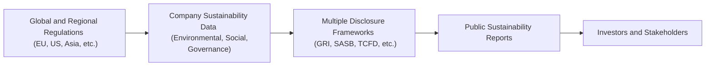

## Introduction

I still remember the first time I encountered a corporate annual report brimming with charts on carbon footprints, employee diversity, and community investments. I was both impressed (hey, this was a refreshing break from purely financial metrics) and a bit puzzled: How could I be sure these sustainability figures were comparable across different companies? And who was actually ensuring that these disclosures were accurate? Well, the truth is, sustainability disclosures have come a long way, and nowadays there's a whole web of regulations nudging—or outright requiring—companies to share consistent, trustable data on environmental, social, and governance (ESG) matters.

In this section, we’ll explore how these regulations came about, what they aim to achieve, and why they're increasingly important for finance professionals. We'll also get into the nitty-gritty details of major regional rules, such as the EU’s Non-Financial Reporting Directive (NFRD) and its newer cousin, the Corporate Sustainability Reporting Directive (CSRD). More importantly, we’ll consider the frameworks underpinning these disclosures—like GRI, SASB, and TCFD—and how challenging it can be to weave them all together into a coherent, standardized approach.

While some folks might think of sustainability as a mere marketing angle, there’s a growing recognition that robust ESG data is critical for portfolio managers, financial analysts, and investors who want to understand a firm’s long-term risks and growth potential. After all, hidden environmental liabilities or glaring social issues can eat away at returns, damage reputations, and even lead to legal trouble. So let's roll up our sleeves and walk through this evolving space of regulatory perspectives on sustainability disclosures—where it’s headed, what it means for us, and why we should pay attention.

## The Growing Trend of Mandated Sustainability Disclosures

Organizations worldwide are waking up to the idea that sustainability is not just a “nice-to-have” but a fundamental piece of corporate strategy. Investors, too, are putting the squeeze on boardrooms, demanding more transparency around climate change, labor practices, or governance. And guess who else is weighing in? Regulators.

Stock exchanges and government agencies are increasingly requiring public companies to disclose specific ESG metrics. For instance, the Hong Kong Stock Exchange mandates listed firms to publish an ESG report at least annually. In the United States, the SEC has proposed enhanced climate-related disclosure rules, though these are still evolving. In other regions—like Canada, Australia, or parts of Asia—there’s ongoing debate on how to structure these obligations in ways that deliver meaningful insights without burdensome compliance overhead.

### Why Mandatory Disclosures?

• Transparency and comparability: Investors have repeatedly said, “We need consistent metrics!” A company’s carbon footprint or diversity statistics mean little if we cannot compare them with industry peers.  
• Investor protection: Regulators want to ensure that investors aren’t misled by ambiguous marketing claims (sometimes called “greenwashing”).  
• Alignment with global climate and social objectives: Governments and supranational organizations (e.g., the United Nations) see these disclosures as a critical step in steering businesses toward more sustainable behavior.

## Key Regional Regulations

### The EU’s Non-Financial Reporting Directive (NFRD)

The Non-Financial Reporting Directive (NFRD) was a big turning point in Europe. It requires large companies (and certain groups) to report on how they manage environmental protection, social responsibility, anti-corruption measures, and diversity on boards. One reason Europe led the way on this is that the region is highly committed to achieving climate neutrality and robust social welfare programs. The NFRD has provided a baseline to ensure that large and listed enterprises share critical non-financial data.

### Stepping Up with the Corporate Sustainability Reporting Directive (CSRD)

But wait—Europe didn’t stop there. The Corporate Sustainability Reporting Directive (CSRD) ups the ante. It expands the scope of companies required to report (including relatively smaller listed firms), and it also demands more detailed disclosure on sustainability strategy, supply chain impacts, and governance structures. That’s a huge leap, and it’s not just about writing bigger annual reports. The CSRD includes more aggressive auditing requirements, meaning external assurance of sustainability data might become as common as financial audits. Talk about raising the bar!

### Other Jurisdictions

• United States: The Securities and Exchange Commission (SEC) has lined up proposals for climate-related disclosures, focusing on greenhouse gas (GHG) emissions, risk management processes, and scenario analyses.  
• Asia-Pacific: In jurisdictions like Singapore and Hong Kong, stock exchanges have been stepping in to require ESG reporting from their listed issuers.  
• Latin America: Some countries are incorporating ESG disclosures within existing corporate governance codes, while others are exploring more formalized legislation.  

It’s quite a patchwork, right? Let’s be honest: This patchwork approach is one of the reasons many companies find compliance tricky, especially those operating globally.

## The Rationale Behind Mandatory Disclosures

So, why all this regulatory fervor? Why can’t sustainability reporting remain voluntary?

1. **Comparability and Consistency**: Investors crave consistent metrics to effectively assess long-term risks and opportunities. Mandated disclosures help standardize information, making it easier to compare company A’s carbon footprint with that of company B.  
2. **Transparency to Combat Greenwashing**: Without regulatory guidance, companies can overstate their “green” achievements (intentionally or not). Mandated rules keep them honest by specifying clear measurement and reporting guidelines.  
3. **Investor Protection**: Regulators aim to protect investors from incomplete or misleading data. Mandated disclosures set a minimum standard of accountability.  
4. **Alignment with Global Goals**: Given the world’s shifting focus on climate change, biodiversity loss, and social justice, governments want corporate reporting to align with broader policy objectives (e.g., the Paris Agreement).

## Challenges in Harmonizing Reporting Frameworks

Even though mandatory sustainability disclosures are on the rise, we have a modern Tower of Babel issue: multiple frameworks each claiming to be the gold standard. Let’s run through some of the big players:

- **GRI (Global Reporting Initiative)**: Covers a broad spectrum of ESG factors.  
- **SASB (Sustainability Accounting Standards Board)**: Industry-specific metrics that target material financial impacts in the United States and beyond.  
- **TCFD (Task Force on Climate-related Financial Disclosures)**: Focuses on climate risk disclosure aligned with governance, strategy, risk management, and metrics/targets.  
- **IIRC (International Integrated Reporting Council)**: Promotes principles for integrated thinking, bridging financial and non-financial performance.

Companies with international footprints often find themselves juggling different frameworks to comply with local regulations and meet investor preferences. Um, talk about an administrative burden! Some are calling for a single, globally recognized reporting baseline—like the newly formed International Sustainability Standards Board (ISSB) under the IFRS Foundation. But it will likely take years before the dust settles and we achieve real harmonization.

## Benefits and Costs of Regulatory Disclosure

Let’s do the old pros and cons list. On the plus side:

- **Improved investor confidence**: Transparent, standardized disclosures reduce uncertainty, enabling better capital allocation.  
- **Enhanced reputational standing**: Companies that meet or exceed sustainability reporting requirements often get favorable public perception.  
- **Better internal management**: A surprising side effect is that the process of collecting, verifying, and publishing ESG data can push management to refine internal processes and risk controls.

But there are downsides:

- **Administrative burden**: Complying with multiple frameworks or new regulatory standards can be time-consuming and expensive. “Where do we get the data? Who vets it?”  
- **Risk of misalignment**: If a company’s operations span different countries with varied regulations, it may have to produce distinct—sometimes inconsistent—disclosure sets.  
- **Potential for information overload**: Paradoxically, more disclosure can lead to confusion if not properly structured. Users of this information can be overwhelmed by the volume of data.

## Potential Legal Consequences and Investor Protection

Now for the cautionary part: Once disclosures become mandatory, failing to comply can lead to fines or reputational damage. In some jurisdictions, misrepresenting sustainability data might even invite legal action, including class-action lawsuits if shareholders feel misled (“We invested believing your company was low-carbon, but it turns out you were nowhere near it!”).

### Greenwashing Woes

Companies that exaggerate their eco-friendliness or social responsibility (sometimes known as “green claims”) risk not only legal challenges but also brand damage. Regulators can impose hefty penalties if they find disclosures to be fraudulent or grossly inaccurate. On top of that, investor-led litigation is growing, particularly in areas like climate change—where data can be verified using satellite imagery, third-party audits, or advanced analytics.

## Role of International Organizations and Cross-Border Initiatives

When we talk about cross-border initiatives, we’re looking at organizations like the IFRS Foundation (which is setting up the ISSB) and collaborations such as the Climate Disclosure Standards Board (CDSB). Their goal is to create global standards that can be adopted widely, bridging the gap between different jurisdictions and frameworks. Some regulators encourage a “building block” approach, where a universal baseline standard coexists with local or regional reporting requirements.

These cross-border efforts can significantly reduce complexities for multinational firms, clarifying how sustainability disclosures are compiled and validated. And if implemented well, they empower investors to meaningfully assess risks and opportunities on an apples-to-apples basis.

## Technology Solutions in Sustainability Reporting

Are you thinking, “Okay, that all sounds complicated—maybe technology can help?” Well, guess what: it can.

- **Artificial Intelligence (AI)**: AI-driven platforms can sift through internal corporate data (like energy consumption, materials used, supply chain logistics) to produce cohesive ESG metrics. They help spot anomalies and even detect potential greenwashing.  
- **Blockchain**: Some companies use distributed ledger technology to ensure traceability of raw materials or to certify carbon offset data. This tamper-resistant infrastructure can add credibility to disclosures.  
- **Data Aggregators**: Various data providers (often using big data analytics) compile standardized ESG scores that investors can compare across different companies, though these still vary in methodology.

Here’s a quick diagram showing a simplified flow of sustainability data as it moves through regulations, frameworks, and ultimately to stakeholders:

The data funnel is complex, but technology solutions can smooth things out, making it easier to comply with varied rules while delivering consistent, credible ESG information to stakeholders.

## Real-World Example: Harmonizing Disclosures Across Multiple Jurisdictions

Imagine a large automotive manufacturer headquartered in the EU but with assembly plants in Asia and North America. Under the CSRD in Europe, it must produce detailed sustainability reports covering the entire group. However, in the United States, it might also face SEC requirements focusing explicitly on climate disclosures. In Asia, local stock exchange rules could mandate additional social metrics, like workforce diversity or community engagement.

The firm invests in a central data repository, implementing an AI-based platform to streamline data collection from each unit. Then it organizes these results in line with GRI and TCFD for universal comparability. Meanwhile, local teams tailor the data to meet specific regional demands. Sure, it’s resource-intensive, but the payoff is better risk management, consistent communication of sustainability performance, and fewer regulatory headaches.

## Exam Relevance and Best Practices for CFA Candidates

For CFA candidates—especially at an advanced level—understanding these regulations is increasingly important. Not only might exam questions reference specific directives (NFRD, CSRD, etc.), but scenario-based problems often require analyzing how certain sustainability metrics might affect a firm’s valuation or risk profile. Ethics questions, too, can revolve around misrepresenting ESG data or failing to disclose material sustainability risks.

### Tips for Exam Day

- **Know the Major Frameworks**: You don’t need to memorize every detail, but be aware of who sets them (GRI, SASB, TCFD, etc.) and their primary objectives.  
- **Study the Rationale**: Understand why regulators are shifting toward mandatory reporting—transparency, comparability, investor protection, alignment with climate goals.  
- **Appreciate the Challenges**: Realize that global companies can be subject to multiple (sometimes conflicting) disclosure requirements.  
- **Link to Portfolio Management**: In essays or item sets, be prepared to discuss how robust ESG data influences security analysis, valuation, and overall portfolio construction.  

## Common Pitfalls and Strategies to Overcome Them

- **Pitfall**: Relying on a single framework for a multinational entity and ignoring local rules.  
  **Strategy**: Conduct a gap analysis to ensure that all mandatory disclosures across jurisdictions are satisfied.  
- **Pitfall**: Overlooking the verification process and assuming the numbers speak for themselves.  
  **Strategy**: Establish internal teams or hire external auditors to verify ESG data.  
- **Pitfall**: Getting tangled in too much data and losing clarity.  
  **Strategy**: Focus on materiality and clarity. Provide the most relevant ESG metrics, supplemented by context.

## Glossary

• **Non-Financial Reporting Directive (NFRD)**: An EU directive requiring large companies to disclose certain information on the way they operate and manage social and environmental challenges.  
• **Corporate Sustainability Reporting Directive (CSRD)**: An EU directive that expands the scope of the NFRD, introducing more detailed reporting requirements and stringent auditing standards.  
• **Disclosure Regulation**: Legal requirements governing the information companies must provide to investors and other stakeholders.  
• **Investor Protection**: Regulatory measures designed to ensure investors are not misled by incomplete or inaccurate information.  
• **Cross-Border Initiatives**: Collaborative efforts by multiple countries or regulators to establish uniform standards for issues such as sustainability reporting.  
• **Administrative Burden**: Additional work and resources required for compliance with legal, regulatory, or organizational requirements.  
• **Harmonization of Standards**: The process of aligning different regulations, frameworks, or methodologies to reduce complexity and confusion.  
• **Green Claims**: Assertions made by companies about their environmental performance or the environmental attributes of their products/services.

## References & Further Reading

- CFA Institute. (Latest Edition). CFA Program Curriculum, Volume 10: Ethical and Professional Standards.  
- European Commission on sustainability reporting:  
  https://ec.europa.eu/info/business-economy-euro/company-reporting-and-auditing/company-reporting_en  
- World Economic Forum. (2020). “Toward Common Metrics and Consistent Reporting of Sustainable Value Creation.”  

-----

## Test Your Knowledge: Regulatory Perspectives on Sustainability Disclosures



### Which of the following best describes the main reason behind the increasing trend of mandatory sustainability disclosures?

- [ ] To provide companies with a marketing advantage for attracting new investors  
- [x] To enhance transparency and comparability of ESG data for investor protection  
- [ ] To unify tax reporting and minimize corporate tax liabilities  
- [ ] To encourage localized sustainability practices without any oversight  

> **Explanation:** The primary driver of mandatory disclosures is the need for enhanced transparency and comparability of ESG data, ensuring investors are well-informed and protected.

### Under the EU's Non-Financial Reporting Directive (NFRD), which of the following areas is a key focus of required disclosures?

- [ ] Marketing strategy and branding activities  
- [ ] Dividends and executive bonus payouts  
- [x] Environmental protection, social responsibility, anti-corruption, and board diversity  
- [ ] Competitive product pricing strategies  

> **Explanation:** The NFRD compels large companies to disclose aspects like environmental protection, social responsibility, anti-corruption, and board diversity, rather than purely financial metrics or product pricing details.

### How does the Corporate Sustainability Reporting Directive (CSRD) differ from the NFRD?

- [ ] It abolishes non-financial reporting requirements entirely  
- [x] It introduces more detailed reporting requirements and extends the scope to more companies  
- [ ] It focuses exclusively on reducing reporting burdens for multinational corporations  
- [ ] It only mandates disclosure for government agencies  

> **Explanation:** The CSRD expands the NFRD by increasing the number of companies that must report and tightening requirements, including more detailed disclosures and auditing provisions.

### What is one central challenge companies face when complying with multiple ESG reporting standards across different regions?

- [ ] Reduced capital inflows due to lack of options for compliance  
- [ ] Consistent improvements in stock price due to identical public perceptions  
- [x] Time-consuming and costly efforts to harmonize data across different frameworks  
- [ ] Total elimination of all non-regulatory disclosures  

> **Explanation:** Companies often need to align data with local regulations and global frameworks (e.g., GRI, SASB, TCFD). This can be administratively burdensome and complex.

### Which of the following is a potential legal consequence of misrepresenting sustainability data?

- [ ] Automatic tax exemption for environmental activities  
- [ ] Government subsidies for carbon reduction programs  
- [x] Fines, lawsuits, and reputational damage  
- [ ] Guaranteed regulatory immunity under green finance laws  

> **Explanation:** Regulators and investors can pursue legal action if sustainability data is misrepresented or fraudulent, leading to financial penalties and reputational harm.

### Which statement best describes a cross-border initiative in sustainability reporting?

- [x] Collaborative efforts by global bodies or regulators to create uniform ESG standards  
- [ ] Individual local mandates that prohibit companies from following any external frameworks  
- [ ] A marketing campaign for overseas product expansion  
- [ ] A mechanism allowing corporations to avoid reporting entirely  

> **Explanation:** Cross-border initiatives focus on uniform ESG standards across multiple nations or regions, aiding harmonization and comparability.

### Which of the following frameworks primarily focuses on climate-related disclosures in governance, strategy, risk management, and metrics/targets?

- [ ] Global Reporting Initiative (GRI)  
- [ ] Sustainability Accounting Standards Board (SASB)  
- [x] Task Force on Climate-related Financial Disclosures (TCFD)  
- [ ] Integrated Reporting Council (IIRC)  

> **Explanation:** TCFD is recognized for its specific focus on climate-related disclosures, emphasizing governance, strategy, risk management, and metrics/targets.

### What is one benefit that companies can gain from mandatory ESG disclosures?

- [ ] An opportunity to hide operational inefficiencies  
- [ ] Less transparency, resulting in fewer investor questions  
- [x] A boost in investor confidence through standardized, reliable data  
- [ ] Elimination of audits and third-party reviews  

> **Explanation:** Transparent and standardized disclosures can enhance investor confidence and potentially improve a company's access to capital.  

### How can technology, such as blockchain, help streamline sustainability disclosures?

- [ ] By making financial audits redundant  
- [ ] By guaranteeing every company will report identical ESG metrics  
- [x] By ensuring tamper-resistant tracking of data, increasing credibility and transparency  
- [ ] By restricting data access to only government agencies  

> **Explanation:** Blockchain provides a secure and transparent way to record and verify ESG data, making it harder to manipulate or misrepresent performance metrics.

### True or False: An increasingly globally accepted approach is to create a universal baseline standard for sustainability reporting, which jurisdictions can then build upon with local requirements.

- [x] True  
- [ ] False  

> **Explanation:** Many international organizations advocate a “building block” approach where a universal baseline standard coexists with local mandates, fostering both global consistency and necessary regional customization.


