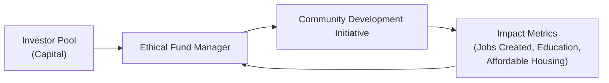

## Introduction

Picture this: you’re walking through a neighborhood that once had vacant buildings, underfunded schools, and few job opportunities, but now it’s brimming with vibrant small businesses, well-maintained affordable housing, and community centers filled with after-school programs. It’s a place that has transformed from neglected to flourishing—largely because of targeted community development initiatives and ethical investments that aimed to make a real difference. This is precisely what community development programs can do when paired with responsible capital.

Community development initiatives are more than just feel-good endeavors. They have a direct impact on economic and social well-being, and they’re often facilitated by investments specifically designed to improve local communities’ quality of life. In the context of ethical investing, these structures can be scaled to meet environmental, social, and governance (ESG) goals while delivering financial returns. Whether you’re fresh to the CFA Program or a seasoned pro, understanding these initiatives and how they fit into ethical finance is key to promoting sustainable wealth generation that benefits everyone.

## Understanding Community Development Initiatives

Community development initiatives are programs designed to enhance the well-being, economic opportunities, and social infrastructure within specific neighborhoods or regions. Often, these programs focus on areas with limited resources—so-called underserved communities—which lack adequate access to financial services, healthcare, education, or stable housing.

Examples of community development projects include:

• Building affordable housing for low-income residents.  
• Creating educational and vocational training centers for youth and adults.  
• Improving local infrastructure (e.g., roads, internet connectivity).  
• Offering microloans or small-business loans to local entrepreneurs.

I once talked with a community leader in a small rural town who shared how a single low-interest loan to a local bakery sparked ripple effects: new jobs, customer foot traffic, and a boost in local tax revenue that funded better public services. That’s the essence of community development—simple, targeted investments that can have an outsize, positive impact.

## The Role of Ethical Investment in Community Development

Ethical investment, sometimes referred to as socially responsible investing or sustainable investing, means directing capital in a way that aligns with moral or social principles. In the context of community development, ethical investors look beyond pure profit motives to evaluate whether a project will help (or harm) the local population.

By aligning with broader ESG objectives, community-focused investments often produce measurable social benefits alongside financial returns. The synergy is compelling: ethical investors tap into stable yield streams—such as mortgage payments in affordable housing complexes or consistent revenue from small businesses—while those local communities gain access to improved livelihoods and resources. The approach can be especially relevant for risk-averse investors looking for diversification, given that local markets can follow different cyclical patterns than larger or more mainstream investments.

## Vehicles for Community Investing

Investors may support community development through multiple avenues, from direct investments to specialized funds. One popular route involves Community Development Financial Institutions (CDFIs).

### Community Development Financial Institutions (CDFIs)

A Community Development Financial Institution (CDFI) is a specialized financial organization offering credit and financial services to underserved communities. CDFIs can be banks, credit unions, loan funds, or venture capital funds. They often fill the gap where traditional banks won’t lend, thereby fostering economic opportunities in places that need it most. CDFIs exist globally, though regulations and classifications may vary.

Examples of CDFI activities:
• Low-interest loans or lines of credit for small businesses in low-income areas.  
• Microfinance-type loans for entrepreneurs eager to start local ventures.  
• Financing for affordable housing projects, including housing co-ops.

CDFIs maintain standards that balance social impact with financial sustainability. They usually rely on a mix of philanthropic grants, government incentives, and private capital. From an investor’s perspective, placing capital in a CDFI can support inclusive growth at the grassroots level while offering modest but steady returns.

### Other Community Investment Vehicles

• Microfinance Institutions (MFIs): Typically found in emerging markets, MFIs may focus on tiny loan amounts to individuals or small groups, encouraging local entrepreneurship.  
• Public-Private Partnerships (PPPs): Structured agreements where governments and private entities share risks and rewards for large-scale community improvement projects—think new hospitals, roads, or public transport in underserved areas.  
• Crowdfunding and Peer-to-Peer Lending Platforms: Some online platforms facilitate direct lending to community projects, providing transparency and traction for smaller-scale investments.

## Aligning Community Development with ESG Goals

Community-based projects dovetail seamlessly with wider ESG strategies. Think of an investment in affordable housing meeting the “S” dimension of ESG by promoting social equality; or a micro-loan fund that fosters women-owned enterprises, thereby promoting gender equity and inclusive growth. 

When integrated into a broader portfolio, such investments can help satisfy an investor’s desire for double- or triple-bottom-line returns—where financial gain is measured alongside social and environmental impact. If you recall from earlier chapters that touched upon sustainability (see Chapter 8.1 on ESG Standards), community development can become a tangible proof point of an investor’s impact orientation.

To visualize how these elements might flow from an investment fund to local communities, consider the following diagram:

In this schematic, capital is deployed through an ethical fund manager to specific community projects—like building schools or supporting local entrepreneurs. The community development initiative reports back on social metrics (e.g., job creation, poverty reduction, or education outcomes), which in turn can inform the ongoing strategy of the fund manager and the investor.

## Public-Private Partnerships for Community Growth

Public-Private Partnerships (PPPs) offer a powerful framework when you have government incentives and private capital working hand in hand. Picture large-scale initiatives like constructing a new healthcare clinic in an underserved region. The local government might provide land grants, tax incentives, or regulatory support, while private investors finance and possibly operate the facility using best practices gleaned from the private sector.

Successful PPPs can reduce the financial burden on government budgets while accelerating positive outcomes for local communities. However, PPPs aren’t always a slam-dunk. Misalignment of interests or a breakdown in accountability can hamper results. Ensuring robust contracts and ongoing monitoring is critical for success. 

## Measuring Social Impact

One time, I visited a local credit union that was providing small auto loans to residents who needed reliable cars to get to work. They were proud to show me the data: car owners reported higher rates of stable employment, better income, and a boost in overall household finances. The anecdotal stories were heartwarming, but so were the statistics—serving as objective verification of positive outcomes.

Quantifying these outcomes is key to demonstrating the value of community development investments. Common metrics and measurements include:

• Job creation or reduction in local unemployment rates.  
• Increase in affordable housing units or improved housing quality.  
• Educational improvements, such as higher graduation rates.  
• Poverty reduction measured by median household income or number of individuals above the poverty line.

Often, a Social Impact Assessment (SIA) report can be compiled, detailing quantitative and qualitative results of a particular intervention—helping investors and other stakeholders gauge the effectiveness and sustainability of their projects.

## Ethical Considerations: Inclusivity, Culture, and Equity

While community development projects can spark transformation, they also carry ethical risks. For instance, if new funds flood into a fragile community with little oversight, there’s a possibility of gentrification—where long-time residents are priced out as property values spike. Likewise, ignoring local customs can erode trust or lead to ineffective resource allocation.

Hence, it’s important to maintain a balance between attracting investment and preserving local culture. Adequate consultation with community members, transparent governance, and inclusive planning sessions help ensure that development meets community needs. Respecting property rights and mitigating environmental harm are also paramount. Otherwise, well-intentioned projects risk causing unintended damage.

## Best Practices in Due Diligence

When evaluating community-based investing opportunities, you want to dig deeper than standard financial metrics:

• Verify Community Engagement: Has the project sought local input? Are community members or leaders part of the governance?  
• Assess the Track Record: Investigate the track record of the implementing organization or sponsor—do they have a history of successful, impactful projects?  
• Review Impact Assessments: Determine if they provide thorough Social Impact Assessments (SIAs) or similar evaluations.  
• Investigate Potential Externalities: Examine the risk of displacing local residents, raising rents, or harming ecological systems.  
• Monitor Use of Funds: Confirm that your capital is allocated as intended—whether that’s job training, a new community center, or small-business loans for local entrepreneurs.

In practice, community-based projects may require hands-on involvement or specialized managers who understand local conditions. This can be more labor-intensive than typical corporate equity or fixed-income due diligence, but the societal payoff can be far more rewarding.

## Common Pitfalls and Challenges

• Overstating Impact: Some organizations make grand promises but deliver vague or minimal outcomes. Always insist on verifiable data.  
• Insufficient Community Buy-In: Projects that fail to incorporate local voices often stumble, undermining both financial returns and social benefits.  
• Regulatory Barriers: Different regions carry varying levels of regulatory red tape, which can delay or derail projects.  
• Gentrification Risk: While appreciation in property values can be beneficial for some, it may drive out existing residents and worsen income inequality.  
• Mission Drift: In the push for profitability, some funds may move away from truly underserved communities, undermining the original social objective.

## A Thought on the Bigger Picture

Community development initiatives interlock seamlessly with broader conversations in finance about stakeholder capitalism, ESG integration, and the pursuit of sustainable growth. By directing capital to where it’s needed most, ethical investors strengthen local economies, reduce inequality, and align risk and return in ways that create a more just society. Even small efforts—like a local bakery loan—can set off a chain reaction of improvements across the community.

## Exam Tips: Applying Concepts in Real-World Scenarios

• Connect Theory to Practice: When the CFA exam includes an item set scenario describing a community investment fund, link it to the underlying theory (e.g., measuring social impact, risk-return trade-offs, alignment with investor values).  
• Use the Right Metrics: Be prepared to reference both quantitative (employment rates, income levels) and qualitative (community engagement, cultural preservation) measures when analyzing case studies.  
• Watch for Ethical Traps: Identify potential negative externalities, such as gentrification or environmental harm, and suggest mitigations—since ethical accountability is crucial in the eyes of the CFA Institute.  
• Be Clear on Definitions: Understand how a CDFI differs from a typical bank, or how PPP risk-shifting differs from pure private or public funding. This detail can pop up in exam queries.  
• Discussing Real-World Application: Anticipate constructed-response questions that ask you to propose, evaluate, or critique a community development project using ethical frameworks.

## References and Further Reading

• Community Development Financial Institutions Fund (CDFI Fund):  
  https://www.cdfifund.gov  

• Benabentos, D. (2019). “Investing in Community: Strategies for Place-Based Impact.” Stanford Social Innovation Review.

• The World Bank’s resources on community-driven development:  
  https://www.worldbank.org/en/topic/communitydrivendevelopment

## Glossary

• Community Development Financial Institution (CDFI): A specialized organization providing financial services to low-income communities or individuals that typically lack access to traditional finance.  
• Affordable Housing: Housing units considered financially accessible to people with income below the neighborhood’s median.  
• Public-Private Partnership (PPP): A cooperative arrangement between a public agency and the private sector to fund, build, and operate projects.  
• Inclusive Growth: An economic approach aiming for all segments of society to benefit from economic developments.  
• Social Impact Assessment (SIA): A method to forecast and evaluate the social consequences of a planned project or intervention.  
• Gentrification: A process where an influx of more affluent individuals changes the character of a neighborhood, often displacing existing residents.  
• Underserved Communities: Groups or areas that lack access to essential services like banking, healthcare, or education.  
• Local Culture Preservation: Efforts to maintain the traditions and social fabric of a community when implementing development projects.

---

## Test Your Knowledge: Community Development and Ethical Investment



### Which of the following best describes a Community Development Financial Institution (CDFI)?  

- [ ] A government-owned institution focused on high-net-worth investors.  
- [x] A specialized financial organization providing services to underserved communities.  
- [ ] A credit rating agency that evaluates only microfinance institutions.  
- [ ] A traditional commercial bank that emphasizes investment banking.  

> **Explanation:** A CDFI is characterized by its mission to serve individuals and businesses in underserved or low-income communities, often bridging the gap that traditional banks may not fill.

### Which of the following could represent a tangible outcome of a successful community development project?  

- [ ] Speculative real estate gains without local benefit.  
- [x] Development of affordable housing units for low-income families.  
- [ ] Expansion of high-risk endeavors lacking transparency.  
- [ ] Immediate higher returns at the expense of property rights.  

> **Explanation:** Community development aims to improve local quality of life, such as through the creation of affordable housing.

### Why might ethical investors be particularly attracted to community development initiatives?  

- [x] They offer opportunities for measurable social impact alongside financial returns.  
- [ ] They typically promise the highest possible yield in the market.  
- [ ] They require no due diligence or disclosures.  
- [ ] They bypass all regulatory oversight due to special exemptions.  

> **Explanation:** Ethical investors look for both returns and positive social impact. Community development initiatives often align with ESG and mission-related goals, making them highly attractive to these investors.

### What is a key advantage of public-private partnerships (PPPs) in community development?  

- [ ] They eliminate the need for community engagement.  
- [x] They pool government incentives and private capital to fund large-scale projects.  
- [ ] They bypass ethical considerations and regulatory reviews.  
- [ ] They ensure zero risk for all parties involved.  

> **Explanation:** PPPs facilitate collaboration between the public sector, which can offer land, policy support, and incentives, and private investors who can contribute capital and expertise.

### Which of the following is a common pitfall to consider when investing in community development projects?  

- [ ] Achieving too many positive outcomes.  
- [x] Gentrification, where property values rise and displace long-standing residents.  
- [ ] Excessively low interest rates that harm borrower affordability.  
- [ ] Delivering quantifiable social impact metrics to investors.  

> **Explanation:** Gentrification is a known risk wherein development activities can inadvertently drive out existing communities.

### Inclusive growth in a community context primarily aims to:  

- [ ] Maximize profits for developers.  
- [ ] Focus solely on environmental considerations.  
- [x] Ensure all segments of society benefit from economic progress.  
- [ ] Restrict economic development to specific interest groups.  

> **Explanation:** Inclusive growth means empowering all community members, including marginalized or low-income groups, to share in the benefits of development.

### When assessing the social impact of a community project, an investor should:  

- [x] Examine both quantitative data (job creation, income levels) and qualitative feedback (community satisfaction).  
- [ ] Concentrate exclusively on financial ROI.  
- [ ] Ignore feedback from local communities.  
- [ ] Focus only on philanthropic grants with no return expectation.  

> **Explanation:** A thorough impact assessment combines numerical metrics (e.g., employment rates, income) with community feedback to capture the project’s multidimensional value.

### Which best characterizes a Social Impact Assessment (SIA)?  

- [ ] A framework focused only on environmental issues.  
- [ ] A financial statement measuring net income margins.  
- [x] A methodology to predict and evaluate social effects of planned interventions or projects.  
- [ ] A marketing report focused on product branding in local communities.  

> **Explanation:** An SIA looks beyond pure financial or environmental metrics, focusing on how a new project may alter social dynamics, resource distribution, and community well-being.

### What is one reason an investor might accept a lower yield from a community development bond, relative to higher-yield corporate bonds?  

- [x] They value the social benefits provided by community-focused investments.  
- [ ] Such bonds are guaranteed to outperform corporate bonds.  
- [ ] Gentrification ensures higher property values that benefit the investor.  
- [ ] There is no difference in yield between community development bonds and corporate bonds.  

> **Explanation:** Ethical investors often balance financial objectives with social aims, so they may accept slightly lower yields if it means funding valuable community outcomes.

### True or False: Proper due diligence for a community development project involves verifying local input and ensuring the initiative addresses the actual needs of the population.  

- [x] True  
- [ ] False  

> **Explanation:** Due diligence in community investing includes understanding and respecting the perspectives of local residents, ensuring that capital addresses the real challenges faced by the community.


