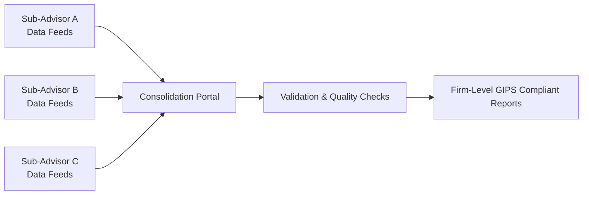

## Introduction

I still remember the first time I encountered a multi-strategy hedge fund that monitored real estate, private equity, and public equities under one umbrella. It felt like wrangling a three-headed hydra because each strategy had different reporting methodologies and data lag times—and I was supposed to unify them under the Global Investment Performance Standards (GIPS®)! If you’ve ever dealt with the demands of complex portfolio structures, constantly shifting exchange rates, or partial compliance, you know just how complicated it can get.

In this section, we’ll explore some of the advanced issues that arise when you’re applying GIPS to intricate portfolios, such as hedge funds, private equity, multi-currency accounts, side pockets, and more. Along the way, we’ll talk about best practices, common pitfalls, and how to maintain robust controls to ensure your performance reporting is both accurate and ethically sound. GIPS might feel like a daunting standard to tackle, but trust me—when investors see the GIPS-compliant stamp of approval on your firm’s performance, they appreciate it.

## Handling Non-Traditional Portfolio Structures

### Hedge Funds and Multi-Strategy Funds
Hedge funds and multi-strategy portfolios often employ a variety of asset classes and investment techniques. One day, they might be dabbling in convertible arbitrage; the next, they’re elbow-deep in distressed debt. Reconciling these shifts under a single composite can be challenging.

• Strategy Definition: GIPS requires that portfolios be grouped into composites with similar objectives or strategies. For multi-strategy funds that have overlapping strategies, you may have to define multiple composites or carefully define a “master” composite that accurately captures the overall hedge fund approach.  
• Illiquid Assets: Many hedge funds invest in assets that are not frequently priced, so you’ll need consistent valuation policies—especially for distressed assets and side pockets. In essence, define a standard approach for marking these to market or fair value.

### Private Equity
Private equity (PE) structures pose further wrinkles, from capital calls to distributions:

• Vintage Year Reporting: GIPS includes specific guidance for private equity, recommending vintage-year reporting for each fund or sub-fund. You’ll want to ensure you align the performance track record with the year capital was first called.  
• Internal Rate of Return (IRR) Calculations: PE returns are often expressed as annualized IRRs using cash flows, rather than time-weighted returns. It’s important to maintain consistent IRR methodology across your firm’s PE composites.  
• Real Estate Overlaps: Some private equity funds also hold direct real estate, so be sure you’re consistent in handling disclaimers for appraisals and outside valuations.

## Performance Reporting for Multi-Currency Portfolios

### The Need for Consistency
Managing portfolios in multiple currencies can be, well, tricky. Let’s say you have a British client holding Brazilian equities, paying dividends in U.S. dollars, and you’re required to consolidate everything into euros at quarter-end. GIPS does allow either local-currency or a single base-currency return, but the key is consistency.

You might use the following formula for returns on foreign assets before repatriation:


\text{Return in Base Currency} = \left(1 + r_{\text{foreign}}\right) \times \left(1 + r_{\text{FX}}\right) - 1


Where:  
• \\( r_{\text{foreign}} \\) is the percentage return of the underlying asset in its local currency.  
• \\( r_{\text{FX}} \\) is the percentage change in the foreign exchange rate to convert from the local currency to the base currency.

### Multi-Currency Data Integration Example (Python Snippet)

Below is a short Python code snippet that shows a simplified approach to consolidating daily returns in multiple currencies. While you probably won’t replicate your entire GIPS process in a Jupyter notebook, this kind of script can help your compliance team spot anomalies:

```python
import pandas as pd

data = {
    'Local_Return': [0.01, 0.02, -0.015],
    'FX_Change': [0.005, -0.003, 0.002]
}
df = pd.DataFrame(data)

def convert_to_base(local_ret, fx_change):
    return (1 + local_ret) * (1 + fx_change) - 1

df['Base_Return'] = df.apply(lambda x: convert_to_base(x['Local_Return'], x['FX_Change']), axis=1)

print(df)
```

This snippet calculates a “Base_Return” column that combines local returns with currency effects. If you see large and unexpected fluctuations, you’ll know to dig deeper into your data set.

## Partial Compliance and Transitional Cases

One of the most eye-opening experiences I’ve had in GIPS training sessions was watching folks try to declare partial compliance for brand-new divisions of their company—only to discover that GIPS doesn’t simply allow partial compliance to fit a marketing narrative. GIPS standards are typically all or nothing; however, they do provide transitional allowances in certain scenarios (e.g., newly formed firms that require time to align all their historical numbers with GIPS methodology). The key guidelines are:

• Limited Grace Period: Transitional compliance is allowed to ensure that new or reorganized entities can obtain all the data necessary to meet GIPS.  
• Consistency in Core Policies: Even if not all historical data can be aligned, your firm must still adhere to the GIPS fundamentals, such as fair valuation and consistent composite definition.  
• Explicit Disclosures: If you are claiming partial compliance in these rare situations, you must disclose the time period and portions of the firm or track record to which that partial compliance applies.

## Real-Life Complexities: Side Pockets and Illiquid Investments

### Side Pockets
Side pockets are used to house illiquid or “hard-to-value” assets that could otherwise distort the performance of liquid holdings. They are common in hedge funds that encounter assets frozen in a workout process or legal disputes.

• Inclusion or Exclusion in Composites: GIPS guidance generally states that a side pocket is still part of the fund’s overall strategy; it affects performance. You cannot arbitrarily exclude it from composite performance.  
• Detailed Disclosure: You will often need footnotes describing the side pocket’s purpose, the time of its creation, and valuation assumptions. This helps to reduce confusion about how your GIPS compliance is impacted.

### Illiquid Investments
Whether it’s private equity or certain real estate holdings, illiquid assets can pose challenges:

• Infrequent Pricing: Employ consistent external appraisals or manager marks, ensuring the logic and frequency are described in your GIPS-complaint disclosures.  
• Watch Out for “Price Stale”: If your last third-party valuation is 18 months old, you can’t claim the same level of reliability as a daily-priced security.

## Robust Internal Controls to Ensure Data Consistency

When data are collected in decentralized ways—like from multiple fund administrators or sub-advisors—tight internal controls are paramount. You might have a brilliant performance system, but if your administrators are feeding you incomplete or mismatched data, you’ll have an immediate compliance headache.

### Key Internal Control Practices
• Standardized Templates: Define a single blueprint for collecting data from sub-advisors.  
• Reconciliation: Compare your net asset values (NAV) with the sub-advisor’s records on a regular schedule.  
• Spot Checks: Perform random sample checks to verify both returns and trade-level data.  
• Training: Make sure everyone from junior analysts to sub-advisor contacts knows what GIPS requires of them, from fair value definition to data retention.

Below is a basic Mermaid diagram to illustrate how performance data might flow in a multi-manager platform:



This diagram highlights how multiple data sources feed into a central portal and are then validated—an essential process for GIPS compliance.

## Reconciling & Verifying Data from External Sources

When sub-advisors or third-party administrators manage slices of your portfolio, performance numbers can become messy. I recall one situation where a sub-advisor repeatedly sent net returns calculated from a slightly different fee structure than our main system. The bottom line is:

• Documentation: Make sure sub-advisors either follow the same GIPS policies or provide you with data that can be converted to your standard.  
• Ongoing Dialog: Schedule periodic calls or audits to align assumptions for valuations, exchange rates, manual adjustments, and fees.  
• Use of Verification: GIPS verification by independent third parties can help ensure sub-advisor data doesn’t create inconsistencies or disclaimers that undermine the main composite’s integrity.

## Automated Performance Software Solutions and Manual Oversight

With multi-currency, multi-strategy, and partial compliance issues, it’s easy to lean heavily on advanced software solutions. There are quite a few well-known vendors that claim to offer “turnkey GIPS compliance.” Although technology can help, there’s no substitute for good old human sense-checks.

• Customization: Off-the-shelf software may not align perfectly with your specialized asset classes, particularly if you have illiquid or esoteric holdings.  
• Manual Checks: If something in the system’s calculations looks too good (or too bad) to be true, do manual spot checks.  
• Workflow Documentation: Keep an audit trail of overrides, especially for fair-value adjustments or classification changes.

## Best Practices for GIPS Disclosures and Footnotes

When you’re dealing with complex portfolio structures, your footnotes might stretch longer than your performance table. And that’s a good thing if it clarifies your methodology. GIPS demands transparency:

• Summarize Key Assumptions: Let’s say you have monthly pricing for real estate. Disclose the pricing frequency and how you handle mid-month inflows/outflows.  
• Clarify Limitations: If illiquid holdings are based on annual appraisals, mention the date of the last appraisal and how interim valuations are derived.  
• Partial vs. Full Compliance: If you’re in a transitional phase, clarify precisely which elements of your firm’s performance track record meet GIPS at this point (and which do not).

## Concluding Remarks and Exam Tips

Tackling the GIPS standards in the context of complex investment strategies is not for the faint of heart. But if you do it well—aligning your disclosures, internal controls, data processes, and composite definitions—you’ll stand out as a provider of transparent performance data. This fosters trust among institutional investors and regulators alike.

For the CFA® exam, you may face scenario-based questions testing your understanding of how an unusual portfolio’s performance must be reported under GIPS. You might be asked: “A hedge fund invests in illiquid side-pocket positions—should it be excluded from the main composite?” or “Can partial compliance be claimed for a newly formed subsidiary’s track record?” Focus on the core principles: consistency, fair valuation, thorough documentation, and ongoing verification of data.

• Be prepared to read a vignette describing multi-currency woes or side-pocket issues and decide the best GIPS-compliant approach.  
• Look out for partial compliance “traps,” as the exam might show a situation in which a firm incorrectly claims partial compliance.  
• Remember to keep a sharp eye on footnote disclosures and how they align with GIPS transparency standards.

## References

- Global Investment Performance Standards (GIPS®), 2020 Edition – CFA Institute (www.cfainstitute.org)  
- “Global Investment Performance Standards Handbook” – CFA Institute  
- “Performance Measurement and Attribution” by Carl R. Bacon  

## Potential Pitfalls in Complex GIPS Scenarios: Self-Test



### A hedge fund sets up side pockets for distressed assets. According to GIPS, how should these side-pocket holdings be handled?
- [ ] Exclude them entirely from the composite for clarity.  
- [x] Include them in the composite but add clear footnotes detailing valuation methods and timing.  
- [ ] Exclude them from composite returns but include them in a separate GIPS report.  
- [ ] Include them only if they exceed a certain percentage of the portfolio’s NAV.  

> **Explanation:** GIPS standards require that side pockets be included in overall performance. Clear disclosure of valuation methods and timing helps ensure compliant reporting.

### Which of the following best characterizes partial GIPS compliance for a newly established firm?
- [ ] It’s freely available for firms that lack complete historical data.  
- [x] It’s permitted only under certain transitional circumstances and must be fully disclosed.  
- [ ] It’s considered standard practice for all new investment products.  
- [ ] It’s automatically granted if the firm follows at least half of the GIPS standards.  

> **Explanation:** Partial compliance is rarely allowed and only in specific transitional cases clearly stated by GIPS. Firms must disclose the nature and timeline of their partial compliance.

### In multi-currency portfolios, which of the following statements is most accurate?
- [ ] Currency conversions must always be done weekly using an external benchmark.  
- [ ] Local returns can be reported directly without conversion for GIPS compliance.  
- [x] Consistent conversion to a base currency or local currency approach is acceptable, provided disclosures are clear.  
- [ ] Only time-weighted returns are allowed for foreign-currency exposures.  

> **Explanation:** GIPS allows either local currency or a single base currency reporting. The key is to remain consistent and disclose your approach.

### A private equity fund uses annual external appraisals for illiquid holdings. Under GIPS, what is essential to address reliability concerns?
- [ ] Exclude any illiquid assets from performance calculations.  
- [ ] Report the last known appraisal, ignoring changes in valuation.  
- [x] Employ consistent valuation methods and disclose the timing of appraisals.  
- [ ] Use interpolation to estimate monthly returns for the illiquid portion.  

> **Explanation:** GIPS standards emphasize consistency and transparency. A fund should maintain a reliable, disclosed method for appraisals and describe exactly how and when they are updated.

### When verifying performance data from multiple sub-advisors, a recommended best practice is:
- [x] Reconcile sub-advisor data with firm-wide records on a consistent schedule.  
- [ ] Rely entirely on sub-advisor data if they claim GIPS compliance independently.  
- [x] Provide standardized templates for data submission.  
- [ ] Only verify sub-advisor data once a year for cost efficiency.  

> **Explanation:** Reconciliation ensures consistency, and standardized data collection templates reduce confusion. Firms remain responsible for the data they use, even if sub-advisors claim GIPS compliance on their end.

### A multi-strategy fund invests in real estate, private equity, and public equities. Which of the following is a GIPS-compliant approach to composite construction?
- [ ] Creating one single composite that aggregates all strategies without any definition.  
- [ ] Splitting the fund into multiple composites but never disclosing performance differences.  
- [x] Defining composites by investment strategy or objective and clearly disclosing allocations and valuations.  
- [ ] Reporting all performance at the total fund level without explaining sub-strategies.  

> **Explanation:** GIPS requires grouping portfolios with similar mandates. If the multi-strategy fund can be broken down appropriately, each portion should be in its respective composite, with transparent disclosures.

### Under GIPS, how should a firm approach disclosures about annual valuations for an illiquid private equity fund?
- [x] Provide footnotes explaining the basis, frequency, and last date of valuations.  
- [ ] State that the fund’s valuations are proprietary and omit further details.  
- [x] Note any changes in valuation methodologies in the performance footnotes.  
- [ ] Only disclose frequency but not the dates of appraisals.  

> **Explanation:** GIPS is all about transparency. Firms must detail the nature of valuations (e.g., external appraisals), frequency, timing, and any shifts in methodologies.

### A firm claims partial GIPS compliance for one of its subdivisions. According to GIPS, what must be included in its official disclosures?
- [ ] The partial compliance claim is enough without further explanation.  
- [ ] A vague statement indicating that it follows some GIPS guidelines.  
- [x] Detailed explanation of which segments and periods are included, plus the specific reason for partial compliance.  
- [ ] A statement that partial compliance has the same standing as full compliance.  

> **Explanation:** When partial compliance is valid, GIPS requires a specific and transparent disclosure about how and why partial adherence applies, along with the timeline for transitioning to full compliance.

### Why is manual oversight still necessary, even when firms use automated performance software solutions?
- [ ] GIPS prohibits automated solutions entirely.  
- [ x ] Software can have incorrect inputs; manual checks catch errors and unusual results.  
- [ ] Sub-advisors are prohibited from feeding data into software directly.  
- [ ] Automated solutions don’t support multi-currency conversions.  

> **Explanation:** Software platforms are helpful but rely on accurate inputs. Humans have to check for outliers, anomalies, or methodological mismatches that might slip through.

### A firm attempts to exclude side pockets from performance calculations to show a smoother return series. Under GIPS, is this action acceptable?
- [x] True  
- [ ] False  

> **Explanation:** Excluding side pockets is not acceptable under GIPS. The returns of all assets within the portfolio, including illiquid or distressed assets, must be reflected in the composite performance.


