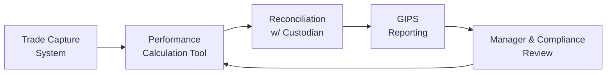

## Introduction and Motivation

You know, I still remember the first time I saw a firm’s performance reports get, well, let’s say “dangerously creative.” The performance team was under pressure to show stellar numbers, and ironically, the bigger risk turned out to be unintentional data slips rather than any outright fraud. Even honest mistakes—like an overlooked custodial fee or a misapplied benchmark weight—can snowball into massive inconsistencies. In the context of the Global Investment Performance Standards (GIPS), these errors can be downright disastrous, undermining trust with clients, stakeholders, and regulatory bodies.

So, in this section, we’ll examine practical ways to ensure accuracy and consistency in GIPS reports, with a special emphasis on standardized performance calculations, robust reconciliation processes, thorough data validation, procedural oversight, and ethical obligations. Along the way, we’ll pepper in real-life scenarios, best practices for global firms, and a few pointers on how cutting-edge technology can help you sleep better at night.

## Standardized Methodologies for Calculating Performance

When it comes to GIPS, consistency is king. To maintain your internal credibility (and keep external stakeholders happy), your firm needs standardized, clearly documented performance calculations. The two heavy hitters in the performance metrics toolbox are Time-Weighted Rate of Return (TWRR) and Money-Weighted Rate of Return (MWRR).

### Time-Weighted Rate of Return (TWRR)

TWRR is usually the go-to measurement because it neutralizes the impact of external cash flows. Think of it as trying to evaluate a portfolio manager’s pure skill without letting sudden inflows or outflows of cash skew the results. At a high level, TWRR calculates sub-period returns and then chains them together to get an overall return. Mathematically, for n sub-period returns R₁, R₂, …, Rₙ:


\text{TWRR} = \left( \prod_{i=1}^{n} (1 + R_i) \right) - 1


The idea is that each sub-period return stands on its own. As GIPS encourages, TWRR is consistent across different composites, making comparisons a snap, though it’s essential that every compliance professional at your firm uses the same approach.

### Money-Weighted Rate of Return (MWRR)

On the other hand, MWRR (also known as Internal Rate of Return, or IRR) incorporates the timing and magnitude of cash flows. This measure can paint a more accurate picture from an investor’s standpoint—an investor who invests cash at a specific time and wants to know how that particular investment grew (or shrank) over time.

TWRR vs. MWRR might seem like an either/or proposition, but in practice, it’s more about choosing the right tool for the situation. TWRR is generally mandated by GIPS for composites that aim to reflect a manager’s track record, but MWRR might be used internally for performance analyses on certain private equity or real-estate funds, or to provide additional detail to clients. The key is to stick to consistent, transparent computations firmwide, so that one department isn’t reporting TWRR while another uses a different twist on the same formula, or worse, a formula that is incorrectly applied.

#### A Quick Python Example

Below is a tiny snippet of Python code that can illustrate how TWRR might be computed for a series of sub-period returns:

```python
sub_period_returns = [0.02, -0.01, 0.015]  # For example, 2%, -1%, 1.5%
twr_result = 1.0
for r in sub_period_returns:
    twr_result *= (1 + r)
twr_result -= 1.0

print("TWRR: {:.2%}".format(twr_result))
```

While this snippet is super simple, it underscores the importance of clarity, because 1 + R is the sub-period growth factor. Then, all factors are multiplied together, and we subtract 1 to convert back to a percentage.

## The Importance of Periodic Reconciliation

Now, if you read any earlier chapters (particularly sections referencing accountability and risk controls), you’ll know that reconciling internal performance data with external custodial records is a big deal. You can’t just rely on your in-house performance analytics if your custodial statements are showing a different story. This is where mistakes—both honest and, occasionally, not so honest—are uncovered.

### Reconciliation in Action

A large asset management firm might maintain multiple custodian relationships for different asset classes (equities, bonds, real estate, alternative investments). Month-end can feel like a swirling chaos of spreadsheets and data extracts. But at each month’s close, performance teams (or outsourced service providers) compare:

• Internal trade records to confirm accuracy of trades and positions  
• Security pricing data to ensure consistent valuations across systems  
• Income accruals and fee calculations  

This systematic process aims to catch differences like missing interest accrual, delayed corporate action, or mispriced assets. Some firms rely on daily or weekly partial reconciliation: well, it’s more work, sure, but it can nip those problems in the bud before they get too large.

## Data Validation Checkpoints and Tolerance Thresholds

Strong data validation helps ensure that your performance numbers aren’t off because of a single decimal misplacement or a bizarre outlier that nobody double-checked. Many enterprises define “data validation checkpoints” that operate at key steps:

• Trade capture, where potential out-of-range prices or suspicious transaction details raise a flag.  
• Processing and month-end close, checking position balances, realized/unrealized gains, and corporate actions.  
• Composite assembly, ensuring that each portfolio in the composite is included at the correct weight and that TWRR or MWRR methods remain consistent.

### Tolerance Thresholds

Let’s be honest, minor discrepancies might still creep in. Firms often define “tolerance thresholds” for performance deviations. For instance, if your expected equity composite monthly return is around 2%, a system might flag any portfolio with a monthly return outside ±1% of that average for deeper review.

Remember, GIPS doesn’t mandate a universal threshold. Instead, it’s on you to set thresholds that reflect your firm’s operational complexity and risk tolerance. Then, you must diligently investigate every flagged occurrence. Sure, 3.5% might be perfectly valid if you’re dealing with a specialized growth strategy, but you still want to know why your performance is diverging from the rest of the composite.

## Handling and Communicating Restatements

We all want to be perfect, but mistakes happen. When an error or methodology oversight is discovered, the ethical (and GIPS-compliant) course of action is to perform a restatement of historical data. This can be messy and downright embarrassing if it changes previously reported returns or ranks.

### Best Practices for Restatements

• A formal, documented approval process: This ensures that restatements aren’t made lightly and that the entire management chain is aware.  
• Timely notifications to affected stakeholders: Don’t hide it. Transparency fosters trust in a crisis.  
• Clear labeling of the corrected periods and an explanation of the new methodology or data correction.  
• Ongoing staff training: Everyone involved in data management or performance calculation should know how restatements work and why they’re necessary.

In many ways, restatements can be turned into a teaching moment. By thoroughly explaining the underlying cause for the restatement, your firm can prove just how serious you are about accurate reporting and your commitment to the letter and spirit of GIPS.

## Technology Solutions for Streamlined Performance Reporting

Technology can be your best friend—or your worst enemy if it’s not configured properly or if staff are not well-trained. Effective performance systems, especially those integrated with advanced data analytics, can automate a good part of performance calculation, reconciliation, and data validation. 

### Potential Tools

• Real-time reconciliation platforms that detect mismatches almost immediately after transactions are processed.  
• Data warehousing solutions with built-in rules engines that auto-flag unusual performance metrics or missing data.  
• Cloud-based dashboards that allow compliance officers and portfolio managers easy, unified visibility of the entire performance chain.  

A more sophisticated technology stack often includes machine learning models to learn normal patterns and highlight anomalies. But free tip: fancy technology doesn’t replace well-defined procedures and skilled staff who understand the underlying business processes. 



Above, we see a simplified flow from trade capture all the way to manager and compliance review, looping back to performance calculation. Each step can incorporate data validation checkpoints to spot errors early.  

## Ensuring Consistency Across Multiple Jurisdictions

If you’re a global firm managing assets in, say, Europe, North America, and Asia, you’ll run into all sorts of local performance reporting regulations. Some regulators might mandate different performance calculation timelines, or additional disclosures. Meanwhile, GIPS stands as a voluntary global standard, but it doesn’t always line up perfectly with the local regulator’s demands.

### Strategies for Harmonizing

• Centralize your performance policies (the “one rule book” approach), but allow for local add-ons to meet any extra regulatory requirement.  
• Maintain a regulatory calendar that outlines each jurisdiction’s specific performance reporting obligations.  
• Deploy a local compliance champion or team in each region. They serve as the eyes and ears for local rules, bridging them with GIPS guidelines.  
• Conduct internal audits that specifically compare local regulatory outputs to the GIPS presentations to ensure they’re not contradictory.

## Ethical Duty to Avoid Misrepresentation

As you might recall from Chapter 3 (Guidance for Standards I–VII), misrepresentation—intentional or unintentional—can violate Standard I on Professionalism. When performance figures are inaccurate, even by a fraction of a percent, it can cause a ripple effect in client perception and future capital inflows. Beyond the potential legal hazards, upholding the spirit of GIPS is about fostering trust and integrity in the investment profession.

### Oversight and Continuous Improvement

• Audit Trails: Keep detailed records of the steps taken to generate each performance figure, plus who handled it, when, and why.  
• Random Spot Checks: Senior compliance folks might do unannounced reviews of a random subset of composites each quarter.  
• Independent Verification: GIPS encourages external verification. This doesn’t just check a compliance box; it yields deeper insights into possible data blind spots.  
• Continuous Education: Everyone from senior portfolio managers to new junior analysts can benefit from periodic training on GIPS and the ethical obligations in performance reporting.

If you’re feeling squeamish about that next big performance presentation, ask yourself: am I prepared to stand behind each data point? If the CFO or CEO suddenly calls, do you have the verifiable backup? If you can’t produce it, it’s time to reevaluate your processes.

## Final Exam Tips

• Always align your performance calculation methodology (TWRR or MWRR) with GIPS guidelines.  
• Keep an eye on reconciliation routines, especially for multi-custodian relationships. Expect a question or two about how best to handle discrepancies.  
• Data validation and tolerance thresholds are easy to overlook but can be tested in scenario-based item sets.  
• Restatements: Understand both the technical presentation changes and how you’d communicate them to clients.  
• Technology solutions and best practices for multi-jurisdiction harmony are increasingly relevant.  
• Ethical angles: Be prepared to discuss how misrepresentation can happen innocently, the steps to prevent it, and the line between mistakes and violation of professional standards.

## Concise Reference List

• GIPS Standards Handbook: Performance Calculation Methods (CFA Institute)  
• The Essentials of Performance Reporting by Bruce J. Feibel  
• International Organization of Securities Commissions (IOSCO) – Guidelines on Portfolio Performance Presentation  

## GIPS Reporting Accuracy: Test Your Knowledge



### Which performance measure neutralizes the effect of external cash flows?

- [x] Time-Weighted Rate of Return (TWRR)
- [ ] Money-Weighted Rate of Return (MWRR)
- [ ] Benchmark-Conscious Return
- [ ] Geometric Mean Return

> **Explanation:** TWRR focuses on the manager’s investment skill by “breaking” the calculation into sub-periods to reduce the effect of cash inflows and outflows.

### What is the primary purpose of reconciliation between internal and external records?

- [ ] To create a secondary record of portfolio holdings
- [x] To detect and correct discrepancies in traded positions, valuations, and income
- [ ] To satisfy investor curiosity about transaction details
- [ ] To eliminate the need for external auditors

> **Explanation:** Reconciling internal data with custodial or accounting statements ensures accuracy and consistency. It also identifies errors (e.g., missing positions, inaccurate prices) that could impair reported returns.

### Which approach best describes data validation checkpoints?

- [ ] Setting up software blocks that allow any data entry without checks
- [x] Establishing pre-defined filters or rules that flag unusual or out-of-range figures
- [ ] Limiting the number of staff allowed to input data
- [ ] Restricting technology integration to a single proprietary system

> **Explanation:** Data validation checkpoints are automated or manual filters that flag anomalies. They keep input errors from propagating through to final reports.

### Tolerance thresholds are used to:

- [x] Identify deviations in performance beyond expected ranges
- [ ] Ensure TWRR calculations are consistently negative
- [ ] Guarantee every portfolio has identical returns
- [ ] Remove extraneous composite portfolios from GIPS reports

> **Explanation:** Tolerance thresholds serve as guardrails to highlight performance figures that deviate significantly from the average or expected range, prompting further investigation.

### When a firm’s historical performance is found to have a calculation error, a best-practice step is to:

- [x] Issue a restatement with proper disclosure
- [ ] Conceal the error to avoid client confusion
- [x] Train employees on how to prevent such errors in the future
- [ ] Destroy older performance records to avoid audits

> **Explanation:** Restating historical data with transparent communication is key. Additionally, implementing training and process improvements ensures the mistake is less likely to recur.

### Why is technology alone insufficient for ensuring accurate GIPS reporting?

- [x] Proper procedures and trained personnel are needed to interpret and verify technology outputs
- [ ] Technology has no effect on performance calculations
- [ ] GIPS standards only allow manual calculations
- [ ] Technology complicates TWRR calculations

> **Explanation:** While technology is invaluable for automation and real-time monitoring, you still need knowledgeable people and solid procedures to validate outputs and interpret flagged issues correctly.

### A global firm facing different local regulations should:

- [x] Centralize policies while allowing local add-ons
- [ ] Adopt only the strictest local regulation
- [x] Employ local compliance teams to align regional rules with GIPS
- [ ] Dismiss the GIPS framework altogether

> **Explanation:** Consistency across jurisdictions involves central oversight plus local adaptations. Local teams ensure compliance with local laws while staying GIPS-compliant.

### Which of the following best highlights the ethical risks in performance reporting?

- [x] Even small unintended errors can build up to major misrepresentations
- [ ] Investors expect performance to be overstated
- [ ] Regulators allow minor mistakes if promptly corrected
- [ ] GIPS compliance eliminates all ethical concerns

> **Explanation:** Seemingly minor errors can accumulate, distorting performance results and violating ethical and professional standards, especially if left uncorrected.

### What is the purpose of an external GIPS verification?

- [x] Provide an independent review of policies and procedures
- [ ] Replace internal audits entirely
- [ ] Lower regulatory obligations
- [ ] Guarantee no future mistakes

> **Explanation:** External verification increases credibility by confirming that the firm’s data and processes align with GIPS standards. It complements, not replaces, internal audits.

### When investigating large deviations flagged by tolerance thresholds, it is most accurate to say:

- [x] True
- [ ] False

> **Explanation:** Tolerance thresholds require thorough investigation of large deviations. They might turn out valid, but due diligence is essential to affirm accuracy or fix errors.


