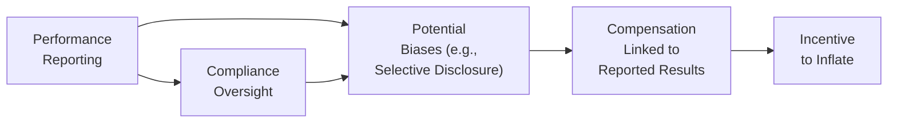
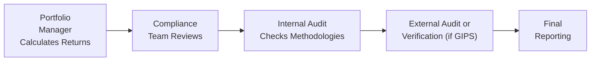

## Introduction and Overview

When you think about the excitement of presenting solid investment returns to stakeholders, it’s easy to see why so many professionals get a bit carried away. You know, the situation where an investment manager might say, “Look how amazing our fund is doing—invest now!” But if those numbers are inflated or selectively disclosed, well, you can guess the consequences: the erosion of investor trust, possible legal battles, and definitely a black mark on the firm’s reputation. In short, honest, thorough, and transparent performance reporting is an absolute must—and not just because regulators demand it, but because our integrity as financial professionals is on the line.

In this section, we’ll explore the ethical imperatives that govern how we report performance and dissect exactly why thoroughness matters so much. We’ll also see how incomplete or misleading disclosures can undermine both client relationships and the entire investment profession. Along the way, we’ll talk about how GIPS (Global Investment Performance Standards) compliance safeguards against these pitfalls, and how real-world ethical lapses can teach us the importance of disclaimers, structured escalation protocols, and a deep-rooted ethical organizational culture.

## The Foundation of Transparency and Honesty

Transparency forms the bedrock of ethical performance reporting. Clients want you to show them the real deal—no sugarcoating, no hidden disclaimers stuck in the fine print. Sure, you might think, “Well, it’s just a small carve-out,” or “We only took out the non-performing, weird outliers.” But omitting even a single piece of relevant information can tilt the risk-reward perception of the portfolio.

Honesty in reporting not only reflects on you as an individual professional—it’s also essential for safeguarding the broader financial ecosystem. Investors make decisions that affect their livelihoods, future retirement plans, or child education funds based on the numbers you present. Any shortcuts with performance reporting become the breeding ground for mistrust and, eventually, market instability. The CFA Institute Code of Ethics and Standards of Professional Conduct sets forth the principle that all stakeholders benefit when practitioners adhere to complete, accurate, and consistent disclosures.

### A Quick Anecdote on Transparency

I remember a time when I was new to the industry. I’d just received some performance figures from a colleague who insisted this data was “clean and bulletproof.” But something about it felt off. We double-checked the source data and realized they’d excluded months of underperformance when the market was volatile. The newly minted returns looked great, but they didn’t actually reflect the portfolio’s reality.

If we presented those “enhanced” results, we’d be crossing ethical boundaries. Moreover, this misrepresentation could’ve been flagged by a prospective client’s due diligence process, leading to reputational damage. That’s the cost of a seemingly harmless omission. And trust me, it’s never worth it.

## Conflicts of Interest in Performance Reporting

Conflict of interest in reporting is more common than you might think. If you’re compensated based on performance-based fees or bonuses, there’s an extra incentive to present the highest possible return metrics. And that can lead to subtle biases—or not-so-subtle ones—where negative data is, well, conveniently overlooked.

Financial professionals must maintain objectivity despite these potential conflicts. To mitigate such risks, organizations typically separate compliance, audit, and performance teams from direct compensation structures—or at least implement checks and balances so that managers can’t unilaterally massage the numbers. A robust conflict-of-interest policy should cover how data is collected, who reviews it, and under what circumstances it can be amended or restated.

### Diagram: Conflict of Interest in Reporting Flow

Below is a simplified flow illustrating how conflict of interest pressures can arise in performance reporting. Notice how compensation structures or personal goals might lead to subtle data manipulation unless strong controls are in place:

In this diagram, “A” is the act of performance reporting, which can be influenced by “B,” potential biases. These biases can get amplified if “C,” compensation, is tied to the results. That creates an opportunity or “D,” an incentive to inflate performance. Meanwhile, “E,” compliance oversight, loops back to reduce or catch these biases, but it needs to be robust to be effective.

## The Dangers of Selective Disclosure

Selective disclosure is basically telling only part of the story. It’s the classic scenario where a marketing brochure shows the fund’s best returns over a short time window, conveniently ignoring the prolonged downturn right before or after. Even if the small print mentions some disclaimers, many investors might not see—or understand—those details.

There’s a slippery slope here: a manager might start with small omissions (“We only have partial data for that quarter, so let’s skip it”) but before you know it, the entire performance package is built on incomplete info. This practice not only violates the principle of fairness—it can breach the law in certain jurisdictions. The GIPS standards were developed, in large part, to address exactly these manipulations.

### GIPS as a Safeguard

So how does GIPS come into play? The Global Investment Performance Standards require firms to present full data for all time periods, use consistent calculations, and provide mandatory disclosures about strategies, composites, and fee structures. By adopting GIPS, a firm commits to:

• Disclosing not just the best results, but the entire composite performance over time.  
• Setting consistent valuation standards for portfolio accounting.  
• Including disclaimers about fees, benchmark performance, and significant events that may have affected returns.  
• Outlining any changes in investment strategies, composite structures, or personnel.

Following these guidelines helps ensure managers aren’t cherry-picking or misrepresenting results. In short, GIPS compliance is an industry gold standard that helps both managers and clients rest easier.

## The Role of Disclaimers and Disclosures

Disclaimers matter—a lot. They provide important context for interpreting data. For instance, if you present hypothetical or back-tested returns, disclaimers should say so explicitly: “These results are not from an actual portfolio, and the investor’s real-world experience might differ.” Without such disclaimers, investors may believe they are looking at actual performance and base their decisions on unrealistic assumptions.

### Types of Disclaimers

1. Hypothetical Returns: Let’s say you’re running a new algorithmic trading strategy on old data (i.e., backtesting). This form of data is absolutely prone to model overfitting or “look-ahead bias.”  
2. Limited Track Record: For new portfolios or managers, disclaimers clarify that a strategy’s historical performance might be short or incomplete.  
3. Changes in Benchmark or Investment Strategy: If your benchmark has changed over time or you’ve pivoted from long-only equity to a multi-asset approach, disclaimers help clarify the context around reported results.  

If you ever see disclaimers as a “nice to have”—please, think again. They’re an integral piece of ethical communication with clients.

## Real-World Cases of Unethical Reporting

We’ve seen enough news headlines about firms that manipulated or inflated returns, only to face regulatory enforcement and lawsuits down the line. Consider the hypothetical scenario of “Firm X,” which promoted steady outperformance for years—until the documentation revealed they systematically ignored weeks of underperformance by attributing it to “data issues.” That rationale might sound valid in a marketing pitch, but regulators discovered that “data issues” were basically code for “we don’t like those results.” Eventually, clients discovered the misrepresentation, and the firm was shut down, with hefty fines assessed against senior management.

Another example involves a well-regarded portfolio manager who presented a dazzling track record to new investors but conveniently didn’t mention that the track record reflected marketing gains from a bull market in only one sector—tech—while ignoring the rest of the portfolio’s underperformance. Once the bubble burst, the real numbers surfaced and the results were devastating, not just for the manager’s career but for investor trust in that entire investment approach.

## Organizational Culture and Leadership

Cultivating an ethical culture might sound like a corporate buzzphrase, but in practice, it’s everything. If top management routinely “dresses up” performance data—or encourages staff to do so—compliance procedures can become toothless. On the other hand, if managers emphasize integrity above quick wins, employees are more inclined to follow suit. Encouraging professionals to raise questions and concerns (often known as whistleblowing) is a hallmark of a strong compliance culture. When staff members feel safe escalating potential discrepancies, it decreases the odds of major ethical breaches.

### Escalation and Whistleblowing Procedures

No matter how robust an organization’s controls are, suspicious or incorrect data can slip in. That’s where whistleblowing procedures come into play. A clear escalation protocol ensures that if an analyst notices something fishy—like performance numbers that just don’t add up—they can alert compliance or senior officers without fear of retribution. Anonymity and protection for whistleblowers are vital because, let’s face it, no one wants to be penalized or ostracized for bringing honesty to light.

## Ongoing Professional Development

Performance reporting standards, including GIPS, evolve over time to handle new forms of data, new asset classes, or changes in measurement methodologies. Staying updated on these developments isn’t a “one and done” exercise. If you or your compliance team ditches professional development, you might miss crucial updates that keep your reporting in line with both the rules and ethical expectations.

1. Regular Training: Encourage frequent training sessions for all staff. Some large institutions have mandatory monthly or quarterly training on performance measurement and compliance.  
2. Conference Attendance: Industry events bring practitioners, regulators, and experts together. You get direct insights on best practices (and sometimes cautionary tales).  
3. Mentoring Programs: Pair junior employees with seasoned compliance professionals or performance managers to cultivate an environment of knowledge transfer.  

## Practical Strategies for Ethical Reporting

So, what can we do on a day-to-day basis to maintain ethical performance reporting?

• Use Composites Properly: Group similar portfolios in the same composite to give a true reflection of performance. Don’t conveniently exclude “bad performers” just to boost that average.  
• Document Everything: Maintain detailed records of how returns are calculated, how benchmarks are chosen, and how any adjustments are made. Transparency in your methodology is your armor against accusations of wrongdoing.  
• Employ Consistent Valuation Practices: Align your portfolio valuations with standard protocols. If you’re using fair value, stick to it across the board. Inconsistent use can produce artificially inflated or deflated numbers.  
• Incorporate Multiple Layers of Review: Even if performance is initially computed by a portfolio manager, a compliance or auditing layer ensures a second set of eyes.  
• Encourage Open Communication: If team members feel comfortable questioning performance data, suspicious numbers are more likely to be caught early.

Below is a simple diagram showing how multiple layers of verification can strengthen ethical reporting:

By building checks and balances into your process, you significantly reduce the temptation or ability to manipulate performance figures.

## Exam Relevance and Final Tips

Performance reporting is an area where exam questions often test your knowledge of permissible and impermissible practices. You’ll need to recognize:

• How to address potential conflicts of interest.  
• What disclaimers are necessary for various types of reported data (e.g., partial-year returns, back-tested results).  
• How to evaluate ethical guidelines in real-world scenarios or case studies.  

During the exam, pay special attention to any question about GIPS. They often revolve around the correct labeling of composite returns, the necessity of front-loaded or back-loaded fees in performance calculations, or the difference between hypothetical and actual performance data. If you see a scenario with possible selective disclosure, watch for compliance red flags that you, as a candidate, would be expected to notice and highlight.

### Common Pitfalls

• Failing to mention disclaimers for hypothetical or back-tested results.  
• Omitting relevant performance periods (like a crash year) from a historical record.  
• Calculating performance metrics in a manner inconsistent with existing standards to artificially “boost” returns.  

### Strategies for Constructed-Response (Essay) Questions

1. Read the prompt carefully; identify possible ethical breaches (incomplete records, selective disclaimers, performance-based incentive conflicts).  
2. Cite the appropriate Standard from the CFA Institute Code and Standards—often either Standard I(C) Misrepresentation or Standard III(D) Performance Presentation.  
3. Propose steps to remedy the situation—like acknowledging the omitted data, including disclaimers, or adjusting fee calculations to comply with GIPS.  
4. Sum up the potential outcomes or ramifications for ignoring correct procedures (loss of client trust, regulatory actions, reputational damage, etc.).

## References

• CFA Institute Code of Ethics and Standards of Professional Conduct (<https://www.cfainstitute.org>)  
• Rezaee, Zabihollah. “Corporate Governance and Ethics.” Wiley, 2009.  
• CFA Institute Research Foundation. “Ethics in the Investment Industry: Case Studies.” Various authors, 2020.  

--------------------------------------------------------------------------------

## Mastering the Ethical Implications of Reporting Practices: Practice Questions



### 1) Which of the following best describes a conflict of interest in performance reporting?

- [ ] When a compliance officer verifies reported performance.  
- [x] When compensation is tied to reporting higher returns.  
- [ ] When auditors review actual vs. reported performance.  
- [ ] When reporting standards are updated regularly.  

> **Explanation:** Compensation tied to higher reported returns creates incentives to manipulate data, which is a classic conflict of interest in performance reporting.

### 2) An investment manager omits underperforming accounts from a composite to improve reported returns. Which GIPS principle is being violated?

- [ ] Including full fee disclosures.  
- [x] Fair representation in composite construction.  
- [ ] Requiring monthly valuations.  
- [ ] Reporting annually rather than quarterly.  

> **Explanation:** GIPS requires that all similar portfolios be included in the same composite. Omitting underperformers creates misleading overall returns.

### 3) Back-tested performance data:

- [ ] Does not require disclaimers if it is projected onto similar portfolios.  
- [x] Requires a disclaimer because those results are hypothetical in nature.  
- [ ] Cannot be presented under any circumstances.  
- [ ] Is inherently more accurate than live portfolio data.  

> **Explanation:** Back-tested (or hypothetical) performance data must be recognized as such, because historical simulation can differ significantly from real-world outcomes. Disclaimers are critical to avoid misleading clients.

### 4) A firm decides to show only its best 12-month performance period in marketing presentations, omitting any references to down markets. This scenario most clearly involves:

- [x] Selective disclosure.  
- [ ] Appropriate GIPS compliance.  
- [ ] Transparent disclaimers.  
- [ ] Integrated compliance oversight.  

> **Explanation:** By only highlighting the strongest performance window, the firm engages in selective disclosure that misrepresents the total performance picture.

### 5) When a manager changes the benchmark from a broad equity index to a narrower sector index without disclosure, the biggest ethical issue is:

- [x] Inadequate disclosure regarding changes in performance benchmarks.  
- [ ] Overstating risk-adjusted returns.  
- [ ] Adding disclaimers for all hypothetical returns.  
- [ ] Combining several unrelated portfolios into one composite.  

> **Explanation:** Changing benchmarks can materially affect performance comparisons. Failure to disclose such changes leaves investors without the context they need to interpret results accurately.

### 6) How can an organization foster a culture that reduces unethical performance reporting?

- [ ] Encourage competition among employees for large bonuses based on reported returns.  
- [ ] Minimize compliance oversight to allow for flexible reporting.  
- [x] Promote transparency, reward ethical behavior openly, and ensure whistleblower protection.  
- [ ] Require employees to sign non-disclosure agreements restricting any disclosures outside the firm.  

> **Explanation:** Establishing a culture that prioritizes ethics—through consistent messaging, transparency, and protection for whistleblowers—helps reduce unethical reporting.

### 7) A firm using GIPS-compliant methods wants to market a recently launched fund. The track record is less than six months. What is the primary ethical consideration here?

- [x] Presenting partial-year returns with full disclosure of the limited track record.  
- [ ] Excluding the new fund until performance reaches at least three years.  
- [ ] Combining with longer-standing funds to create a longer track record.  
- [ ] Emphasizing hypothetical returns from a similar approach.  

> **Explanation:** If the fund is new, the ethical approach is to present partial-year or short performance with clear disclosure that the track record is limited.

### 8) Which of the following actions most helps address conflicts of interest in performance reporting?

- [ ] Providing no performance-based compensation whatsoever.  
- [x] Ensuring a separation of duties between those calculating returns and those benefiting from them.  
- [ ] Limiting disclosure of performance data to key investment officers.  
- [ ] Bundling different client segments into one composite for consistency.  

> **Explanation:** Having different teams handle performance calculation and management responsibilities reduces conflicts of interest, since those who benefit from high reported returns do not independently control the data.

### 9) If a firm’s performance record is discovered to be inaccurate due to deliberate omission of poor returns, which CFA Institute Standard is most directly violated?

- [ ] Standard IV – Duties to Employers.  
- [ ] Standard V – Investment Analysis, Recommendations, and Actions.  
- [ ] Standard VI – Conflicts of Interest.  
- [x] Standard I(C) – Misrepresentation.  

> **Explanation:** Providing misleading or false information about performance violates Standard I(C) related to misrepresentation.  

### 10) True or False: A GIPS-compliant firm can partially comply with the standards by claiming compliance only for certain high-performing composites.

- [ ] False  
- [x] True  

> **Explanation:** This is actually a trick question—partial compliance is not permitted. However, the statement is reversed in the answer set. Firms must comply on a firmwide basis to claim to be GIPS-compliant. Therefore, the correct response is “False,” meaning the statement that partial compliance is allowed is incorrect.


