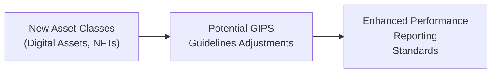

## Introduction

If you’ve ever watched a firm scramble to explain its returns on a brand-new digital asset fund, you might have sensed that the traditional approach to performance standards isn’t fully keeping pace with innovation. I remember a moment when a friend—who’d just started investing in tokenized real estate—asked why his performance statement looked so different from the standard equity reports. It struck me then: our performance measurement framework needs to evolve right alongside these emerging asset classes.

The Global Investment Performance Standards (GIPS) have been the gold standard for transparent, comparable, and ethical performance reporting for years. But now, as the market sees dramatic growth in digital assets, real-time reporting, environmental considerations, and more, the GIPS framework is standing at a pivotal crossroads. So, let’s explore these future developments in GIPS—where they might be headed, how emerging technologies and regulations could shape them, and why the entire investment profession should pay close attention.

## Impact of Emerging Asset Classes

For quite some time, GIPS practitioners have mostly focused on traditional asset classes: equities, fixed income, real estate, and private equity. But the rapid explosion of digital assets and even non-fungible tokens (NFTs) has raised new issues:

• Valuation challenges. Traditional frameworks may struggle to capture reliable prices for thinly traded digital assets that can swing wildly within hours.  
• Custody and safekeeping. Verifying ownership and ensuring secure transaction records can be much more complex on decentralized (and sometimes pseudonymous) platforms.  
• Regulatory uncertainty. Different jurisdictions treat digital assets in wildly different ways—some see them as currencies, some as commodities, and others as securities requiring additional disclosures.

Future GIPS revisions are likely to propose clarifications for consistent reporting of digital assets, NFT valuations, and transaction histories. Industry groups and professional bodies are testing guidelines for these new product types. The aim is to eliminate confusion about pricing, reduce discrepancies in performance calculations, and maintain comparability across investment firms.

Here’s how it might look visually:

In the end, properly integrating these asset classes into GIPS means more comprehensive coverage of an ever-evolving portfolio universe. Once the frameworks and industry consensus fall into place, you can expect to see more refined disclosures, likely with footnotes that detail digital asset risk factors and liquidity constraints.

## Harmonizing GIPS and IFRS

GIPS convergence with accounting standards, like the International Financial Reporting Standards (IFRS), has long been on the horizon. IFRS sets the tone for how assets are recognized, measured, and disclosed in financial statements. By aligning with IFRS, GIPS can reduce confusion stemming from different definitions of fair value or from multiple presentation methods.

One area that’s particularly relevant is IFRS 9, which addresses financial instruments. Digital assets—some might be considered financial instruments—have unique accounting treatments, and GIPS must ensure performance calculations match these valuation metrics. This potential alignment could reduce the chances that a client sees one figure under IFRS-based financial statements and a totally different one under GIPS composites.

Active dialogue continues between the CFA Institute, major accounting bodies, and regional regulators to foster a collective approach. The result might be new guidance on how to treat unrealized gains, currency conversions, or even capital distributions within the IFRS-GIPS ecosystem. It could also produce consistent footnote disclosures so that investors can see how the raw data in IFRS statements feed into the GIPS performance numbers.

## Potential for Automated Performance Calculations (Blockchain and DLT)

Blockchain and distributed ledger technology (DLT) are two big buzzwords these days. But it’s not just hype—these technologies can automate and validate transaction histories in near-real-time. For performance reporting, the implications are huge:

• Transaction verification. A distributed ledger can provide an immutable record of inflows, outflows, and underlying holdings.  
• Reduced reconciliation errors. With synchronized data across multiple nodes, the chance of double counting or missing trades is minimized (though not entirely eliminated, of course).  
• Real-time updates. DLT systems could, in theory, produce live updates of portfolio returns if integrated with a robust performance engine.

Imagine a future where, instead of waiting for month-end or quarter-end, an investor can log into a secure platform that shows real-time GIPS-compliant returns, verified via blockchain. That’s still a little utopian, but the technology is developing quickly. Indeed, pilot projects have demonstrated how smart contracts can automate investment compliance, fee calculations, and distributions. GIPS-compliant firms will likely adopt pieces of this technology to streamline data validation and to comply with performance standards more efficiently.

## Shifting Toward Real-Time Reporting

Let’s face it: many clients want immediate updates. If you trade derivatives or hold complex assets, you hardly want to wait for the end of the quarter to see how your portfolio is doing. But real-time (or close to real-time) performance calculations introduce new uncertainties:

• Data reliability. Intraday data might not always be consistent, especially for over-the-counter derivatives or other illiquid securities.  
• Standardization. GIPS historically relies on consistent period-end data. Real-time snapshots can differ drastically depending on the time of day or market conditions.  
• Operational complexity. Systems that generate near-live returns require robust technology, risk controls, and capacity to handle large data volumes flawlessly.

Despite these challenges, many in the industry expect GIPS to move toward more frequent reporting, perhaps weekly or daily. But real-time could be the next frontier for certain asset classes, especially highly liquid and exchange-traded products. With advanced data feeds, integrated portfolio management systems, and possibly a blockchain-based approach to transaction verification, daily or even intraday GIPS-compliant performance reporting might become the norm in a decade or so. It’s a leap, but the global demand for immediacy is pushing the investment profession in that direction.

## Improvements in ESG Disclosures

Environmental, Social, and Governance (ESG) factors are no longer just “nice to have.” They’re an integral part of how investors assess a portfolio’s long-term viability and impact. At the moment, GIPS doesn’t embed separate frameworks for ESG performance attribution—rather, it primarily looks at returns on a broad, composite level.

But the conversation is shifting:

• ESG-based performance attribution. Future versions of GIPS may outline ways to attribute returns specifically linked to ESG integration, such as lower carbon footprints or well-governed companies.  
• Additional disclosures. Investors increasingly want to know how much of a composite’s return is derived from ESG-oriented strategies. They also want to compare the performance of an ESG-focused composite to a traditional benchmark.  
• Standardized approach to materiality. GIPS might implement guidelines on which ESG issues have a direct financial impact and how to reflect them in performance reporting.

We might see explicit rules about how to classify “green bonds” or how to treat “socially responsible” investing outperformance. More investors demand it, and regulators are stepping in with climate risk disclosures and other frameworks, so GIPS inevitably will adapt to remain relevant in this evolving landscape.

## Refined Composite Definitions

For ages, GIPS composites have served as the backbone of performance grouping for distinct investment strategies. But as financial products diversify—think multi-strategy hedge funds or frictionless transitions between long-only equities and alternative assets—defining a composite can become a bit of a guessing game.

Future GIPS changes could include:

• More granular definitions for multi-asset composites. Firms might be required to create subcomposites or carve-outs that clearly reflect the various strategies under one product.  
• Additional guidance for unique structures (e.g., tokenized real estate vehicles that hold both physical and digital assets).  
• Clearer rules on reclassification. If a strategy’s mandate changes halfway through, how do we handle the composite’s historical performance?

Industry working groups, including those at the CFA Institute, are pushing for these refined definitions. They recognize that the line between a “hedge fund composite” and a “private equity composite” might blur when a single fund invests across multiple asset types with varied lockup periods. Properly segmenting performance ensures apples-to-apples comparisons for prospective clients.

## Evolving Verification Guidance

Verification has always been key to GIPS credibility, as it offers external assurance that performance presentations adhere to standards. However, as new asset classes and real-time reporting creep in, verification will need to adapt:

• More frequent audits. Even annual or quarterly verifications might not be enough if daily or intraday performance updates become the norm. There might be rolling verification cycles focusing on data integrity at all times.  
• Specialized auditors for digital assets. Verifying blockchain-based transactions is a different beast than verifying a standard equity portfolio. Verification teams may need specialized skill sets or new automated auditing tools (e.g., specialized block explorers, digital footprint audits).  
• Risk-based approaches. Instead of verifying everything, auditors might concentrate on the high-risk areas—like illiquid digital tokens or complex derivative structures. We could see more targeted audits based on each portfolio’s complexity.

Expect future GIPS guidance to encourage more agile verification methodologies, possibly requiring new certifications for verification providers who deal with advanced technology platforms.

## Global Stakeholder Collaboration

With the increased complexity in global markets, a single standard can’t be developed in a vacuum. Investment firms, regulators, rating agencies, standard-setters, and even retail investor communities are banding together to enhance comparability. Market participants in Europe, Asia, and the Americas are contributing cultural nuances as well as local regulatory concerns to shape the future of performance reporting.

This broader collaboration:

• Helps unify local variations. Different regulators might handle digital assets differently, so GIPS will need to offer bridging guidelines.  
• Encourages global consistency. A firm in Singapore might hold tokens on a U.S.-based exchange, governed by distinct regulatory frameworks. Yet it must produce GIPS-compliant performance that an investor in the U.K. can trust.  
• Boosts investor confidence. When stakeholders around the globe share input, the final standard is more robust and fosters a universal sense of fairness and transparency.

## Best Practices and Common Pitfalls

Sometimes, the future can look shiny and perfect, but let’s be real: adopting all these changes won’t be a walk in the park. Here are some best practices and pitfalls to consider:

• Best Practice: Start small with new asset classes. If your firm is venturing into digital assets, pilot test the measurement and internal controls for a small composite before rolling it out widely.  
• Best Practice: Engage specialized teams or consultants when dealing with ESG or blockchain-related performance complexities.  
• Pitfall: Overcomplicating composites. If you carve out too many subcomposites or implement real-time performance updates with no central data governance, you can confuse clients and regulators alike.  
• Pitfall: Neglecting investor education. Even if you produce daily performance updates, clients might not fully grasp the intraday fluctuation context, risking misinterpretation or undue panic.

## Exam Tips

From an exam perspective, don’t be surprised if you see scenario-based questions where you must handle performance reporting for a novel asset class or defend the rationale for real-time reporting. Be prepared to:

• Demonstrate how to classify digital assets within a composite.  
• Identify the potential impact of IFRS alignment on GIPS calculations.  
• Explain how verification might differ between traditional portfolios and those with complex decentralized assets.  
• Discuss ESG metrics and how they could alter the portrayal of a portfolio’s performance.

For constructed-response questions, outline your reasoning methodically. For item sets with multiple-choice questions, watch for details about liquidity, valuation date, or how frequently data is updated. Keep in mind that small changes in the hypothetical scenario—like switching from monthly to daily valuations—can significantly affect whether a performance figure is considered GIPS-compliant.

Staying on top of the evolving GIPS rules—and understanding how they interact with IFRS, ESG frameworks, and new technologies—will help you handle these exam questions smoothly.

## References for Further Study

• “The Future of GIPS: Innovation and Challenges” – CFA Institute panel discussions  
• “Distributed Ledger Technology in Finance” – World Economic Forum  
• “Integrating ESG into Performance Measurement” – CFA Institute Research Foundation  
• CFA Institute GIPS Standards Handbook (latest edition)  
• IFRS Foundation – Official standards and updates  
• Various industry white papers on blockchain-based accounting and auditing

## Test Your Knowledge: Future Developments in GIPS Standards



### Which of the following is a key challenge in incorporating digital assets into GIPS compliance?

- [x] Establishing consistent valuation methods for volatile, thinly traded assets
- [ ] Finding a single global regulator to oversee all digital assets
- [ ] Ensuring that digital assets always trade on regulated exchanges
- [ ] Avoiding the use of any third-party verifiers

> **Explanation:** A significant challenge is consistently determining fair value, especially for assets with significant price fluctuations and irregular trading volumes.

### How might IFRS alignment with GIPS benefit investment firms?

- [x] It reduces discrepancies between financial statements and performance presentations.
- [ ] It eliminates the need for external auditors entirely.
- [ ] It eliminates local regulatory requirements for GIPS compliance.
- [ ] It forces fund managers to adopt daily performance reporting.

> **Explanation:** Harmonization helps ensure that reported figures under IFRS and GIPS are consistent, improving clarity for investors and stakeholders.

### Why is blockchain technology potentially useful for GIPS-compliant performance reporting?

- [x] It can provide a verifiable, immutable record of all transactions and valuations.
- [ ] It replaces the need for any form of external audit or verification.
- [ ] It automatically reconciles data with IFRS standards in real-time.
- [ ] It strictly eliminates all liquidity risk in the portfolio.

> **Explanation:** Blockchain’s immutability and transparency can help reduce errors and provide a solid audit trail for transactions, increasing confidence in the reported performance.

### What is the main concern with real-time or near-real-time performance reporting under GIPS?

- [x] Ensuring data reliability and consistency amidst intraday market fluctuations
- [ ] Determining standard monthly market close prices
- [ ] Restricting GIPS reporting only to annual statements
- [ ] Avoiding intraday transaction data

> **Explanation:** Real-time data can vary significantly during the trading day, and establishing a consistent methodology for intraday valuations is a primary challenge.

### How might ESG considerations alter future GIPS performance reporting?

- [x] GIPS could require specific disclosures that outline the impact of ESG strategies on returns.
- [ ] ESG factors would automatically be excluded from all future performance calculations.
- [x] GIPS might include performance attribution linked to environmental or social metrics.
- [ ] GIPS would cease to differentiate between passive and active portfolios.

> **Explanation:** Emerging standards suggest separating the effect of ESG-related decisions from broader investment returns. This might involve additional disclosures and specialized attribution methods.

### Which best practice is most useful when adopting GIPS for digital or alternative assets?

- [x] Start by testing the reporting framework on a small subset of the portfolio.
- [ ] Shift all portfolio reporting to real-time metrics immediately.
- [ ] Merge all digital and traditional assets into one composite for simplicity.
- [ ] Rely solely on third-party custodians for valuation data.

> **Explanation:** It is wise to pilot test the controls, valuation methodologies, and compliance measures on a smaller scale before rolling them out to the entire firm’s holdings.

### In the future, how might GIPS verification processes evolve for complex portfolios?

- [x] They may rely on more frequent or rolling audits focusing on higher-risk asset classes.
- [ ] They will eliminate the need for any outside verification if the firm has internal controls.
- [x] They might require specialized auditors with expertise in digital or derivative assets.
- [ ] They will reduce the scope of audits to cut costs.

> **Explanation:** Complex portfolios and advanced technologies could prompt more comprehensive, specialized, and frequent verifications.

### Why is the concept of composite definitions becoming more complex?

- [x] Multi-strategy funds now blend different asset classes and investment policies, complicating standard composites.
- [ ] Active equity and passive equity are now exactly the same strategy.
- [ ] Clients generally prefer a single global composite for everything.
- [ ] GIPS strictly prohibits multi-asset composites.

> **Explanation:** Diversified funds spanning multiple asset classes challenge the traditional approach of classifying a portfolio under a single mandated strategy.

### How might greater investor awareness of GIPS affect disclosures?

- [x] Firms could face pressure to increase transparency and detail within their performance reports.
- [ ] Investors will begin to ignore performance standards altogether.
- [ ] Regulators will ban all references to GIPS compliance.
- [ ] Firms will rely solely on internal data without external verification.

> **Explanation:** As investors become more knowledgeable, they demand thorough and clear disclosures, pushing firms to refine and expand their reporting detail.

### True or False: One major goal of harmonizing GIPS with IFRS is to create a unified global regulatory body that manages all investment performance standards.

- [x] True
- [ ] False

> **Explanation:** Harmonization is aimed at creating consistency and reducing confusion across jurisdictions, though it doesn’t necessarily mean the establishment of a single global regulator. However, many in the industry see it as a step toward more universally recognized performance management.


