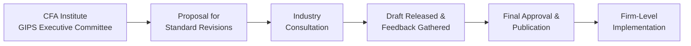
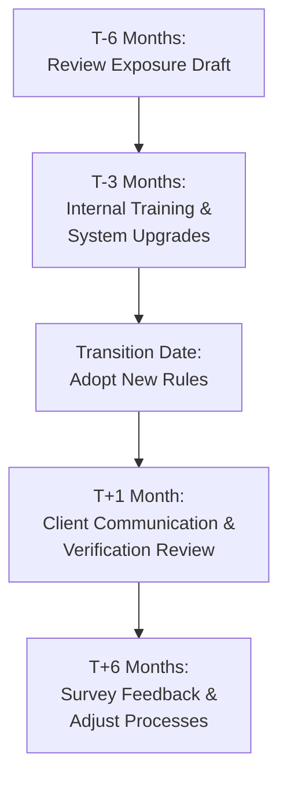

## Understanding the GIPS Updating Process

Sometimes it’s easy to think that once you’ve mastered a set of standards—like the Global Investment Performance Standards (GIPS)—you’re done. But, well, that’s rarely how it goes in the real world. The CFA Institute and the GIPS Executive Committee periodically review and update these standards to ensure they remain relevant, consistent, and reflective of the latest best practices in performance reporting. These revisions often arise from discussions with industry stakeholders, including:
• Asset managers who must apply GIPS to their real-world performance reporting  
• Verifiers who audit compliance  
• Regulators who look to maintain market integrity  

At first, I personally found these incremental updates a bit intimidating. The GIPS manual is already quite hefty, right? But over time, I realized that incremental revisions are designed to ease the burden on the investment community: small, periodic changes can be more manageable than massive overhauls every decade. Below, we’ll dig into how these revisions unfold and how you can prepare your firm for a stable, efficient transition.

## How Incremental Revisions Are Shaped

Why do these revisions keep popping up? In most cases, the triggers come from evolving market practices, technological changes, and emerging asset classes. The GIPS Executive Committee collects data from comment letters, roundtable discussions with industry experts, and feedback from local CFA societies around the globe. Then, the committee refines the standards, often releasing an exposure draft before finalizing new rules or clarifications.

Here’s a simple flowchart that shows the big-picture process:

As you can see, there's typically a period of open discussion and feedback before final approval. This consultative approach is intended to ensure that any new rule or revision is functional and aligned with practical realities.

## Key Historical Overhauls (Why They Matter)

GIPS has had a few major revision waves. Each wave introduced transitional rules so firms could smoothly shift from old requirements to new ones. For instance, back in the early 2010s, GIPS introduced clarifications on how to treat carve-outs without allocated cash. This was a big deal for multi-asset managers, who sometimes extracted portions of portfolios to highlight specific performance.

When those rules arrived, many firms needed time to adapt their performance systems. Some had to restructure their performance measurement processes to conform with the new approach. The GIPS Executive Committee recognized that an abrupt switch could create chaos and confusion, so they introduced transitional windows—meaning you had, say, 12 to 18 months to adopt the new rules while continuing to report under the old ones.

## The Role of Transitional Rules

Transitional rules are basically guidelines that bridge the gap between ending compliance with old standards and adopting the revised ones. Think of them like a gentle on-ramp. They’ll often define:
• The official effective date for new requirements.  
• How to treat partial-year data.  
• Disclosures you need to provide if you’re presenting results under both the old and new frameworks within the same period.  

These rules also address methodology shifts—where you might, for example, go from a modified dietz approach to a daily-weighted time-weighted return approach (or vice versa) for performance calculations. Ensuring clarity in your disclosures is crucial. If performance differences crop up because of new calculation methods, you don’t want your clients to be startled or suspect any data manipulation.

## Preparing Your Compliance Infrastructure

Before any new GIPS provisions are released, it’s best to anticipate possible changes. In my experience—usually working at mid-sized asset management firms—internal staff greatly appreciate a heads-up. When discussing compliance infrastructure, that includes:

• Software systems that calculate portfolio performance;  
• Data management processes for client records, benchmarks, or composite definitions;  
• Staff roles and training, especially for your performance measurement team;  
• Verification partners who need to be aligned with your updated approach.  

By initiating internal discussions about potential updates, you set the stage for a smoother pivot when the changes arrive. Also, letting your team practice incremental revision scenarios (even hypothetical ones) can be a game-changer. For example, simulating a partial-year shift from one performance methodology to another helps staff see actual processes in action—like how to segment a January-to-June period under the old rules and a July-to-December period under the new ones.

## Segmenting Reporting Periods During Transition

Sometimes the official GIPS update or revision might take effect mid-year. This means you’ll have a portion of your annual results computed and reported under old rules, and another portion computed under new rules. From an investor’s perspective, it’s essential to see not only consistency but also clear documentation of where and how the methodology changed.

One approach is to present two sets of data:  
• One covering performance results until the effective date of new rules, calculated under the old methodology.  
• Another that picks up after the effective date, using the new methodology.  

But be careful. Double reporting can confuse clients. You’ll need clear footnotes or disclosures that differentiate these time frames.

Let’s say your transition date is June 30. In your annual performance report for the year, you might explicitly highlight something like:

“Performance from January 1 to June 30, 2025, is presented according to GIPS 2020 rules. Performance from July 1 to December 31, 2025, reflects the updated GIPS 2025 provisions, which incorporate changes to [XYZ methodology]. Please refer to the accompanying footnotes for details on these modifications.”

Outlining the reason and scope of changes (like new benchmark adjustments or revised classification of certain securities) helps keep stakeholders calm and informed. 

## Partial-Year Adjustments: Where Things Get Tricky

Partial-year adjustments come into play when new standards are introduced mid-calculation cycle. Let’s say GIPS clarifies the use of risk measures in official performance presentations. If that standard becomes effective in September, you might find yourself with a partial year of data reported under the old method of risk calculation (perhaps monthly VaR estimates) and the remainder of the year under a new method (say, daily VaR or an entirely different risk metric).

In these cases, docu­ment how you arrived at each partial-year figure. Internal notes or footnotes in your performance disclosures can clarify:

• The old method used for the first portion of the year  
• The new method for the remainder of the year  
• Why the change was necessary and mandated  

This level of transparency puts you in a strong ethical position and aligns with the spirit of GIPS: to give the end user a fair picture of how performance was measured and how it might differ from prior data.

### A Quick Example

Imagine a firm invests across multiple equity strategies and presents performance for a global equity composite. Under the old rules, they were required to do monthly revaluations. A new GIPS update institutionalizes daily valuations for more accurate time-weighted returns. If this shift happens on August 1:

• For January through July, the firm uses monthly revaluation. Returns are aggregated accordingly.  
• Starting in August, daily valuations become the norm.  
• The firm discloses the exact month of the shift plus any expected differences in the resulting performance numbers.  

Sure, it can be a bit of extra work, but it significantly reduces the chance of confusion or accusations that you “massaged” the data mid-year.

## Documentation and Training

With every revision, not only do you need to update your operational processes, but you might also need to train all relevant personnel, including portfolio managers, compliance officers, marketing teams, and any external verifiers. 

You’ll want to create or update the following:  
1) Internal Guides: Short manuals that outline the new requirements, their effective date, and steps to fulfill them.  
2) Training Sessions: Possibly a lunch-and-learn format or a formal training session that walks through changes and their impact.  
3) Communication Templates: Email or letter templates you can use for notifying clients, regulators, or other interested parties of new data or transitional disclaimers.

Sometimes, industry associations or major consultancies publish checklists to help you manage the transition. If you have a verification firm, it’s wise to invite them early to any internal training so they can answer staff questions directly. Plus, it builds trust and sets clear expectations on what needs verifying under new conditions and what doesn’t.

## Contingency Planning for Operational Risks

If you’ve ever been in the middle of a major software update only to have your system crash unexpectedly, you know how chaos can ensue. Now imagine that happening during a GIPS transitional period. Not a good time.

Contingency planning revolves around ensuring your processes and systems can handle any hiccups when new rules come into play. This can include:

• Storing old performance calculation engines so you can revert if the new approach malfunctions.  
• Having a robust data backup system so partial-year data under the old regime doesn’t get accidentally overwritten.  
• Scheduling system upgrades well before or after the revision effective date to avoid layering too many changes at once.  

And, as with all contingency plans, communicate them across your organization. Your compliance folks, IT department, portfolio management teams, and verification partners should all have clear steps on what to do if something goes sideways.

## Engaging with Clients and Stakeholders

Open communication is a hallmark of ethical reporting under GIPS. If you’re midpoint in your transition to updated standards, let your clients know early and clearly. They don’t need to become GIPS experts, but they do need to understand the high-level reasons for changes. Try a frequently asked questions (FAQ) format to anticipate their concerns. For instance:

• Why is the firm changing performance measurement approaches now?  
• Will reported returns differ significantly from prior methods? If so, how?  
• Has this new approach been verified by an external auditor or GIPS verifier?  

Explaining these points proactively preserves and even strengthens trust. One of my colleagues told me that after adopting a new GIPS measure, their compliance department posted a short video tutorial for clients on their website. It got a surprisingly positive response, largely because it showed the firm genuinely cared about clarity.

## Practical Case Example: Adding a New Risk Metric

Picture an asset manager that invests primarily in high-yield bonds. The GIPS Executive Committee decides that managers of certain fixed-income strategies must now disclose an additional standardized risk metric (like maximum drawdown or standard deviation at a more frequent interval) to provide better insight into volatility. The manager must:

1. Identify data systems that can generate this new risk metric.  
2. Train staff on how to interpret and present the data.  
3. Decide how to break out pre-adoption periods from post-adoption periods in client reports.  
4. Add disclaimers: “These performance metrics were calculated under a new methodology that took effect on June 1. Past results under the old methodology remain available upon request.”  

Through consistent messaging and thorough footnotes, the transition can appear seamless to outside observers, despite the behind-the-scenes scramble.

## Best Practices for Smooth Transitions

• Start Early: Review proposed or draft revisions as soon as they’re published. Provide feedback during consultation stages.  
• Map Out Timelines: Align internal deadlines for staff training, system updates, and verification processes.  
• Conduct Test Runs: Experimental or parallel runs of the new measuring methodology help detect problems before the official go-live date.  
• Keep Detailed Records: Document your rationales for every methodological tweak, so you have a paper trail if questions arise later.  
• Engage Verifiers: The sooner your external verifiers know about the changes, the more effectively they can guide you on compliance.  

## Mermaid Diagram of a Sample Transitional Timeline

Below is a rough visual of how you might stage your transition if you have a mid-year revision to GIPS:

• T-6 Months: The period leading up to the effective date for reviewing drafts and setting your plan.  
• T-3 Months: Time to solidify training and complete system changes.  
• Transition Date: Official start of compliance with the new GIPS revision.  
• T+1 Month: Early post-transition checks, external verifications, and clarifications.  
• T+6 Months: Evaluate how well the transition went and iron out any wrinkles.

## Ethical Considerations and Investor Protection

Maintaining ethical standards in performance reporting means striving for transparency, consistency, and fairness towards clients. Each incremental revision to GIPS can prompt new ethical obligations. If the revision clarifies disclosures around fees, for instance, it’s crucial to ensure that clients can easily identify the direct impact of these fees on performance. 

Never “hide” or minimize changes in small-print footnotes with obscure language. Instead, highlight them where investors routinely look. The idea behind transitional reporting is not just to cover technical bases but to reinforce trust. By offering clear, well-documented transitions, you uphold the spirit of GIPS and show stakeholders your commitment to honest representation of results.

## Common Pitfalls in Transitional Reporting

• Delaying Implementation: Waiting until days before the effective date can lead to rushed, error-prone processes that undermine confidence.  
• Inconsistent Data Sets: Mixing old and new methodologies in a single performance figure without full disclosure.  
• Lack of Staff Understanding: If employees aren’t well-trained, they might calculate or communicate partial-year figures incorrectly, leading to confusion or compliance breaches.  
• Overcomplication: Excessive segmentation of reporting periods can overwhelm clients. Where possible, present a united view, then break out details as needed.  
• Poor Communication: Failing to inform external verification partners or regulators in a timely manner can hamper the verification process and sow doubt with clients.  

## Continuously Refining the Process

Remember, standards like GIPS aren’t static. After a transition period ends, you may find additional clarifications or minor modifications required. Treat each revision as a learning experience. Solicit feedback from your internal stakeholders—especially your marketing and portfolio management teams. They might have suggestions you can pass on to the GIPS Executive Committee in future consultation rounds.

## References for Further Exploration

• “CFA Institute GIPS Executive Committee Updates” – Regular newsletters and announcements from CFA Institute.  
• “Transitioning to a New GIPS Era” – Industry white papers from major asset management consultancies, providing step-by-step transition strategies.  
• “Operational Resilience in the Face of Regulatory Change” – Deloitte & Touche, offering guidelines on how to maintain operational continuity during compliance transitions.  
• GIPS Standards Official Website – The official repository for GIPS guidance statements, consultations, and final standards.  

--------------------------------------------------------------------------------

## Test Your Knowledge: Incremental Revisions and Transitional Reporting Challenges



### Which entity primarily proposes and oversees changes to the GIPS standards?

- [ ] Local CFA Societies
- [x] The CFA Institute GIPS Executive Committee
- [ ] External Audit Firms
- [ ] Global Regulators Only

> **Explanation:** The GIPS Executive Committee within the CFA Institute is responsible for drafting, consulting, and finalizing revisions to the GIPS standards.

### During a transitional period, why is it usually recommended to segment performance reports into pre- and post-adoption segments?

- [ ] To avoid disclosing methodology changes
- [ ] To eliminate the need for verifiers
- [x] To show the performance results under each set of rules clearly
- [ ] To reduce the number of performance presentations

> **Explanation:** Segmenting allows users to see how performance might differ under old and new methodologies and ensures transparency during the adoption process.

### What is one major operational benefit of incremental rather than comprehensive revisions to the GIPS standards?

- [x] Smaller changes are typically easier for firms to absorb and implement
- [ ] They eliminate the need for staff training
- [ ] They decrease the overall level of compliance
- [ ] They allow for immediate adoption without warning

> **Explanation:** Incremental revisions usually require less drastic overhauls, making it simpler for firms to adapt systems and processes gradually.

### Which of the following is a recommended good practice when transitioning to a new GIPS requirement halfway through a reporting cycle?

- [ ] Present all data under only the new method
- [ ] Present all data under only the old method
- [ ] Delay reporting until year-end to limit confusion
- [x] Comply with both old and new methods for relevant periods, with clear disclosure

> **Explanation:** When requirements change mid-year, firms typically must ensure historical data is presented under the old rules while future data follows the new rules. Clear footnotes help investors understand the transition.

### Why is stakeholder communication crucial during GIPS revisions?

- [x] It maintains trust by explaining how and why performance presentation methods are changing
- [ ] It removes the need to publish formal performance reports
- [x] It ensures external verifiers are aligned with internal compliance efforts
- [ ] It is optional unless regulators demand it

> **Explanation:** Communicating early and often with clients, verifiers, and regulators is key for smooth transitions and underscores the firm’s commitment to ethical transparency.

### What is a primary reason for including footnotes or disclosures about partial-year adjustments in performance reports?

- [x] Clarify the methodologies used for different portions of the year
- [ ] Hide performance discrepancies
- [ ] Mask potential negative returns
- [ ] Fulfill an optional marketing requirement

> **Explanation:** Footnotes ensure that clients and other stakeholders understand when and why a calculation shifted under new or updated rules.

### A firm is updating its performance system to comply with a new GIPS rule requiring daily valuations instead of monthly. Which type of contingency plan is most important?

- [x] Data backups in case the new methodology system fails
- [ ] Eliminate monthly valuations entirely
- [x] Parallel runs with old and new valuation methods
- [ ] Rescind all prior marketing materials

> **Explanation:** Ensuring you can revert to or compare data between old and new methodologies—and having appropriate backups—minimizes operational risk and helps verify accuracy.

### What should a firm do if new GIPS measures materially alter the reported returns?

- [x] Disclose the reason for the change and discuss differences in performance due to the methodology shift
- [ ] Combine the old and new returns into one holistic figure
- [ ] Backdate the performance using the new methodology
- [ ] Withhold new figures until year-end

> **Explanation:** Transparency about how changes in methodology affect outcomes is essential for maintaining ethical standards and client trust.

### Why is staff training a crucial step in preparing for GIPS revisions?

- [x] Staff must know how to calculate and report performance accurately under new rules
- [ ] Training only matters for sales staff
- [ ] The compliance officer is solely responsible for changes
- [ ] It is optional unless specifically mandated by regulators

> **Explanation:** Properly trained staff across departments—from portfolio management to marketing—helps ensure consistent and accurate application of updated standards.

### A firm transitions to an updated GIPS approach on July 1. True or False: They may need to disclose both old and new performance figures within the same calendar year.

- [x] True
- [ ] False

> **Explanation:** If the standard changes mid-year, the firm must show how performance was reported previously and how it’s being reported post-transition, maintaining transparency for external stakeholders.


