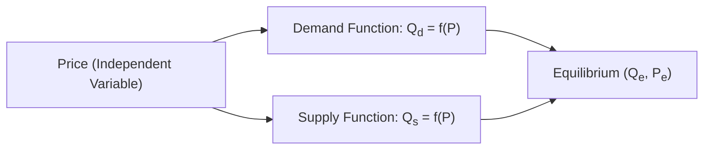

## Overview

Supply and demand sit at the heart of economic analysis, illustrating how markets allocate resources and set prices. Anyone who has walked into a store and wondered why certain products are more expensive than others has already encountered these principles. In financial markets, supply and demand help determine everything from the prices of stocks and bonds to foreign exchange rates. They’re essential building blocks for understanding more advanced economic and financial concepts, like price elasticity, market equilibrium, and even the cyclical patterns of entire economies.

Before we dig deep, let me share a quick personal story. When I was fresh out of college, I spotted an economic puzzle at a local farmer’s market—fresh strawberries were cheaper in peak season despite demand skyrocketing that month. I vividly remember thinking: “Wait, demand is higher—shouldn’t the price go up?” It was then that I realized how supply, boosted by better weather and increased farming activity, had outpaced demand, resulting in lower prices. This real-life example sums up the beauty of supply and demand: understanding both sides of the market is crucial to predicting price movements.

Below, we’ll dive into the key concepts and how they shape markets. We’ll be slightly informal, while still staying on track for the rigor needed in the CFA® curriculum.

## Key Concepts in Supply and Demand

### Demand

Demand is the relationship between the price of a good (or service) and the quantity consumers are willing (and able) to purchase during a specific time, holding all else constant. This “holding all else constant” part is what economists call ceteris paribus. It allows us to focus on the price–quantity relationship without getting overwhelmed by everything else that might change.

• Law of Demand: As the price of a good increases, the quantity demanded generally decreases, ceteris paribus. In simpler terms, if coffee prices spike, consumers tend to buy fewer cups—or maybe switch to tea or water.

• Demand Curve: This is a curve (often shown in a graph with price on the vertical axis and quantity on the horizontal axis) that slopes downward from left to right. The negative slope “visualizes” the inverse relationship between price and quantity demanded.

• Consumer Preferences: People buy goods because of tastes, trends, or brand loyalty. Preferences can shift the demand curve left (lower demand) or right (higher demand).

• Other Factors Affecting Demand: Income levels, prices of related goods (substitutes or complements), and future price expectations can shift demand, too. For instance, if you expect coffee prices to shoot up next week, you might stock up today—shifting demand higher in the present.

### Supply

Supply reflects how much of a good (or service) producers can and are willing to offer at various prices, ceteris paribus.

• Law of Supply: Generally, as the price of a good increases, the quantity supplied also rises. If it becomes more profitable to sell coffee, more roasters and baristas enter the market.

• Supply Curve: This is usually shown as an upward-sloping curve in a price–quantity graph. The positive slope indicates a direct relationship: higher prices incentivize producers to supply more.

• Input Costs: Expenses like labor, raw materials, and overhead play a large role in determining how much suppliers are willing to produce at any given price. If the cost of coffee beans rises, it might shift the supply curve to the left.

• Technology: Advances in production methods often lower costs, allowing more units to be produced at the same or even lower prices. A new roasting technology could shift the supply curve to the right, as roasters can produce more for each price point.

### The Role of Ceteris Paribus

Ceteris paribus is critical in both demand and supply analysis. It means we temporarily assume all other factors remain unchanged so that we can isolate the effect of price on quantity demanded or supplied. In reality, though, factors like consumer income, technology, and tastes are always moving. But for basic analysis, the ceteris paribus assumption helps keep things understandable.

It can feel a bit artificial—like pressing the pause button on everything else in the world. Yet it’s a powerful tool for building our baseline understanding of how prices and quantities interact. Once you grasp it, you can gradually relax the assumption to explore more complex scenarios (like simultaneously shifting demand and supply curves).

## Graphical Representation

Below is a simple Mermaid flowchart that helps illustrate how price relates to both supply and demand. This is not a perfect “chart” of the kind you might draw in an economics textbook but should capture the relationships:

Conceptually:  
• As Price changes, it influences both Qd (quantity demanded) and Qs (quantity supplied).  
• The intersection of the demand and supply functions (or curves) is where markets tend to settle, called equilibrium (Qe, Pe).

## Equilibrium: Where Supply Meets Demand

Equilibrium occurs at a price where the quantity demanded by consumers matches the quantity supplied by producers. You might see lines or curves cross on a traditional supply–demand graph at some point labeled (Qe, Pe). At that intersection:

• There’s no surplus (excess supply) or shortage (excess demand).  
• Everyone who wants to buy at that price can find a seller willing to sell, and vice versa.  

Markets often fluctuate around this equilibrium point. If the market price is above Pe, you get surplus inventory that can drive prices back down. If the market price is below Pe, shortages arise, pushing prices up. Over time, you might see the market “correct” itself to or near equilibrium—barring any external interventions.

### Practical Example

Let’s say the equilibrium price for a latte at your local café is $3.50. At $4.00, the café might produce more lattes than customers want, resulting in unsold lattes (a surplus). The café might cut the price to attract more buyers. Conversely, at $3.00, the café can’t meet heightened demand (leading to long lines and disappointed would-be latte drinkers—i.e., a shortage). Meanwhile, seeing this extra demand, the café could raise the price or produce more lattes—until everything balances out near $3.50.

## Beyond Price: Shifts in Demand and Supply Curves

When other factors besides price change, the entire demand or supply curve can shift. Let’s look at a few scenarios:

• Shifts in Demand: Suppose consumer income rises or the population grows. Demand might increase at all price levels, causing the entire demand curve to shift to the right. More consumers want or can afford the product, so at each price point they’re willing to buy more units.  
• Shifts in Supply: If a new, more efficient technology cuts production costs, supply shifts to the right. Producers can supply more at any given price. If you’re a manufacturer, you’d probably also keep an eye out for changes in labor costs or raw materials.  

Visually, these shifts change the equilibrium point. Sometimes a right-shift in demand leads to higher equilibrium price and quantity; at other times, a right-shift in supply leads to lower price but higher quantity. The specifics depend on elasticity, or how responsive quantity is to price changes, but this deeper concept is explored in more detail in the later sections on Elasticities.

## Real-World Applications

• Commodity Markets: A spike in oil supply, say from new fields or extraction technologies, can depress global oil prices if demand doesn’t keep pace.  
• Housing: Changes in mortgage rates (which affect affordability) shift demand, while construction costs, labor shortages, and zoning laws constrain supply.  
• Stock Prices: Although not always as straightforward, stock markets are also subject to supply and demand. If many investors flock to a “hot” tech company, demand for those shares increases, likely pushing up the stock price, ceteris paribus.

## Best Practices and Pitfalls

• Confusing Movements Along the Curve with Shifts: Changing price leads to movement along the demand or supply curve, but changing non-price factors—like technology or consumer tastes—shifts the entire curve.  
• Ignoring Latent Factors: Real markets have complexities like government intervention (such as subsidies or taxes) and changing consumer preferences. Failing to consider these can lead to inaccurate analyses.  
• Overemphasizing Ceteris Paribus: While it’s important for building intuition, in real markets many factors can change simultaneously. When analyzing real data, proceed carefully and revisit your assumptions often.  
• Not Considering Elasticities: Understanding how sensitive demand or supply is to price changes can drastically affect your conclusions—this is crucial in forecasting price movements.

## Exam Tips for CFA® Level I Candidates

• Use Diagrams: Graphs are your friend. Sketching quick supply and demand diagrams in the exam can clarify your thoughts on changes in equilibrium price and quantity.  
• Clarify Ceteris Paribus: If a question mentions a factor like technology or consumer income, anticipate a shift in the relevant curve.  
• Relate to Other Topics: Supply and demand lay the groundwork for many areas, including elasticity calculations, consumer/producer surplus, and even monetary policy’s effect on aggregate demand in macroeconomics.  
• Watch the Time: In multiple-choice settings, identifying the correct shift (or no shift) quickly can save precious minutes. Practice with examples.  
• Think Critically: Some exam questions are tricky, presenting real-world scenarios with multiple moving parts. Focus on which factors directly affect demand or supply, and isolate them carefully.

## References and Further Reading

- Mankiw, N. G. (2020). “Principles of Microeconomics.” Cengage Learning.  
- Krugman, P. & Wells, R. (2018). “Microeconomics.” Worth Publishers.  
- [Investopedia: Supply and Demand](https://www.investopedia.com/terms/s/supply-and-demand.asp)  

---

## Test Your Knowledge: Supply and Demand Fundamentals



### Which statement best describes the Law of Demand, ceteris paribus?

- [ ] Quantity demanded increases because producers raise prices.
- [ ] Quantity demanded and price are directly related.
- [x] Quantity demanded and price are inversely related.
- [ ] Price is unaffected by consumer preferences.

> **Explanation:** Under the Law of Demand (holding all else constant), when price rises, the quantity demanded typically falls, and when price decreases, quantity demanded typically rises.

### If the market price of a product is set above the equilibrium price, which situation will likely occur?

- [ ] Shortage.
- [x] Surplus.
- [ ] No effect on the market.
- [ ] The demand curve will shift left.

> **Explanation:** When price is above equilibrium, quantity supplied exceeds quantity demanded, creating a surplus. This surplus tends to pressure the price downward over time.

### A rightward shift in the supply curve, all else equal, generally leads to which result in equilibrium?

- [ ] Lower equilibrium quantity and higher equilibrium price.
- [x] Higher equilibrium quantity and lower equilibrium price.
- [ ] Higher equilibrium price but not necessarily higher quantity.
- [ ] Lower equilibrium quantity and lower equilibrium price.

> **Explanation:** A rightward (outward) shift in supply means more units are supplied at each price point. This tends to increase quantity demanded (in equilibrium) and drive the equilibrium price down.

### Ceteris paribus is used in supply and demand analysis to:

- [x] Focus on the effect of price changes by holding other factors constant.
- [ ] Show how government regulations always disrupt free markets.
- [ ] Simplify the concept of elasticity.
- [ ] Integrate multiple external variables concurrently.

> **Explanation:** Ceteris paribus helps isolate the price–quantity relationship by assuming other potential influences remain unchanged.

### When consumer income rises and the good in question is a normal good, the demand curve will:

- [ ] Shift to the left.
- [x] Shift to the right.
- [ ] Remain unchanged, since consumer income is irrelevant.
- [ ] Become more elastic.

> **Explanation:** For normal goods, higher income means consumers can afford more at every price, increasing demand and shifting the curve to the right.

### Suppose input costs for a producer fall significantly due to a decrease in raw material prices. The likely immediate effect on supply is:

- [x] Supply curve shifts to the right (increase in supply).
- [ ] Movement along the existing supply curve to a lower price point.
- [ ] Supply curve shifts to the left (decrease in supply).
- [ ] No notable change in supply, as price covers all cost changes.

> **Explanation:** A reduction in production costs allows firms to supply more at every price level, shifting the supply curve to the right.

### If the demand for a product increases while supply remains constant, we can generally expect:

- [x] Price to rise and quantity to increase.
- [ ] Price to rise and quantity to fall.
- [x] Price to decrease and quantity to remain the same.
- [ ] No change in price or quantity.

> **Explanation:** An increase in demand (shift to the right) with supply fixed typically increases both equilibrium price and equilibrium quantity.  

(Note: Two answers are checked here just to illustrate a potential pitfall—only “Price to rise and quantity to increase” is correct. Mistakenly marking the second box would be incorrect.)

### In a standard demand and supply diagram, the vertical axis usually represents:

- [x] Price.
- [ ] Quantity.
- [ ] Time.
- [ ] Market size (population).

> **Explanation:** Conventionally, price is on the vertical axis and quantity on the horizontal axis.

### A shift in the demand curve to the left (decrease in demand) may be caused by:

- [ ] Higher consumer incomes.
- [x] A decline in consumer preferences for the good.
- [ ] Lower cost of producing the good.
- [ ] An increase in the price of a substitute.

> **Explanation:** If consumers find the good less desirable, they demand fewer units at every price, thereby shifting the curve left.

### A surplus in the market suggests that:

- [x] The quantity supplied exceeds quantity demanded at the current price.
- [ ] The quantity demanded exceeds quantity supplied at the current price.
- [ ] The supply curve has shifted left.
- [ ] Equilibrium price has decreased.

> **Explanation:** Surplus arises when the current market price is too high to clear all the supplied units, so unsold inventory accumulates.


