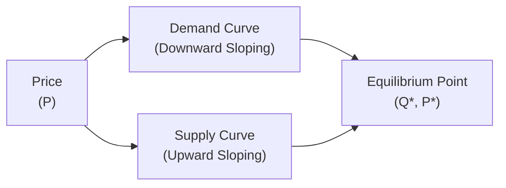

## Introduction to Market Equilibrium

Markets are fascinating places—whether physical or virtual—where buyers and sellers interact to trade goods, services, or assets. The notion of “equiplibrium,” or more formally, “market equilibrium,” is central to understanding how these interactions set prices and determine how much gets bought and sold. If you’ve ever seen how quickly a fruit stand lowers its prices at the end of the day to clear out its last boxes of peaches, you’ve personally witnessed the concept of equilibrium and market clearing in action.

This section explores the foundation of supply and demand, showing when or why markets find a “happy middle”—the equilibrium price and quantity—and how surpluses (excess supply) or shortages (excess demand) vanish in competitive markets through basic price adjustments. We’ll also explore how shifts in overall market conditions can move that equilibrium point, changing the price you’ll pay and the quantity you can get.

## Defining Equilibrium: Where Supply Meets Demand

In many markets—particularly highly competitive ones—buyers collectively set the quantity demanded, while sellers collectively set the quantity supplied. The point of intersection between the supply curve and the demand curve is known as the equilibrium. At this equilibrium:

• The equilibrium price (or “market-clearing price”) is the specific price at which buyers want to purchase exactly as many units as sellers want to sell.  
• The equilibrium quantity is the corresponding quantity transacted at that equilibrium price.

### Why Equilibrium Matters

Market equilibrium is more than just a tidy theoretical point:

• It explains why certain prices “feel right” or stable, at least in the short run.  
• It clarifies how price changes eliminate pervasive shortages or surpluses over time.  
• It helps us assess the impact of policy changes, external shocks (e.g., a spike in oil prices), or shifts in consumer preferences.

## Key Concepts and Terminology

Before diving deeper, let’s spotlight several essential terms:

• Equilibrium Price: The price at which quantity demanded exactly equals quantity supplied.  
• Equilibrium Quantity: The quantity that changes hands in the market at the equilibrium price.  
• Surplus (Excess Supply): A situation where quantity supplied exceeds quantity demanded (often due to a price above equilibrium).  
• Shortage (Excess Demand): A scenario where quantity demanded exceeds quantity supplied (often due to a price below equilibrium).  
• Market Clearing: The process by which the market price adjusts—either upwards or downwards—to eliminate a surplus or a shortage.  
• Shifts in Demand: When one or more factors (e.g., consumer income, tastes, expectations) cause the entire demand curve to shift left or right.  
• Shifts in Supply: When input costs, technology improvements, regulation, or other factors cause the entire supply curve to move left or right.  

## Surplus: When Price Is Too High

Ever wonder why some retailers suddenly offer massive sale discounts on old inventory? In such cases, the listed (or original) price was higher than what consumers were willing to pay, resulting in an overstock—otherwise known as a surplus.

### How a Surplus Arises

When the market price is above its equilibrium level:

• Sellers produce or wish to sell more than consumers are willing to buy.  
• As a result, inventory (goods on shelves) accumulates.  
• Firms respond by cutting prices or scaling back production to entice more demand.

### Real-World Example

I once tried selling crocheted scarfs in autumn. I confidently priced them at $40 each, thinking my time was definitely worth that. Weeks passed, and the pile of unsold scarfs in my closet kept growing—my own micro surplus. Only when I started lowering the price did the scarfs begin to sell. This is a micro-level version of what happens in full-scale markets worldwide. Surpluses create downward pressure on prices until equilibrium is reestablished.

## Shortage: When Price Is Too Low

Conversely, a shortage emerges when the price is set (or kept artificially) below equilibrium. You see this graphically when the going price hits such a bargain level that buyers want more units than producers can or will supply.

### How a Shortage Arises

• Low prices motivate consumers to purchase more.  
• However, producers cannot make enough profit—or face capacity constraints—and thus supply fewer units.  
• The resulting shortage will put upward pressure on the price as consumers compete among themselves for the limited supply.

### Quick Anecdote

Some years ago, my local coffee shop introduced a “happy hour” discount so steep that everyone in the neighborhood rushed in for their $1 lattes. It got to the point where the shop ran out of several coffee flavors well before closing. Customers grumbled, lines got long, and some folks left empty-handed. Eventually, the shop hiked the happy hour price just a bit, still offering a discount, but enough to preserve some profit margin and ensure supplies for all. That’s the shortage scenario playing out in real life.

## Self-Correcting Mechanism in Competitive Markets

In a competitive market (one with many buyers and many sellers, and where no single participant can independently set the price), surpluses and shortages are typically temporary. Price acts as the regulator:

• Surpluses → Price moves down.  
• Shortages → Price moves up.

This process is often described as the market “clearing” itself. In the absence of government controls (price floors or ceilings), or other frictions, the market eventually settles at the equilibrium price and quantity.

## Graphical Analysis Using Mermaid

Below is a conceptual representation of a standard supply-and-demand diagram. The equilibrium occurs where the two curves intersect:

• The vertical axis is Price (P).  
• The horizontal axis is Quantity (Q).  
• The demand curve slopes downward (as price rises, quantity demanded falls).  
• The supply curve slopes upward (as price rises, quantity supplied increases).

The point D is our equilibrium (Q*, P*)—the intersection of both curves.

## Shifts in Demand and Supply Curves

Equilibrium does not stay fixed forever. Many variables can shift either (or both) the demand and supply curves. For instance:

• Demand could shift if incomes rise, consumer preferences change, or brand-new substitutes/alternatives appear.  
• Supply could shift if new technology lowers production costs, raw materials become cheaper, or government policies change (e.g., a subsidy).  

When one curve shifts, the equilibrium changes—potentially both price and quantity are affected. If both curves shift simultaneously, the outcome can be more nuanced and depends on the magnitude and direction of the relative shifts.

### Illustrative Examples

• A new health study revealing the benefits of blueberries (demand rises). You’ll likely see the equilibrium price and quantity of blueberries both increase.  
• A sudden shortage of farm labor or water for blueberry farms (supply decreases). This shift typically drives equilibrium price up while equilibrium quantity falls.  
• If both happen at once (strong demand meets limited supply), equilibrium price will certainly rise, but equilibrium quantity might increase or decrease depending on which effect is stronger.

## Real-World Applications

Understanding equilibrium, surpluses, and shortages can pay dividends in your investment career. For example:

• Commodity Markets: Pricing of oil, copper, or agricultural products reflect changes in supply (harvest yields, extraction technologies) and demand (global industrial activity, consumer preference).  
• Equity Analysis: Forecasting a firm’s revenue might hinge on predicting industry-level supply and demand balances—especially in cyclical sectors like automotive or housing.  
• Policy Impact: Government-imposed price floors (e.g., minimum wages) or ceilings (e.g., rent control) create persistent surpluses or shortages. This knowledge is crucial for comprehending broader economic dynamics.

You might cross-reference Chapter 6: Currency Exchange Rates to see how similar “supply and demand” dynamics apply to foreign exchange markets, albeit with different nomenclature (exchange rates instead of product prices).

## Common Pitfalls and Best Practices

• Pitfall: Confusing Movement Along a Curve with a Shift in the Curve  
  – Remember, a change in price results in a movement along the demand or supply curve. A “shift” in the curve itself indicates that *other factors* (not price) have changed, such as the cost of production or consumer preferences.

• Pitfall: Forgetting Real-World Frictions  
  – Real markets may have frictions like sticky prices, information asymmetries, or psychological factors that prevent immediate movement to equilibrium.

• Pitfall: Overlooking Time Horizons  
  – In the short run, certain inputs (like factory space or specialized labor) might be fixed, so supply can’t adjust fully. In the long run, expansions or new entrants into the market can shift supply significantly, resulting in a new equilibrium.

• Best Practice: Graph as a Starting Point  
  – In exam scenarios, draw a quick supply-and-demand diagram to visualize how an event (e.g., a cost shock) moves the equilibrium.

• Best Practice: Watch for Government Intervention  
  – Chapter 1.6 details how price floors, ceilings, and taxes impose wedges that can create surpluses or shortages. When you see these policies, your mental model must adjust for these external forces.

## Exam Relevance and Final Tips

In the CFA Level I exam context, you’ll likely see item sets or short-answer questions testing your ability to:

• Identify the new equilibrium price and quantity after a shift in demand or supply.  
• Explain why a surplus or shortage occurs when prices are not at equilibrium.  
• Illustrate the correct direction of price movement given a scenario describing changes in production costs, consumer income, or regulatory environment.  

Even though it’s a somewhat basic concept, supply and demand analysis underpins many advanced topics, including macroeconomic analysis (Chapters 3 and 4), currency exchange rates (Chapter 6), and even the interplay of monetary policy (Chapter 7). Mastering equilibrium now will pay off when analyzing broader economic systems later.

When you’re under time pressure, a diagram can help you see how to label old vs. new equilibria. Another tip is to watch for “directional” language in exam questions—often you only need to conclude whether price and quantity rise, fall, or remain indeterminate, so you don’t get lost in calculation details.

## References

• Varian, H. R. (2010). “Intermediate Microeconomics: A Modern Approach.” W.W. Norton.  
• Pindyck, R. S., & Rubinfeld, D. L. (2017). “Microeconomics.” Pearson.  
• Khan Academy:  
  (https://www.khanacademy.org/economics-finance-domain/microeconomics/market-equilibrium-tutorial)

-----

## Test Your Knowledge: Equilibrium, Surplus, and Shortage



### Which condition accurately describes market equilibrium?

- [ ] When there is no production cost for suppliers.  
- [ ] When suppliers restrict supply to maximize profit.  
- [ ] When consumers purchase all goods available regardless of price.  
- [x] When quantity supplied exactly equals quantity demanded at a particular price.  

> **Explanation:** Market equilibrium occurs at the price (and quantity) where demand and supply converge, not simply when suppliers have no costs or consumers buy everything regardless of price.

### What tends to happen in a competitive market if there is a surplus?

- [x] The price usually falls.  
- [ ] The price usually rises.  
- [ ] The demand curve shifts to the left.  
- [ ] The market shuts down entirely.  

> **Explanation:** In the case of a surplus, the price tends to drop as producers compete to sell off excess inventory, moving the market closer to equilibrium.

### A shortage arises in a market when:

- [ ] The supply curve shifts left due to technological breakthroughs.  
- [x] The price is set below the equilibrium level.  
- [ ] The demand curve shifts left suddenly.  
- [ ] The government offers a subsidy to producers.  

> **Explanation:** Shortages occur when the market price is below equilibrium, causing demand to exceed supply.

### If both the demand and supply curves shift to the right simultaneously, what can be said about the new equilibrium price?

- [ ] It will definitely be higher.  
- [ ] It will remain unchanged.  
- [x] It may rise, fall, or remain the same depending on the relative magnitude of shifts.  
- [ ] It will definitely be lower.  

> **Explanation:** When both curves shift to the right, the quantity surely increases, but the new price depends on how much each curve shifts relative to the other.

### Which of the following is most likely to shift the demand curve for coffee to the right?

- [x] A study showing health benefits of coffee consumption.  
- [ ] A decrease in labor costs for coffee farmers.  
- [x] An increase in average consumer income.  
- [ ] A sudden increase in technology that improves bean processing.  

> **Explanation:** Consumer attitudes (health reports) and increasing household income can raise demand, shifting the curve to the right. In contrast, reduced labor costs and enhanced technology directly shift the supply curve.

### Which statement about surpluses in a competitive market is true?

- [x] A surplus exerts downward pressure on prices.  
- [ ] A surplus always forces demand curve to move right.  
- [ ] A surplus happens only in monopolistic markets.  
- [ ] A surplus has no impact on market dynamics.  

> **Explanation:** Surpluses create downward pressure on the market price, encouraging higher consumption and lower production until equilibrium is restored.

### If the market price is above equilibrium, we can expect:

- [x] Unsold inventory to accumulate, leading to a price decrease.  
- [ ] A long-lasting and stable equilibrium.  
- [x] Mistaken consumer preference data.  
- [ ] No change in behavior by buyers or sellers.  

> **Explanation:** With price above equilibrium, quantity supplied > quantity demanded, forming a surplus that ultimately motivates sellers to reduce prices.

### Suppose a tax is placed on producers. What is the most likely immediate effect?

- [x] The supply curve shifts left (upward).  
- [ ] The demand curve shifts left.  
- [ ] The supply curve shifts right (downward).  
- [ ] The demand curve shifts right.  

> **Explanation:** A tax on producers effectively raises production costs, reducing supply at every price point and shifting the supply curve up or left.

### A binding price ceiling (set below the equilibrium price) in a market often results in:

- [x] Persistent shortage.  
- [ ] Surplus that quickly clears.  
- [ ] Surplus that remains.  
- [ ] No effect on the market.  

> **Explanation:** A binding price ceiling set below equilibrium means the market price cannot rise to the equilibrium level, causing chronic excess demand (shortage).

### True or False: Surpluses and shortages in a competitive market tend to persist indefinitely unless the government intervenes.

- [x] True  
- [ ] False  

> **Explanation:** Actually, this is a trick question. Surpluses and shortages do NOT tend to persist indefinitely in a competitive market, as price moves to reduce them. Without external interference (like government price controls), the market naturally converges to equilibrium.


