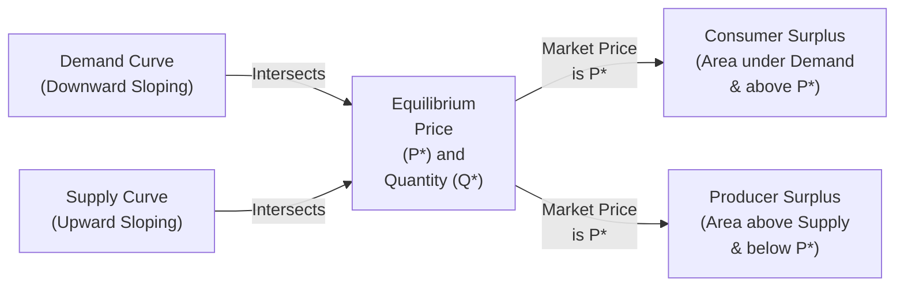

## Overview

If you've ever heard someone brag about scoring a sweet deal—like snapping up a designer coat at half price in a clearance sale—they're unknowingly talking about something close to consumer surplus. That feeling when you pay less than you expected? Yep, that is consumer surplus in everyday language. And on the flip side, if you’re a business owner who sold a product at a price that’s higher than your bare-minimum “get-it-off-my-hands” threshold, you’re enjoying producer surplus.

In the context of financial analysis, consumer surplus (CS) and producer surplus (PS) are crucial for understanding market efficiency and resource allocation. They represent the benefits that consumers and producers respectively gain from market transactions. Collectively, these surpluses form what we call total surplus, a measure of the overall welfare in a market. For CFA exam candidates—especially those delving deeper into the principles of microeconomics—this concept provides an essential lens for evaluating taxes, subsidies, tariffs, and a wide variety of policy interventions. 

In this section, we’ll clarify the definitions, dissect how surpluses arise in a well-functioning market, and explore how changes in price or quantity (caused by shifts in supply or demand) can alter these surpluses. You’ll also see how policy measures such as price floors, price ceilings, or taxes might affect the overall economic welfare.

## Defining Consumer Surplus

Consumer surplus is the difference between what a consumer is willing to pay (the maximum amount, or “reservation price”) and what the consumer actually pays. Think of CS as the “extra happiness” consumers get from taking part in a market exchange.

- Willingness to Pay (WTP): This is the hypothetical highest price a consumer would be okay to pay for a product or service. It can vary across consumers, depending on their preferences, income, and alternative choices.
- Market Price (P): This is the actual price settled in the market, determined by overall market supply and demand (see also Section 1.2 on equilibrium).

Mathematically, for a single unit:
    
Consumer Surplus (CS) = (Willingness to Pay) – (Market Price)

In a more continuous setting (imagine a large number of infinitesimally small units sold up to quantity Q), CS is the area under the demand curve and above the equilibrium price line, from quantity 0 to Q.

So if a shopper would pay up to $40 for a product, but the market price is just $25, the consumer surplus on that unit is $15.

## Defining Producer Surplus

Producer surplus is the difference between the price a producer receives in the market and the minimum amount they’d be willing to accept (often called the reservation price or marginal cost of production). This concept measures the net benefits to producers from participating in the market.

- Willingness to Accept (WTA) / Reservation Price: The lowest price at which a producer is willing to produce and sell one additional unit.
- Market Price (P): The actual transaction price achieved in the marketplace.

Mathematically, for a single unit:
    
Producer Surplus (PS) = (Market Price) – (Minimum Acceptable Price or Marginal Cost)

On a supply-demand graph, the supply curve often represents marginal cost. Producer surplus is thus the area above the supply curve and below the equilibrium price, from quantity 0 to Q.

## Graphical Representation and Key Insights

It helps to remember that the demand curve typically slopes downward, reflecting diminishing marginal utility from each additional unit of the good. Meanwhile, the supply curve generally slopes upward, representing increasing marginal costs of production for each additional unit. The point where these two curves intersect is the market equilibrium, determining both the equilibrium price (P*) and equilibrium quantity (Q*).

Below is a simplified Mermaid flow diagram (rather than a coordinate axis plot) illustrating conceptually how demand and supply overlap at equilibrium and how consumer and producer surpluses fit into the picture:

• Consumer Surplus (CS): Graphically, this is the area below the demand curve but above the market price, from 0 to Q*.  
• Producer Surplus (PS): Graphically, this is the area above the supply curve but below the market price, from 0 to Q*.  

The sum of these two areas is known as total surplus (TS), a key measure of overall economic welfare in a market without external intervention.

## Interplay with Total Economic Welfare

Total Surplus (TS) = Consumer Surplus (CS) + Producer Surplus (PS).

When the market is perfectly competitive and there are no externalities or distortions, total surplus is maximized at the equilibrium. One of the most critical conclusions in basic microeconomics is that markets, under ideal conditions, allocate resources efficiently, meaning the total surplus is as large as it can be.

## Changes in Surplus Due to Shifts in Supply or Demand

Markets are not static. Demand and supply curves can shift for any number of reasons—consumer preferences, technological innovations, resource cost changes, or external factors like environmental regulations. Any shift in either supply or demand will lead to a new equilibrium price and quantity (see also Section 1.7 on demand and supply shifters).

When these shifts happen, the areas representing consumer and producer surplus will change. A shift in supply that lowers production costs (moving the supply curve downward or to the right) generally increases producer surplus if it leads to higher equilibrium quantity and potentially lower price, but it can also increase consumer surplus because consumers now pay a lower price. The specific effect on each surplus type depends on the relative elasticities of supply and demand, which is closely tied to concepts explored in Section 1.5 on elasticities.

## Policy Interventions and Their Effects on Surplus

Public policies like price floors, price ceilings, taxes, and subsidies (discussed in Section 1.6) can significantly affect consumer and producer surplus. While these tools may be designed to achieve social or political objectives, they can create inefficiencies or deadweight losses (See also Section 1.4 on market efficiency and deadweight loss).

• Price Ceiling (e.g., rent control): This sets a maximum legal price below equilibrium, often increasing consumer surplus for those who can still get the product at the lower price, but creating shortages and reducing producer surplus (and total surplus) overall.  
• Price Floor (e.g., minimum wage): This sets a minimum legal price above equilibrium, helping producers (or employees) who can still sell (or work) at the higher price, while reducing consumer surplus and possibly leaving some producers with unsold goods, leading to surpluses of unwanted inventory or unemployment in labor markets.  
• Taxes: A per-unit tax on suppliers usually shifts the supply curve upward by the amount of the tax, causing producers and consumers to share the tax burden. Consumer surplus decreases because of higher prices, and producer surplus falls due to lower net revenue. A portion of the total surplus is effectively transferred to the government (as tax revenue), but because quantity traded usually declines, a drop in total surplus creates a deadweight loss (inefficiency).  
• Subsidies: A per-unit subsidy shifts the supply curve downward (or the demand curve upward, depending on which side of the market is subsidized). It can raise both consumer surplus and producer surplus but typically costs the government money and may create inefficiencies if it encourages overproduction.

## Practical Numeric Example

Let’s illustrate consumer and producer surplus with a simple linear example:

• Demand: P = 100 – 2Q  
• Supply: P = 20 + 3Q  

To find the equilibrium:  
1) Set demand equal to supply  
   100 – 2Q = 20 + 3Q  
   80 = 5Q  
   Q* = 16  

2) Plug Q* back in to find P*:  
   P* = 100 – 2(16) = 68  
   or confirm with the supply function: P* = 20 + 3(16) = 68  

Hence, equilibrium price P* = 68, and equilibrium quantity Q* = 16.

• Consumer Surplus (CS)  
  The demand curve intersects the price axis at P = 100 (when Q=0).  
  For a straight-line demand curve,  
  CS = ½ × (Base) × (Height).  
  Base = Q* = 16.  
  Height = difference between intercept (100) and equilibrium price (68) = 32.  
  So, CS = ½ × 16 × 32 = 256.  

• Producer Surplus (PS)  
  The supply curve intersects the price axis at P = 20 (when Q=0).  
  PS = ½ × (Base) × (Height).  
  Base = Q* = 16.  
  Height = difference between equilibrium price (68) and intercept (20) = 48.  
  So, PS = ½ × 16 × 48 = 384.  

Total Surplus (TS) = CS + PS = 256 + 384 = 640.

Notice that each side of the market benefits from the transaction—consumers pay less than their maximum willingness to pay, and producers receive more than their minimum acceptable price. Under normal competitive market assumptions, this is where net economic welfare is maximized.

## Best Practices and Common Pitfalls

• Overlooking Elasticity: In the exam context, remember that elasticities (see Section 1.5) significantly affect how shifts in supply or demand impact consumer and producer surplus. A more elastic demand curve might limit the producers’ ability to pass on higher costs (like taxes) to consumers.  
• Neglecting Partial Equilibrium Analysis: Sometimes candidates focus too heavily on one side (consumer or producer) without fully considering the interplay between the two.  
• Confusing Surplus with Profit: Producer surplus is not the same as accounting profit. Producer surplus is above marginal cost but may not account for fixed costs or overhead.  
• Misidentifying Surplus Changes: When reviewing taxes or subsidies, ensure you accurately track the new price that consumers pay, the net price that producers receive, and the wedge between them.  

## Importance for CFA® Exam Preparedness

Consumer and producer surplus play a fundamental role in:  
• Evaluating the welfare effects of regulation or government interventions (Chapter 1.6).  
• Understanding the economic rationale behind free markets, price controls, and trade policies (Chapters 5, 9).  
• Executing cost-benefit analyses in capital market expectations (see Chapter 10).  

At the Level I stage, you’ll be expected to be comfortable with identifying and calculating these surpluses in standard supply-and-demand diagrams. This skill set often extends to advanced scenarios in Levels II and III, where taxes, externalities, or trade restrictions come into play—particularly in discussion-based or item set questions analyzing macro and microeconomic policies.

## Final Thoughts and Exam Tips

In real life, it’s rarely as neat as a simple linear demand and supply function. Markets have complexities, externalities, and strategic behaviors, but consumer and producer surplus remain core tools. As you prepare for the CFA exams, keep these pointers in mind:

• Sketch Diagrams: When in doubt, draw a quick supply-demand graph. Visually identifying surpluses helps prevent confusion.  
• Identify Key Puzzle Pieces: In a problem involving government intervention, parse out which portion of total surplus changes, how it transfers, and whether a deadweight loss appears.  
• Watch for Edge Cases: Price floors well above equilibrium can produce a big surplus of unsold goods, whereas price ceilings far below equilibrium can cause severe shortages.  
• Time Management: If the exam question is heavy on numeric data, do the equilibrium calculation promptly and carefully. Then identify areas of consumer surplus and producer surplus systematically.  

You’ve now got a solid grasp of consumer and producer surplus—tools that, once you get used to them, feel almost intuitive for analyzing market outcomes.  

## References

- Nicholson, W., & Snyder, C. (2016). Microeconomic Theory: Basic Principles and Extensions. Cengage.  
- Cowen, T., & Tabarrok, A. (2015). Modern Principles of Economics. Worth.  
- Investopedia:  
  [Consumer Surplus](https://www.investopedia.com/terms/c/consumer_surplus.asp) and  
  [Producer Surplus](https://www.investopedia.com/terms/p/producer_surplus.asp)  

---

## Test Your Knowledge: Consumer and Producer Surplus in Market Analysis



### Which statement best describes consumer surplus (CS)?

- [x] It is the net benefit consumers receive when they pay less than their maximum willingness to pay.
- [ ] It measures how much a producer earns above total variable cost.
- [ ] It is the area below the supply curve from 0 to Q*.
- [ ] It equals the difference between total revenue and total cost.

> **Explanation:** Consumer surplus is the difference between the maximum amount a consumer is willing to pay and what they actually pay, represented graphically by the area below the demand curve and above the price.

### Which of the following would likely increase both consumer surplus and producer surplus in a market?

- [ ] A price ceiling set below equilibrium price.
- [ ] A per-unit tax on the good.
- [x] A technological improvement that lowers production costs.
- [ ] An increase in the minimum wage.

> **Explanation:** Technological progress shifts the supply curve outward (downward), generally lowering the market price and increasing equilibrium quantity, thus boosting both consumer and producer surplus (assuming demand is not perfectly elastic or perfectly inelastic).

### If a price floor is set above the market equilibrium price, what is the most likely effect?

- [x] Excess supply (a surplus) of the good.
- [ ] Permanent scarcity in the market.
- [ ] Consumer surplus will always increase.
- [ ] No producers will abide by the new price.

> **Explanation:** A price floor above equilibrium discourages consumer purchases and encourages suppliers to produce more than the market can absorb, leading to a surplus of goods (excess supply).

### In a competitive market, producer surplus is best described as:

- [ ] The difference between total revenue and total fixed cost.
- [x] The difference between market price and marginal cost (reservation price).
- [ ] Payment received for all units produced, regardless of cost.
- [ ] The area between the demand curve and supply curve.

> **Explanation:** Producer surplus is the difference between the price the producer sells the good for (market price) and the marginal cost they incur to produce each unit, summed over all units sold.

### A linear demand function can be written as P = a – bQ, and a linear supply function can be written as P = c + dQ. Which of the following formulas correctly calculates consumer surplus (CS) for these linear curves at equilibrium (Q*)?

- [x] CS = ½ × Q* × (a – P*).
- [ ] CS = ½ × Q* × (P* – c).
- [x] CS = ½ × Q* × (a – P*) + ½ × Q* × (P* – c).
- [ ] CS = (P* × Q*) – Total Cost.

> **Explanation:** For a linear demand curve, consumer surplus is ½ × base × height, basically ½ × Q* × (the difference between the demand curve’s intercept a and the market price P*). Note: The question might have a nuance (the second half of the line might be referencing total surplus). But the textbook formula for consumer surplus alone is ½ × Q* × (a – P*).

### Suppose the government places a per-unit tax on producers. Which of the following statements is correct regarding the burden of the tax?

- [x] Both producers and consumers typically share the tax burden, depending on the relative elasticity of demand and supply.
- [ ] Consumers always bear the entire tax burden, regardless of elasticity.
- [ ] Producers always bear the entire burden if the market is in equilibrium.
- [ ] Neither side incurs any deadweight loss with a per-unit tax.

> **Explanation:** The incidence of a tax is shared between consumers and producers, proportional to their price elasticities of supply and demand. This typically results in a higher price for consumers and a lower net price for producers.

### How is producer surplus affected if a firm experiences a reduction in marginal costs?

- [ ] It shifts the demand curve to the left.
- [x] Producer surplus increases because producers can supply at a lower cost but still receive roughly the same market price until equilibrium adjusts.
- [ ] It has no effect on producer surplus unless total fixed costs also drop.
- [ ] Producer surplus decreases because the firm must lower its price.

> **Explanation:** A lower marginal cost means producers keep a greater difference between market price and what it costs them to produce each unit, thus raising producer surplus.

### After a negative supply shock (e.g., a sudden increase in raw material costs), which of the following statements is most likely to be true?

- [x] The supply curve shifts upward (or left), causing market price to rise and quantity to fall, reducing consumer surplus.
- [ ] The demand curve becomes flatter.
- [ ] Producer surplus always rises because they receive a higher price.
- [ ] The market returns to the old equilibrium immediately without welfare loss.

> **Explanation:** A negative supply shock shifts supply upward or left. Market price generally increases, quantity declines, and consumer surplus decreases because of the higher price and reduced consumption. Producer surplus can rise or fall depending on how the cost shock compares to the resulting price increase.

### Which of the following best describes the total surplus in a market?

- [x] The sum of consumer surplus and producer surplus.
- [ ] The sum of all firms’ profits plus government revenue.
- [ ] The difference between the demand and supply intercepts at Q=0.
- [ ] The maximum willingness to pay minus the minimum willingness to accept for one unit.

> **Explanation:** Total surplus (also called social surplus) is the sum of consumer surplus and producer surplus, representing the net benefits that both parties derive from market transactions.

### True or False: Consumer surplus is always maximized at a price of zero.

- [x] True
- [ ] False

> **Explanation:** If the price is zero, consumers pay nothing and therefore capture maximum possible benefits—though, in practical markets, a price of zero is generally unsustainable and leads to other distortions. Nonetheless, theoretically, consumer surplus is maximal at a price of zero.


