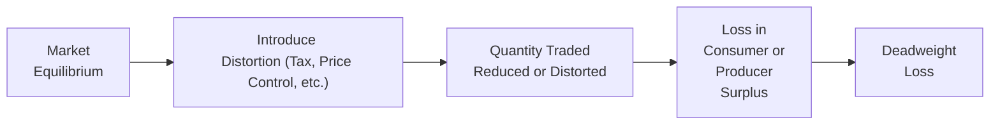

## Overview

In this section, we’re going to explore one of the most fundamental ideas in microeconomics—namely, how markets can achieve efficiency in allocating scarce resources, and what happens when that efficiency is lost. Often, we talk about markets as though they magically move toward an ideal equilibrium; however, real-world forces such as taxes, subsidies, and regulation inevitably shift that equilibrium or prevent it from forming entirely. These market distortions can lead to something we call “deadweight loss” (DWL). And let me tell you, I've watched many bright-eyed students cringe (yours truly included!) the first time they see that dreaded triangle on a supply-and-demand diagram. But rest assured—once you understand the basic logic, it’ll stick with you.

In the CFA® curriculum, especially as you head toward advanced levels, mastery of the relationship between total surplus, consumer surplus, producer surplus, and deadweight loss is a big deal. Understanding these concepts helps you interpret policy impacts, analyze market scenarios, and even incorporate adjustments for potential inefficiencies in your investment and portfolio modeling. 

Below, we’ll break down the definitions, delve into the sources of distortions, and illustrate how different market interventions cause deadweight loss. We’ll also link the notion of market efficiency to the broader theme of welfare economics—this is the lens economists use to determine how well (or poorly) resources are being allocated across society.

## Defining Efficiency and Surplus

### Economic Efficiency
Economic efficiency occurs when the total surplus—made up of consumer surplus plus producer surplus—is maxed out. Another way of saying this is that the goods are produced by the lowest-cost producers and are consumed by the people who place the highest value on them. In more formal economic speak, a market outcome is “Pareto efficient” if no one can be made better off without making someone else worse off.

• Consumer Surplus is the difference between what consumers are willing and able to pay (their maximum willingness to pay) and what they actually pay in the market.  
• Producer Surplus is the difference between the price producers actually receive and the price at which they are willing to supply the good or service.  

When a perfectly competitive market—with no externalities and no distortions—is in equilibrium, the price and quantity reflect a scenario where marginal benefit equals marginal cost. That’s like the sweet spot for society, from a purely allocative efficiency perspective.

### Total Surplus and Its Components

To visualize how total surplus works, let’s take a classic supply-and-demand diagram. At the equilibrium:

• The market price pe equals the marginal cost of production for the last unit sold.  
• The quantity qe is where supply meets demand.  
• Consumer surplus is the area under the demand curve and above the price, from zero to qe.  
• Producer surplus is the area above the supply curve and below the price, from zero to qe.  

In an unregulated competitive market, consumer and producer surplus basically “fill up” the entire rectangle and triangle shaped areas around that equilibrium price. No one else could squeeze out a better deal without leaving someone else worse off.  

Consider how other aspects from earlier sections in Chapter 1—like supply curve shifts (Section 1.7) or differences in elasticity (Section 1.5)—tie into this discussion. Elasticities influence how easily producers and consumers respond to price changes, hence affecting the shape of those surplus areas.  

## Market Efficiency in Action

### Getting to Pareto Efficiency

Let’s say you have a market for something mundane, like notepads. Manufacturers produce them at various costs, consumers buy them at different willingness-to-pay values, and a market price develops. At the equilibrium quantity, the only people who purchase are the ones whose willingness to pay is at least the market price. Producers who sell are those whose production costs are at or below that market price. 

Remarkably, this arrangement ensures there are no “unexploited trades”—a trade from which seller and buyer both could benefit but did not happen. If a potential buyer is unwilling to pay the price that covers at least the marginal cost, that trade wouldn’t create a net benefit for society. If a potential seller’s cost is above the equilibrium price, they wouldn’t supply anyway.

### Why It Matters

In portfolio management, you might think: “Okay, so how does that help me pick stocks?” Well, if you believe a market (like a stock market) is informationally efficient and free from major structural frictions, then under standard theories, one can’t systematically beat that market by finding mispriced assets. But real-world markets have frictions, taxes, transaction costs, etc. Studying these distortions at a micro-level (like supply and demand analysis) fosters a deeper intuition about whether a market’s equilibrium is truly near a welfare-maximizing point—or if certain structural constraints inject inefficiencies.

## What Is Deadweight Loss?

### Definition

Deadweight loss (DWL) is the portion of total surplus lost due to any sort of market distortion or intervention that prevents the market from reaching the competitive equilibrium. If you were to draw a supply-and-demand chart and impose something like a tax, you’d see the equilibrium quantity shrink. The triangular area representing the transactions that no longer happen because of the tax is your DWL.

Formally, if QE is the efficient quantity and QD is the quantity traded after a distortion, and if MB and MC are the marginal benefit and marginal cost of those forgone transactions, the DWL can be conceptualized as the net area under the demand curve and above the supply curve between QD and QE.

### Why It Occurs

DWL arises because market agents are either forced out of transactions that would’ve been beneficial or lured into transactions that are not beneficial. Taxes, subsidies, and price controls are common culprits, but externalities, information asymmetries, and negative supply shocks can create similar effects.

In welfare economics, we often reference how these policy tools might be used to correct an externality (e.g., a carbon tax to limit emissions). When an external cost (pollution, for example) is not accounted for, a tax might actually reduce the overall deadweight loss to society even though it creates a private DWL in the narrower sense of the market for that good. It can get a bit tangled, so keep track of the difference between “market distortion” and “correcting an externality.” In the latter, the “distortion” might actually be helpful from a broad-scope or social welfare standpoint.

## Visualizing Deadweight Loss

Below is a simple flow diagram in Mermaid.js showing how a market moves from equilibrium to a distorted outcome that generates DWL:



When this shift from equilibrium happens, fewer (or sometimes more) units get traded. The transactions that could’ve created net benefits aren’t occurring. That missed opportunity is the heart of DWL.

## Common Sources of Deadweight Loss

### 1. Taxes

When a tax is placed on a good, the supply curve (as seen by consumers) is effectively shifted upward, or equivalently, the demand curve (as seen by producers) is shifted downward. The result is a lower equilibrium quantity traded. Yes, the government collects tax revenue, but both consumers and producers lose some surplus in the process. Part of that loss is offset by the tax revenue, but the portion that neither the producers, consumers, nor government gets is the deadweight loss.

Numerically, a stiffer tax usually creates a greater wedge between buyer and seller, thus leading to a bigger potential DWL. However, the size of that DWL is also driven by the elasticities of supply and demand. For instance, if demand is highly inelastic, the quantity traded might not drop much, so the DWL can be relatively small.

### 2. Subsidies

Subsidies push the price that producers receive above the free-market equilibrium, potentially boosting production beyond the efficient level. While a targeted subsidy could help foster a young industry or encourage beneficial innovation, it can also generate DWL because socially suboptimal transactions occur at artificially high production levels.

### 3. Price Floors and Ceilings

Price controls keep prices above or below equilibrium:

• A Price Floor (e.g., a minimum wage) can lead to a surplus of labor (i.e., unemployment if the wage is above equilibrium). You then lose transactions that would have occurred between lower-wage workers and employers who’d have hired them at a wage lower than the floor, meaning society misses out on some beneficial trades.  
• A Price Ceiling (e.g., rent control) can create shortages. Some potential tenants are unable to find apartments because landlords won’t supply enough units at the artificially low rent. 

In both cases, the transactions that don’t happen or happen at the “wrong” price lead to a deadweight loss triangle.

### 4. Externalities and Other Market Failures

This chapter mostly focuses on the direct concept of DWL from interventions, but we shouldn’t forget externalities or imperfect information scenarios (as discussed in Sections 1.8 and 1.9). If a market fails to capture the social cost or benefit of a product, either too much or too little gets produced, and that mismatch can generate deadweight loss as well. Policies designed to correct externalities—like taxes on pollution—may reduce a pre-existing DWL in a broader sense, even though they appear like a distortion in the narrower sense of the immediate market.

## The Role of Elasticities in DWL

A key factor in the size of the deadweight loss is how responsive consumers and producers are to price changes. This responsiveness is measured by elasticities.

• If demand or supply is very inelastic, the quantity traded doesn’t change drastically even when there’s a tax or price control. So, the deadweight loss remains relatively small.  
• If demand or supply is highly elastic, even a small price wedge can cause a significant drop in quantity traded, thus generating a larger deadweight loss.  

In practice, many real-world markets have both some short-run inelasticities and long-run elasticities that tend to be larger. Over long spans, producers and consumers find ways to adjust behavior more significantly.

## Real-World Case Studies

### Case 1: Sin Taxes on Cigarettes

Taxes on cigarettes vary significantly around the world. A high “sin tax” is often justified to discourage smoking and to raise funds for healthcare. Here, the targeted goal is broader social welfare: fewer health problems, encouraging people to quit or reduce smoking. In purely economic terms, though, that tax does create a deadweight loss in the cigarette market itself—some beneficial trades (smokers who value cigarettes above the cost) might not happen because of the higher retail price. Yet from a policy perspective, this DWL might be considered acceptable or even beneficial if we consider the externalities of secondhand smoke and public health costs.

### Case 2: Agricultural Subsidies

Many countries pay subsidies to farmers to bolster food production or stabilize incomes. While this might ensure a robust domestic supply, it may also encourage oversupply, leading to wasted resources or artificially high farmland prices. On a supply-and-demand diagram for typical grain markets, the price producers receive is boosted above equilibrium by those subsidies. An overproduction scenario emerges, with a DWL that represents the excess resources devoted to producing output beyond what society would demand in a free market.

### Case 3: Rent Controls

Rent control aims to make housing more affordable by setting a price ceiling. Unfortunately, in many cities with strict rent control, you see housing shortages and reduced incentives for landlords to maintain or build new rental units. Over time, some might leave the rental market altogether. This situation yields a deadweight loss corresponding to all the potential renters and landlords who are no longer transacting. The “loss” might be partly offset by the social objective of ensuring affordable housing options, but it’s still a real resource allocation cost.

## Simple Python Example: Calculating DWL

Below is a minimal Python snippet that demonstrates how you might calculate deadweight loss in a simple, linear supply-and-demand framework. Let’s assume linear demand and supply:

• Demand: P = a - bQ  
• Supply: P = c + dQ  

where a, b, c, and d are parameters, P is price, and Q is quantity.

```python
# Demand: P = 100 - 2Q
# Suppose a tax of T = 5 is placed on producers.

import sympy as sp

Q = sp.Symbol("Q", real=True, nonnegative=True)
a, b, c, d = 100, 2, 10, 1
T = 5  # tax

# 100 - 2Q = 10 + Q   ->   3Q = 90   ->   Q = 30

# So new eq condition: 100 - 2Q = 10 + Q + 5
#                     3Q = 85
# P taxed = 100 - 2 * 28.33 = 43.33 approx

Q_eq = (a - c) / (b + d)
P_eq = a - b*Q_eq

Q_taxed = (a - c - T) / (b + d)
P_taxed = a - b*Q_taxed

print("Original Equilibrium Quantity:", Q_eq.evalf())
print("Original Equilibrium Price:", P_eq.evalf())
print("New Equilibrium Quantity with tax:", Q_taxed.evalf())
print("Price consumers pay after tax:", P_taxed.evalf())

# to identify the deadweight loss through standard geometry.
```

Though this snippet is quite simplified, it shows how you can shift from a theoretical supply-and-demand framework to a quick numerical approach, letting you measure how big the deadweight loss is for different tax rates or changes in supply/demand parameters.

## Balancing Efficiency with Social Objectives

Here is where things get interesting in “real life.” Governments and regulators often consciously create some deadweight loss to pursue certain policy objectives—public goods provision, redistributive goals, or controlling negative externalities. The question is always whether the benefits of the policy measure exceed the forgone surplus. 

For instance, if a government imposes a carbon tax to reduce greenhouse gas emissions, you do see a deadweight loss from fewer carbon-based energy transactions, but that may be offset by environmental and health benefits.

## Exam Relevance and Best Practices

1. • Master the Graphical Intuition: For CFA® exam questions, you might be asked to identify the area representing deadweight loss or to compare surpluses before and after a policy shift.  
2. • Compare Alternative Policies: You may face item set questions requiring you to quantify changes to total surplus under different scenarios—for example, a per-unit tax vs. a subsidy.  
3. • Use Elasticities: Always remember that the magnitude of DWL depends on elasticities. In more advanced questions, you might be asked how a given policy’s effect changes when elasticity changes.  
4. • Watch for Externalities: Some questions will combine the idea of externalities and standard supply-and-demand distortions, testing if you can see the “hidden” social costs or benefits.  

### Potential Pitfalls

• Not Distinguishing Between a Transfer and a True Welfare Loss: High taxes can shift surplus to the government (which might or might not spend it in socially beneficial ways). The portion that vanishes from the system altogether is the actual deadweight loss.  
• Overcomplicating the Graphics: In exam settings, you need clarity, so label the axes, equilibriums, and the relevant triangles.  
• Confusing the Direction of Shifts: Remember that a tax on producers effectively raises the supply curve, while a tax on consumers effectively shifts the demand curve down. The essence is that a wedge develops between what consumers pay and what producers receive.

## Conclusion

Market efficiency is the cornerstone of resource allocation in a perfectly competitive environment. When markets operate without distortions, total surplus (the sum of consumer surplus and producer surplus) is maximized, meaning no beneficial transaction is left on the table. Deadweight loss represents the wasted opportunities—those missing transactions that could have created value but never happened because of price floors, ceilings, taxes, subsidies, or other distortions. 

Yet, in many cases, public policies might purposefully introduce such distortions to achieve other societal objectives, from reducing pollution to ensuring basic income for farmers. As you grow into more advanced financial analysis, keep these welfare implications at the forefront, especially if you ever find yourself working with large-scale sector analysis or macro-level policy impacts woven into investment solutions.

---

## Test Your Knowledge: Market Efficiency and Deadweight Loss



### Which of the following best describes deadweight loss?

- [ ] The total revenue earned by producers minus the total cost of production.
- [ ] The monetary value that consumers save when paying an equilibrium price.
- [x] The lost total surplus due to a market distortion preventing equilibrium transactions.
- [ ] The burden of an excise tax that is entirely paid by consumers.

> **Explanation:** Deadweight loss is the portion of total surplus that disappears when the market is taken away from its efficient equilibrium—transactions that would have yielded net benefits don't happen.


### A market is in perfect competition with no externalities. At its equilibrium, which statement is most accurate?

- [x] Both consumer surplus and producer surplus are maximized, so total surplus is maximized.
- [ ] Producer surplus is maximized, but consumer surplus is minimized.
- [ ] Price floors and price ceilings naturally arise to improve total surplus.
- [ ] Deadweight loss is a normal characteristic of any market.

> **Explanation:** In a perfectly competitive market free of externalities, total surplus (i.e., consumer surplus plus producer surplus) is maximized at equilibrium. No deadweight loss emerges in such a scenario.


### What usually happens to deadweight loss when demand is more elastic and a per-unit tax is imposed?

- [x] The deadweight loss tends to increase because the quantity traded drops more significantly.
- [ ] The deadweight loss remains unchanged regardless of elasticity.
- [ ] The deadweight loss tends to decrease because producers absorb all tax incidence.
- [ ] The deadweight loss goes to zero when demand is highly elastic.

> **Explanation:** Greater elasticity on either the demand or supply side means the quantity traded is more sensitive to price changes. A given tax wedge then causes a larger reduction in quantity, increasing the area of deadweight loss.


### A binding price ceiling is enacted. Which of the following occurs in the market subject to that price ceiling?

- [ ] A surplus of the good or service.
- [x] A shortage of the good or service.
- [ ] No effect on consumer surplus.
- [ ] Producer surplus remains the same.

> **Explanation:** A binding price ceiling is set below the free-market equilibrium price. This typically leads to a shortage because quantity demanded exceeds quantity supplied at that artificially low price, creating deadweight loss.


### If a tax is imposed on tobacco products to correct the negative externality of secondhand smoke, how might this tax influence total surplus from society’s perspective?

- [ ] Total surplus necessarily decreases due to deadweight loss.
- [ ] Total surplus is unaffected by the externality or the tax policy.
- [x] Total surplus from society’s perspective could actually improve if the tax corrects an externality.
- [ ] Consumer surplus increases, but producer surplus and total surplus remain unchanged.

> **Explanation:** While taxes typically create deadweight loss in a simple supply-and-demand model, incorporating the broader negative externality of secondhand smoke means society’s overall welfare can rise if the tax reduces harmful consumption.


### How do we interpret the “distortion” created by a per-unit subsidy to producers in a competitive market?

- [x] The price received by producers is artificially high, leading to overproduction and a deadweight loss.
- [ ] The price is lower than the natural equilibrium and creates a shortage.
- [ ] It automatically eliminates any deadweight loss previously in the market.
- [ ] It has no effect on producer surplus or consumer surplus.

> **Explanation:** A subsidy raises the effective price producers receive, which can lead to overproduction and an associated deadweight loss. Although producers might gain, there is still a resource misallocation from a societal standpoint.


### Which of these is NOT a direct source of deadweight loss?

- [ ] Taxes that create a wedge between consumer and producer prices.
- [ ] Binding price floors that generate surplus supply.
- [x] Perfectly inelastic demand with no market intervention.
- [ ] Binding price ceilings that create shortages.

> **Explanation:** With perfectly inelastic demand and no market intervention, the quantity traded remains at equilibrium, and there’s no wedge introduced preventing beneficial transactions, so no deadweight loss arises.


### What happens when a market is at equilibrium but there’s an external cost unaccounted for in the supply curve?

- [ ] This is still a Pareto efficient scenario.
- [ ] Consumer surplus is zero, but producer surplus is maximized.
- [ ] There is definitely no scope for deadweight loss.
- [x] An externality-induced deadweight loss is likely present because the market fails to account for the social cost.

> **Explanation:** Negative externalities that aren’t captured in prices mean the equilibrium quantity is too high compared to what is socially optimal, producing a deadweight loss from society’s viewpoint.


### A government imposes a price floor above equilibrium. Why does this price floor cause deadweight loss?

- [ ] It increases consumer surplus substantially.
- [x] It reduces the quantity demanded, eliminating some beneficial trades.
- [ ] It leads to a perfectly efficient outcome in the labor market.
- [ ] It forces producers to exit the market, increasing total surplus.

> **Explanation:** When the floor price is set above equilibrium, quantity demanded is lower than the efficient level. Fewer trades happen, meaning some potential consumer-producer pairs are excluded, creating a deadweight loss.


### Deadweight loss refers to the reduction in total surplus that occurs whenever a policy or market condition prevents the market from reaching a Pareto efficient outcome.

- [x] True
- [ ] False

> **Explanation:** By definition, deadweight loss captures the lost net benefits due to market distortions or failures, preventing the equilibrium quantity from being reached.



---

**References and Further Reading**  
• Rosen, H. S., & Gayer, T. (2013). “Public Finance.” McGraw-Hill.  
• Gravelle, H., & Rees, R. (2004). “Microeconomics.” Pearson.  
• [Khan Academy: Deadweight Loss](https://www.khanacademy.org/economics-finance-domain/ap-microeconomics/ap-consumer-producer-surplus/deadweight-loss-tutorial)  

Keep these ideas in mind when you move on to the subsequent sections, particularly those on government intervention (Section 1.6) and market failures (Sections 1.8 and 1.9). By fully understanding how deadweight loss shapes market outcomes, you’ll be well-prepared to tackle policy analysis, externalities, and advanced examination questions on resource allocation.
