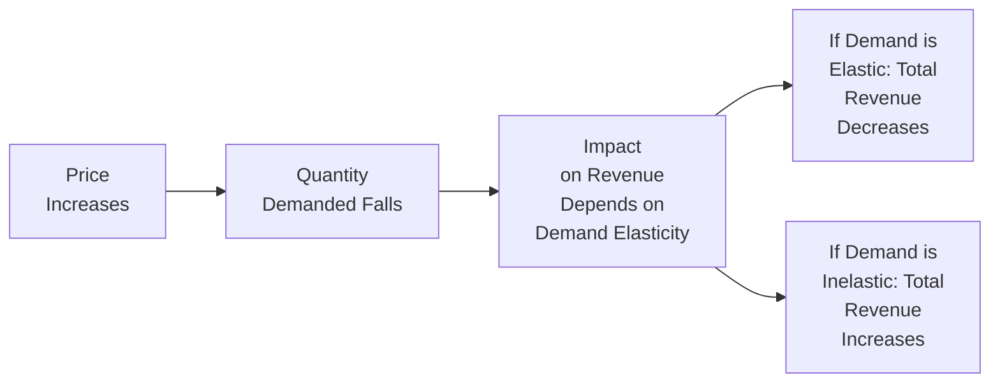

## Introduction
Ever found yourself wondering why demand for certain products plummets after even a small price hike, while other products seem to keep selling no matter how pricey they get? Welcome to the concept of elasticity—one of those fundamental ideas in economics that can sometimes feel, well, a bit abstract at first. I recall the first time I wrestled with this topic in graduate school. I was running a small pop-up coffee stand on weekends and wanted to figure out why a small increase in the latte price caused a huge drop in sales, yet raising the price of muffins by 50 cents didn’t faze customers much. That real-world puzzle took me right into elasticity, and discovering the reasons was a total “aha!” moment.  

In investment and financial analysis, understanding elasticity helps you predict how demand or supply will react to changes in price or consumer income. This is especially relevant when you consider revenue projections, cost structures, and even macroeconomic cycles. If you’re looking at equities in the retail sector, for instance, knowledge of elasticity can help you analyze how well a firm’s products might withstand price fluctuations or an economic downturn that affects consumer income.

Below, we’ll discuss the major types of elasticity—Price Elasticity of Demand, Price Elasticity of Supply, Income Elasticity of Demand, and Cross-Price Elasticity of Demand—and how each can be interpreted and applied. 

We’ll keep the discussion approachable but also tie everything back to real-world applications, as well as highlight some typical pitfalls that Level I candidates (and yes, even more experienced professionals) sometimes encounter.

## Price Elasticity of Demand
Price Elasticity of Demand (PED) measures how sensitive the quantity demanded of a good or service is to changes in its price. Formally, the PED is:


\text{PED} = \frac{\%\Delta Q_d}{\%\Delta P} = \frac{\left( \Delta Q_d / Q_d \right)}{\left( \Delta P / P \right)},


where \\(Q_d\\) is the quantity demanded and \\(P\\) is the price of the good.

• Elastic Demand: |PED| > 1  
• Inelastic Demand: |PED| < 1  
• Unit Elastic: |PED| = 1  

An “elastic demand” means a small percentage change in price results in a larger percentage change in quantity demanded. Think about items like branded cereals: if you bump the price up by just a bit, some shoppers switch to cheaper brands instantly. Conversely, products such as life-saving medications typically have “inelastic demand,” because even if the price changes, the demand changes by a smaller percentage (people need those medications regardless of cost).

### Main Determinants of Price Elasticity of Demand
• Availability of Substitutes: The more substitute products available, the more elastic the demand.  
• Necessity vs. Luxury: Necessities tend to be less price-sensitive, while luxury items can be highly elastic.  
• Time Horizon: Demand becomes more elastic over time as consumers adjust their consumption patterns.  
• Share of Consumer Budget: Goods that form a large portion of one’s budget (like housing) tend to have more elastic demand.

### Price Elasticity of Demand and Total Revenue
One classic use of PED is examining its relationship with total revenue (TR), defined as:


\text{TR} = P \times Q_d.


• When demand is elastic, an increase in price reduces total revenue (and a decrease in price can increase total revenue).  
• When demand is inelastic, an increase in price can increase total revenue, because the drop in quantity demanded is relatively small.  

Here’s a small flowchart capturing the interplay between price changes, quantity demanded, and total revenue under different elasticities:

This interplay is critical for corporate pricing strategies. Analyzing the demand elasticity of the goods or services that a firm sells can help a manager decide whether to raise or lower prices to maximize revenue.

## Price Elasticity of Supply
Price Elasticity of Supply (PES) measures how quickly producers respond to a change in price by adjusting the quantity they supply. Formally:


\text{PES} = \frac{\%\Delta Q_s}{\%\Delta P},


where \\(Q_s\\) is the quantity supplied.  

Some goods or services—like digital products—can be scaled up quickly at relatively low cost. That often results in highly elastic supply since a small increase in price might spur a large increase in quantity supplied (e.g., streaming services or e-books). But if you’re talking about farmland or specialized rare microchips, supply can remain relatively inelastic in the short run because you just can’t crank out more farmland or specialized manufacturing capacity overnight.

### Determinants of Price Elasticity of Supply
• Production Timeframe: For many goods, supply becomes more elastic over the long run.  
• Ease of Storing Inventory: Goods that can be stored easily can have more elastic supply in the short run.  
• Availability of Production Inputs: If inputs are readily available and factor markets are flexible, supply can adjust more readily to price changes.

Understanding PES is especially important for industries like commodities (e.g., oil). We often talk about “supply shocks,” where supply is slow to adjust to big swings in global demand, leading to large price fluctuations.

## Income Elasticity of Demand
Income Elasticity of Demand (YED) helps us understand how changes in consumer income affect demand. The formula is:


\text{YED} = \frac{\%\Delta Q_d}{\%\Delta \text{Income}}.


If YED is greater than zero, the good is typically considered “normal” (demand increases as income rises). If YED is less than zero, the good is “inferior,” meaning demand goes down as people’s incomes go up (they opt for higher-quality options).

### Normal vs. Inferior Goods
• Normal Goods (YED > 0): Luxury cars, gourmet meals, or high-end fashion. Demand increases faster than income if the good is a luxury (YED > 1).  
• Inferior Goods (YED < 0): Basic staples or cheaper substitutes like store-brand groceries. As income increases, demand for these goods might drop.

In a portfolio management context, analyzing a company’s product line in relation to the economic cycle can be insightful. For instance, during recessions, some consumers cut back on high-end goods and switch to lower-priced alternatives. Income elasticity helps you anticipate which companies might face strong headwinds (e.g., luxury brands) and which might stay stable or even see demand rise (e.g., discount retailers offering budget-friendly items).

## Cross-Price Elasticity of Demand
Cross-Price Elasticity of Demand (XED) measures the responsiveness of demand for one good (say, Good A) to a change in the price of another good (say, Good B). The formula is:


\text{XED}_{(A,B)} = \frac{\%\Delta Q_d(A)}{\%\Delta P(B)}.


• Substitutes (XED > 0): If the price of one good goes up, demand for its substitute increases. A rise in the price of coffee might increase the demand for tea, assuming consumers see them as fairly interchangeable sources of caffeine.  
• Complements (XED < 0): If the price of one good goes up, demand for its complement decreases. Think about printers and ink cartridges: if printer prices rise significantly, fewer people might buy printers—and, by extension, fewer ink cartridges.

This concept comes up in multi-product firms and in analyzing broader industry trends. A beverage company, for example, might assess how changes in soda prices influence the demand for bottled water or energy drinks.  

## Elasticity Categories at a Glance
Let’s summarize the categories of elasticity with a quick table:

| Type of Elasticity             | Formula                                              | Interpretation                                               |
|--------------------------------|------------------------------------------------------|--------------------------------------------------------------|
| Price Elasticity of Demand     | \\(\frac{\%\Delta Q_d}{\%\Delta P}\\)                 | How demand changes with price changes                        |
| Price Elasticity of Supply     | \\(\frac{\%\Delta Q_s}{\%\Delta P}\\)                 | How supply changes with price changes                        |
| Income Elasticity of Demand    | \\(\frac{\%\Delta Q_d}{\%\Delta \text{Income}}\\)     | How demand changes with income changes                       |
| Cross-Price Elasticity of Demand | \\(\frac{\%\Delta Q_d(A)}{\%\Delta P(B)}\\)         | How demand for good A changes with price changes in good B   |

## Real-World Applications and Insights
• Pricing Strategy: If a firm identifies that the demand for its flagship product is highly elastic, raising prices could be risky for revenue. Conversely, knowledge of inelastic demand might allow modest price increases without significantly hurting sales.  
• Forecasting Demand Shifts: Investment analysts often project how demand might change if consumers’ incomes rise or if competing products shift in price.  
• Policy and Taxation: Governments rely on elasticity to forecast the effects of taxes or subsidies on the overall market. For instance, a tax on cigarettes (where demand is inelastic) may not drastically reduce smoking but can increase government revenue.  
• Complementary Product Lines: Firms might set prices for printers cheaply knowing that the inelastic demand for ink cartridges (a complementary product) will generate profits later.  

## Common Missteps and Pitfalls
• Confusing Direction of Causality: Remember that XED looks at how changes in Good B’s price affect Good A’s demand, not the other way around.  
• Misinterpreting Sign: A negative sign often indicates how quantity moves in the opposite direction of price. Keep an eye on whether the question is about complements vs. substitutes, or normal vs. inferior goods.  
• Overlooking Time Horizons: A commodity can be inelastic in the short run but becomes more elastic in the long run as alternatives or new technology appear.  

## Linking Elasticities to Other Topics
Earlier in this chapter, we covered how markets can experience surpluses or shortages (Section 1.2) and how consumer and producer surplus arises (Section 1.3). Elasticity underpins these concepts:

• In Surplus or Shortage Scenarios: Highly elastic supply or demand might quickly eliminate a surplus/shortage as prices adjust.  
• In Calculating Surpluses: The shape of the demand or supply curve (linked to elasticity) determines how changes in price shift the distribution of consumer and producer surplus.

Moreover, as you progress into advanced areas like macroeconomic forecasting (discussed further in Chapter 3), elasticity insights can come in handy. During recessionary phases, for example, goods with high income elasticity might see a significant drop in demand, influencing business cycle analysis.

## Exam Tips and Best Practices
1. Know Your Formulas: Elasticity formulas are straightforward but watch out for the negative sign in price elasticity of demand. Typically, we talk about PED in absolute value terms.  
2. Practice Interpreting Numerical Values: Be comfortable deciding whether a good is elastic, inelastic, or unit elastic—especially with borderline cases.  
3. Watch for Extremes: Perfectly inelastic demand means quantity demanded doesn’t change at all when price changes (vertical demand curve). Perfectly elastic demand means quantity demanded changes dramatically at a specific price (horizontal demand curve).  
4. Understand Real-World Scenarios: Command an example or two in your mind for each elasticity concept—this will help you in scenario-based questions.  

## References
• Sloman, J. (2013). “Economics.” Pearson.  
• Samuelson, P. A., & Nordhaus, W. D. (2010). “Economics.” McGraw-Hill.  
• [Investopedia: Elasticity](https://www.investopedia.com/terms/e/elasticity.asp)  

## Test Your Knowledge: Price, Income, and Cross-Elasticities Quiz



### Which of the following correctly describes price elasticity of demand (PED)?
- [ ] The percentage change in price divided by the percentage change in quantity demanded.
- [ ] The responsiveness of quantity supplied to a change in price.
- [x] The percentage change in quantity demanded divided by the percentage change in price.
- [ ] The responsiveness of a product’s price to changes in consumer incomes.

> **Explanation:** Price elasticity of demand is defined as the percentage change in quantity demanded divided by the percentage change in price.

### Which statement about inelastic demand is most accurate?
- [ ] A 10% increase in price leads to a greater than 10% drop in quantity demanded.
- [x] A 10% increase in price leads to a smaller than 10% drop in quantity demanded.
- [ ] The price-value relationship is irrelevant to consumers.
- [ ] Total revenue always decreases with an increase in price.

> **Explanation:** If demand is inelastic, the percentage change in quantity demanded is less than the percentage change in price.

### Company A notices that after a 5% decrease in its television prices, quantity sold increases by 8%. Which label best fits its product’s price elasticity of demand?
- [x] Elastic
- [ ] Inelastic
- [ ] Unit Elastic
- [ ] Perfectly Inelastic

> **Explanation:** Since quantity increases by a larger percentage than the price decrease (8% > 5%), the demand is elastic.

### If the price of hamburgers increases by 10% and as a result, hot dog demand rises by 5%, how do we classify these two goods?
- [x] Substitutes
- [ ] Complements
- [ ] Normal Goods
- [ ] Inferior Goods

> **Explanation:** A positive cross-price elasticity means the goods are substitutes.

### What would be the likely income elasticity of demand for luxury handbags?
- [x] Greater than 1
- [ ] 0
- [ ] Negative
- [x] Potentially positive and could be very high

> **Explanation:** Luxury items tend to have YED > 1, indicating demand rises faster than income.

### A commodity’s supply curve is said to be perfectly inelastic if:
- [x] Each producer supplies the same quantity, regardless of the price.
- [ ] A small rise in price leads to a significant expansion in output.
- [ ] The quantity demanded changes proportionally with price.
- [ ] The good is a luxury product that producers enjoy making.

> **Explanation:** Perfectly inelastic supply means quantity supplied does not change at all when price changes.

### Which factor tends to make demand more elastic over time?
- [x] The availability of more substitutes as consumers adjust.
- [ ] Higher taxes on luxury products.
- [x] Consumers becoming loyal to a single brand.
- [ ] The good becomes a necessity.

> **Explanation:** Demand is typically more elastic in the long run because consumers can find alternatives or change habits as time passes.

### Two goods have a cross-price elasticity of -1.2. Which of the following statements is correct?
- [x] They are complements.
- [ ] Their demand is unaffected by price changes.
- [ ] They are substitute goods.
- [ ] They must be public goods.

> **Explanation:** A negative cross-price elasticity indicates that when the price of one good rises, the demand for the other good falls, which is characteristic of complements.

### A normal good will always have:
- [x] A positive income elasticity of demand.
- [ ] A negative income elasticity of demand.
- [ ] Perfectly elastic demand.
- [ ] A cross-price elasticity of zero.

> **Explanation:** Normal goods have a positive income elasticity of demand, meaning consumers buy more as their incomes rise.

### When demand is unit elastic (PED = 1), the effect of a price change on total revenue is:
- [x] Neutral: total revenue remains unchanged regardless of price changes.
- [ ] Positive: total revenue always increases.
- [ ] Negative: total revenue always decreases.
- [ ] Symmetrical for both normal and inferior goods.

> **Explanation:** With unit elastic demand, proportional changes in price and quantity demanded exactly offset each other in terms of total revenue.


