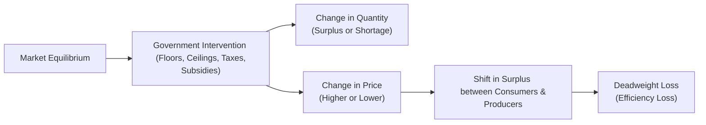

## Introduction
Have you ever strolled through a bustling city and noticed how some people struggle to afford rent, while others can’t find decent-paying jobs? Maybe you’ve sensed that tension firsthand—especially if you once had to share a place with five roommates because of high housing costs (trust me, I’ve been there). Well, government intervention in markets is often intended to address such issues. In many cases, interventions like price floors and price ceilings respond to social or political pressures to make essentials “more affordable” or to ensure a “fair” wage for workers. Taxes and subsidies also play a big part: governments use them to shift resources, influence production, or encourage (or discourage) consumption of particular goods. 

For the CFA Level I exam—and in real-world finance—understanding these interventions is crucial because they can significantly alter supply, demand, and pricing structures. This article explores how government interventions operate, their motivation, and their potential implications for market efficiency, business profitability, and consumer welfare.

## Price Floors
A price floor is a legally mandated minimum price at which a good (or service) can be sold. When set above the free-market equilibrium price, it leads to a surplus—more is supplied than demanded. Governments may impose price floors to ensure that producers receive adequate income for vital goods like agricultural products or to guarantee a certain standard of living through minimum wage legislation.

### Key Mechanism
• When the floor is set above equilibrium, the quantity supplied (Qs) exceeds the quantity demanded (Qd).  
• Surplus (excess supply) arises.  
• Producers in non-competitive markets might benefit if their supply is still purchased (often by the government).  
• Consumers face higher prices, reducing their overall consumer surplus.

### Example: Minimum Wage
Perhaps the most familiar price floor is the minimum wage. In many countries, it’s intended to raise the income of the lowest-paid workers. If the legally required minimum wage is above the equilibrium wage, some businesses reduce hiring to cut costs, potentially leading to unemployment (a surplus of labor). 

While minimum wage laws can increase earnings for those who remain employed, the policy might reduce jobs for the least skilled. This balancing act often becomes a major economic and political debate. For the CFA exam, it’s important to grasp how changes in labor demand and supply elasticity affect total employment, wages, and the distribution of labor income.

## Price Ceilings
A price ceiling is a legally mandated maximum price at which a good (or service) can be sold. If set below the equilibrium price, a price ceiling typically creates a shortage—quantity demanded exceeds quantity supplied.

### Key Mechanism
• With a price ceiling below equilibrium, more consumers want the product at the artificially low price.  
• Producers supply less, since lower prices can shrink profit margins or even lead to losses.  
• Shortages emerge, sometimes resulting in non-price rationing (e.g., waiting lists, black markets).  

### Example: Rent Control
Rent control policies cap the maximum rent landlords can charge. They’re often championed to protect lower-income renters from surging housing costs. But over the long run, rent control might prompt landlords to invest less in property maintenance or discourage new housing developments, exacerbating the housing shortage. You might have heard stories of entire families occupying small rent-controlled units for decades because it’s so cheap—while newcomers can’t find any place nearby at a regulated price. 

This is a classic illustration of how price ceilings can lead to unintended consequences. For the CFA curriculum, keep in mind how shortages reduce consumer surplus for those who fail to secure housing, even if the lucky tenants who do find a rent-controlled apartment see increased consumer surplus.

## Taxes
Taxes are levied by governments to raise revenue or promote specific policy objectives. In a standard supply-and-demand framework, a tax on a good or service generally raises the price paid by consumers and lowers the price received by producers. 

### Tax Incidence
Tax incidence refers to how the burden of a tax is shared between consumers and producers. It depends critically on the relative elasticities (responsiveness) of supply and demand:
- If demand is less elastic (i.e., consumers are less responsive to price changes) than supply, consumers bear more of the tax burden.  
- If supply is less elastic, producers bear a larger share of the burden.  

Mathematically, one common representation for the proportion of tax borne by consumers (assuming linear supply and demand) is:


\text{Consumer's share of tax} = \frac{E_{s}}{E_{d} + E_{s}}


where \\( E_{s} \\) is the price elasticity of supply, and \\( E_{d} \\) is the absolute value of the price elasticity of demand. The fraction borne by producers is \\( \frac{E_{d}}{E_{d} + E_{s}} \\).

### Numeric Example
Imagine a market where, in equilibrium, price is $10, and quantity is 100 units. Then the government imposes a $3 per unit tax on producers.

• If demand is highly elastic (say, consumers quickly switch away if the price rises), producers cannot pass much of the tax onto consumers, so the new price to consumers might rise to only $11, while producers face a net price of $8 (they get $11 from consumers but pay $3 tax per unit). Quantity sold might drop from 100 to 90 units.  

• If demand is inelastic (consumers keep buying despite a price increase), the new price might be $12.50, with producers getting only $9.50 after tax. Quantity might barely change, say from 100 to 98 units.

In both cases, both consumers and producers share some portion of the tax burden, but how much each pays depends on elasticity.

### Simple Python Example for Tax Impact
Let’s say you have linear demand and supply curves and you want to see how equilibrium adjusts when a tax T is introduced.

```python
# Suppose Supply: Qs = c + d*P

a, b = 120, 2.0
c, d = 20, 2.0
T = 3.0  # tax per unit

# => (a - c) = P*(b + d)
P_no_tax = (a - c)/(b + d)
Q_no_tax = a - b*P_no_tax

# And P_producer = P_demand - T

import sympy
P_demand = sympy.Symbol('P_demand', real=True)
eq = sympy.Eq(a - b*P_demand, c + d*(P_demand - T))
solution = sympy.solve(eq, P_demand)
P_demand_tax = float(solution[0])
P_producer_tax = P_demand_tax - T
Q_with_tax = a - b*P_demand_tax

print(f"No Tax: Price={P_no_tax:.2f}, Quantity={Q_no_tax:.2f}")
print(f"With Tax: Price to Consumers={P_demand_tax:.2f}, "
      f"Price to Producers={P_producer_tax:.2f}, "
      f"Quantity={Q_with_tax:.2f}")
```

Although you might not whip out Python during the CFA exam, understanding how numerical solutions reflect demand and supply behavior can sharpen your intuition for test questions. 

## Subsidies
Subsidies are payments from the government to producers or consumers, effectively lowering the cost of production or purchase. They are often used to encourage the production of valuable goods (e.g., renewable energy) or consumption of socially beneficial products (e.g., vaccinations). 

### Key Mechanism
• A subsidy to producers effectively decreases their cost structure, shifting the supply curve outward (rightward).  
• If consumers receive a subsidy, the demand curve shifts outward (rightward).  
• Resulting effects: lower market price, larger quantity traded, and increased costs to the government.  

Much like taxes, the benefit (or incidence) of subsidies depends on elasticity. If demand is inelastic, the price reduction to consumers might be more modest, and producers capture most of the subsidy. Conversely, if supply is inelastic, consumers reap more benefits from the subsidy in the form of lower prices.

### A Quick Anecdote
I once encountered a local government that provided heavy subsidies on solar panel installations. The immediate effect was that solar panel producers ramped up output, and many homeowners jumped on the solar bandwagon. Over time, the region's energy mix changed dramatically. Some folks claimed it was a “win-win,” but others pointed out that the policy artificially boosted demand and cost taxpayers millions. This is a prime example of how subsidies, while often well-intentioned, can have ripple effects—both good and not-so-good.

## Effects on Market Efficiency and Welfare
All these interventions—floors, ceilings, taxes, subsidies—can create some form of distortion relative to the free-market equilibrium. Generally, we call these inefficiencies or deadweight losses. This matters in finance and economics because:

• Deadweight loss indicates a loss of total social surplus—neither consumers nor producers capture that “lost” surplus.  
• Market players (businesses, consumers, and investors) must adapt to government policies, reshaping production, pricing, wage structures, and resource allocation.  
• Policies usually carry trade-offs: helping one group might harm another.

Below is a high-level flowchart illustrating how government intervention leads to potential welfare changes:



In a perfect competition scenario without externalities, any movement away from the free-market equilibrium typically reduces overall welfare. However, governments do not intervene in a vacuum: they might seek to correct market failures, ensure fair wages, stabilize incomes for vulnerable groups, or manage strategic reserves of commodities.

## Practical Examples and Case Studies
• Agricultural Price Supports (Price Floor): Many countries offer minimum prices for crops like wheat or corn, often leading to stockpiles of unsold products or expensive disposal programs.  
• Rent Stabilization (Price Ceiling): Urban centers such as New York City or Paris have rent regulations to protect tenants, though the resulting housing shortages are frequently lamented.  
• “Sin Taxes” on Tobacco or Alcohol: Governments often tax cigarettes and alcohol, partly to raise revenue and partly to discourage consumption of unhealthy products.  
• Renewable Energy Subsidies: Countries around the world subsidize solar, wind, and other green technologies to reduce carbon emissions and foster innovation.  

## Balancing Goals and Trade-Offs
Governments often face conflicting objectives. One might want to reduce inequality by imposing a minimum wage but simultaneously keep businesses competitive in global markets. Another might want to ensure affordable housing yet avoid deterring new development. These dilemmas underpin many exam questions in the CFA Program. You will see references to how policy changes can affect corporate earnings, cost of capital, or investment strategies—particularly if a government introduces or rescinds a subsidy in a key sector.

As a finance professional, you’ll likely model different scenarios for your clients or firm. For instance, if a major commodity is subject to new taxes or price ceilings, the supply chain and profitability for related investments may shift meaningfully. 

## Final Exam Tips
• Understand the basic shapes of supply and demand curves. Identify how a policy shift (e.g., new tax or subsidy) would move those curves.  
• Memorize who bears the tax or subsidy burden under different elasticity scenarios.  
• Familiarize yourself with examples of price floors and ceilings; the exam may show you a graph and ask you to identify shortages, surpluses, or the resulting surpluses/shortages for consumers or producers.  
• Practice conceptualizing deadweight loss—both in graphs and in numeric examples.  
• Connect real-world policy debates to theoretical outcomes: exam essays or vignettes often test your ability to analyze pros and cons.  

## References
- Stiglitz, J. E., & Rosengard, J. K. (2015). “Economics of the Public Sector.” W.W. Norton.  
- [OECD: Policy Responses and Price Controls](https://www.oecd.org/economy)  
- [Khan Academy: How Price Controls Reallocate Surplus](https://www.khanacademy.org/economics-finance-domain/microeconomics)  

---

## Test Your Knowledge: Government Intervention in Markets



### Which of the following is the best definition of a price floor?

- [x] A legally mandated minimum price set above equilibrium
- [ ] A legally mandated maximum price set below equilibrium
- [ ] A government subsidy to protect producers
- [ ] A tax on final goods to reduce demand

> **Explanation:** A price floor is a minimum legal price typically set above the market equilibrium price, causing a surplus since quantity supplied exceeds quantity demanded.

### If a price ceiling is set below an item’s equilibrium price, what is the most likely outcome?

- [ ] An increase in producer surplus
- [ ] A surplus of the good
- [x] A shortage of the good
- [ ] A decrease in demand only

> **Explanation:** Setting a price ceiling below equilibrium leads to increased demand and restricted supply, creating a shortage.

### In analyzing tax incidence, which factor primarily determines which party bears a larger share of the tax?

- [x] The relative elasticity of demand and supply
- [ ] The total amount of the tax revenue needed by the government
- [ ] The presence of externalities in consumption
- [ ] The marginal propensity to save

> **Explanation:** Whether consumers or producers bear more of the tax burden (tax incidence) depends on the relative elasticities of supply and demand.

### Which of the following would most likely result from a binding minimum wage set above the equilibrium level?

- [ ] An immediate increase in the labor supply, pushing wages lower
- [x] A surplus of labor (i.e., unemployment)
- [ ] Decreased producer surplus in the product market
- [ ] A shortage of labor, forcing employers to pay more

> **Explanation:** A price floor on labor visible as a minimum wage above the equilibrium wage creates unemployment because the quantity of labor supplied exceeds the quantity demanded.

### What is the primary reason that governments provide subsidies to producers?

- [x] To shift the supply curve to the right and encourage increased production
- [ ] To regulate the total amount of consumer surplus
- [x] To lower the cost of production for domestic firms
- [ ] To create a shortage that raises equilibrium prices

> **Explanation:** Producer subsidies typically lower production costs, encouraging higher output and shifting the supply curve to the right.

### Which of the following is true about the burden of a subsidy?

- [x] Both consumers and producers share the subsidy benefits, depending on elasticity
- [ ] Only consumers benefit from a subsidy
- [ ] Only producers benefit from a subsidy
- [ ] The government suffers no cost in providing the subsidy

> **Explanation:** As with taxes, the benefit of a subsidy is shared between consumers and producers based on the elasticity of supply and demand.

### A binding rent control policy is likely to cause:

- [x] A reduction in the quality and quantity of available rentals
- [ ] An excess supply of rental apartments
- [x] An increase in new housing construction
- [ ] No effect on the equilibrium

> **Explanation:** Rent control (a price ceiling below equilibrium) limits landlord revenue, often decreasing incentive to build or maintain properties, leading to lower quality/quantity of rental units.

### For a given product, if demand is more elastic than supply, who generally bears the greater burden of an excise tax?

- [x] Producers
- [ ] Consumers
- [ ] Wholesalers
- [ ] The government alone

> **Explanation:** When demand is more elastic, it’s easier for consumers to switch to substitutes. Therefore, producers cannot pass on much of the tax to consumers and end up bearing a larger share of the tax burden.

### Deadweight loss essentially measures:

- [x] The net loss in total surplus due to market distortions
- [ ] The increase in consumer surplus after a government subsidy
- [ ] The tax revenue gained by the government
- [ ] Producer surplus minus consumer surplus

> **Explanation:** Deadweight loss is the loss in total (consumer + producer) surplus that occurs because the intervention (or market distortion) prevents transactions that could have benefited both parties.

### Price floors set above equilibrium generally lead to:

- [x] True
- [ ] False

> **Explanation:** Price floors above equilibrium create surpluses because quantity supplied exceeds quantity demanded.


