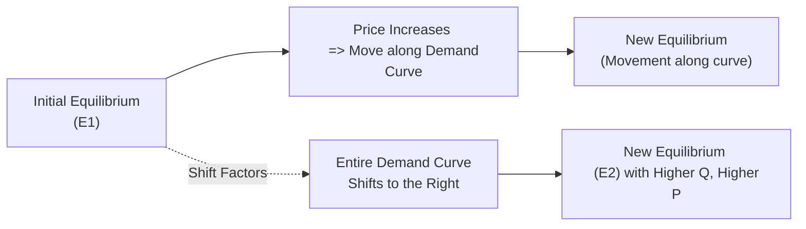

## Introduction

Have you ever watched the price of a commodity—maybe crude oil or sugar—and wondered why it zigzags up and down almost daily? Well, part of that story is straightforward: the higher the price, the fewer barrels or pounds consumers want to buy (all else equal). What’s more interesting, though, is how factors beyond the day-to-day price changes—like shifting consumer tastes, new technology, or regulatory updates—push entire demand or supply curves. This is exactly our focus here: how to recognize factors that move demand and supply, how to distinguish these shifts from mere price-based movements along the curves, and how these changes can spill over into financial markets and shape investment decisions.

In capital markets, understanding supply and demand is often the starting point for analyzing asset valuation and macroeconomic trends. For instance, analyzing demand shifters for a specific industry helps a portfolio manager figure out whether growth prospects will justify an investment. Similarly, anticipating supply constraints allows you to forecast possible upward pressure on prices for a commodity or security. In short, demand and supply analysis forms the bedrock of both micro-level security selection and macro-level portfolio strategy.

Below, we’ll break down the most common reasons demand and supply curves shift, highlight real-life examples, and discuss practical implications, especially for those of you preparing for advanced financial decision-making. Let’s dive in.

## Understanding Demand Shifters

Demand shifters are non-price factors that cause the entire demand curve to move left or right. A “shift to the right” represents an increase in demand at every price level, whereas a “shift to the left” represents a decrease in demand at every price. If you think about it in personal terms, there might be times when you’re simply more eager to buy a product at the same price, or times when you wouldn’t buy it even if the price remained unchanged.

### Changes in Consumer Income

When consumer incomes change, it can significantly alter the demand for various goods and services:

• Higher income. As incomes rise, consumers typically demand more “normal goods,” such as well-known brands or premium products. They might drive nicer cars, eat at expensive restaurants, or travel more.  
• Lower income. If incomes fall, demand for normal goods declines, and people turn to inferior goods—more budget-friendly substitutes or generic brands. Think about how discount supermarkets thrive in an economic recession.

A portfolio manager might track disposable income data across emerging markets to forecast consumer demand for branded electronics or higher-end fashion. An unanticipated surge in disposable income could be a buy signal for companies poised to capture that increased demand.

### Tastes and Preferences

Tastes and preferences can shift due to cultural trends, health information, or even social media movements. Just think of how quickly consumer sentiment pivoted toward more eco-friendly or socially conscious products. One personal story: I used to love driving gasoline-based cars; I was all about engine noise. But now, I’ve grown fond of electric vehicles (EVs). In fact, after reading a few reports on emissions, I realized I cared more about the environment (and saving on fuel costs), so my “taste” changed. Multiply that effect across millions of consumers, and suddenly EV demand skyrockets in an entire market.

Such changes in tastes can have remarkable effects on investment strategies. If you anticipate that consumer tastes will gravitate toward greener solutions, you might consider overweighting companies in your portfolio that produce renewable energy technologies or electric vehicles.

### Prices of Related Goods: Substitutes and Complements

For financial analysts, understanding the interplay between related goods (substitutes and complements) is crucial:

• Substitutes. Goods that can replace each other, such as tea and coffee, or perhaps energy drinks and soft drinks. If coffee becomes too expensive, some tea lovers might “switch” to tea. Demand for tea shifts to the right.  
• Complements. Goods that are often consumed together, such as smartphones and data plans. If smartphone prices drop, we might expect data plan subscriptions to rise as more individuals purchase smartphones.

How does this matter to finance? Let’s imagine an automotive company that also develops proprietary charging infrastructure. If electric car demand surges (because fossil-fuel-based vehicles have become pricier or less fashionable), then demand for charging stations—its complementary good—could rise in tandem. Savvy equity analysts stay alert to these “linked” demand relationships.

### Population and Demographics

A growing population or shifts in the demographic mix (e.g., aging populations, younger families) can move demand curves. For instance, a country with a rapidly growing middle class might see rising demand for houses, consumer electronics, and automobiles. In contrast, aging demographics in another country might see increased demand for healthcare services and pharmaceutical products but weaker demand for sports cars.

### Expectations of Future Prices or Income

Sometimes, consumers alter today’s buying decisions based on tomorrow’s outlook. If you expect the price of gold to soar, you might buy more gold now. If you expect your future income to dip, you might postpone upgrading your electronics. These “forward-looking” decisions can shift the demand curve today, creating short-term anomalies in markets.

In capital markets, investor expectations often factor into the pricing of commodities, Amazon Web Services capacity, shipping logistics, and so on. An asset manager might monitor consumer confidence indicators to gauge how expectations about future income or economic conditions could shift demand for consumer discretionary stocks or luxury goods.

## Understanding Supply Shifters

The supply side of the market can sometimes be overshadowed by flashy consumer trends, but shifts in supply curves have equally potent effects on prices and quantities. When supply increases (shifts to the right), more quantity is offered at each price. When it decreases (shifts left), less quantity is available at each price. Let’s break that down.

### Changes in Input Prices

Supply curves are often anchored in the cost of production. If the prices of critical inputs—like labor, raw materials, or energy—go up, firms will find it more expensive to produce a given level of output. This effectively pushes the supply curve to the left (a decrease in supply). Conversely, falling input prices free up room to produce more profitably, shifting supply to the right.

For instance, an electronics manufacturer that sees semiconductor input costs plummet may expand production of smartphones. In terms of portfolio impact, an analyst might forecast higher margins for consumer electronics companies if global semiconductor prices are expected to decline. Or, if energy prices spike, manufacturing companies might retract supply, leading to cost pressure on final goods.

### Technology and Productivity

Breakthroughs in production processes—like 3D printing, big data, or advanced robotics—can drastically reduce the marginal cost of production. This powerful shift in technology leads to supply expansion. The classic example is how computational technology has driven down costs in nearly every sector, from car manufacturing to financial services.

Investors often pay close attention to technology innovations when they attempt to identify industries with potential future expansions in supply (and thus potential competitive advantages). A portfolio manager who sees a wave of AI automation might invest in advanced manufacturing equipment firms that will supply these technologies, expecting them to benefit from an outward shift in overall supply potential.

### Number of Sellers

More sellers in a market typically mean greater total supply. For example, the proliferation of smartphone manufacturers in the last decade drove smartphone prices down—at least for mainstream models—because each additional supplier contributed to an increased aggregate supply. On the flip side, if major providers exit or consolidate, supply can contract, potentially boosting prices.

### Expectations of Future Prices

Producers can be just as forward-looking as consumers. If manufacturers anticipate that prices of their goods will rise in the future (say, because of a forecasted shortage in raw materials or anticipated regulatory changes), they might store inventory or delay selling now. This “withholding” can reduce current supply, shifting the supply curve to the left until higher prices materialize.

### Government Policy, Taxes, and Regulations

Tariffs, subsidies, and other policy changes can quickly alter production incentives. Higher taxes or stricter regulations usually raise the cost of production, shifting supply left, while subsidies can nudge supply to the right.

• Taxes and quotas add extra costs. A new carbon tax might significantly hit steel producers, discouraging production.  
• Subsidies can encourage supply. Government support for solar panel manufacturers can push the supply curve to shift right, bringing down prices.

From a portfolio-management perspective, analyzing policy changes is integral. If you anticipate a new subsidy for green energy, you may invest in the relevant industry, expecting an outward shift in supply.

## Movements Along vs. Shifts of Curves

One of the most common conceptual mistakes in supply–demand analysis is mixing up “moves along” a curve with “shifts of” the curve. Here’s the gist:

• A movement along a demand or supply curve is triggered purely by a change in that good’s own price. If the price of a product goes up, and nothing else changes, we slide along the demand curve to a lower quantity demanded. The same logic applies for supply.  
• A shift of the curve happens when any non-price factor changes. Think: consumer incomes, input costs, new regulations, or evolving tastes. These are the changes that can fundamentally move an entire curve to a new position.

To help visualize:

In this diagram, the top branch shows a simple movement along the curve: price changes, quantity demanded changes, but the curve itself remains in the same location. The dashed arrow from “Initial Equilibrium” to “Shift of Demand Curve” shows how a non-price factor (like changing consumer preferences) can move the entire demand curve.

## Real-Life Events and Portfolio Implications

Real-world supply–demand changes rarely occur in isolation. Let’s highlight two big market examples:

• Crude Oil ProductionCuts. When OPEC aligns on production cuts, supply shifts left, raising prices if demand remains unchanged. Now, if at the same time the global economy slows down (reducing demand), we might see both supply and demand shifting left. That can leave the new equilibrium price uncertain without more precise estimates of how big each shift is—a dilemma for energy sector analysts.  
• Electric Car Boom. Growing consumer tastes for EVs and government green regulations can push demand for EVs to the right. Meanwhile, improved battery technology (lowering production costs) pushes their supply to the right. In equilibrium, the quantity of EVs might rise significantly, while the net effect on price depends on which shift is greater.

For portfolio managers, such changes can ripple widely. When oil prices move upward, airline stock valuations might fall, while producers of alternative energy might benefit. Monitoring how these supply–demand shifts propagate through complementary and substitute markets offers an edge in both tactical asset allocation and scenario-based stress testing.

## Combining Multiple Shifts

Sometimes demand and supply shift simultaneously. If both curves shift in the same direction (both to the right or both to the left), your confidence about the direction of equilibrium quantity can increase, but the effect on price can be ambiguous. Conversely, if they shift in opposite directions, the price movement is clearer, but the quantity effect may be uncertain.

• Demand up, supply up. Quantity will definitely rise, but price could go up, down, or stay the same, depending on the magnitude of shifts.  
• Demand down, supply down. Quantity likely falls, but price might not be predictable without further data.  
• Demand up, supply down. Price is likely to rise, but quantity could go either way.  
• Demand down, supply up. Price likely falls, but quantity is uncertain.

For investment analyses, when real-world conditions cause multiple variables (like interest rates, consumer sentiment, raw material costs, and trade policies) to move at once, developing scenario trees or contingency tables can help. That is one reason big banks and hedge funds create elaborate economic models—capturing how multiple shifts at once might reshuffle equity or bond valuations.

## Short-Term vs. Long-Term Shifts

In the short run, some factors (like capital and certain regulations) might be fixed. Firms can’t instantly build new factories just because demand soared yesterday. So, supply is relatively inelastic in the short run, leading to potentially dramatic price increases when demand spikes. Over the long run, firms can adjust capacity, so supply might become more elastic, eventually moderating prices.

This disparity can matter a great deal in portfolio management. A sudden supply constraint (such as a natural disaster knocking out production facilities) can spike commodity prices in the short run. Over the longer term, however, supply may adjust as alternative producers or improved technologies come online. Distinguishing this time-lag effect helps with deciding whether to hold short-term derivative positions or plan longer-term capital expenditures.

## Ripple Effects on Related Markets

Markets are interconnected. A shift in supply or demand in one market can shape a different—but related—market:

• Complements. If the supply of smartphone microchips is constrained, smartphone production might fall, which in turn reduces demand for phone cases or data plans, at least in the short run.  
• Substitutes. If a new technology drastically reduces the cost of wind power, the demand for coal-generated electricity might decline. Commodities in the energy space can exhibit correlated price movements.

From a portfolio-management lens, watch out for correlation structures that shift as demand and supply changes spread. For instance, if rising oil prices cause demand for electric vehicles to surge, traditional automakers that are slow to adapt may see declines in market share. This interplay can compress or widen correlation spreads between energy, automobile, and even technology indices.

## Practical Example: A Quick Back-of-the-Envelope Model

Below is a tiny numeric illustration, which you can adapt or scale. Suppose you have the following linear demand and supply equations for some commodity, Q (quantity) measured in millions of units, and P (price) in dollars:

Demand:  
 Q_D = 800 - 10P   

Supply:  
 Q_S = 100 + 5P   

At equilibrium, Q_D = Q_S. Solve for P:  

800 - 10P = 100 + 5P \implies 700 = 15P \implies P = \frac{700}{15} \approx 46.67
  

Q = 800 - 10 \times 46.67 = 800 - 466.7 = 333.3 \, (\text{million units})


Now, imagine input costs drop, pushing the supply equation to:  
 Q_S' = 200 + 5P   
That’s an outward shift—producers can supply more at every price. Then, the new equilibrium is:  
 800 - 10P = 200 + 5P \implies 600 = 15P \implies P = 40   
 Q = 800 - 10 \times 40 = 800 - 400 = 400   

Price fell from about \$46.67 to \$40, while quantity rose from 333.3 million units to 400 million. If you’re analyzing a firm producing this commodity, you’d want to forecast how this price drop affects their revenue and profit margin. If your portfolio holds that firm’s stock, these shifts have direct implications for its earnings.

## Best Practices and Common Pitfalls

• Always separate price movement effects (along the curve) from non-price factors (shifts). Many exam takers and even professionals conflate these concepts.  
• Avoid focusing on one side of the market in isolation. Real demand–supply analysis is a multi-dimensional conversation.  
• Incorporate time horizons. The short run can behave starkly differently from the long run, especially if production capacity or consumer loyalty must adjust.  
• Remember elasticity. Even if a factor shifts demand or supply, the actual effect on price and quantity can hinge on how responsive (elastic) each side is.  
• Cross-market influences. Substitutes and complements can create or dampen demand and supply shifts.  

## Implications for Portfolio Management

Demand and supply analysis is not just an abstract concept for microeconomics textbooks. In the real investment world:

• Asset Allocation. Macro factors that shift aggregate demand (e.g., consumer confidence) can impact sector allocations. If you suspect rising consumer incomes, you might overweight consumer discretionary stocks.  
• Security Selection. Company-specific demand or supply changes can shape top-line revenue forecasts. An equity research analyst looks for margin expansions (due to supply curve shifts) or robust sales growth (due to demand curve shifts).  
• Risk Management. Supply shocks—like weather disruptions that destroy crops—can create volatility. Derivative hedging might be critical.  
• Economic Indicators. Watch for signals in leading indicators that can warn of upcoming shifts. For example, a drop in building permits might forecast a slowdown in construction demand.

By combining these insights, you strengthen your ability to forecast market moves and position portfolios accordingly, adjusting both top-down (asset-class selection) and bottom-up (individual security selection) strategies.

## Conclusion

Demand and supply shifters represent one of the most fundamental yet powerful frameworks in economics. As you refine your analysis, always be on the lookout for factors beyond price—like shifting consumer preferences, regulatory changes, or technology leaps—that can jolt entire markets. For a portfolio manager or CFA candidate, skillful anticipation of these shifts can reveal both hidden risks and lucrative opportunities. If you get comfortable integrating these insights into your modeling and scenario analysis, you’ll be well-prepared for both exam success and real-world investment challenges.

## References and Further Reading

• Frank, R. H., & Bernanke, B. S. (2012). Principles of Microeconomics. McGraw-Hill.  
• Baye, M. R. (2016). Managerial Economics and Business Strategy. McGraw-Hill.  
• Investopedia:  
  [Demand Shock vs. Supply Shock](https://www.investopedia.com/terms/s/supply-shock.asp)  

---

## Test Your Knowledge: Demand and Supply Shifters Quiz



### Which of the following best describes a shift of the demand curve for a product?

- [ ] A price increase causing consumers to buy fewer units.
- [ ] Changes in the product’s own price.
- [x] An increase in consumer incomes that drives more purchases at each price point.
- [ ] A price decrease causing consumers to buy more units.

> **Explanation:** A shift in the demand curve occurs when a non-price factor—such as consumer income—changes how much will be purchased at every price point. Movements along the curve result from changes in the good’s own price.

### Suppose the price of a vital input for smartphone production significantly decreases. Which statement describes the most likely effect on the smartphone market?

- [x] The supply curve shifts to the right.
- [ ] The supply curve shifts to the left.
- [ ] The demand curve shifts to the right.
- [ ] The demand curve shifts to the left.

> **Explanation:** Lower input costs decrease production expenses, so at any given price, producers can supply more units. That’s a rightward shift of the supply curve.

### In a market for electric cars, consumer tastes are growing more eco-friendly. Simultaneously, an expensive metal crucial for batteries becomes scarce. Which outcome is most likely?

- [ ] Demand shifts left; supply shifts right.
- [ ] Demand shifts left; supply shifts left.
- [x] Demand shifts right; supply shifts left.
- [ ] Neither supply nor demand curve shifts.

> **Explanation:** Eco-friendly sentiments shift demand right, while the scarcity (and thus higher cost) of a key input pushes supply left.

### A movement along the supply curve is most commonly caused by:

- [ ] Changes in producer technology.
- [ ] A tax increase on production.
- [x] A change in the price of the good itself.
- [ ] The exit of a major firm from the industry.

> **Explanation:** Movements along the supply curve generally arise from changes in the good’s own price. Technological changes, taxes, or an exodus of firms cause shifts.

### Which of the following might lead to a leftward shift in the supply curve for wheat?

- [x] An increase in the cost of fertilizer.
- [ ] An improved harvesting technology.
- [x] A higher wage rate for farm labor.
- [ ] Implementation of a government subsidy for wheat farmers.

> **Explanation:** Both an increase in fertilizer cost and a higher wage rate serve to push the supply curve left. A new technology or subsidy would shift it right.

### If the demand for a product shifts to the right, and at the same time supply shifts to the right, which outcome is certain?

- [x] The equilibrium quantity will increase.
- [ ] The equilibrium price will increase.
- [ ] The equilibrium price will remain unchanged.
- [ ] The equilibrium quantity will decrease.

> **Explanation:** When both demand and supply move in the same direction—particularly to the right—quantity unambiguously increases. However, price could move up, down, or stay the same depending on the relative magnitudes of the shifts.

### In the short run, a rightward shift in demand often causes a large increase in price because:

- [x] Supply is typically less elastic in the short run.
- [ ] Supply is infinitely elastic in the short run.
- [x] Producers cannot quickly adjust production capacity.
- [ ] Consumers don’t notice price changes in the short run.

> **Explanation:** With supply less elastic in the short run, producers cannot immediately ramp up output to meet higher demand, pushing prices sharply upward.

### Which scenario exemplifies a shift in demand specifically due to changes in expectations?

- [x] Consumers hear that the price of a new smartphone model will double next month, and they buy now.
- [ ] The cost of phone screens falls, making smartphones cheaper to produce.
- [ ] The current price of smartphones remains constant, prompting consumers to buy the same quantity as last week.
- [ ] Government imposes a new tax on smartphone assembly plants.

> **Explanation:** When buyers think the price will rise in the future, they adjust their purchasing decisions now, shifting the entire demand curve to the right.

### A rise in the number of producers in an industry generally:

- [x] Shifts the supply curve outward.
- [ ] Shifts the supply curve inward.
- [ ] Increases the demand for the product.
- [ ] Reduces the demand for substitute goods.

> **Explanation:** Additional firms joining an industry expand total production capacity, shifting supply to the right.

### A change in the price of a product is most accurately categorized as the cause of:

- [x] True
- [ ] False

> **Explanation:** A change in the product’s price itself causes a movement along the demand or supply curve, rather than shifting the entire curve.


