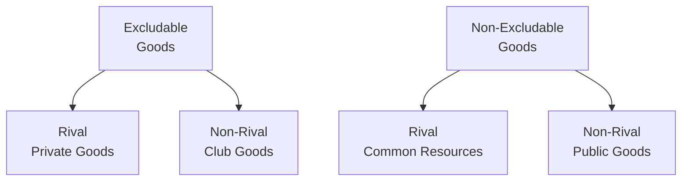
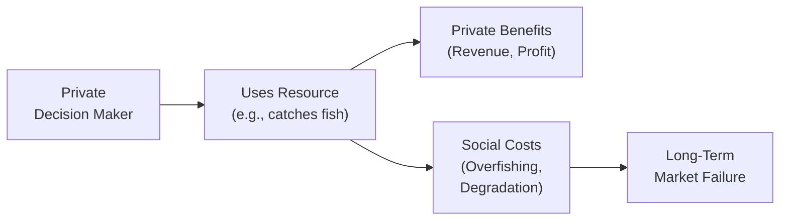

## Introduction

Imagine you’re at a friend’s backyard barbecue (prepping for the CFA® exam, of course), and the grill is chock-full of hamburgers. However, there are no rules about how many burgers each person can grab. You notice some guests going for second and third helpings while others haven’t even gotten their first burger. By the time you get in line, the burgers are all gone. That feeling—where you suspect an overuse of a limited resource—touches on what economists call the “tragedy of the commons.” 

Common resources and public goods are two distinct categories of goods that bring special challenges for any society. While these issues might seem worlds away from advanced financial topics, they directly impact economic growth, regulatory policy, and investment decisions. For CFA® candidates, understanding these concepts helps reinforce how markets work (and sometimes fail) when left entirely on their own. This section clarifies the characteristics of common resources and public goods, explores the problems they create (i.e., overuse and underprovision), and discusses likely policy solutions.

## Rivalry and Excludability

Before diving into the specifics, let’s recall two simple yet powerful concepts: rivalry and excludability. These characteristics define the four broad categories of goods.

• Rivalry: A good is said to be rival if one person’s use of it diminishes the amount others can consume.  
• Excludability: A good is excludable if people who do not pay (or otherwise have no permission) can be prevented from accessing or consuming it.

From these two traits, we get four general categories of goods:

|                              | Excludable              | Non-Excludable            |
|------------------------------|--------------------------|---------------------------|
| **Rival**                    | Private Goods           | Common Resources          |
| **Non-Rival**                | Club (Toll) Goods       | Public Goods              |

We can illustrate these categories with a simple Mermaid diagram:

In practice, many goods lie along a spectrum rather than being purely one type or the other. Nevertheless, these labels are handy for identifying certain market failures and designing relevant policies.

## Common Resources

Common resources are rival and non-excludable. This means your consumption (or use) of the resource can reduce someone else’s potential consumption, but there’s typically no simple way to prevent others from using it too. For instance:

• Fish in the ocean or a lake (fisheries).  
• Public forests for timber (if unregulated).  
• Public waterways or grazing land, historically used for cattle.  

### The Tragedy of the Commons

Let’s dig into a phenomenon every CFA candidate should know: the tragedy of the commons. Because common resources aren’t excludable and are open for use by all, individuals often have an incentive to consume as much as possible—to “beat” others to what’s left. Paradoxically, this behavior leads to overconsumption and possible long-term depletion of the resource, harming everyone in the end.

When we talk about “tragedy,” we’re typically referring to resource exhaustion—like an overfished reef or farmland that’s stripped of its nutrients. There’s a sense of short-term private gain at the expense of long-term sustainability. From an economic perspective, each individual fisherman or livestock grazer is not motivated to conserve the resource because their own restraint might only slightly benefit the ecosystem but immediately benefits everyone else, too.

Think of it like a game: if you limit how many fish you catch to help preserve the stock, the next fisherman may still go above the recommended quota. In other words, there is a mismatch between individual incentives and what’s best for the group as a whole, a hallmark of many externality-driven market failures.

### Policy Solutions and Market-Based Approaches

Because most individuals and firms tend to behave in their own self-interest, common resources often need government intervention or regulated market-based solutions to prevent depletion. Policies include:

• Quotas and licensing: Setting a maximum allowable catch or harvest.  
• Individual Transferable Quotas (ITQs): Assigning each fisher a catch limit that may be bought or sold, thereby introducing a market mechanism that encourages efficient use.  
• Tradable permits: Similar to ITQs, but often used in contexts like pollution management, greenhouse gas emissions, etc.  
• Property rights: Offering or enforcing clearer ownership so that private owners have a direct economic stake in sustaining the resource.

Policies that assign property rights or create a structure for responsible stewardship often rely on the Coase Theorem in some shape or form—that if property rights are clearly defined and transaction costs are low, private parties can bargain and achieve an efficient outcome. Of course, the Coase Theorem might not always be practical, given real-world complexities like large numbers of stakeholders and significant legal or enforcement costs.

## Public Goods

Public goods are both non-rival and non-excludable. In other words, one person’s consumption does not affect another’s (non-rival), and you can’t easily exclude individuals from using it (non-excludable). Classic examples include:

• National defense  
• Street lighting in a city  
• Public knowledge or basic scientific research (where discoveries are freely accessible)

Public goods create an interesting challenge for markets because private businesses have a tough time charging individuals for their usage. If you build a lighthouse, how do you charge each passing ship (especially if they don’t voluntarily pay)? Once the lighthouse is operational, it’s difficult to exclude ships that haven’t contributed to the upkeep. 

### The Free-Rider Problem

Because public goods are non-excludable, many individuals have an inherent incentive to “free ride.” A free rider benefits from the good without paying for it or contributing to its creation. If everyone tries to do the same thing, the private market severely underprovides (or may not provide at all) these useful goods, which fosters strong arguments for governmental provision.

A quick personal anecdote: I once lived in a neighborhood that relied on voluntary contributions for street lighting. Everything looked great on paper. But guess what? Most neighbors didn’t want to pay “extra” to fund new lamps since they’d enjoy light when jogging at night whether they contributed or not. Eventually, the local council had to step in and make street lighting part of the property tax. That is classical free-riding.

### Government Provision and Funding

Because of the free-rider problem, governments frequently finance public goods via taxation. For instance:

• National defense is typically provided by the government using tax revenue.  
• Public roads or highways rely on budget allocations, though some roads impose tolls (making them club goods in certain conditions).  
• Basic research is often funded by grants or direct public expenditures.

In some areas, private foundations or philanthropic organizations may fill gaps in public funding for non-rival and non-excludable goods (e.g., Wikipedia, open-source software). Nevertheless, the lion’s share of provision in many regions relies on governmental involvement to ensure these goods are available.

## Environmental and Global Context

Though “environmental economics” might sounds specialized, it’s extremely relevant for the long-term horizon under which investment professionals operate. Common resources like oceans, freshwater reservoirs, and clean air impact global welfare and directly affect many industries, from tourism and fisheries to shipping and agriculture.

• Carbon emissions: A major global challenge, often characterized as a common resource problem (the capacity of the atmosphere to absorb CO₂). Emission trading systems (ETS) or carbon credits are policy tools to control greenhouse gases.  
• Renewable energy: A potential public good if the technology is made freely available. Some argue for open licenses on advanced green-tech solutions to ensure wide adoption, though this approach could hamper private R&D if companies cannot recoup costs.

In a nutshell, these resource allocation and free-rider issues shape how societies balance private profit motives with the broader societal good—crucial for stable capital markets in the long run. 

## Best Practices and Common Pitfalls

• Ignoring the externalities: Overlooking how personal use affects everyone else may create suboptimal policy recommendations.  
• Failing to apply the correct classification: For exam or real-world analysis, carefully determine whether the resource is excludable or rival. Misclassification leads to flawed solutions.  
• Overlooking distributional effects: Some policy solutions—like ITQs—can be seen as privatizing a historically open resource. That can raise equity concerns or lead to political resistance.  
• Underestimating enforcement costs: Even with a great policy design, monitoring and compliance remain critical. Setting a cap on, say, fish catches is useless if local authorities can’t enforce it. 

## Real-World Applications

1. Fisheries Management: Countries like New Zealand use ITQs, allowing fishers to trade quotas, encouraging efficient allocation of fishing rights. If you can catch fish at a lower cost, you can buy more quota from others.  
2. Congestion Pricing in Cities: Roads can be a common resource susceptible to overuse (traffic jams). Some cities apply congestion fees to manage road usage, effectively reducing overconsumption.  
3. Carbon Credit Trading: By establishing a carbon market, governments assign emission allowances that can be bought and sold, effectively placing a price on using the “common resource” of clean air.  
4. Research Data Repositories: Large, open databases that store publicly funded research (e.g., the Human Genome Project) exemplify public goods. The data is non-rival (everyone can look at it simultaneously) and non-excludable (it’s published free of charge).

## Suggested Diagram: Market Failure with Externalities

Below is a simple illustration in Mermaid that showcases how market failure arises when the social costs of resource use or pollution exceed private costs. This is closely tied to the concept of common resources and the environment.

When each individual only accounts for private benefits versus private costs, the broader social costs (i.e., resource depletion) aren’t fully factored into decisions. Tailored interventions aim to bring private incentives into better alignment with social outcomes.

## Exam Relevance

In the CFA® exam context, common resources and public goods show up in questions about market failure, externalities, and government policy. You may find item sets involving fisheries, pollution control, or national defense. Common pitfalls include:

• Misidentifying the good’s classification: Getting “non-rival” and “excludable” features mixed up leads to choosing the wrong solution, such as imposing user fees where it is difficult to exclude free riders.  
• Proposing purely private solutions to public goods: The exam might give you a scenario in which private markets practically can’t solve the free-rider problem, so the question might revolve around justified government intervention.  
• Overlooking regulatory enforcement challenges: Policy is only as effective as its enforcement.  

Knowing these distinctions can help you quickly eliminate incorrect multiple-choice responses and craft logical arguments in constructed-response scenarios.

## Final Exam Tips

• Compare definitions carefully: Rival vs. non-rival and excludable vs. non-excludable are crucial to answering these questions. Keep a mental or scribbled 2x2 matrix in mind!  
• Don’t forget government roles: If you see a question about non-rival, non-excludable goods, consider how the government might fund and provide such goods.  
• Cite examples in essay/constructed responses: Examiners value clarity. Real examples like fisheries, lighthouses, or national defense show a strong understanding.  
• Connect with externalities: Be ready to discuss negative externalities (in common resources) and the free-rider problem (public goods). Both tie in with broader market efficiency analysis.  

## References

- Ostrom, E. (1990). Governing the Commons. Cambridge University Press.  
- Mas-Colell, A., Whinston, M. D., & Green, J. R. (1995). Microeconomic Theory. Oxford University Press.  
- OECD: Fisheries & Aquaculture. (https://www.oecd.org/agriculture/topics/fisheries-and-aquaculture)

## Practice Questions on Common Resources and Public Goods



### Which of the following best describes a common resource?  
- [ ] A good that is both non-rival and excludable.  
- [x] A good that is rival but non-excludable.  
- [ ] A good that is non-rival and non-excludable.  
- [ ] A good that is both rival and excludable.  

> **Explanation:** Common resources are rival (one person’s consumption reduces availability for others) but non-excludable (difficult to prevent others from using the resource).

### What key problem arises for public goods because of non-excludability?  
- [ ] Monopoly profits.  
- [x] The free-rider problem.  
- [ ] Excessive private supply.  
- [ ] Zero marginal cost.  

> **Explanation:** Because public goods are non-excludable, individuals can benefit without paying, leading to underprovision in a purely private market (free-rider issue).

### Which of the following scenarios exemplifies the tragedy of the commons?  
- [ ] A public park charges an entrance fee, resulting in fewer visitors.  
- [x] Unregulated fishing in a common lake, depleting fish stocks rapidly.  
- [ ] Local charities collecting excess donations and distributing them efficiently.  
- [ ] A private landowner limiting hunting on her property.  

> **Explanation:** A tragedy of the commons occurs when overuse of a resource leads to its depletion, commonly observed with unregulated fisheries.

### Which policy tool assigns catch limits that are tradable among fishers to ensure efficient allocation of common resources?  
- [ ] Free-rider checks.  
- [x] Individual Transferable Quotas (ITQs).  
- [ ] Lump-sum taxes.  
- [ ] Pigovian subsidies.  

> **Explanation:** ITQs are a mainstay in fisheries management, granting ownership-like rights to portions of the total allowable catch. These are often tradable, helping optimize resource usage.

### What is a primary difference between common resources and private goods?  
- [x] Common resources are non-excludable, while private goods are excludable.  
- [ ] Common resources are non-rival, while private goods are rival.  
- [ ] Private goods are both non-rival and excludable.  
- [ ] Private goods are neither excludable nor rival.  

> **Explanation:** Private goods are both rival and excludable, whereas common resources are rival but non-excludable.

### Which of the following best illustrates a public good?  
- [ ] Toll roads with limited access.  
- [ ] Cable television services with monthly subscriptions.  
- [ ] A car parked in a private driveway.  
- [x] National defense.  

> **Explanation:** National defense is a classic example of a public good: non-rival (one person’s protection does not reduce others’ protection) and non-excludable (everyone in the country benefits).

### Why do free markets underprovide public goods?  
- [x] The inability to exclude non-payers incentivizes people to free ride.  
- [ ] Government regulations forbid private provision.  
- [ ] The marginal cost of providing public goods is always higher than private goods.  
- [ ] They are always overpriced.  

> **Explanation:** Because public goods are non-excludable, people have the incentive to free ride, resulting in underprovision when left solely to private markets.

### How does applying a congestion charge to road use help address a common resource issue?  
- [x] It limits overuse by introducing a cost, thus reducing traffic congestion.  
- [ ] It turns the road into a purely public good.  
- [ ] It removes the rival nature of the good.  
- [ ] It eliminates externalities entirely.  

> **Explanation:** Roads can be considered a common resource prone to overuse. By pricing usage during peak hours, authorities reduce demand and manage congestion.

### In the context of fisheries, which statement is most accurate about the role of ITQs?  
- [x] They help align individual incentives with sustainable fishing by granting enforceable rights.  
- [ ] They eliminate the need for regulatory oversight.  
- [ ] They transform fish into a public good.  
- [ ] They have no economic benefit and are purely administrative.  

> **Explanation:** ITQs create a regulated right to fish a certain amount. Because they are tradable, fishers are incentivized to either fish sustainably or sell their quotas, promoting overall efficiency.

### True or False: One major reason governments provide public goods is that private markets will always produce an efficient quantity of non-rival, non-excludable goods.  
- [x] True  
- [ ] False  

> **Explanation:** Actually, this statement is false in spirit: governments intervene because private markets do not provide an efficient quantity of public goods due to the free-rider problem. However, if the statement is gleaned carefully, it says “One major reason governments provide public goods is that private markets will always produce an efficient quantity of non-rival, non-excludable goods.” - that is contradictory. The reason governments provide public goods is precisely that the private market usually fails to do so.  


