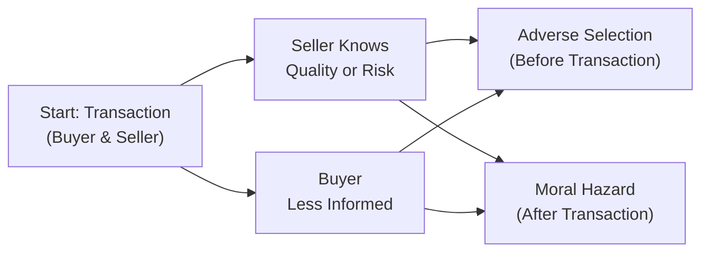

## Introduction and Overview

Sometimes we think that if everyone just follows their best self-interest, markets will magically supply the right amounts of goods at the right prices to the right people. But real-life markets often stumble when certain assumptions of perfect competition fail to hold (e.g., no externalities, perfect information, many small buyers/sellers). These hiccups may create “market failures.” If you’ve ever been stuck paying for repairs because a used car turned out to be a complete disaster, you’ve tasted the sour side of asymmetric information—where the seller might know way more than you about what’s under the hood.  

From a CFA exam perspective, understanding how and why markets fail is critical for analyzing real-world asset prices, financial policies, and portfolio decisions. This section delves into market failures—particularly externalities and asymmetric information—and highlights how government policies aim to address these issues. We’ll also look at potential pitfalls of interventions that can introduce new inefficiencies or “government failures.”  

## Defining Market Failure

Market failure describes any situation where free markets, left to their own devices, fail to maximize total economic welfare (or total surplus). In an idealized perfectly competitive market, the price system efficiently coordinates buyers and sellers, ensuring resources are allocated to their highest-valued uses. But in reality, there are times when markets misfire and generate outcomes that are not socially optimal.

Several well-known sources of market failure include:

• Externalities (positive or negative)  
• Public goods (non-rival and non-excludable)  
• Asymmetric information (adverse selection and moral hazard)  
• Market power (monopoly, oligopoly)  

We’ll keep our focus on two topics especially relevant for this stage of your CFA studies: externalities and asymmetric information.

## Externalities and Their Impact

An externality occurs when a transaction affects a third party who is neither the buyer nor the seller. If you’ve ever enjoyed the sweet smell of your neighbor’s outdoor barbecue (positive externality)—or endured the smoke from a nearby factory’s pollution (negative externality)—you’ve seen externalities in action.

Negative externalities pull the market quantity above the socially efficient level: producers or consumers do not bear the full cost of their decisions, which leads to overproduction or overconsumption. Positive externalities push the market quantity below the socially optimal level: since the full benefit isn’t captured by the private actor, we get underproduction.

### Correcting Externalities with Pigouvian Taxes or Subsidies

One potential way to “fix” a negative externality is a Pigouvian tax—a per-unit tax equal to the external cost. This tax forces producers (or consumers) to internalize the external cost. Analogously, a subsidy can encourage more of a good that has positive spillover benefits.  

When done correctly, these tools can shift the private cost or benefit toward the true social cost or benefit, aligning private incentives with overall societal welfare. But taxes or subsidies are not always easy to calibrate. Estimating the exact monetary value of an external cost or benefit can be tricky, and poorly designed taxes might create new inefficiencies.

## Asymmetric Information

Asymmetric information surfaces when one party to a transaction (often the seller) has more or better information than the other (often the buyer). In a perfectly competitive market, buyers and sellers have equal and free access to all relevant information. In reality, that rarely happens—especially in insurance markets or markets for experience goods and complex financial services.

### Adverse Selection

Adverse selection refers to the situation where individuals or goods that pose higher risks or are of lower quality are more likely to be selected or offered in a transaction. George Akerlof’s famous 1970 paper “The Market for ‘Lemons’” illustrated how used-car markets can deteriorate if sellers have more information about car quality than buyers.  

• Buyers, uncertain of a car’s quality, are only willing to pay an “average” price.  
• Sellers with genuinely high-quality cars find this price too low, so they exit the market.  
• The market gradually becomes dominated by “lemons,” or poor-quality cars.  

The same dynamic can arise in health insurance: people with higher health risks are more likely to seek insurance, but insurers—unable to perfectly observe each applicant’s risk—set premiums that might chase away healthier (low-risk) individuals. This scenario leaves the insurer with mostly high-risk customers, pushing premiums even higher, and possibly leading to market collapse.

### Moral Hazard

Moral hazard happens after the transaction takes place. It occurs when one party changes behavior because someone else bears some or all of the risk. For instance, if a company knows it’s insured for certain losses, it may take on riskier projects or be less cautious, secure in the knowledge that the insurance covers part of the downside.

Another classic example is the relationship between a company’s shareholders (principals) and its management (agents). Once managers are hired and entrusted with shareholder capital, they might spend corporate funds more lavishly or engage in projects that are personally beneficial rather than value-maximizing for shareholders—if there aren’t proper incentives or monitoring mechanisms in place.

## Illustrative Flow of Asymmetric Information

Below is a Mermaid diagram showing how asymmetric information can result in either adverse selection or moral hazard. Notice how lack of full disclosure or weak monitoring can distort decisions and lead to suboptimal outcomes.

• Adverse Selection typically happens before a transaction: sellers with more information can selectively market lower-quality goods or unhealthy applicants selectively enroll in insurance.  
• Moral Hazard manifests after a transaction: having insurance or delegated authority may alter a party’s incentive to behave prudently.

## Government Interventions and Policy Tools

### Mandatory Disclosures

To reduce adverse selection, many regulators mandate information disclosures. For instance:  
1. Public companies must publish audited financial statements under IFRS or U.S. GAAP.  
2. Sellers of financial products must disclose fees, risks, and performance track records.

This transparency ensures that potential buyers can better assess the “true” value or risk. The CFA Institute Code of Ethics and Standards of Professional Conduct also reinforce the principle of full disclosure, thereby reducing information gaps.

### Monitoring and Oversight

For moral hazard, oversight mechanisms such as corporate governance practices, independent boards, or performance-based compensation can align managers’ incentives with shareholder interests. In insurance, deductibles and co-payments discourage reckless behavior by making policyholders bear some of the cost.

### Government Failures and Implementation Costs

We often assume government solutions are a neat fix to market failures—but they can lead to “government failures.” Think of poorly designed taxes that distort incentives, or bureaucratic inefficiencies that increase administrative costs. Sometimes regulators lack the necessary information themselves, or face lobbying from powerful interest groups, which may lead to suboptimal policies.

In short, policy interventions can be beneficial, but they’re not always guaranteed to improve welfare. As a CFA candidate and future practitioner, remember that each real-world intervention has trade-offs, and it’s not enough to say, “Tax it!” or “Subsidize it!” We must analyze the costs, benefits, and potential unintended consequences.

## Practical Examples and Case Studies

### Health Insurance

• Adverse Selection: Individuals with higher health risks are more inclined to buy comprehensive health insurance. If insurers can’t differentiate high-risk from low-risk individuals, they set a uniform premium that’s higher than what low-risk individuals find worthwhile. Low-risk folks drop out, and eventually, the pool is dominated by high-risk policyholders, driving premiums up further.  

• Moral Hazard: Once insured, some people may be less vigilant about health checkups or overall lifestyle choices.  

Government Mitigation Strategy: Many countries make health insurance mandatory or impose open-enrollment periods with premium subsidies to ensure a balanced risk pool. Insurers may also adjust deductibles and co-pays to reduce unnecessary claims.

### Corporate Governance

• Adverse Selection: In a sense, shareholders worry that hidden problems in a company remain undisclosed before they buy stock. If disclosures are lacking, “bad” companies might dominate, and “good” companies might avoid listing publicly.  

• Moral Hazard: Once managers are ensconced, they might pursue personal perks, inflated salaries, or nepotistic hires. A well-structured board and performance-linked pay can help align managerial decisions with shareholder value.

### Environmental Externalities

• Negative Externality: Factories emit pollution affecting local communities. Without regulation or a Pigouvian tax, factories overproduce, ignoring the broader social costs.  

• Positive Externality: Firms that invest in research and development might create knowledge that others benefit from. Without subsidies or intellectual property protection, such firms underinvest relative to the societal optimum.

## Best Practices and Common Pitfalls

• Always check if there’s more information lurking behind the scenes. Whether you’re valuing a company or assessing an insurance product, ask yourself, “Do I have all relevant data?”  
• Watch out for moral hazard. Are you protected so well that you (or a counterparty) might get lazy or take on extra risk?  
• Recognize that not all government solutions will deliver the textbook outcome. Implementation details matter, and so do political or institutional constraints.  
• In portfolio management, consider how market failures might affect valuations, credit spreads, or regulatory risks. For instance, if lenders suspect moral hazard, they may charge higher interest rates to firms with poor governance, impacting the valuations of those firms’ securities.

## Exam Relevance and Practical Applications

Market failure concepts appear in numerous areas, from reading policy discussions to evaluating business risk. On the CFA exam (and particularly in real-world practice), you might see scenario-based questions where a firm’s financial statements are incomplete or biased, or you need to analyze the potential impact of a new environmental regulation on an industry. The goal is to identify when the usual equilibrium models fall short and how to factor in these distortions when making investment decisions.

When tackling item set or constructed-response questions, remember:  
• Identify whether the scenario involves externalities, asymmetric information, or both.  
• Discuss potential regulatory or private solutions to address those inefficiencies.  
• Evaluate possible unintended consequences that might arise from these interventions.

## Final Tips for the Exam

• Know the differences between adverse selection (pre-transaction) and moral hazard (post-transaction).  
• Be comfortable distinguishing how negative externalities shift supply curves and how positive externalities shift demand curves (and vice versa).  
• Be ready to illustrate how Pigouvian taxes or subsidies aim to align private cost/benefit with social cost/benefit.  
• Practice reading carefully. A typical exam question might slip in a detail about incomplete disclosure or hidden risk. Spot it and discuss how it affects market efficiency.  
• Keep your responses focused. Highlight the market failure source, discuss how the market outcome deviates from efficiency, propose a plausible solution (e.g., regulation or tax), and measure whether it might help or hurt overall welfare.

## References

• Akerlof, G. A. (1970). “The Market for ‘Lemons’: Quality Uncertainty and the Market Mechanism.” Quarterly Journal of Economics, 84(3): 488–500.  
• Spence, M. (1973). “Job Market Signaling.” Quarterly Journal of Economics, 87(3): 355–374.  
• University of California, Berkeley: Lecture Notes on Market Failures.  
• CFA Institute. (2025). CFA Program Curriculum, Level I & II (Core frameworks on ethics and quantitative methods).  

---

## Test Your Knowledge: Market Failures and Asymmetric Information



### Which of the following is a primary cause of adverse selection in used-car markets?

- [x] Sellers have more information about the car’s condition compared to buyers.
- [ ] Buyers have more information about financing options than sellers.
- [ ] Car manufacturers control the resale market exclusively.
- [ ] High-quality cars are subsidized by the government.

> **Explanation:** In the classic “lemons” problem, sellers know which cars are “lemons” or of poor quality, but buyers typically cannot distinguish a lemon from a good vehicle. This informational gap can cause average prices to dominate, chasing away high-quality cars.

### What is a key difference between adverse selection and moral hazard?

- [x] Adverse selection occurs before a contract or transaction; moral hazard arises after.
- [ ] Adverse selection is relevant only in health insurance; moral hazard only in auto insurance.
- [x] They both reduce market efficiency in identical ways.
- [ ] They are synonymous terms used interchangeably in economics.

> **Explanation:** Adverse selection stems from hidden information (“pre-transaction”), whereas moral hazard arises from hidden actions (“post-transaction”). Both can reduce market efficiency, but they do so in different ways.

### A Pigouvian tax is designed primarily to:

- [x] Internalize the external cost imposed on society by a private transaction.
- [ ] Make certain industries more profitable through targeted subsidies.
- [ ] Provide incentives for foreign direct investment.
- [ ] Penalize firms randomly to reduce competition.

> **Explanation:** A Pigouvian tax aligns private costs with social costs by charging producers (or consumers) for their negative externalities, thus reducing overproduction or consumption of harmful goods.

### Which of the following best illustrates moral hazard?

- [x] A manager invests in riskier projects because the company’s shareholders bear most of the downside.
- [ ] Low-risk applicants avoiding insurance because the price is too high.
- [ ] A credited university course offering free attendance to job-seeking alumni.
- [ ] Consumers being fully informed about a product’s manufacturing details.

> **Explanation:** Moral hazard arises when an individual or entity changes behavior after becoming insured or otherwise protected. In this example, the manager takes on more risk because personal downside is limited.

### Which policy tool typically helps reduce adverse selection in financial markets?

- [x] Mandatory disclosure requirements for firms going public.
- [ ] Providing subsidies to all firms in the market.
- [x] Eliminating all taxes and fees on corporate profits.
- [ ] Encouraging moral hazard through limited liability structures.

> **Explanation:** Requiring transparent and audited financial data reduces information asymmetry, thereby lowering the likelihood that unsuspecting investors buy “lemons.”

### Which scenario most closely represents a positive externality?

- [x] A technology firm invests in research that other companies can adapt free of charge.
- [ ] A factory dumps wastewater into a river, harming nearby fisheries.
- [ ] A commercial bank provides confidential underwriting advice exclusively to one client.
- [ ] A sporting goods retailer raises prices on bicycles in a booming economy.

> **Explanation:** When knowledge spillovers from R&D benefit third parties, society reaps additional gains. This exemplifies a positive externality.

### Government may fail to correct a market failure if:

- [x] The cost of implementing the intervention outweighs the benefits.
- [ ] They rely on mandatory disclosures.
- [x] They use Pigouvian taxes.
- [ ] They precisely estimate the external cost of a pollutant.

> **Explanation:** Government failures occur when policy responses introduce new inefficiencies or the administrative and enforcement costs exceed the net benefits.

### How do deductibles and co-payments address moral hazard in insurance markets?

- [x] They force individuals to bear a portion of the loss, discouraging reckless behavior.
- [ ] They attract only the healthiest individuals to insurance pools.
- [ ] They are primarily a form of Pigouvian subsidy.
- [ ] They ensure private goods become public goods.

> **Explanation:** By requiring policyholders to share some of the cost, deductibles and co-pays help align personal incentives with the insurance provider’s interest in minimizing unnecessary or excessive claims.

### Which statement most accurately describes the relationship between externalities and efficiency?

- [x] Externalities distort market outcomes by failing to account for third-party costs or benefits.
- [ ] Externalities only influence oligopolistic markets.
- [ ] Externalities do not affect long-term decision-making.
- [ ] Positive externalities always reduce the quantity supplied below socially optimal levels, while negative externalities do the same.

> **Explanation:** Externalities impact those not directly involved in the transaction. When negative externalities are overlooked, there is overproduction; when positive externalities are unaccounted for, there is underproduction.

### True or False: Mandatory disclosures always eliminate asymmetric information in financial markets.

- [x] True
- [ ] False

> **Explanation:** While disclosures significantly reduce information gaps, they rarely eliminate them entirely. However, for exam-related simplification, we often consider mandatory disclosures a primary tool against asymmetric information.


