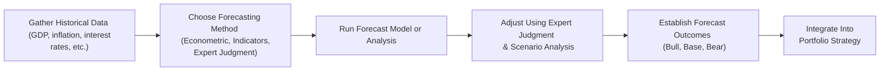

## Introduction
Macroeconomic forecasting is both an art and a science. It shapes our view of where the economy is heading and helps us make well-grounded decisions when allocating capital, managing portfolio risk, or advising corporate policy. A forecast might be as simple as predicting next quarter’s GDP growth or as complex as modeling a decade-long trend for inflation and interest rates. This process can involve sophisticated econometric methods, or it can get downright intuitive—relying on gut feeling and chats with industry insiders. And yep, sometimes those gut feelings end up being surprisingly accurate.

In this section, we’ll break down the main approaches to macroeconomic forecasting, blend in a few personal reflections on how these forecasts can go both amazingly well and hilariously awry, and finally connect these methods to the realm of capital markets.

## The Role of Macroeconomic Forecasting in Capital Market Expectations
If you’re an investor, you know there’s a lot riding on your projections for the economy. Maybe you’re a portfolio manager deciding whether to tilt toward cyclical stocks in an anticipated recovery, or a fixed-income analyst wondering if the central bank will raise rates in response to inflation. Even short-term traders watch monthly manufacturing reports for signals of the next big market move. Forecasting is central to building well-thought-out capital market expectations: deciding how certain asset classes—like equities, bonds, real estate, or even commodities—might perform under different macroeconomic conditions.

Consider a bond fund manager: anticipating a recession would likely prompt a more defensive positioning in long-duration treasuries, given the historical tendency for central banks to cut rates in weaker economic environments. Or an equity manager might shift allocation toward consumer staples if high unemployment threatens consumer spending in discretionary areas. In every scenario, the manager often depends on a macroeconomic forecast (or several) to guide these decisions.

## Key Approaches to Macroeconomic Forecasting
There are many ways to tackle forecasting, but four broad categories tend to dominate. These can be used independently or in combination:

### Econometric Models
Econometric models are the bread and butter for many professional forecasters. They take historical data, such as GDP growth, interest rates, consumption spending, or commodity prices, and use statistical techniques—often linear regressions—to figure out relationships among variables. Some forecasters prefer structural models that rely on economic theory (e.g., the idea that consumer spending might depend on disposable income), while others prefer vector autoregression (VAR) models, which treat multiple economic variables more symmetrically.

If you’ve ever built a regression on your laptop, you know the basic formula:


y_t = \beta_0 + \beta_1 x_{1t} + \beta_2 x_{2t} + \ldots + \beta_k x_{kt} + \epsilon_t


where \\(y_t\\) might be GDP growth at time \\(t\\), and \\(x_{1t}, x_{2t}, \ldots\\) are factors like short-term interest rates or leading indicators of demand, plus some randomness \\(\epsilon_t\\). Of course, more advanced structural models might incorporate multiple equations or constraints suggested by economic theory.

Anyway, economists love these models because they are testable and can be evaluated out-of-sample. That is to say, “Hey, does my model that was calibrated on data from 2000–2020 still perform well in 2021?” If it does, that’s a good sign that we’re picking up real economic relationships and not just random noise. But we have to be careful with big shocks—like the global financial crisis of 2008 or a giant pandemic—because these events often break the historical pattern that underpins our model.

### Leading Indicators
Leading indicators are basically the crystal ball of economics. They change before the overall economy changes, so we watch them for early warning (or early opportunity) signals. For instance, new orders for durable goods can give us a sense of upcoming manufacturing activity (people don’t typically order big machinery if they think demand is tanking). Building permits might hint at the future state of the construction sector. The Conference Board Leading Economic Index is a popular composite measure that lumps together several indicators like new orders, average weekly hours, and consumer expectations.

If you spot a downturn (like a consistent dip in leading indicators over a few months), you might think, “Uh-oh, demand is falling; maybe a broader slowdown is on its way.” And as an investor, that might mean considering a shift in your portfolio—perhaps reducing cyclical equities.

### Coincident Indicators
Coincident indicators are more like real-time updates. They move alongside the economy, telling us how things are going right now. Industrial production, personal income, and retail sales are the usual suspects. If they’re strong, it’s a sign that economic activity is chugging along in line with official growth numbers.

For everyday people, these are the headline indicators they often hear on the news. “Industrial production up 1% from last month” means the economy is likely enjoying stable or rising production. You might not glean big predictive power from these alone, but you’ll know how the economy is doing in the here and now. And that’s often critical when short-term market decisions hinge on ongoing expansions or emerging recessions.

### Expert Judgment / Qualitative Analysis
Let’s face it: not everything that matters can be measured or stuffed into a spreadsheet column. Geopolitical tensions, changes in consumer preferences, or technological disruptions might be missed by purely quantitative methods if they haven’t happened often (or at all) in historical data. That’s where expert judgment swoops in.

You might consult industry specialists who’ve been working in the same sector for decades. They often have a feel for cyclical turning points, especially in niche industries. There’s also the intangible question: “How do people feel about the economy?”—which might be gleaned from surveys, anecdotal evidence, or even social media chatter. In times of significant change—like a country imposing major sanctions or a sudden pandemic outbreak—expert opinions can fill the gap. It’s that intangible spark that says “There’s a shift in the wind,” and sometimes that’s more accurate in the short term than any model.

## Combining Quantitative and Qualitative Approaches
In practice, forecasters often merge the best of both worlds. An investment bank might have a large team building a dazzling econometric model based on historical data. Then, after the model spits out a number, the chief economist or strategist might apply judgments. They might say, “Yes, the model suggests a mild slowdown in housing, but I’ve talked with real estate developers at a conference—they’re seeing supply constraints that are more serious than the model assumes. Let’s adjust the forecast for housing starts downward.”

This synergy of data-driven analysis plus real-world insight can produce a more robust forecast. Of course, there’s always the risk of “beauty contest” forecasting, where the forecaster is more concerned about aligning with consensus than about the forecast’s actual accuracy. Groupthink can be a major pitfall here.

## Long-Term vs. Short-Term Forecasts
The length of your forecasting horizon matters. For the short term (say, over the next 3–12 months), details like monthly consumer confidence, weekly jobless claims, or business surveys can carry a lot of weight. Since you’re dealing with near-term cyclical fluctuations, you might rely more on high-frequency data or leading indicators. For instance, if building permits are plunging, you might not wait for the official GDP data to conclude growth is slowing.

For the long term (say, 3–10 years or more), structural factors come into play. We’re talking about demographics (like aging populations), technological progress (one of the biggest drivers of productivity growth), or policy regimes (e.g., how a government invests in education or infrastructure). Over these horizons, cyclical fluctuations matter less—and major shifts in government policy or global trade patterns matter more. Trend-based or structural models often incorporate variables like labor productivity growth (\\( \Delta \text{GDP per worker} \\)), capital accumulation, or exogenous technical changes.

## Forecast Validation Methods
Have you ever tested your personal forecasts against reality? Let’s be honest: sometimes it can be painful. But it’s essential. Two common validation tactics in forecasting:

• Rolling Window Regressions: You estimate your model on a moving window (e.g., 10 years of data), then slide that window forward. If the relationships in your model remain stable—even as time progresses—this signals that your model likely has some predictive capacity, not just data-mined relationships from the past.

• Out-of-Sample Testing: You estimate the model parameters using data up to time \\(T\\). Then you see how well the model performs for \\(T+1\\) onward. Good out-of-sample performance indicates your model might capture genuine economic relationships. Disappointing results often suggest overfitting.

## Limitations and Potential Pitfalls
Forecasting is inherently tricky. I once ran a forecast for an emerging market just before a surprise coup d’état. Well, no model was built to handle such an event (nor was my own imagination!). Unpredictable shocks—like natural disasters, pandemics, or dramatic policy changes—can toss a neat forecast right out the window.

Beyond that, we have to grapple with data revision issues. GDP numbers, for example, can be revised months (even years) after their initial release. Then you have behavioral biases: overconfidence (that voice in your head going, “Of course I’m right!”) or herding (conveniently sticking to consensus to avoid looking foolish alone). These biases can lead to systematic forecast errors.

In many cases, it’s not that the model is poorly built; it’s that the real world has changed or that we’re dealing with incomplete data. The best forecasters know they’re dealing with uncertain waters and plan accordingly.

## Practical Considerations
When you make decisions based on forecasts, it’s prudent to include a margin of safety. If your model predicts a 3% inflation rate, consider “what if it’s 5%?” or “what if supply chain disruptions throw everything off?” This is where scenario analysis comes in. You might build a base case forecast, a bullish scenario, and a bearish scenario, assigning probabilities to each. That way, you’re not locked into a single set of assumptions.

Another tip: update your forecasts regularly. Many new data points come out monthly, weekly, or even daily. If you’re relying on a forecast from 18 months ago in a fast-changing environment, you risk being blindsided. Instruments like “nowcasting,” which uses real-time data (like credit card spending or even satellite images of manufacturing facilities), can help keep your finger on the pulse.

## Integration with Capital Markets
In finance, everything circles back to risk-and-return considerations. Perhaps you’re doing a top-down asset allocation: you start with a macro forecast—maybe you suspect the economy will continue to expand at a modest clip, with inflation at a stable 2%. That might encourage you to slightly overweight equities relative to your neutral benchmark. Or if your forecasting framework signals a deep recession, you might tilt toward more defensive assets such as government bonds or defensive equity sectors (utilities, consumer staples, healthcare).

Macroeconomic forecasts are also central to risk measurement. If you expect big economic volatility, the standard deviation (or Value at Risk) of many asset classes might jump. This will influence how you size your positions.

## One Little Personal Anecdote
I remember early in my career being so proud of a fully specified multicountry VAR model—it had a million moving parts and looked super fancy. The model predicted stable growth in a major economy. Two months later, that same country was slammed by a surprise tariff from a key trading partner. Exports tumbled, investor sentiment took a nosedive, and my stable-growth forecast was toast. Honestly, it was an important lesson for me about humility: no matter how sophisticated your model, the world doesn’t always play by your rules. 

## A Real-World Look: Forecasting a Hypothetical Energy Shock
Let’s illustrate a scenario: Suppose you want to forecast GDP growth for a region heavily reliant on imported energy. You might start with an econometric model that includes energy prices, consumer spending, and relevant leading indicators (like new freight orders). But you see a potential geopolitical flash point threatening to interrupt energy supply lines. That risk isn’t well captured in historical data. So you consult an energy-market expert who says, “If this conflict flares up, energy imports could be disrupted for months, driving up local prices and hitting consumer spending.”

Your final forecast might incorporate a base scenario (no conflict) plus a downside scenario (conflict leading to an energy shortfall). The difference in those GDP paths could be significant. A portfolio manager might use these scenarios to hold options on energy commodities or to underweight sectors that suffer from rising energy costs. This approach of layering qualitative risk assessments on top of an econometric baseline can provide a more holistic view than either approach alone.

## Visual Representation of the Forecasting Process
Below is a simple Mermaid diagram to illustrate how these steps come together:



## A Brief Python Example of Rolling Regression
Below is a simplified Python snippet that demonstrates how you might implement a rolling regression for GDP growth on two factors—interest rates (INT) and consumer sentiment (CON)—using pandas and statsmodels.

```python
import pandas as pd
import statsmodels.api as sm

window_size = 40  # e.g., 40 quarters (10 years if quarterly data)
slopes = []

for i in range(len(df) - window_size):
    window_data = df.iloc[i:i+window_size]
    y = window_data['GDP_growth']
    X = window_data[['INT', 'CON']]
    X = sm.add_constant(X)  # Add intercept
    model = sm.OLS(y, X).fit()
    slopes.append(model.params)

results_df = pd.DataFrame(slopes)
results_df.index = df.index[window_size:]  # Align with the date index after the window
print(results_df.tail())
```

In practice, you’d evaluate how these parameter estimates evolve over time, looking for shifts or instability in relationships that might affect your forecasting approach.

## Best Practices and Common Pitfalls
• Diversify Your Methods: Relying solely on one forecasting approach can be risky. Mix econometric models with judgement from seasoned economists.  
• Keep an Eye on Data Quality: Garbage in, garbage out. Ensure you’re using the best data available and watch for significant revisions.  
• Beware Bias and Groupthink: Everyone might say the same thing just because it’s the safe consensus. Challenge assumptions.  
• Watch Out for Overfitting: Especially if you have many variables. Test your model out-of-sample.  
• Consider Multiple Time Horizons: Short-term models can help you gauge cyclical turns, while long-term models capture structural trends.  
• Practice Scenario Analysis: Always have a plan for best, base, and worst cases. The real world is rarely linear.

## Conclusion
Macroeconomic forecasting is a crucial building block for setting capital market expectations. Whether you prefer the rigor of econometric models or the intuition of expert judgment (or, more likely, both), the goal is the same: to peer around the corner of the future and bolster investment decisions with evidence-based planning. While we accept that forecasts will never be perfect—they can be invaluable for portfolio construction, risk management, and strategic planning when used thoughtfully and regularly updated. Ultimately, it’s about balancing quantitative analysis with qualitative insights, always staying vigilant against unforeseen shocks.

## References
• Stock, J. and Watson, M. “Introduction to Econometrics.” Pearson.  
• IMF World Economic Outlook reports:  
  https://www.imf.org/en/Publications/WEO  
• OECD Economic Outlook:  
  https://www.oecd.org/economic-outlook/  
• CFA Institute Research Foundation: “Macroeconomic and Market Models for Analysts”  

## Test Your Knowledge: Macroeconomic Forecasting



### Which of the following statements best characterizes the integration of macroeconomic forecasts into investment decisions?

- [x] Macroeconomic forecasts often guide asset allocation and sector positioning in portfolios.
- [ ] Macroeconomic forecasts are strictly used for short-term tactical trading and rarely affect long-term strategy.
- [ ] Macroeconomic forecasts have no relevance for risk management.
- [ ] Macroeconomic forecasts are only valuable for central banks and government agencies, not private investors.

> **Explanation:** Macroeconomic forecasts provide the foundation for investment strategies, helping forecasters and portfolio managers tilt portfolios toward certain asset classes or sectors and adjust risk exposures.

### Which of the following is a leading indicator often used in macroeconomic forecasting?

- [ ] Unemployment rate
- [x] New orders for durable goods
- [ ] Industrial production
- [ ] Real GDP growth

> **Explanation:** New orders for durable goods typically move before overall economic activity, signaling upcoming changes in manufacturing and consumer spending.

### When building an econometric model for forecasting, which validation approach involves testing the model on data not used in making the model?

- [ ] Rolling window regression
- [ ] Coincident indicators
- [x] Out-of-sample testing
- [ ] Rescaling the dependent variable

> **Explanation:** Out-of-sample testing examines the model's performance on a time period or dataset outside the original estimation window, revealing whether the model truly captures repeatable economic relationships or merely overfits historical data.

### Experts often combine quantitative forecasts with subjective assessments. Which of the following best explains why expert judgment remains indispensable?

- [ ] Expert judgment is purely intuitive and lacks credibility.
- [ ] Data rarely gets revised, so subjective insight corrects stable data.
- [x] Some unpredictable developments and unique market conditions are best captured by qualitative insights.
- [ ] Expert judgment is unnecessary when big data approaches are used.

> **Explanation:** Qualitative analysis allows forecasters to incorporate non-quantifiable factors—like sudden geopolitical events or regulatory changes—into the forecasting process.

### Which statement describes a pitfall of relying solely on historical time-series data for macroeconomic forecasting?

- [ ] It guarantees perfectly accurate results for future scenarios.
- [x] It may overlook structural changes and unrepeatable past conditions.
- [ ] It ensures robust short-term forecasts but fails in the long term.
- [ ] It removes the need for expert judgment entirely.

> **Explanation:** Historical models often rely on patterns that may not hold in the presence of one-off events, regime shifts, or new technologies.

### What is one advantage of using rolling window regressions when generating forecasts?

- [x] They help assess whether model relationships remain consistent over different time periods.
- [ ] They completely eliminate forecasting error.
- [ ] They require no historical data.
- [ ] They do not allow any structural breaks in the data.

> **Explanation:** Rolling window regressions test the stability of the estimated relationships by updating the regression sample over time. If relationships remain stable, the model is more trustworthy going forward.

### Which is the primary reason forecasters often use scenario analysis?

- [ ] To replace standard regression methods entirely.
- [x] To evaluate multiple possible outcomes, especially under high uncertainty.
- [ ] To comply with government requirements for worst-case analysis.
- [ ] To avoid using quantitative data in forecasts.

> **Explanation:** Scenario analysis is used to capture a range of outcomes (bull, base, bear) so that decision-makers can plan for uncertain future states. It’s especially important when markets face tail risks or rare events.

### Why might long-term forecasts place a heavier emphasis on demographics and productivity trends?

- [ ] Short-term forecasts already incorporate structural changes.
- [ ] It is easier to forecast monthly changes in productivity trends than annual changes.
- [x] Structural variables like demographics and productivity drive growth potential over extended horizons.
- [ ] Demographics fluctuate too frequently to matter for the long run.

> **Explanation:** In the long run, cyclical fluctuations even out, and macro growth potential is largely shaped by labor force growth, productivity improvements, and capital accumulation.

### A key limitation of macroeconomic forecasting is:

- [ ] It is immune to model risk.
- [ ] It always accounts for major external shocks.
- [ ] It is only valid for stock market predictions.
- [x] It is vulnerable to unexpected disruptions (shocks) and data inaccuracies.

> **Explanation:** Forecasts can be derailed by unforeseeable events (natural disasters, geopolitical crises) or evolving data revisions, making them inherently uncertain.

### Considering behavioral biases, which of the following best defines “groupthink” in forecasting?

- [x] Forecasters align with consensus to avoid standing out, potentially ignoring contrary evidence.
- [ ] Forecasters deliberately misrepresent data to match official government forecasts.
- [ ] Forecasters individually choose the same method because it is the most accurate.
- [ ] Forecasters adopt contrarian views to prove their independence.

> **Explanation:** Groupthink arises when forecasters converge on a common expectation to blend in with the consensus, sometimes ignoring signals that run counter to that collective view.


