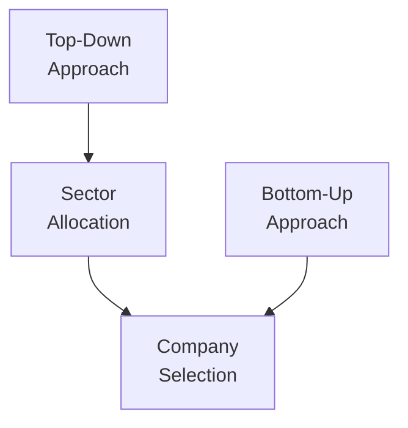

## Introduction

So, let’s say you’re an analyst at a major asset management firm, and your boss walks in and says: “We need to select a new set of equities for our growth portfolio. Should we first look at the macro climate or start hunting for hidden gems among individual companies?” That, in a nutshell, is the classic debate between top-down versus bottom-up analysis. Each approach offers a unique vantage point on how to forecast market trends, select securities, and build portfolios. In this section, we’ll explore the core ideas behind both methods, including how to use them in real-world scenarios, the advantages or shortcomings of each, and—ultimately—how they can be combined to set richer, more robust capital market expectations.

## The Macro Approach: Top-Down Analysis

Top-down analysis typically begins with the “big picture”—national or global economic conditions, monetary and fiscal policies, political events, regulatory changes, and so forth. Think of it as zooming in from the stratosphere: You start by examining global GDP growth forecasts, central bank decisions on interest rates, inflation expectations, and industry-specific macro trends. Only then do you drill down into industries or regions that appear most promising under those macro conditions.

• Focus on Macro Factors:  
  – GDP growth (real vs. nominal)  
  – Inflation rates, monetary policy, and credit cycles  
  – Political stability, regulatory environment, and possible geopolitical tensions  
  – Exchange rate regimes, capital controls, and other cross-border considerations  

• How It Narrows to Industries and Companies:  
  – Identify which sectors traditionally outperform in certain stages of business cycles (e.g., consumer staples in downturns, cyclical industries in recoveries)  
  – Recognize externalities such as tariffs, commodity price swings, or interest rate shifts that can favor or hamper specific industries  
  – Pinpoint regions or asset classes that might benefit from central bank easing or from surging consumer demand

For asset allocators, top-down analysis is incredibly handy when making large-scale decisions like choosing the relative weighting between equities and bonds, or deciding which geographic markets to emphasize. Global macro hedge funds often leverage top-down thinking to capitalize on interest rate differentials, currency shifts, or commodity price trends stemming from major geopolitical events.

### Advantages of Top-Down Analysis

• Efficiency: You can quickly eliminate markets or industries that are obviously misaligned with your macro forecast.  
• Alignment with Policy Shifts: Monetary and fiscal policies can alter the investment climate significantly; spotting them early is a big win.  
• Broad Exposure: Particularly useful when managing multi-asset portfolios or country/sector exchange-traded funds (ETFs).

### Disadvantages of Top-Down Analysis

• Missed Company-Level Gems: A broad forecast might incorrectly exclude certain companies that are poised to outperform, even if the overall sector is out of favor.  
• Overgeneralization: Nuanced or rapidly shifting industry-specific trends may fly under the radar if the focus remains too high-level.

## The Micro Approach: Bottom-Up Analysis

Bottom-up analysis, on the other hand, inverts the hierarchy. You start with individual companies and their fundamental metrics: earnings growth, revenue stability, competitive dynamics, and managerial competence. A typical bottom-up study might include detailed discounted cash flow (DCF) valuations, ratio analyses (e.g., P/E, EV/EBITDA), or thorough investigations into a product’s viability. 

You might recall that day when you found a small-cap company with an unassuming brand but a fantastic new technology. There was a feeling—like you’d discovered buried treasure. That’s precisely what bottom-up analysts live for: a strong belief that meticulous fundamental research can unearth hidden value. Only after concluding that a company is promising do bottom-up investors consider macro factors to see if they might bolster or hamper that company’s prospects.

• Focus on Company Fundamentals:  
  – Earnings projections, revenue growth, profitability trends  
  – Leadership quality and corporate governance  
  – Product pipeline, research & development strengths, innovation capacity  
  – Competitive environment, barriers to entry, brand power  

• Positioning Within the Broader Market:  
  – Assess macroeconomic influences (e.g., inflation or interest rates) only after establishing the company’s intrinsic worth  
  – Evaluate how industry trends or consumer demand might affect future cash flows  
  – Determine if currency exposures, trade barriers, or regulatory issues might undermine the thesis

### Advantages of Bottom-Up Analysis

• Identifying Mispriced Opportunities: It’s the best approach for discovering undervalued gems or reaping outsized gains from unique competitive advantages.  
• Deep Company Insights: You thoroughly understand a firm’s operations, competitive positioning, and potential catalysts for growth.  
• Flexibility Across Market Cycles: Even in an unreceptive macro environment, a robust bottom-up case can identify resilient companies.

### Disadvantages of Bottom-Up Analysis

• Macro Blind Spots: Overemphasizing firm-level fundamentals might lead to ignoring systemic risks—such as recessions or policy changes that can drag even the best companies down.  
• Time-Intensive: Conducting thorough qualitative and quantitative research on each company is laborious and can be resource-heavy.

## Diagram: Macro-to-Micro and Micro-to-Macro

Below is a simple Mermaid diagram showing how the top-down (macro-first) and bottom-up (micro-first) approaches ultimately converge at company selection.

As you can see, both approaches—though starting at different points—eventually meet at the decision: “Which companies deserve our capital?”

## Practical Application in Capital Market Expectations

In practice, investors often use both approaches to set capital market expectations (CMEs)—that is, forecasts of market returns, volatility, and risks that guide portfolio construction. 

• Asset Allocation:  
  – A global macro viewpoint might suggest overweighting emerging markets if you expect robust economic growth in select regions.  
  – Within these chosen regions, you use bottom-up analysis to zero in on local companies with strong potential sales growth or competitive cost structures.

• Tactical Sector Shifts:  
  – If top-down analysis signals that an economy is shifting into a late-cycle expansion, you might favor defensive sectors like utilities or consumer staples.  
  – Then, you pinpoint which companies in those sectors are best in class—perhaps those generating steady free cash flows and having strong dividend policies.

• Security Selection:  
  – Even if your macro outlook is negative on an entire sector, a bottom-up approach might uncover a niche firm whose products are recession-proof or whose management consistently outperforms peers.  
  – Conversely, bullish top-down forecasts for an industry can lead to significant gains if you identify especially innovative firms within that space.

## Combining Both Approaches for Robust Analysis

Now, maybe you’re wondering: “Why not just pick one method and go for it?” In reality, many analysts and portfolio managers blend both approaches to balance their strengths and weaknesses.

• Enhancing Precision: Top-down can provide overall direction—such as, “We expect healthcare to benefit from demographic shifts.” Then bottom-up can help you select which specific healthcare companies have the most potential within that theme.  
• Risk Management: A purely bottom-up portfolio that ignores macro vulnerabilities could be blindsided by systemic shocks. Meanwhile, a purely top-down allocation might overlook outstanding companies in an unloved sector.  
• Confirmation of Investment Thesis: A favorable macro context plus solid company fundamentals can foster a stronger conviction in an investment. Conversely, if a sector is projected to do well but the individual stock’s numbers don’t add up, that’s a telltale sign to stand aside.

## Case Study Example: Renewable Energy Transition

Consider a fund manager looking at the burgeoning renewable energy sector:
• A top-down approach would reveal shifting environmental policies, rising carbon taxes, and government subsidies for green technology. These macro factors suggest strong tailwinds for renewable energy investments.  
• Narrowing down to companies, a bottom-up approach might highlight a solar panel manufacturer with a scalable business model, strong patent protection, and robust revenue growth.  
• If the overall economic environment stays supportive (top-down) and the company’s financials remain healthy (bottom-up), you have a more holistic reason to invest.

## Common Pitfalls and Best Practices

• Pitfall—Ignoring Contradictions: If top-down analysis suggests a certain sector is declining, yet bottom-up suggests a company is thriving, dig deeper. Sometimes distinctive business models can outperform sector-wide gloom, but confirm the macro headwinds aren’t lethal.  
• Pitfall—Analysis Paralysis: Searching for perfect alignment between macro scope and micro insights can be time-consuming. Analysts might get stuck reconciling conflicting information.  
• Best Practice—Iterative Feedback Loop: Let top-down assumptions guide your first wave of analysis, then let bottom-up clarifications refine your macro assumptions. It’s a living process, not a one-and-done exercise.  
• Best Practice—Stress Testing: Always test how your carefully selected companies perform under different macro "what if?" scenarios (e.g., sudden interest rate hikes, unexpected tax reform).

## Balancing with Regulatory and Ethical Considerations

When employing either approach, remember that compliance with ethical standards (e.g., CFA Institute Code of Ethics and Standards of Professional Conduct) remains paramount:

• Full Transparency: For instance, if you’re using macro data from government sources, you must verify its reliability and timeliness. Disclosing data sources and research methods fosters client trust.  
• Avoid Conflicts of Interest: Whether top-down or bottom-up, ensure that your recommendations or models don’t benefit you personally at the expense of client interests.  
• Use of Nonpublic Information: If you’re gleaning company-level insights (bottom-up), be mindful of insider trading restrictions.  

## Final Exam Tips

• Synthesize, Don’t Just Recite: In a CFA Level III setting, you’ll likely face questions that ask you to integrate macroeconomic forecasts with company-specific valuations. Show exam graders your ability to connect the dots logically.  
• Highlight Relative Merits: Essays may direct you to compare top-down vs. bottom-up for a particular portfolio strategy. Emphasize specific advantages and contexts where each shines.  
• Practice Scenario-Based Problems: Expect item set or constructed-response questions about how a portfolio might adapt if certain macro conditions change, plus how to pick stocks that fit the scenario.  
• Time Management: If a question asks for both macro and micro viewpoints, allocate your minutes wisely. Tackle top-down analysis succinctly, then provide your bottom-up detail in a well-structured manner.

## References

• Mauboussin, M. and Rappaport, A. “Expectations Investing.” Columbia Business School Publishing.  
• Damodaran, A. “Investment Valuation: Tools and Techniques for Determining the Value of Any Asset.” Wiley.  
• CFA Institute: “Equity Asset Valuation.”  
• CFA Institute Code of Ethics and Standards of Professional Conduct (Latest Edition).

## Test Your Knowledge: Top-Down vs Bottom-Up Analysis Quiz



### Which of the following best describes “top-down” analysis?

- [ ] An approach that focuses solely on discounted cash flow models without considering macro conditions.  
- [x] An approach that starts from broad economic indicators and narrows down to specific sectors and companies.  
- [ ] A technical approach that relies exclusively on price trends.  
- [ ] A method for analyzing derivative contracts independently of the underlying fundamentals.  

> **Explanation:** Top-down begins with macroeconomic data and then drills down to industries and companies.

### You’re analyzing a regional consumer electronics market. In a bottom-up approach, what is your very first step?

- [x] Evaluating individual companies’ balance sheets and income statements.  
- [ ] Identifying broad economic growth forecasts for the entire region.  
- [ ] Assessing foreign exchange rate trends.  
- [ ] Analyzing short-selling data on competitor firms.  

> **Explanation:** Bottom-up analysis starts with company-specific fundamentals before looking at broader trends.

### A significant disadvantage of a purely top-down approach is:

- [ ] Excessive time spent researching individual companies.  
- [x] Missing out on exceptional companies that remain profitable despite weak macro fundamentals.  
- [ ] The inability to forecast interest rates and inflation trends.  
- [ ] The higher transaction costs associated with global macro strategies.  

> **Explanation:** A purely top-down approach can overlook company-specific strengths or unique competitive advantages.

### Which macro factor would a top-down investor be most likely to emphasize?

- [x] Central bank monetary policy.  
- [ ] A company’s free cash flow projections.  
- [ ] Product-level profit margin changes.  
- [ ] A firm’s unique patents.  

> **Explanation:** Top-down investors prioritize big-picture influences like interest rates set by central banks.

### If an investment manager states: “This stock is undervalued because it trades at a lower multiple than peers, and its new product pipeline is strong,” their viewpoint reflects:

- [x] Bottom-up emphasis.  
- [ ] Top-down emphasis.  
- [x] A focus on company-specific factors.  
- [ ] Purely qualitative reasoning.  

> **Explanation:** Discussing valuations and pipeline strength indicates a bottom-up approach with company fundamentals.

### Combining both top-down and bottom-up analysis is beneficial primarily because:

- [x] It helps reduce the risk of ignoring macroeconomic signals or missing micro-level opportunities.  
- [ ] It automatically doubles portfolio returns.  
- [ ] It eliminates hedging requirements.  
- [ ] It exclusively applies to equity investing.  

> **Explanation:** Blending macro perspectives with company details creates a more balanced strategy.

### A bottom-up analyst might overlook:

- [x] Political turmoil that negatively impacts the entire market.  
- [ ] Poor management decisions within a specific firm.  
- [x] Sudden interest rate hikes that slow economic growth.  
- [ ] Horizontal mergers in the company’s industry.  

> **Explanation:** One risk of focusing on firm-level data is missing big-picture threats like political crises or interest rate shifts.

### A top-down manager deciding to overweight technology stocks due to strong GDP growth signals in a certain region would next:

- [x] Evaluate individual technology companies for competitive positioning.  
- [ ] Short-sell all non-technology stocks.  
- [ ] Initiate buy positions in every company from that region.  
- [ ] Halt further analysis to avoid confusion.  

> **Explanation:** After identifying the sector via macro signals, a top-down manager narrows to specific firms.

### In capital market expectations (CMEs), a top-down approach primarily contributes by:

- [x] Forecasting overall market returns based on macro signals.  
- [ ] Identifying mispriced individual stocks through detailed financial modeling.  
- [ ] Reviewing daily trading volume for anomalies.  
- [ ] Designing new derivative securities.  

> **Explanation:** Top-down is central to forming broad market return forecasts, which feed CME models.

### True or False: A bottom-up investor always ignores macroeconomic events.

- [x] True  
- [ ] False  

> **Explanation:** While “always” is an extremely strong word, bottom-up does tend to prioritize company fundamentals first. Strictly speaking, some bottom-up investors do eventually factor in macro data, but the approach itself inherently places secondary emphasis on macro factors, so the statement is “true” in the spirit of method prioritization.


