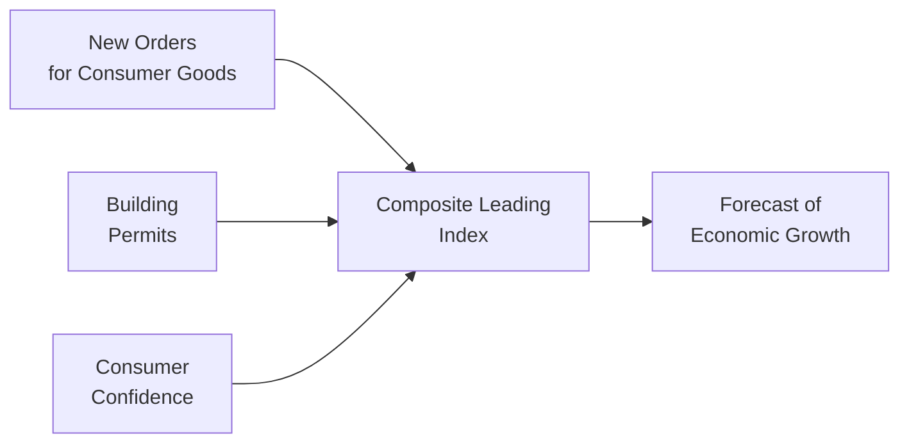

## Introduction
When we talk about forecasting recessions, planning portfolio allocations, or just trying to get a sense of what’s next for the economy, leading economic indicators tend to come up a lot. They’re called “leading” because, well, they often give us clues before the broader economy starts to shift direction. As a CFA® Level I candidate, it’s essential to understand these signals if you want to set realistic capital market expectations.

I personally remember a time (during my first job in a research firm) when I spent weeks studying building permit data—dull, right? Yet, that data provided real insight into future construction activity and broader economic momentum. So, yes, these indicators may seem granular, but they can totally inform high-level decision-making, especially if you're serious about forecasting or portfolio management.

## Key Leading Indicators
Leading indicators can come in various shapes and forms. Below are some of the most commonly watched ones:

• Building Permits: Reflect intentions to break ground on new structures. When permits rise, it may indicate activity in housing and construction is set to increase, supporting overall economic growth.  
• New Orders for Consumer Goods and Business Equipment: Rising new orders can mean upcoming boosts in manufacturing and industrial activity, while a decline may point to economic slowdowns in the near future.  
• Stock Market Performance: Share price trends can (though not always perfectly) signal future earnings expectations and investor sentiment.  
• Consumer Confidence Index: Provides insight into whether households might increase or reduce spending in the near term—consumers drive a big slice of GDP.  
• Initial Unemployment Claims: Not always enumerated among “leading” sets, but these claims often move before official unemployment rates. If initial claims spike, that’s an early sign of a softening labor market.

It’s worth noting that no single indicator is a perfect crystal ball—false signals happen! We’ll get into that soon.

## Data Sources
If you’re like me, you may have found yourself lost scrolling through government data portals at some point, trying to piece together tidbits of information. Let’s break down the main data sources:

### Government Agencies
• Bureau of Labor Statistics (BLS): In the United States, the BLS publishes data on employment, wages, productivity, and inflation. The monthly Employment Situation Report can shape short-term equity and bond market moves.  
• Census Bureau: Collects broad data on retail sales, inventories, housing starts, international trade, and more.  
• Eurostat: Governs statistical data across the European Union, including labor markets, GDP, and consumer prices.

### International Organizations  
• IMF: Monitors international economic trends, offering key global macroeconomic data.  
• World Bank: Provides extensive development indicators for emerging and frontier markets, from literacy to infrastructure indexes.  
• OECD: Best known for its Composite Leading Indicators (CLIs) that compare economic turning points across member countries.

### Private Research Firms
Institutions such as IHS Markit or major investment banks produce specialized data sets (manufacturing PMIs, consumer sentiment surveys, etc.), often with quicker releases and deep sectoral breakdowns. They can give you an early read on how things might evolve.

## Composite Leading Indicator Indexes
You’ll often see references to “composite” indexes that combine multiple leading indicators into one number to track. A prominent example is The Conference Board Leading Economic Index (U.S.). This index includes:

• The average workweek in manufacturing  
• New orders for consumer goods  
• Building permits  
• Stock prices  
• Leading credit index  
• And more

The index aggregates these components using specific weights and methodologies, aiming to predict cyclical shifts in the economy. The big plus? You get a single series that tries to show you where the economy might be headed. But remember, composite indexes are only as good as their chosen components and weighting scheme. If the economy undergoes structural shifts—like a large jump in e-commerce that changes how retail data might be interpreted—some of these older components might lose punch.

## Market-Based Indicators
Market signals can also serve as leading indicators. It might feel more intuitive, as the market is forward-looking:

• Interest Rate Spreads: The difference between short-term and long-term yields often signals expectations for future growth and inflation. The so-called yield curve inversion (when short-term yields exceed long-term yields) often foreshadows a recession.  
• Equity Indexes: Changes in major stock indexes can indicate shifting corporate earnings outlooks and investor confidence levels.  
• Credit Spreads: Increasing corporate bond spreads (over risk-free bonds) can reflect fear of deteriorating credit conditions.

Now, you should never rely on just one measure. The yield curve can invert prematurely, or stock markets can rally on speculation, so always cross-check with other data.

## Challenges in Using Leading Indicators
Leading indicators are famously tricky. They don’t always “lead” as perfectly as textbooks might imply:

• False Signals: It’s possible to have a brief pop in consumer confidence that fizzles out or a sudden drop in housing permits that doesn’t ultimately mean recession.  
• Data Revisions: Government bureaus often revise statistics, sometimes significantly. An indicator that looked bullish may later be revised downward.  
• Methodology & Structural Change: Calculation changes (e.g., revised seasonal adjustments) can break historical comparisons. Likewise, major shifts in globalization or technology can alter relationships among traditional indicators.

This is something I learned the hard way. Early in my career, I pinned a forecast on a spike in consumer credit—which promptly got revised away the following month, rendering my “predictions” moot. It was humbling, to say the least.

## Practical Forecasting with Leading Indicators
So how do you combine these signals effectively?

• Multiple Indicator Approach: Look for recurring signals across a variety of indicators (e.g., if building permits, new orders, and consumer confidence all move in the same direction).  
• Direction & Momentum: Are certain indicators moving modestly or surging quickly? The velocity of change can matter.  
• Time Lags: Leading indicators typically move a few months to maybe a year ahead of economic turning points, but the specific lag varies. Pay attention to historical patterns for each indicator.

One practical way is to look at a “heat map” approach—assign color codes (green, yellow, red) to each leading indicator’s momentum and observe trend consistency. If everything is turning green after being red for a while, watch out for a potential rebound.

## Integrating Leading Indicators into Investment Strategy
For the CFA® exam—and real-world portfolio management—leading indicators often drive tactical asset allocation decisions. Let’s walk through a few examples:

• Equity Allocation: If multiple leading indicators point to an upcoming expansion, you might overweight cyclical stocks such as industrials, consumer discretionary, or tech. Conversely, if you see a downturn on the horizon, shift more weight to defensive sectors like utilities or consumer staples.  
• Fixed Income Management: A flattening or inverting yield curve might prompt moves to shorter-duration bonds or higher-quality corporates, anticipating economic slowdown.  
• Currency Trades and Emerging Markets: If leading indicators (like manufacturing PMIs) suggest growth pick-up in an emerging market region, you might allocate to that currency or equity market early—before official GDP numbers confirm the trend.

## Best Practices and Common Pitfalls
### Best Practices
• Triangulate Data: Validate signals with at least three different indicators—government data, private surveys, and market-based metrics.  
• Compare Historically: Look for patterns in how these indicators performed in past cycles.  
• Remain Flexible: Adjust weightings or the selection of indicators as the economy evolves.

### Common Pitfalls
• Overreliance on One Indicator: Surprise! That one favorite metric can fail from time to time.  
• Ignoring Structural Shifts: If the economy has changed drastically (e.g., big push into digital services), older manufacturing metrics may be less relevant.  
• Confirmation Bias: If you already expect a recession, you might only see the data that confirms your view.

## Real-World Illustration
Consider the 2020 global pandemic. Many standard leading indicators rapidly collapsed, but not all had the same predictive power due to the unprecedented nature of lockdowns. Stock markets initially tanked, then soared amid massive fiscal and monetary stimulus—reflecting future expectations rather than present reality. Those who relied heavily on just one leading indicator (like unemployment claims) might have missed the quick market bounce, highlighting why combining leading signals with broader analysis is essential.

## Visualizing Leading Indicator Relationships
Below is a simple Mermaid diagram illustrating how a few leading indicators might converge to signal future trends. Feel free to imagine these blocks represent different data sets and their combined effect on a composite leading index:

The diagram shows that each of these indicators (new orders, building permits, confidence) feed into a composite measure, which analysts use to forecast growth. Of course, in real life, you might have 7–10 components, plus the occasional revise or weighting tweak.

## Conclusion and Exam Tips
Leading economic indicators are powerful, but they’re not infallible. A big part of mastering these indicators as a CFA® candidate is understanding how to interpret them in concert—and how to handle their inherent limitations. Remember:

• Keep an eye on data revisions and cyclical contexts.  
• Cross-check multiple indicators, including market-based signals like interest rate spreads.  
• Use leading indicators to guide your expectations about economic turning points, then consider how those expectations shape portfolio decisions.

During the exam, you may be presented with scenario-based item sets or essay-style questions referencing leading indices or market-based indicators. Be sure to:  
• Identify which indicator might be moving first.  
• Question the reliability of each indicator in the given context.  
• Propose an investment strategy change based on these signals.  
• Address potential pitfalls and alternative outcomes, demonstrating critical thinking.

Now, time to put this knowledge to the test!

## References and Further Reading
• [The Conference Board: “Leading Economic Indicators”](https://www.conference-board.org/)  
• [OECD: “Composite Leading Indicators”](https://www.oecd.org/sdd/leading-indicators/)  
• [Bureau of Labor Statistics](https://www.bls.gov/)  
• IMF, World Bank, Eurostat, Census Bureau, and many other data providers  

---

## Test Your Knowledge: Leading Economic Indicators and Data Sources



### Which of the following is considered a leading economic indicator that often predicts shifts in construction activity? 
- [ ] The unemployment rate
- [x] Building permits
- [ ] Personal consumption expenditures (PCE)
- [ ] Industrial production index

> **Explanation:** Building permits typically move in advance of construction activity and are commonly used to anticipate potential changes in economic growth.

### What aspect of consumer confidence makes it a leading indicator?
- [ ] It directly reflects past retail sales.
- [ ] It is embedded in GDP calculations.
- [x] It reflects consumers’ intentions to spend, signaling future economic momentum.
- [ ] It measures how much consumers spent after the fact.

> **Explanation:** Consumer confidence asks respondents about their future spending plans and general outlook, hence providing a forward-looking gauge.

### Which of the following represents a potential drawback when relying on leading indicators?
- [ ] They’re available too early to be useful.
- [ ] They’re unaffected by structural changes in the economy.
- [ ] They only reflect global data, not local details.
- [x] They can generate false signals and may be subject to significant revisions.

> **Explanation:** Leading indicators can sometimes produce misleading signals, and data revisions can alter initial readings. Certain structural changes or methodological updates can also reduce their predictive power.

### Suppose the yield curve steepens significantly. Which of the following scenarios might it indicate from a leading indicator perspective?
- [x] Market participants expect economic growth and possibly rising inflation in the future.
- [ ] The economy is definitely already in a recession.
- [ ] The central bank has decided to de-peg the currency immediately.
- [ ] The short-term interest rates are now negative.

> **Explanation:** A steeper yield curve typically signals expectations of stronger growth and higher future interest rates, as long-term bond yields rise relative to short-term yields.

### A composite leading index that weights multiple indicators is beneficial primarily because:
- [ ] It focuses on a single key metric.
- [x] It aggregates various components, smoothing out the idiosyncrasies of individual indicators.
- [ ] It never changes its component structure.
- [ ] It is an official measure reported by the government only once.

> **Explanation:** Composite indexes combine multiple data points into one measure, capturing broader economic trends and helping reduce reliance on any one potentially volatile indicator.

### Which of the following market-based measures is commonly watched for signaling recession risk?
- [ ] The gold-to-silver price ratio
- [ ] Average corporate dividend payout ratio
- [ ] Foreign exchange volatility
- [x] Yield curve slope (spread between long-term and short-term bonds)

> **Explanation:** An inverted or significantly flattening yield curve has historically been a warning sign for recessions, making the slope of the yield curve a popular leading indicator.

### A sudden surge in initial unemployment claims would most likely:
- [x] Be considered a leading indicator of a potential rise in the unemployment rate.
- [ ] Indicate definitively that inflation is about to fall.
- [ ] Suggest an immediate decline in government spending.
- [ ] Confirm that GDP has risen for two consecutive quarters.

> **Explanation:** Rising initial claims often foreshadow higher unemployment in the subsequent months, thus leading official unemployment statistics.

### Why is it risky to rely solely on a single leading economic indicator?
- [ ] Policy intervention only affects one indicator.
- [x] It can produce misleading signals if temporary volatility or revisions occur.
- [ ] No single indicator ever moves before the real economy does.
- [ ] Only composite indexes provide useful data.

> **Explanation:** Overreliance on one indicator can lead to flawed conclusions since individual indicators can be volatile, revised, or temporarily driven by unusual circumstances.

### When comparing government agencies, private research firms, and international organizations for economic data:
- [ ] Private data has no lag, while government data always lags by over a year. 
- [x] Using a combination provides a more holistic view of economic trends. 
- [ ] International bodies always have the most accurate real-time data. 
- [ ] Data from government agencies never gets revised. 

> **Explanation:** Multiple sources allow confirmation of trends and can fill gaps in coverage or timeliness. No single source is perfect or meets every data need without revisions.

### Leading indicators are reliable when tested over many cycles. True or False?
- [x] True
- [ ] False

> **Explanation:** Leading indicators can be relatively reliable when used properly and verified over multiple cycles, although they can still fail in unique or extreme event conditions.


