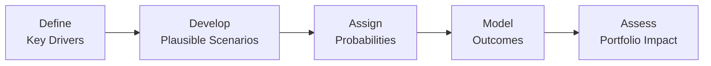
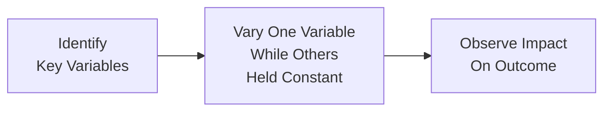

## Introduction

Forecasting economic performance can feel a bit like predicting the weather—sometimes the sun shines when you least expect it, and the storm clouds gather when you’re sure of a clear day. In practice, economists, analysts, and portfolio managers use systematic tools to cope with the uncertainty inherent in macroeconomic forecasting. Two of these popular tools are scenario analysis and sensitivity analysis. They’re cornerstones of risk management and strategic asset allocation, especially in dynamic or volatile markets. 

In short, scenario analysis emphasizes exploring multiple possible future states of the world—think of it as the “big picture” approach—while sensitivity analysis drills down on how changes in specific inputs, one at a time, might impact your forecast outcomes. Both are designed to help you spot vulnerabilities, identify opportunities, and structure your portfolio or strategic outlook just in case markets take an unexpected turn (which they often do).

Sometimes, I think back to my early days analyzing global equities during a time of extreme geopolitical tension. We had a baseline forecast that assumed marginal growth in GDP, but we also cooked up a scenario in which trade wars escalated and risk premiums skyrocketed, leading to slower growth (or even a full-blown recession). Planning out that stress scenario beforehand proved invaluable when a partial version of that scenario actually came to pass. Having that contingency plan in place, along with the knowledge of which portfolio elements were most sensitive to big changes in interest rates, gave us the confidence to make timely asset allocation shifts. This chapter explores how to build those skill sets so that you, too, can forecast with more confidence.

## Defining Scenario Analysis

Scenario analysis is an exercise in mapping out coherent “what-if” stories about the macroeconomic future. Let’s say you’re forecasting corporate earnings for the next couple of years. Rather than rely on a single “most likely” path, scenario analysis challenges you to spell out several distinct pathways:

• A base-case scenario: Your primary or most probable forecast, reflecting commonly accepted outlooks.  
• A best-case scenario: More optimistic assumptions about growth, inflation, interest rates, or corporate profitability.  
• A worst-case scenario: More pessimistic assumptions—potential recessions, market downturns, or systemic shocks.

Under each scenario, you typically estimate how key variables like GDP growth, interest rates, inflation, and employment levels behave. Then, you map those macro variables to critical market or firm-level outcomes like revenue growth, cost of capital, margin structures, and valuation multiples. By building multiple scenarios, you can bracket the uncertainty inherent in macro forecasting—avoiding the trap of believing that there’s one definitive future.

### Why Scenario Analysis Matters

• Proactive Risk Management. You get in front of tail events and black swans by brainstorming “what’s the worst that could happen?” and planning accordingly.  

• Mitigate Overconfidence. Human beings often exhibit overconfidence in base-case projections. Scenario analysis forces you to zoom out and think: “But what if policies change? Or what if consumer confidence takes a sudden hit?”  

• Improve Contingency Planning. Real-world portfolios often require quick adjustments when the narrative changes. Having pre-planned triggers or strategies in place for rapid rebalancing can make all the difference.

## Designing Effective Scenarios

Scenario design hinges on identifying the right drivers and constraints, then ensuring internal consistency. Let’s break down the usual steps:

### Identify Key Drivers  
These could be everything from demographic trends and consumer demand to fiscal stimulus, monetary policy, or commodity prices. You want to pick factors that have historically explained a large portion of variance in your target variables.

### Assign Probabilities (If Appropriate)  
Sometimes, you’ll want to assign subjective probabilities to each scenario—say a 60% chance for the base case, 20% for the best case, and 20% for the worst case. Just be careful; these probabilities can reflect analyst biases. Even so, explicit probability statements can be better than letting hidden biases go unrecognized.

### Develop Qualitative Logic and Quantitative Relationships  
You might note, for instance, that an expansionary fiscal policy stance usually lowers unemployment and encourages consumer spending. Historical correlation analysis can help you build relationships among GDP, inflation, employment, and interest rates. But don’t discount qualitative elements like policy changes, political constraints, or regulatory shifts. 

### Construct Coherent Stories  
For internal consistency, the elements of each scenario should make sense together. If you assume an aggressive interest rate increase in the “worst-case” scenario, make sure it aligns with your assumptions about unemployment, consumer debt burdens, and exchange rates.

### Model the Outcomes  
Using spreadsheets, econometric models, or simulation software, you plug in the scenario assumptions to see how your outputs—like corporate earnings or portfolio returns—would shift. This can be done using anything from simple discounted cash flow valuations to more complex macroeconomic forecasting models.

Below is a simplified visual representation of scenario analysis workflow:

## Sensitivity Analysis Basics

Where scenario analysis looks at multiple factors moving simultaneously, sensitivity analysis isolates the effect of one (or two) key variables on your forecast. Suppose you’re valuing a company using a standard discounted cash flow (DCF) approach. Your forecast might rely on a cost of capital of 8% currently. But what happens if interest rates rise, pushing your cost of capital to 10% or 12%? Sensitivity analysis will reveal how that shift ripples through your valuation.

### Core Steps in Sensitivity Analysis  

1. Select the variable(s) of interest (e.g., interest rates, inflation, exchange rates).  
2. Vary the chosen variable(s) within a plausible range (e.g., ±1%, ±2%).  
3. Keep other assumptions constant.  
4. Record the change(s) in your outcome variable (e.g., equity valuation or GDP forecast).  

Here’s a simple diagram that sums up the typical approach for sensitivity analysis:

### Benefits of Sensitivity Analysis  

• Isolated Focus. You see precisely how one assumption influences your model without multiple confounding shifts.  
• Highlight Critical Assumptions. If your model output changes drastically just by tweaking one variable, that’s a red flag that you need to handle that assumption (and the potential for forecast error) with extra caution.  
• Straightforward Implementation. Most spreadsheets and forecasting tools make it very simple to run sensitivity tables or “data tables” to gauge multiple variations quickly.

### Common Pitfalls  

• Overlooking Interdependencies. Real economies are complex. In practice, variables like inflation and interest rates often move together. Sensitivity analysis can over-simplify by ignoring this.  
• Focusing on an Unrealistic Range. If you vary a key input by too narrow a margin, you may miss the bigger picture.

## Combining the Two Approaches

Scenario analysis and sensitivity analysis aren’t mutually exclusive. In fact, they’re often used in tandem:

• Begin with scenario analysis to map out broad macro conditions (e.g., a recession scenario vs. a flourishing growth scenario).  
• Then conduct sensitivity analysis within each scenario to see which inputs cause the biggest swings in corporate earnings or portfolio returns.

This way, you capture the interplay of multiple variables in scenario analysis while still bearing down on the most critical or uncertain assumptions via sensitivity checks.

## Practical Utilizations and Examples

### Stress Testing Portfolios  
Imagine you manage a multi-asset portfolio with equities, bonds, and real assets. You might create a recession scenario that modifies:

• GDP growth: from +2% to -1%  
• Equity risk premiums: from 5% to 7%  
• Central bank policy rate: from 3% to 2%  

Then you evaluate each asset’s expected return or valuation under this scenario. If your portfolio draws down severely in that environment, scenario analysis shows you potential real-time vulnerability. Next, you could do a sensitivity analysis focusing, for instance, solely on inflation. You test 2%, 3%, and 5% inflation rates to see how your portfolio’s real returns are affected.

### High Inflation vs. Moderate Inflation  
Many times, inflation is the prime suspect in altering discount rates, input costs, and consumer demand. You can run scenario analysis with high inflation assumptions, say 6% or 8%, and a potential central bank response with higher interest rates. Then you measure the outcome for consumer spending, corporate profitability, or bond yields. Next, you might run a sensitivity analysis on just your cost of debt in a corporate model, toggling it from 4% to 6% to 8%, to see how that changes net income and free cash flow.

### Bottom-Up Integration  
In equities research, combining scenario analysis at the macro level with a bottom-up stock model can be powerful. For instance, if the worst-case macro scenario suggests a deep recession, you model how that filters down to firm revenues, cost structures, and profit margins. Then you apply a sensitivity analysis on the firm’s cost of capital or depreciation assumptions to refine your final valuation range. This layered approach can offer a 360-degree view of potential outcomes.

## Benefits in Forecasting

Scenario and sensitivity analyses offer a variety of benefits:

• Encourage proactive thinking about risk and tail events.  
• Mitigate overconfidence by highlighting multiple outcomes.  
• Provide frameworks for contingency planning—when you’ve already mapped out an economic downturn, you’re better prepared to act.  
• Strengthen stakeholder communication. Having a clear scenario-based forecast can make it easier to articulate to clients or colleagues why you recommend a certain strategy.

## Limitations

Even the best scenario-sensitivity combo can’t guarantee accurate foresight:

• Subjectivity in scenario construction. Two analysts can craft wildly different scenarios based on personal biases.  
• Complex interactions among variables can be nearly impossible to capture, especially in extreme conditions (i.e., black swan events).  
• Probability assignments can feel rather arbitrary. While enumerating them is often better than not, it can still be guesswork.  
• Ignores “unknown unknowns.” Scenario and sensitivity analyses only address the known risk factors or at least those you’re able to conceptualize. Unforeseen disruptions may still blindside you.

## Best Practices and Common Pitfalls

• Start with a Clear Baseline. Having a well-thought-out baseline scenario or set of assumptions is crucial for building meaningful “what-if” expansions.  
• Make Scenarios Distinct Yet Plausible. If your best-case and worst-case scenarios end up being too similar to the base case, you won’t gain much insight.  
• Use Historical Data, But Don’t Let it Dominate. History is a guide, not a guarantee. Structural changes in the economy may invalidate old correlations.  
• Communicate Clearly. Transparency in assumptions and probability weightings helps stakeholders understand the model’s limitations and strengths.  
• Avoid “Paralysis by Analysis.” Overly complicated scenario webs can sometimes confuse more than clarify. Aim for clarity and focus on the key drivers.  

## Exam Relevance and Tips

For your CFA exam, you may encounter scenario and sensitivity analysis in both item set questions and more open-ended prompts. Here are some tips:

• Pay Attention to Key Assumptions. The exam often tests your ability to spot nuanced relationships—such as how a shift in interest rates might trickle down into corporate earnings.  
• Walk Through the Logic. If you see a scenario labeled “recession,” expect to see consistent changes in employment, inflation, and interest rates. Inconsistency could be a trick in the question.  
• Identify the Most Sensitive Variables. The exam might ask you to determine which assumption’s change will most materially affect a valuation.  
• Practice Data Table Questions. In sensitivity analysis, especially with DCF valuations, you might see data tables with discount rates on one axis and growth rates on the other. The question might ask for net present value under certain cell values.

## Conclusion

Scenario analysis and sensitivity analysis both enrich your forecasting toolkit. By blending broad “what-if” thinking with precise single-variable stress tests, you stand a better chance of understanding the true distribution of possible outcomes—even when the future feels more uncertain than ever. The beauty of this combined approach is that it forces you to remain open-minded, to question your assumptions, and to build resilience into your investment strategies. And while no one can magically predict exactly where GDP growth or inflation will land next year, employing these analyses (and learning from them) significantly reduces unpleasant surprises. 

## Key Glossary Items

• Scenario Analysis: A process of analyzing possible future events by considering alternative possible outcomes (scenarios).  
• Base Case: The central, most likely scenario in forecasting.  
• Best Case/Worst Case: Scenarios that bound forecast uncertainty with optimistic or pessimistic assumptions, respectively.  
• Sensitivity Analysis: Examines how changes in one variable affect outcomes when all else remains constant.  
• Tail Event: A rare, extreme event with potentially severe impacts on forecasts or valuations.  
• Black Swan: An unpredictable, high-impact event that lies outside normal expectations.  
• Stress Test: A procedure that assesses how a portfolio or institution fares under adverse economic conditions.  
• Contingency Planning: Developing action plans for possible negative outcomes or uncertainties.

## References and Further Reading

• CFA Institute: “Scenario Analysis in Investment Management.”  
• Jorion, P. Value at Risk: The New Benchmark for Managing Financial Risk. McGraw-Hill.  
• Taleb, N.N. The Black Swan: The Impact of the Highly Improbable. Random House.  

## Test Your Knowledge: Scenario and Sensitivity Analysis in Economic Forecasting



### Which of the following best describes scenario analysis?

- [ ] Varying a single variable while holding others constant.  
- [x] Constructing multiple plausible future outcomes (e.g., base, optimistic, pessimistic) to estimate their impact on forecasts.  
- [ ] Employing only qualitative logic to derive an alternative future path.  
- [ ] Using Monte Carlo simulation to generate thousands of potential outcomes automatically.

> **Explanation:** Scenario analysis typically involves designing multiple coherent “what-if” narratives such as recession, steady growth, or expansion and assessing how each scenario affects key variables and forecast outcomes.  

### In the context of scenario analysis, the primary purpose of assigning probabilities to each scenario is to:

- [ ] Guarantee the accuracy of the forecast.  
- [x] Provide a structured way to weight expected outcomes and reflect subjective likelihoods.  
- [ ] Eliminate analyst bias entirely.  
- [ ] Invalidate any scenario that does not rate highly enough.

> **Explanation:** Probabilities in scenario analysis help incorporate analyst judgment about the relative likelihood of different futures. They do not eliminate bias or guarantee final accuracy, but they allow for a more nuanced aggregate forecast.

### An analyst performs sensitivity analysis by:

- [ ] Changing multiple variables simultaneously and measuring the outcomes.  
- [x] Changing one key assumption while holding everything else constant.  
- [ ] Developing base, best, and worst-case projections.  
- [ ] Focusing on unknown unknowns that can’t be quantified.

> **Explanation:** Sensitivity analysis changes a single variable at a time to see how the forecast or model outcome is affected.  

### Which of the following is a limitation of scenario analysis?

- [ ] It completely ignores how multiple variables interact with each other.  
- [ ] It relies solely on quantitative approaches without qualitative assumptions.  
- [x] Different analysts may create very different scenarios, incorporating subjective biases.  
- [ ] It is unable to address the worst-case scenario.

> **Explanation:** Scenario construction is to some extent an art, and subjectivity can lead analysts to propose wildly different versions of the future, leading to divergent outcomes.

### When conducting stress tests under a high-inflation scenario, which factor would most likely see a notable adjustment?

- [ ] Market risk premium is decreased to stimulate investment.  
- [ ] Interest rates remain constant.  
- [ ] Consumer spending is assessed as stable across the board.  
- [x] Central bank rates may be increased to control inflationary pressures.

> **Explanation:** Central banks commonly respond to high inflation with tighter monetary policy, therefore raising policy rates. This has downstream effects on valuations, borrowing costs, and consumer/investor behavior.

### In designing a worst-case scenario, an analyst’s primary objective should be to:

- [x] Explore a plausible negative event that significantly impacts the portfolio.  
- [ ] Show that the risks are smaller than they appear.  
- [ ] Include only changes in fiscal policy.  
- [ ] Use the identical assumptions as the base case, except for one variable.

> **Explanation:** Worst-case scenarios should capture a significant potential downside, exploring how negative events could profoundly affect portfolio returns and valuations.

### One advantage of using both scenario and sensitivity analysis together is that:

- [ ] It reduces the number of underlying assumptions.  
- [x] Scenario analysis captures interactions of multiple variables, while sensitivity analysis isolates the effect of individual inputs.  
- [ ] Neither scenario nor sensitivity analysis requires historical data.  
- [ ] This combination removes all subjectivity from the forecasting process.

> **Explanation:** Combining the two approaches offers a comprehensive view—scenario analysis outlines macro changes, and sensitivity analysis highlights which variables drive the most substantial changes in outcomes.

### A firm’s discounted cash flow valuation changes drastically when interest rates fluctuate by just 0.5%. From a sensitivity analysis perspective, this suggests that:

- [x] The cost of capital is a major driver of valuation for this firm.  
- [ ] The scenario analysis is invalid.  
- [ ] The model does not require further refinement.  
- [ ] The variable range was too wide.

> **Explanation:** A large shift in valuation from a small change in interest rates indicates that interest rates/cost of capital is a key sensitivity driver in the valuation.

### Which statement about probabilities in scenario analysis is correct?

- [x] They can be somewhat arbitrary but can still help quantify relative likelihoods.  
- [ ] They are computed purely from historical data.  
- [ ] They must sum to more than 100%.  
- [ ] They eliminate all subjectivity in forecasting.

> **Explanation:** Probabilities in scenario analysis rely on both data and professional judgment. They often contain inherent subjectivity but still provide a structured way to incorporate likelihood estimates.

### Scenario analysis is particularly useful for:

- [x] Evaluating contingency plans for different economic environments.  
- [ ] Arriving at one definitive forecast with minimal variation.  
- [ ] Narrowing the range of possible outcomes to a single best option.  
- [ ] Predicting the exact timing of market turning points.

> **Explanation:** Scenario analysis allows analysts to consider various economic or market states, facilitating contingency planning for unexpected changes, rather than settling on one definitive forecast.


