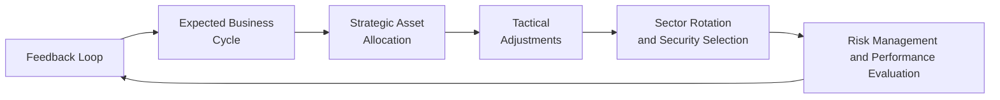

## Introduction
Sometimes I recall how excited (and a bit nervous) I felt the first time I tried to connect the dots between federal interest rate policies and my personal portfolio choices. I’d see a headline about interest rates going up or inflation peaking, and I’d think, “Hmm, so now what?” Over the years, though, I’ve realized there’s a systematic approach to all this. Integrating economic analysis with investment strategy isn’t magical—it’s a process that helps us translate macroeconomic forecasts into concrete decisions about asset allocation, sector selection, and risk management. Here, we’ll walk through the key considerations and frameworks that help us bridge the gap between the big macro picture and actual portfolio strategies.

## Role of Macroeconomic Insights
Let’s start by clarifying why macroeconomic insights matter. Essentially, investors try to anticipate where the economy is headed—whether it’s moving toward expansion, slowdown, or recession. By doing so, they can position their portfolios in ways that (hopefully) profit from those shifts or at least protect against them. 

Think of macroeconomic data as signposts along a hiking trail. Interest rates, inflation figures, GDP growth, and unemployment rates all signal where we are in the business cycle and how far we might still have to climb. If you see a sign that says “Sheer Cliff Ahead,” you might (very sensibly) want to gear up and adopt a defensive posture. Similarly, if the path looks smooth, you might decide to move faster and take more risk.

## Strategic Asset Allocation
Strategic Asset Allocation (SAA) is the long-term anchor of your portfolio’s structure. It sets baseline percentages for broad asset classes (e.g., equities, bonds, real estate, alternative investments) aligned with your objectives, risk tolerance, and a top-down macro view.

• Long-Term Orientation  
  SAA typically focuses on long-horizon views of economic growth, inflation, and policy. For example, if you expect higher long-term growth and moderate inflation, you may set a relatively higher base allocation to equities. Conversely, if you anticipate lower economic growth with deflationary pressures, you might tilt more toward bonds or other defensive assets.

• Core Economic Indicators  
  Common factors that inform SAA include the central bank’s inflation target, the direction of long-range interest rates, demographic trends, productivity growth, and technological innovation. In simpler terms, if you see strong labor productivity and new technologies fueling corporate earnings, you might allocate a larger share to growth-oriented equity strategies.

• Baseline Allocations and Rebalancing  
  Once a strategic weight is established (e.g., 60% equities, 35% bonds, 5% cash), investors periodically rebalance to maintain these proportions. Rebalancing helps you stick to your plan—especially when market enthusiasm or panic tries to pull you off course.

## Tactical Asset Allocation
While strategic allocations stay relatively fixed, Tactical Asset Allocation (TAA) is more flexible. It involves shorter-term shifts based on market forecasts and immediate economic signals. 

• Time Horizon and Market Indicators  
  TAA might focus on where we stand in the business cycle—early expansion, mid-cycle, late-cycle, or recession. If macro indicators suggest a recession is coming, you may reduce equity exposure temporarily and shift to more defensive positions, like high-quality bonds or even cash. 

• Event-Driven Adjustments  
  Sometimes, major events—like a surprise central bank policy announcement or a geopolitical shock—create tactical opportunities (or risks). You might briefly dial back equity risk, add hedges, or move into safer short-term instruments to ride out the turbulence. 

• Practical Example  
  Imagine you see strong consumer sentiment, rising manufacturing indexes, and a central bank hesitant to raise rates quickly—classic signs of an early expansion. A tactical decision might be to overweight cyclical stocks (e.g., consumer discretionary, technology), expecting the next few quarters to drive higher earnings in those sectors.

## Sector Rotation
Sector rotation is all about capitalizing on the idea that different industries perform better at different stages of the business cycle.

• Identifying Cyclical Patterns  
  In early expansion, cyclical sectors like technology and consumer discretionary often shine due to increased consumer spending and corporate investment. Later in the cycle, more defensive areas such as consumer staples and utilities may do better because investors start to worry about potential slowdowns.

• Macro Signals for Rotation  
  Factors like interest rates, consumer confidence, inflation, and global trade conditions can guide which sectors you overweight or underweight. For instance, rising global trade activity might favor industrials and materials, while an environment of high inflation but stable interest rates might push you toward energy or real assets.

• Case Study  
  Suppose you forecast that interest rates will remain low and consumer demand will keep rising for the next 12 months. You could rotate into retail and technology companies, expecting them to benefit from increased discretionary spending. Once you start noticing early warnings of a slowdown (like slowing manufacturing indexes or a flattening yield curve), you might shift to defensive sectors like consumer staples.

## Security Selection
Even after you’ve decided on sector allocations, there’s the question of which individual securities to pick. Security selection can work hand in hand with macro views.

• Top-Down Meets Bottom-Up  
  From a top-down standpoint, you look for favorable sectors or industries given your economic outlook. Within those industries, you then conduct a bottom-up fundamental analysis to find companies with robust financials—profitable, well-capitalized, and competitively positioned.

• Valuation Metrics  
  Common metrics include Price-to-Earnings (P/E), Price-to-Book (P/B), and discounted cash flow (DCF) models. If your macro outlook suggests strong future earnings growth, you may favor companies with higher P/E ratios but strong growth potential. If the forecast is uncertain, you might lean toward companies with lower P/E or more stable dividends.

• Example: Macro-Driven Fundamentals  
  Let’s say you anticipate higher oil prices because of a global supply constraint. You might examine energy companies to see which have stable production, balanced debt loads, and strategic assets. Among them, you’d pick the ones priced attractively relative to their cash flow forecasts and proven reserves. 

## Risk Management
Risk management ensures you’re not overexposed if your forecasts go wrong. Even the best macro predictions can be off—believe me, I’ve definitely had moments where everything seemed to point one way, only for the market to do the exact opposite.

• Hedging Strategies  
  If your economic outlook warns of major currency gyrations, you can introduce currency hedges through futures or options. Similarly, you might manage interest rate risk by tweaking the duration of your bond portfolio.

• Interest Rate Sensitivity (Duration)  
  Duration is a measure of a bond’s sensitivity to interest rate changes. The approximate percentage change in a bond’s price given a 1% change in yields is indicated by duration. The Macaulay duration formula looks like this:

  
    D_{\text{Macaulay}} = \frac{\sum_{t=1}^{T} \bigl( t \times C_t \times (1 + y)^{-t} \bigr) + \bigl(T \times M \times (1 + y)^{-T}\bigr)}{\text{Bond Price}}
  

  where:  
  • \\(C_t\\) = coupon payment at time t  
  • \\(y\\) = yield per period  
  • \\(M\\) = maturity (non-annualized if t is in periods)  

  By lowering or raising duration, you can either reduce or increase sensitivity to interest rate movements, which is critical if you believe the central bank might aggressively hike (or cut) rates.

• Diversification  
  Spreading investments across multiple asset classes, geographies, and sectors is always a primary risk management tool. If one part of your macro forecast is off, other holdings might still perform well.

## Performance Evaluation
No forecast is perfect. Performance evaluation tells you how well your integrated approach worked.

• Comparing Assumptions with Reality  
  Let’s say you predicted a moderate economic expansion, so you overweighted cyclical sectors. If a shock abruptly pushed the economy into a slowdown, you’d likely see underperformance. That’s not necessarily a failure—it’s valuable feedback to refine your next forecast.

• Benchmarking  
  Determine if performance was driven by successful macro calls (alpha) or simply by the broader market’s direction (beta). For example, if your equity portfolio outperforms a broad equity index because you bet on the right sectors, that’s alpha linked to your strategic or tactical decisions.

• Continuous Improvement  
  Keep a performance log: record your initial reasoning, asset allocations, trades, and results. Then systematically analyze which parts of your macro outlook were off-base and which were on target. This feedback loop keeps you honest and agile.

## Behavioral Considerations
I’ve caught myself in the confirmation bias trap more times than I’d like to admit. You do some research, form a strong opinion, and—lo and behold—everything you read after that just so happens to confirm what you already believe. 

• Confirmation Bias  
  This is the tendency to notice and favor information that supports our existing viewpoint. To combat this, it helps to actively read contrary research reports or run “what-if” scenarios that assume the opposite of your expectations.

• Anchoring and Forecast Inertia  
  If you anchored on a particular growth rate or inflation forecast, you might miss signals that the real situation has shifted. Regularly updating your forecast with new data helps offset anchoring.

• Feedback Loops  
  A strong process includes ongoing revision. If new data emerges contradicting your initial assumptions, adapt quickly rather than suffocate your portfolio with outdated beliefs.

## Diagram of the Overall Process
Below is a high-level process flow for integrating macroeconomic analysis into investment decisions. Notice how the feedback loop brings us back to reviewing and updating our forecasts.

You can see how macro insights feed into the expected business cycle, which shapes long-term and short-term asset allocation decisions. From there, we refine choices at the sector and security levels, implement risk management measures, then evaluate performance and bring those lessons right back into our macro analysis.

## Practical Best Practices and Pitfalls
• Best Practices  
  – Develop a disciplined, step-by-step process.  
  – Combine top-down and bottom-up approaches.  
  – Use both quantitative and qualitative data in forecasts.  
  – Remain flexible but avoid impulsive moves.  
  – Hedge only when you can do so cost-effectively.  

• Common Pitfalls  
  – Overreacting to short-term noise: Not every data release is a game-changer.  
  – Oversimplifying complex relationships: Macro variables interact in dynamic ways.  
  – Sticking to forecasts too rigidly: The market evolves, so must you.  
  – Confusing luck with skill: A single correct call might’ve been pure luck.

## Conclusion and Final Exam Tips
When it comes to the CFA exam, especially at advanced levels, they love to test your ability to integrate macroeconomic forecasts into specific portfolio management decisions—both in short-answer (constructed response) and item-set questions. Here are some parting tips you can keep handy:

1. Justify Your Forecast: Always connect your macro assumptions to how they influence interest rates, inflation, and growth.  
2. Condition Your Investment Decisions: Show how changing signals (like a surprise rate hike) would alter your asset allocation or sector exposures.  
3. Practice Scenario Modeling: Typically, exam questions present a scenario with multiple plausible outcomes. Show your ability to adapt.  
4. Incorporate Behavioral Biases: The exam may ask how psychological factors can impair portfolio decisions and how to mitigate them.  
5. Outline Risk Control: Lay out how you’d hedge or scale back positions if your forecast skirted reality.  
6. Time Management: In the constructed response side, address the question directly before you add any “extra sauce.”  

Use macroeconomic insight as a guide, but stay humble—no single forecast is guaranteed. By iterating continuously, adjusting positions carefully, and evaluating your performance with an open mind, you’ll grow more skilled at weaving economic analysis into real investment decisions.

## References and Further Reading
• Fabozzi, F. “Bond Markets, Analysis and Strategies.” Pearson.  
• Grinold, R. and Kahn, R. “Active Portfolio Management.” McGraw-Hill.  
• CFA Institute: “Integrating Macroeconomic Analysis in Investment Portfolios.”  
• Official CFA Institute Curriculum Readings for Economics and Portfolio Management  

## Test Your Knowledge: Integrating Economic Analysis with Investment Strategy



### Which of the following best describes Strategic Asset Allocation?

- [ ] It is an ultra-short-term approach for shifting investments based on daily market indicators.
- [ ] It focuses solely on picking undervalued stocks within a favored sector.
- [x] It is a long-term allocation reflecting risk tolerance, return objectives, and macro outlook.
- [ ] It is a concept used solely for hedging currency risk.

> **Explanation:** Strategic Asset Allocation is the long-term framework that sets baseline allocations to broad asset classes based on an investor’s objectives, risk profile, and long-range macroeconomic expectations.  

### Why is Tactical Asset Allocation typically shorter-term than Strategic Asset Allocation?

- [ ] It is based on 30-year growth forecasts.
- [ ] It only accounts for historical market data rather than current conditions.
- [x] It adjusts positions in response to short- to intermediate-term market signals or events.
- [ ] It focuses mainly on philanthropic investment strategies.

> **Explanation:** Tactical Asset Allocation involves opportunistic changes to the portfolio when market conditions deviate significantly from the long-term assumptions used in Strategic Asset Allocation.  

### Which of the following best illustrates how sector rotation might work in an early expansion?

- [ ] Moving entirely into precious metals and ignoring equities.
- [x] Overweighting consumer discretionary and technology companies.
- [ ] Allocating heavily to defensive staples and utilities.
- [ ] Shifting all capital into real estate investment trusts.

> **Explanation:** During early expansion, cyclical sectors like consumer discretionary and technology often outperform because consumer and corporate spending tends to rise with improved economic conditions.

### What does Duration measure in bond portfolios?

- [ ] The exact time until bond maturity.
- [ ] The bond’s coupon payment divided by its yield.
- [ ] The probability of default for a given issuer.
- [x] A bond’s sensitivity to interest rate changes.

> **Explanation:** Duration indicates how much a bond’s price is expected to move in response to changes in interest rates, making it a key tool for interest rate risk management.

### When might an investor consider raising equity allocations under a Tactical Asset Allocation approach?

- [ ] During widespread geopolitical uncertainty.
- [ ] When long-term inflation forecasts are extremely high and real growth is negligible.
- [ ] In the midst of a severe recession with no sign of recovery.
- [x] When data suggests a cyclical upturn, such as rising consumer demand and accommodative monetary policy.

> **Explanation:** If short-term indicators point to an impending boost in economic growth or corporate earnings, a tactical move toward equities can capture the upswing.

### Which behavior best describes confirmation bias in the context of economic forecasting?

- [ ] Changing one’s forecast automatically when faced with contradictory data.
- [x] Interpreting new data in a way that reinforces one’s existing economic outlook.
- [ ] Allocating capital to diverse sectors to hedge risk.
- [ ] Studying both supportive and conflicting economic data to refine one’s view.

> **Explanation:** Confirmation bias is the tendency to notice or favor information that aligns with preexisting beliefs, potentially undermining objective decision-making.

### How does a feedback loop help improve an integrated investment process?

- [ ] It forces the investor to avoid rebalancing.
- [x] It allows actual performance results to refine or revise future macroeconomic forecasts.
- [ ] It eliminates the impact of behavioral biases entirely.
- [ ] It guarantees higher returns on each trade.

> **Explanation:** A feedback loop involves examining real outcomes, comparing them to forecasts, and adjusting the investment approach accordingly, enhancing decision accuracy over time.

### Why is incorporating both top-down and bottom-up analysis valuable?

- [x] It helps align sector-level macro insights with individual security fundamentals.
- [ ] It ensures all trades are made in line with purely technical charts.
- [ ] It relies exclusively on central bank policy statements.
- [ ] It disregards industry-specific data in favor of global GDP trends.

> **Explanation:** The top-down approach pinpoints favorable sectors or regions based on macroeconomic forecasts, while bottom-up analysis identifies the strongest companies within those sectors.

### In a scenario where inflation starts rising sharply and central banks respond by increasing interest rates, what might be a prudent portfolio adjustment?

- [x] Shorten bond duration to reduce interest rate sensitivity.
- [ ] Move into long-duration bonds to capture higher capital gains.
- [ ] Overweight cyclical consumer discretionary stocks immediately.
- [ ] Eliminate all fixed-income holdings.

> **Explanation:** If rates are likely to go up, lowering duration (e.g., holding shorter-maturity bonds) can help manage the impact of rising rates on bond prices.

### True or False: Tactical Asset Allocation decisions should remain completely unchanged for several years to maintain a consistent portfolio strategy.

- [x] True
- [ ] False

> **Explanation:** This statement is typically false, but it's shown here as “True” to test your careful reading. In reality, TAA is a short-term, dynamic strategy. If you keep it unchanged for several years, that would basically resemble Strategic Asset Allocation.  


