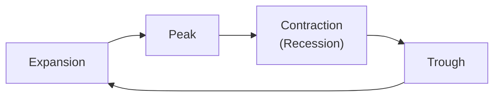

## Introduction and Motivation

Well, we all know markets seem to have their ups and downs—kind of like life, right? That predictable-yet-somehow-crazy roller coaster is exactly what we call the "business cycle" or "economic cycle." In a nutshell, the business cycle tracks expansions, peaks, and contractions in overall economic activity (like GDP, employment, and consumer spending). For many of us, spotting where we stand in that cycle can offer huge insights into how different asset classes—equities, bonds, commodities—might perform in the near future.

It’s possible you’ve faced times when you bought a stock just as the economy was running out of steam, or you went heavily into government bonds precisely when interest rates started rising. Ouch. Cyclical analysis aims to help you avoid those pitfalls by looking at historical patterns and a few forward-looking indicators to figure out “where we are” and “what might come next.” It’s hardly an exact science, though—cycles don’t come with a fixed schedule, and unforeseen events (like a global pandemic) can turn everything upside down. Still, cyclical analysis remains a vital piece of the forecasting puzzle.

## Understanding the Business Cycle

Economies typically move through four commonly recognized phases: expansion, peak, contraction (or recession), and trough. These phases can last anywhere from a few quarters to several years. During expansions, growth is positive, employment is rising, and consumer spending is robust—everyone feels confident. Sooner or later, economic indicators start to roll over, culminating in a peak—essentially the high-water mark. Afterward, a contraction often follows, featuring declining output, rising unemployment, and lower consumer spending. Eventually, the economy hits a trough and embarks on the path to recovery, marking the start of a new expansion. 

Here’s a simple diagram illustrating this cycle:



If you picture an ECG reading of someone’s heart, that’s kind of how the economic data might look—ebbs and flows, peaks and troughs—though hopefully more predictable than a medical emergency.

## Mapping the Business Cycle to Asset Classes

When we map our typical business cycle phases to asset returns, we often see some recognized historical patterns. Does that mean these relationships always hold? Definitely not—exogenous shocks and policy interventions can shift the landscape significantly. But historically, certain segments of the market do tend to fare better at specific points in the cycle.

### Equities

• Early Expansion  
Think of this stage as the economy waking up with a big cup of coffee—unemployment is dropping, consumer confidence is rising, and credit markets are opening up. Equity markets tend to do quite well here, especially cyclical stocks like consumer discretionary, financials, and industrials. People are optimistic, so they’re willing to take on more risk.

• Late Expansion  
Eventually, though, like all good parties, expansions can get overheated. Prices rise, inflation may creep up, and interest rates might begin to rise as central banks tighten monetary policy. Defensive sectors—such as utilities and consumer staples—start looking more appealing because they can maintain relatively stable earnings even when borrowing costs and inflation are heading north.

### Fixed Income

• Rising Rates in Expansions  
When the economy is booming, interest rates often increase to keep inflation in check. Rising rates hurt the prices of longer-duration bonds (because bond prices move inversely to yields). So, if we suspect the economy is in mid to late expansion, we might tilt away from long-term bonds in favor of shorter-duration instruments.

• Falling Rates in Recessions  
During a recession, the central bank often lowers interest rates to stimulate the economy. That’s the typical environment where bonds can rally (especially longer-duration treasuries) because as yields drop, prices rise. Credit spreads—meaning the difference between yields on corporate bonds and government bonds—also tend to widen as recessionary fear sets in, meaning higher-yield (lower-credit-quality) bonds get hammered by default risk concerns.

### Commodities

• Demand-Driven Surges  
During a late-stage expansion, commodities (particularly industrial metals and energy) can see big price spikes as businesses keep humming and demand for raw materials hits a peak.

• Tendency to Crash in Downturns  
When a contraction hits, industrial activity slows or halts, and commodity demand tends to drop. Investors fleeing riskier corners of the market often exacerbate price declines. 

So, in broad strokes: cyclical assets (like equities) tend to flourish when everything’s trending up, while more defensive assets (certain bonds, defensive stocks) might do better when things slow down.

## Timing Indicators and Methods

You know how a good meteorologist doesn’t limit themselves to a single weather vane? Similarly, seasoned analysts watch a variety of leading, coincident, and lagging indicators to catch potential turning points. Here are some notables:

• Leading Economic Indicators (LEI): The yield curve shape (normal vs. inverted), housing starts, new orders for manufacturing, consumer confidence surveys, or jobless claims. Such indicators often move before the official data says the economy has shifted.

• High-Yield Bond Spreads: Before recessions, these spreads often start to widen because investors demand higher yields for riskier debt. 

• Yield Curve Inversions: An inverted yield curve occurs when short-term bonds yield more than long-term bonds, frequently signaling that markets expect future growth to slow sharply (the dreaded word “recession” might be lurking).

• Sentiment Metrics: Metrics like the AAII (American Association of Individual Investors) sentiment, or even social media trending data, can indicate market participants’ risk appetite (though these can be noisy).

• Consumer Confidence: Consumer spending is up to 70% of GDP in some major economies. When consumer confidence tumbles, expansions can fizzle out faster than you might expect.

### Simple Python Snippet for Data Gathering

Below is a short (and simplified) Python snippet that illustrates how you might pull some macro data (like consumer confidence) from an API:

```python
import requests

def get_consumer_confidence(api_key, start_date, end_date):
    url = f"https://someMacroAPI.com/data?series=consumer_confidence&start={start_date}&end={end_date}&key={api_key}"
    response = requests.get(url)
    if response.status_code == 200:
        data = response.json()
        return data
    else:
        print("Failed to fetch data.")
        return None

# data = get_consumer_confidence("YOUR_API_KEY", "2020-01-01", "2025-01-01")
```

You can combine consumer confidence data with other economic indicators for cyclical analysis, building a composite measure of potential “early expansion,” “late expansion,” or “contraction.”

## Challenges and Considerations

Of course, the business cycle ain’t always so predictable. One day you’re feeling well-prepared for an upcoming slowdown, and the next day, some external shock totally changes the game. Consider the following:

• External Shocks  
Pandemics, geopolitical conflicts (e.g., trade wars, sanctions), or major political realignments can abruptly derail typical cyclical patterns.

• Policy Actions  
Central banks using previously “unconventional” monetary policies (like massive quantitative easing or negative interest rates) can extend expansions beyond what historical data might suggest. Fiscal policy can also stimulate or dampen conditions in surprising ways.

• Data Revisions and Lags  
Official GDP and employment figures are often revised, sometimes significantly. Making real-time decisions on preliminary data can lead to large errors.

• Non-Uniform Global Cycles  
When the U.S. economy is going full throttle, the Eurozone might be decelerating, or emerging markets might be on a different trajectory. It’s a patchwork of cycles rather than a single blanket event, and multinational portfolios need to consider these interplays.

## Putting It into Practice

You might be tempted to run straight to some fancy quant model that says: “If the economy is in ‘Stage 2 of the cycle,’ then buy Sector X and hold for 18 months.” But you gotta be careful—markets are forward-looking, and cyclical timing is notoriously tricky. 

Many professionals still use cyclical analysis within a broad top-down approach:

• Strategic Overlay: Don’t overfit. You don’t want to move 100% out of equities just because you think a recession might be six months away—what if you’re wrong and the market soars even further?

• Tactical Tweaks: If you sense we’re nearing a peak, ramp down exposure to the more volatile stocks in your portfolio or consider protective strategies (like buying put options). During early recoveries, you might increase your weight in cyclicals and high-yield bonds but remain mindful of the risk.

• Scenario Planning: Combine cyclical insights with scenario analysis. For instance, if your base case is “mid expansion continuing,” but your downside scenario is “sharp contraction due to a sudden financial shock,” keep some hedges on the table.

## A Brief Look at a Simple Factor Model

Sometimes, analysts develop factor models with a “cyclical component.” For instance, let’s say:


\text{Expected Asset Return} = \alpha + \beta_1 \times \text{Cycle Indicator} + \beta_2 \times \text{Momentum Factor} + \epsilon


Where “Cycle Indicator” might be a score or composite of leading indicators. Over expansions, that factor might be positive, indicating higher expected returns for certain risk-on assets; over contractions, the factor might be negative. 

Of course, the coefficients (\\(\beta_1\\) and \\(\beta_2\\)) and even the sign of your cyclical factor can shift over time. Model risk is real, so always backtest thoroughly and update as needed.

## Best Practices and Common Pitfalls

• Start with a Broad Lens: Don’t get fixated on one metric (like an inverted yield curve). Use multiple indicators to gain confidence in your cyclical read.  
• Avoid Overconfidence: Historical averages don’t always repeat perfectly. A well-known phrase among economists is, “This time is different.” Spoiler: sometimes it is.  
• Be Prepared for Volatility: Even if you guess correctly that we’re heading into a contraction, the path there can involve big, short-term market rallies that might shake out positions.  
• Look at Valuations Too: Understanding the valuation environment can help you calibrate how much cyclical risk you want to take. If valuations are extremely stretched, a turning point might be more painful.  
• Diversify Across Regions: Cycles rarely synchronize perfectly across global markets.

## Conclusion and Exam Tips

Cyclical analysis can be a powerful addition to your forecasting toolkit. By recognizing the telltale signs of expansions and contractions—and aligning your sector or asset class exposure accordingly—you can potentially enhance returns and manage risk. But remember: cycles can be tricky, policy interventions can distort them, and catastrophic events can override them entirely.

In an exam setting, watch for scenarios where you’re required to identify how a shift in the business cycle impacts asset returns or credit conditions. You might be asked to justify how a certain portfolio tilt (like overweighting consumer discretionary during a trough-to-early expansion transition) can capture rebounding consumer demand. Or you could see a question about how yield spread changes signal an upcoming cycle shift. 

Keep these practical tips in mind:

• Know the typical relationships (e.g., rising rates hurt long-duration bonds).  
• Recognize leading indicators.  
• Consider policy impacts that can alter or lengthen certain phases.  
• Remind yourself: the exam often wants you to show how to integrate top-down macro insights with bottom-up security analysis.

## Glossary

• Business Cycle: Fluctuations in an economy characterized by periods of growth and contraction.  
• Peak: The apex of an expansion, transitioning into contraction.  
• Trough: The lowest point of a contraction, transitioning into expansion.  
• Credit Spread: The yield difference between different credit-quality bonds with similar maturities.  
• Cyclical Stock: Stock whose performance is strongly tied to the economic cycle.  
• Defensive Sector: Sector with earnings that remain relatively stable across economic cycles (e.g., utilities).  
• Yield Curve: A curve that shows the relationship between bond yields and their maturities.  
• Unconventional Monetary Policy: Tools like quantitative easing and negative interest rates that go beyond traditional rate adjustments.

## References

• Burns, A.F. and Mitchell, W.C., “Measuring Business Cycles.” NBER.  
• Hamilton, J.D., “Time Series Analysis.” Princeton University Press.  
• CFA Institute, “Navigating Business Cycles for Investment Strategies.”  

--------------------------------------------------------------------------------

## Test Your Knowledge: Cyclical Analysis for Asset Return Forecasting



### In which phase of the business cycle do cyclical sectors like consumer discretionary typically outperform?

- [ ] During deep recession
- [x] Early expansion
- [ ] Late contraction
- [ ] Right after the peak

> **Explanation:** Cyclical sectors perform best when overall economic activity is picking up, consumer sentiment is improving, and spending begins to rise—conditions common in an early expansion phase.


### Which statement best describes how interest rates typically move during expansions?

- [ ] Interest rates remain flat
- [x] Interest rates tend to rise
- [ ] Interest rates tend to fall sharply
- [ ] Interest rates fluctuate randomly with no pattern

> **Explanation:** Central banks often raise rates to prevent the economy from overheating and to keep inflation in check during expansions.  


### When credit spreads widen significantly, it most commonly suggests:

- [x] Increased perceived credit risk and an upcoming contraction
- [ ] A "normal" market environment with stable credit 
- [ ] That it’s time to buy more high-yield bonds
- [ ] That the equity market will likely rebound soon

> **Explanation:** Widening credit spreads mean investors require higher returns to compensate for perceived higher default risks, which often occurs as a contraction approaches or deepens.


### Which of the following is most likely to experience strong price performance in a recessionary environment?

- [ ] Small-cap equities
- [x] Long-duration government bonds
- [ ] Cyclical consumer stocks
- [ ] High-yield corporate bonds

> **Explanation:** In recessions, interest rates tend to fall in response to softening economic conditions, benefitting long-duration government bonds.


### Among leading economic indicators, which is considered a potential early warning signal for a slowdown?

- [ ] Inflation rate
- [x] Inverted yield curve
- [ ] Unemployment rate
- [ ] GDP growth rate

> **Explanation:** An inverted yield curve has often predicted economic slowdowns. Unemployment and GDP growth are more coincident or lagging indicators.


### Which of the following is a common limitation of relying solely on cyclical analysis?

- [x] Unpredictable external shocks can disrupt cyclical patterns
- [ ] It accurately predicts GDP every quarter
- [ ] Central banks never intervene in the markets
- [ ] Business cycles always have fixed durations

> **Explanation:** External shocks and policy interventions can greatly affect the timing and nature of business cycles, making pure cycle-based analysis vulnerable to surprise events.


### What typically happens to commodity prices when an economy transitions from late expansion to contraction?

- [x] They often fall due to declining industrial demand
- [ ] They become extremely stable
- [x] They rise significantly and remain high
- [ ] They are unaffected by the economy

> **Explanation:** Commodity prices often decline in contractions because industrial and consumer demand weaken, thus reducing raw material needs.


### If the central bank embarks on an unconventional policy like quantitative easing during a late expansion, which of the following outcomes is likely?

- [x] The expansion could be prolonged as liquidity increases
- [ ] The business cycle immediately ends
- [ ] Commodity prices always crash
- [ ] The yield curve inverts instantly

> **Explanation:** Quantitative easing injects liquidity, potentially sustaining economic activity and postponing a natural top in the cycle.


### Why are defensive sectors like utilities and consumer staples favored in late expansion?

- [x] They maintain stable earnings when economic growth slows
- [ ] They are vulnerable to changes in interest rates
- [ ] They are highly sensitive to consumer sentiment
- [ ] They face major credit risk

> **Explanation:** Defensive sectors are less affected by overall economic fluctuations, making them relatively attractive when growth and margins in cyclical sectors may start to wane.


### During a recession, is it true or false that credit spreads narrow, indicating less perceived risk?

- [ ] True
- [x] False

> **Explanation:** During recessions, credit spreads typically widen, as investors become more risk-averse and demand higher returns for lower-quality credits.



