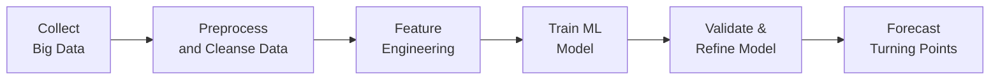

## Introduction

Have you ever felt like you’re missing crucial signals when forecasting the economy? I remember years ago—this was in my early analyst days—when I was stuck relying on delayed government indicators and spotty survey data. By the time official figures came out, the economic environment often had already shifted. Well, welcome to the brave new world of big data and machine learning, where the pace is fast, the data is diverse, and the potential insights can be staggering.

Today, big data sources such as satellite imagery, web-scraped pricing data, credit card transactions, and social media sentiment can give us near real-time glimpses of economic shifts. And machine learning? It’s no longer just a buzzword. These days, sophisticated algorithms can spot subtle turning points, refine our forecasts of GDP or inflation, and even help us detect cyclical peaks and troughs that were previously hidden in the data noise. That said, the march toward big data integration also brings a healthy dose of challenges. I’m talking about potential overfitting, data-quality issues, biases, and those occasional “black box” neural nets that even the best data scientists struggle to explain.

In this section, let’s explore the exciting combination of big data and machine learning in economic forecasting, highlighting practical strategies, common pitfalls, and the ways in which these techniques can be integrated with more traditional frameworks.  

## Big Data: The New Frontier

You know how sometimes we check social media to see what’s “trending,” maybe just to figure out the next big movie or fashion style? The same principle drives big data in finance. But it’s obviously bigger: it’s about using massive, often unstructured data sets in real time to gauge economic activities before official statistical agencies finalize their reports.

### Defining Big Data

Big data usually refers to “3Vs”:
• High Volume: Petabytes of data collected from thousands (or millions) of sources.  
• High Velocity: Data generated, collected, and processed in near-real time (or continuously).  
• High Variety: Different forms—texts, images, geospatial, transaction records, IoT sensor readings, etc.

It’s a fancy way of saying: we now have more data than we’ve ever had in history, coming at us more quickly, from more directions—and that’s a bit exhilarating, if also slightly terrifying. If used wisely, it can give you an informational edge when setting capital market expectations or forecasting GDP.

### Example: Satellite Imagery for Economic Analysis

One attention-grabbing case is satellite imagery. Suppose you’re trying to track inventory levels in a large country’s commodity ports. Traditional data might have a two-week or monthly lag. Meanwhile, satellite images can help measure the buildup or shrinkage of commodities in near real time by literally counting the number of cargo ships and the storage patterns. This approach can give commodity analysts a head start in projecting supply, demand, and price fluctuations.

### Real-Time Payments and Credit Card Data

Credit card spending is another leading indicator. Real-time transaction data can reveal shifts in consumer demand or confidence. If, for instance, you see a surge in restaurant and travel spending, you might adjust your near-term GDP forecasts upward. However, watch out: a sudden expansion in spending could also indicate potential inflationary pressures.  

## Machine Learning Overview

Machine learning brings sophisticated ways to identify patterns in data—ways that might be less intuitive (or downright invisible) to humans. If you’ve dealt with forecasting models that rely on linear regressions, you’ll quickly see that ML can capture relationships that go far beyond linear.

### Supervised Learning

In supervised learning, you provide the algorithm with labeled data (historical outcomes). This includes methods like linear and logistic regression, random forests, gradient boosting, and many others. Think about training a model to predict next quarter’s GDP growth based on hundreds of demographic, financial, and sentiment features. Once “trained,” the model can take fresh data and estimate future GDP growth.  

One typical approach is to deploy tree-based methods (e.g., XGBoost). Tree-based models are flexible and can handle diverse data types (continuous, categorical, etc.). The idea is to recursively split the data into smaller and more homogeneous “nodes,” capturing nonlinear or interaction effects. But do watch for overfitting: if your model has hundreds of hyperparameters, it can chase noise rather than the real signal.

### Unsupervised Learning

Unsupervised learning doesn’t have labeled targets. Instead, it seeks hidden structures in unlabeled data. Clustering algorithms let you group observations—like grouping countries that have similar macroeconomic structures. You may uncover that certain countries with parallel levels of industrialization or consumer spending patterns move in tandem, setting the stage for region- or cluster-specific forecasts.

### Deep Learning

Deep learning is essentially the extension of artificial neural networks to many (sometimes dozens or hundreds) hidden layers. The network’s architecture can capture extremely complex, high-dimensional relationships. In economics, deep learning might help parse unstructured text from social media posts or news stories to derive sentiment signals. Or it might integrate image data (say, real-estate images) with time-series data (like interest rates) to predict real-estate market shifts.  

Of course, deep nets can become black boxes. If you’re preparing for the CFA exam—and also working in compliance-conscious environments—be ready to address questions about model interpretability. Regulators, managers, or clients will likely ask: “Why did the model produce that forecast?”  

## Applications in Economic Forecasting

### Nowcasting

Nowcasting is the art (or science) of estimating the present or near-future economic conditions. In the old days, we’d wait for official GDP figures that might come out weeks after the quarter ends. But machine learning and big data feed more timely signals into the forecast. By analyzing daily or weekly consumer spending, mobility data, or social media sentiment, you can get a near-real-time read on whether the economy is picking up or slowing.  

For instance:
• Compare the weekly chain-store sales data, flight booking data, and web-based job postings.  
• Feed these signals into a model that systematically updates your GDP estimate.  
• Validate this “nowcast” when official numbers finally arrive, refining your model for better accuracy next time.

### Sentiment Analysis

Sentiment analysis is seriously popular in the finance world, from measuring the sentiments of corporate earnings calls to scanning news headlines or social media chatter. Armed with natural-language processing (NLP) and deep-learning algorithms, analysts can transform unstructured text into a numerical measure of positivity or negativity.

This measure can serve as an early warning system: if consumer sentiment dips drastically across social media, your forecast for consumer spending may also be adjusted downward—well before official consumer confidence indexes get published.  

### Pattern Recognition & Turning Points

Imagine sifting through decades of business-cycle data for multiple countries, with thousands of macro variables. A well-tuned machine learning model might detect subtle signals that historically preceded recessions or expansions. Of course, it might produce some false positives along the way. But if your model sees that a cluster of signals—like rising interest-rate spreads, certain social media anxieties, and certain yield-curve configurations—almost always preceded a downturn, it might provide a heads-up on a potential cyclical pivot.

Below is a simple mermaid diagram illustrating how a machine learning pipeline might identify turning points in an economic cycle:



## Challenges and Pitfalls

### Data Quality

A big chunk of big data may be user-generated (think social media or user reviews), which can be noisy, incomplete, or biased. If your satellite imagery is obscured by cloud cover, do you extrapolate? That might introduce errors. Additionally, data from different geographic regions may not be comparable or might arrive in inconsistent formats.  

A robust workflow for data cleansing, validation, and standardizing is essential. Always question whether that new dataset actually addresses your forecast question or if it’s just producing more noise.

### Overfitting

Ever had that moment where your model gets 99% accuracy on historical data? Usually, that’s a bright red flag that it’s just memorizing the noise. Overfitting is especially tricky with large or complex data. If your model can perfectly predict the past, it might do so by capturing random quirks that don’t hold in the future.

Guard against this by:
• Employing cross-validation: dividing your data into training and validation sets multiple times.  
• Using regularization: penalize the model for complexity so it doesn’t overfit.  
• Conducting robust out-of-sample tests: see how the model performs on entirely new periods or event windows.

### Explainability

Neural networks and ensemble methods can be black boxes, spitting out forecasts without easily interpretable logic. This can pose compliance, governance, and ethical issues. If regulators question how your model sets capital market expectations or weightings in a portfolio, you’ll need to demonstrate a clear methodology.  

Techniques like Local Interpretable Model-Agnostic Explanations (LIME) or Shapley values can help break down which features drive the final prediction for a specific observation.  

## Model Integration

### Blending Traditional Methods with ML

Machine learning methods often work best when combined with classic econometric models or subject-matter-expert judgment. For instance, you might:
1. Forecast baseline GDP using a structural (e.g., Keynesian) model.  
2. Overlay big data signals via a ML-based correction factor.  
3. Weigh them using Bayesian updating that assigns higher or lower weight to each component depending on performance over time.

### Continuous Recalibration

Let’s imagine your big data source is credit card spending data. That data might become less relevant if consumer habits change drastically (e.g., post-pandemic). So your model needs regular refreshment, or even a complete overhaul, in response to shifting consumer patterns, data breaks, or structural disruptions.

### Stress Testing

Stress testing is standard for banks, but it’s also increasingly relevant for economic forecasting under big data. How do your ML-driven forecasts hold up if the economy experiences a black-swan event? Would your model fail if certain data sources become unavailable or produce contradictory signals?  

## Ethical & Regulatory Considerations

### Data Privacy

Financial data often includes personal information that is governed by privacy laws such as the EU’s General Data Protection Regulation (GDPR). You must ensure compliance with these regulations, clarifying how data is aggregated or anonymized before it feeds your model.  

### Algorithmic Bias

All data sets are curated in some manner, and this curation can reflect biases. If social media sentiment is predominantly from one demographic group, the model might not accurately capture the entire population’s sentiment. Systematic biases can hamper the reliability and fairness of your forecasts, especially if your results inform policy or investment that affects large groups of people.

## Practical Example: Python Code Snippet

Below is a simplified example (for illustrative purposes) showing how we might use Python to build a random forest model for nowcasting GDP. (This is just conceptual; real implementation would require a more rigorous pipeline.)

```python
import pandas as pd
from sklearn.ensemble import RandomForestRegressor
from sklearn.model_selection import train_test_split

# 'gdp_growth': actual GDP growth, 'credit_spending': daily or weekly credit data,
# 'social_sentiment_score': derived from text analytics.

df = pd.read_csv('macro_dataset.csv')

X = df[['credit_spending', 'online_price_index', 'social_sentiment_score']]
y = df['gdp_growth']

X_train, X_test, y_train, y_test = train_test_split(X, y, test_size=0.2, random_state=42)

model = RandomForestRegressor(n_estimators=100, random_state=42)
model.fit(X_train, y_train)

score = model.score(X_test, y_test)
print(f"Model R^2 on the test set: {score:.3f}")

# (We would have new X data from near real-time sources)
new_data = pd.DataFrame({
    'credit_spending': [300], 
    'online_price_index': [102],
    'social_sentiment_score': [0.8]
})
nowcast = model.predict(new_data)
print(f"Nowcast for next quarter's GDP growth: {nowcast[0]:.2f}%")
```

## Best Practices and Common Pitfalls

• Start small: Incorporate one new data source at a time. Don’t overwhelm your models with every data feed you can find.  
• Validate thoroughly: Always confirm that your new input data actually improves out-of-sample performance.  
• Mind the shifting baseline: Macroeconomic relationships evolve over time, so your model’s parameters might need frequent recalibration.  
• Beware the hype: Big data and ML can work wonders, but they’re not magical. They can’t override fundamental economic laws or fix flawed data.  

## Conclusion and Exam Tips

From a CFA exam standpoint, you’ll want to master both conceptual understanding and the potential pitfalls of using big data and machine learning. For instance, exam questions could ask you to identify the best approach for nowcasting, or highlight how to mitigate overfitting in a random forest. They might also probe your understanding of sentiment analysis or how to interpret an “opaque” deep learning model in an ethical and regulatory context.

As you prepare for exam questions on these topics, keep these guidelines in mind:  
• Demonstrate awareness of data-privacy regulations and potential biases in your data.  
• Show you get the difference between supervised and unsupervised learning (especially how labeled vs. unlabeled approaches apply to macro forecasting).  
• Reference standard best practices to show you can handle cross-validation, data cleansing, and interpretability concerns.

Good luck, and get ready to impress the examiners (and your peers) with your cutting-edge knowledge of big data, ML, and the new horizons they’re opening in economic forecasting.

## References and Further Reading

• Chen, T. and Guestrin, C. “XGBoost: A Scalable Tree Boosting System.” Proceedings of the 22nd ACM SIGKDD.  
• McKinsey Global Institute: “Big Data: The Next Frontier for Innovation, Competition, and Productivity.”  
• CFA Institute Research Foundation: “FinTech and Machine Learning in Capital Markets.”  

## Test Your Knowledge: Big Data and Machine Learning in Economic Forecasting



### Which of the following best describes the term “big data”?
- [ ] Data solely from social media sources.
- [ ] Data that has been stripped of personal identifiers for privacy protection.
- [x] Data characterized by high volume, velocity, and variety.
- [ ] Data used only in supervised learning models.

> **Explanation:** Big data typically involves large volume, high-speed generation, and a variety of data formats (the “3Vs”), such as text, sensor data, images, and more.

### When applying supervised learning for GDP forecasting, which data characteristic is required?
- [x] Historical GDP outcomes (labels) that the model can learn from.
- [ ] Real-time credit card transactions only.
- [ ] Unlabeled economic data without known outputs.
- [ ] Negative sentiment data exclusively.

> **Explanation:** Supervised learning generally requires labeled data (in this case, historical GDP outcomes) to train models to predict future outcomes.

### Which of the following statements about overfitting is correct?
- [ ] Overfitting occurs when the model makes poor predictions on training data.
- [ ] Overfitting is eliminated by always choosing the largest possible model.
- [x] Overfitting happens when a model captures noise instead of underlying patterns from historical data.
- [ ] Overfitting is best achieved by using unsupervised techniques.

> **Explanation:** Overfitting refers to a model that has learned patterns too closely tied to the training data noise, diminishing its predictive power on new data.

### What is a primary goal of nowcasting in an economic context?
- [ ] Forecasting economic variables ten years into the future.
- [x] Estimating current or near-present economic indicators using high-frequency data.
- [ ] Evaluating policy decisions for the next election cycle.
- [ ] Avoiding official government statistics altogether.

> **Explanation:** Nowcasting focuses on using current, high-frequency data to predict the present or extremely near-future status of an economic variable.

### In deep learning, which of the following is typically true?
- [x] Multiple hidden layers can capture highly complex, nonlinear relationships.
- [ ] It always achieves 100% accuracy.
- [x] It can be challenging to interpret the model’s inner workings.
- [ ] It only works effectively on small data sets.

> **Explanation:** Deep learning involves multi-layer neural networks. While they can manage complex relationships, they can be hard to interpret and typically require large data sets.

### What is one reason to integrate machine learning forecasts with traditional economic models?
- [x] ML models alone might fail under structural economic changes, so blending them with established approaches can provide stability.
- [ ] Traditional models are always more accurate than ML approaches.
- [ ] Combining them reduces the complexity of final results.
- [ ] ML adds absolutely no value without classical models.

> **Explanation:** Integrating ML and traditional approaches capitalizes on each method’s strengths and can offset data or structural issues that a single model might face alone.

### Which technique helps address the “black box” issue in machine learning?
- [ ] Ordinary Least Squares (OLS) regression.
- [ ] Manual splitting of data sets.
- [ ] Grid search for hyperparameter tuning.
- [x] Tools like LIME or SHAP to interpret model predictions.

> **Explanation:** LIME and SHAP are methods that explain complex model outputs by attributing contributions to each input feature.

### An analyst collects satellite imagery to measure the cargo volume at major ports. Which challenge might emerge from this data source?
- [ ] Excessive clarity in interpreting port activity.
- [x] Coverage gaps due to cloud or weather conditions.
- [ ] Inability to generate real-time insights.
- [ ] A strict linear relationship with GDP growth.

> **Explanation:** Satellite imagery can be obstructed by clouds or poor weather, leading to coverage gaps that hamper data quality.

### Where might algorithmic bias arise in economic forecasting?
- [x] If the underlying data predominantly represents certain demographic groups or inherently skews results.
- [ ] If the machine learning model is too simple and uses fewer features.
- [ ] When interpretability tools like LIME are used.
- [ ] When official sources strongly verify the data.

> **Explanation:** Algorithmic bias can occur when training data does not represent the full population or has inherent partialities, causing skewed outcomes.

### The practice of splitting data into training and test sets, then rotating these splits repeatedly to assess model performance, is known as:
- [x] Cross-validation
- [ ] Supervised learning
- [ ] Hyperparameter tuning
- [ ] Data wrangling

> **Explanation:** Cross-validation is a standard procedure to ensure that a model’s performance is robust and not overly reliant on one particular training or test set.


