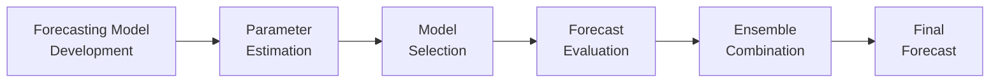

## Overview

Forecasting, especially in macroeconomics and capital market expectations, naturally involves some guesswork. On a personal level, I remember working on a macroeconomic model a few years back—proudly convincing myself that I'd nailed every detail—only to discover that a policy change suddenly made half my assumptions invalid. Ouch. That experience taught me just how sensitive forecasts can be when the economics (or the markets) decide to flip the script. In this section, we’re going to explore those tricky uncertainties that lurk behind our carefully designed models, give them a name—“model risk”—and discuss practical strategies for staying on top of it all while striving for better forecast accuracy.

## The Concept of Model Risk

Model risk refers to the possibility that a chosen forecasting method might be wrong or mis-specified. It’s a risk we encounter any time we rely on a mathematical or statistical structure to project the future. This can happen for several reasons:

• Incorrect functional forms (like using a linear model when the relationship is partly nonlinear).  
• Missing variables (overlooking an influential factor like consumer sentiment or regulatory changes).  
• Structural breaks (when relationships that held in the past simply disintegrate, often due to policy shifts or game-changing technologies).  

As an illustration, consider how the classic Phillips curve—once a reliable mainstay for linking inflation and unemployment—has been less stable over time. It’s as if the curve sometimes goes “on vacation,” ignoring historical patterns and leaving monetary policy officials scratching their heads.

When used in portfolio management or setting capital market expectations, imperfect models can lead to suboptimal asset allocation decisions, incorrect hedging strategies, or misguided risk assessments. For CFA candidates, understanding and acknowledging model risk is critical. It’s not just about having a working knowledge of mathematical formulas; it’s also about questioning assumptions and anticipating potential pitfalls.

## Uncertainty in Economic Relationships

It’s tempting to assume that relationships among macro variables, such as GDP growth and interest rates, or inflation and unemployment, will stay stable. But in reality, globalization and rapid technological change have thrown curveballs at these traditional linkages. Policies can shift overnight, data can be revised, and new economic structures can emerge. That’s the nature of real-world complexity.

In practice, we often rely on historical data to estimate correlations or regression coefficients. Think about the historically negative correlation between bond yields and stock prices: it might hold in certain regimes but break down under extreme conditions or following major policy changes. Recognizing that these relationships are inherently time-varying—and that yesterday’s patterns may not hold tomorrow—is a must.

## Sources of Forecast Errors

Forecast errors don’t just pop out of thin air. They come from specific, often interrelated sources:

### Sampling Error  
When we only have limited data—particularly if it isn’t representative of the true population—parameter estimates can become biased or imprecise. For example, if we’re evaluating stock market volatility since 2009, we might be missing the extreme dislocations of 2008, leading us to systematically misestimate risk.

### Parameter Instability  
Coefficients in regression models can shift over time due to structural breaks or evolving economic conditions. If you used data from the 1980s to build an interest rate forecast model, you’d probably see significantly different relationships than if you used data from the post-2008 financial crisis era.

### Exogenous Shocks  
Unexpected events—like natural disasters, sudden geopolitical tensions, or global pandemics—can alter economic trajectories in a hurry. Even well-specified models might struggle to incorporate these “bolt from the blue” scenarios.

### Behavioral Factors  
Markets aren’t just about data points; they’re about people, too. Emotions such as panic and euphoria lead to herding or contrarian behaviors that do not always match the neat assumptions of rational decision theory. This can magnify forecast errors, especially during bubbles or crises.

## Measuring Forecast Accuracy

To manage model uncertainty, you first want to measure your forecast performance in a structured way.

### Mean Absolute Error (MAE)  
MAE is the average of the absolute differences between predicted and actual outcomes. It puts every deviation on the same footing:

$$
\text{MAE} = \frac{1}{n} \sum_{i=1}^{n} |y_i - \hat{y}_i|
$$

This measure is intuitive—“How far off were we, on average?”—but it doesn’t emphasize larger errors any more heavily than smaller ones.

### Root Mean Squared Error (RMSE)  
RMSE also captures the average deviation between predictions and actuals, but it squares deviations before taking the average and then the square root:

$$
\text{RMSE} = \sqrt{\frac{1}{n} \sum_{i=1}^{n} (y_i - \hat{y}_i)^2}
$$

This measure penalizes large errors more strongly than MAE, which can be beneficial in risk-averse contexts where large misses are particularly damaging.

### Out-of-Sample Testing  
It’s one thing to build a model that performs fantastically on historical data. But can it perform just as well on data it hasn’t seen before? That’s where out-of-sample testing comes in. You train (or calibrate) a model on part of the available data, then test its predictive power on a later (or otherwise different) data set. This helps highlight overfitting issues and ensures you aren’t simply memorizing historical noise.

A quick example in Python might look like this:

```python
import numpy as np

def rmse(actual, predicted):
    return np.sqrt(np.mean((actual - predicted)**2))

historical = np.array([100, 102, 105, 110, 115, 117])
forecasted_in_sample = np.array([99, 101, 104, 109, 114, 118])

future_actual = np.array([120, 123])
future_forecasted = np.array([119, 126])

print("In-sample RMSE:", rmse(historical, forecasted_in_sample))
print("Out-of-sample RMSE:", rmse(future_actual, future_forecasted))
```

In practice, your real code might be more complex, but this snippet demonstrates verifying whether your model “generalizes” to new data.

## Model Combining (Ensemble Methods)

One proven way to mitigate model risk is to combine multiple forecasting approaches, also known as **ensemble methods**. Instead of placing all your bets on a single model, you gather forecasts from different models—like an ARIMA model, a vector autoregression (VAR), and perhaps a machine learning model—and then aggregate or weigh them. This tactic recognizes that each model has strengths and weaknesses. Averaging across them helps reduce the chance of large errors if one approach fails badly.

### Weighted Forecasts  
You might give more weight to a model that has historically performed better, or to one that you expect will do better in certain regimes. Sometimes these weights can be estimated dynamically, so the forecast can shift as new data becomes available.

### Bootstrap Aggregation and Bagging  
In more data-driven contexts, you can resample your dataset many times and build different models on each “bootstrapped” sample. Then you aggregate the forecasts. This approach harnesses the power of variance reduction—kind of like forming an investment portfolio with assets that have less-than-perfect correlation.

## Adaptive Forecasting

Forecasting methods need to be agile and able to learn from new events. Adaptive forecasting helps:

• Continuously re-estimate model parameters (e.g., a rolling-window regression).  
• Use Bayesian updating so prior beliefs about the model or its coefficients get revised based on incoming data.  

Imagine you run a Bayesian vector autoregression—each new GDP or inflation data point updates the posterior distributions of your parameters. Over time, your model “learns” that certain relationships might be shifting. This dynamic approach can be particularly handy in volatile macroeconomic environments.

## Practical Steps to Manage Model Uncertainty

We can’t remove all uncertainty—like it or not, forecasting is about forging ahead with incomplete info. But we can manage the risk effectively:

• **Margin of Error or Confidence Intervals**: Present forecasts with an uncertainty band (e.g., 90% or 95% range). That way, decision-makers can gauge how much risk they’re taking if the forecast deviates from the base scenario.

• **Communicate Uncertainty**: You’ll often see investor reports with disclaimers like “these projections are subject to significant volatility factors.” While it might sound like legal boilerplate, it’s also a real reflection of the environment we live in.

• **Ongoing Monitoring**: Don’t set random forecasts on autopilot. Keep track of actual outcomes versus the forecast, and re-evaluate your approach if errors become too large or patterns shift. This helps catch model drift early.

• **Scenario Analysis**: Even if you have a single best guess, it’s useful to consider alternative scenarios—bull, base, and bear—to highlight how different assumptions about variables (like interest rates, inflation, or growth) can impact results.

Below is a simple flowchart illustrating how forecasting, evaluation, and combination strategies can be structured:



## Glossary of Key Terms

• **Model Risk**: The potential for a flawed or inappropriate model to generate erroneous results, possibly leading to misguided decisions.  
• **Structural Break**: A substantial change in the underlying data-generating process, rendering prior relationships obsolete.  
• **Phillips Curve**: Historically, a relationship suggesting inflation is inversely related to unemployment. This curve has been less reliable in recent decades.  
• **Out-of-Sample Testing**: Evaluating model performance on data not used in model building, to reduce overfitting risk.  
• **MAE (Mean Absolute Error)**: The mean of absolute differences between forecasts and actual observations.  
• **RMSE (Root Mean Squared Error)**: The square root of the average of squared differences, penalizing larger misses.  
• **Bayesian Updating**: A process of continuously adjusting beliefs or model parameters as new evidence becomes available.  
• **Confidence Interval**: A probabilistic range around a forecast that indicates where the actual data might lie with a given level of certainty.

## Final Exam Tips

• Prepare for scenario-based questions that present a model’s forecasts and ask for interpretation or improvement strategies.  
• Practice evaluating bias and variance trade-offs in forecasts—understanding how overfitting might exaggerate short-term accuracy but fail out-of-sample.  
• Be ready to articulate the rationale for using multiple models (ensemble methods) and how to interpret confidence intervals.  
• Study how to incorporate unexpected shocks into forecasts—examiners may give you hypothetical geopolitical or natural disaster scenarios.  
• Always map your forecast discussion to potential portfolio implications. You might see a question about how forecast errors affect an asset allocation decision under uncertain inflation.  

## References and Further Reading

• Diebold, F.X. and Mariano, R.S. “Comparing Predictive Accuracy.” Journal of Business & Economic Statistics.  
• Chatfield, C. “Forecasting in Action.” Cambridge University Press.  
• CFA Institute Publications on Economic Forecasting: “Forecast Uncertainty and Model Risk Management.”  

## Test Your Knowledge: Model Uncertainty and Forecast Accuracy



### Which of the following best defines model risk?

- [ ] The possibility that a correct model was chosen but implemented late in the forecasting cycle.  
- [x] The risk that the chosen model is incorrect or incomplete, leading to unreliable predictions.  
- [ ] The inability of analysts to reach a consensus on a single forecasting technique.  
- [ ] The risk that actual data becomes available before the forecast is published.  

> **Explanation:** Model risk arises from using an inadequate or mis-specified model, causing unreliable or misleading predictions.

### Which phenomenon can trigger parameter instability in economic forecasting models?

- [ ] Going from monthly to weekly data collection without changing the model.  
- [x] Structural breaks, such as major policy shifts or regime changes.  
- [ ] Random sampling of very large datasets.  
- [ ] Maintaining a consistent inflation level.  

> **Explanation:** Parameter instability often surfaces when there is a structural break in the underlying economic environment that invalidates previously stable relationships.

### Regarding Out-of-Sample Testing, which statement is true?

- [ ] It is irrelevant in economic forecasting.  
- [ ] It only applies when the same dataset is used for training and testing.  
- [x] It involves using data not used in model estimation to test predictive performance.  
- [ ] It is typically used to correct sampling errors.  

> **Explanation:** Out-of-sample testing evaluates how a model performs on new data to prevent overfitting and test real predictive power.

### Which of the following measures penalizes larger forecasting errors more heavily?

- [ ] Mean Absolute Error (MAE)  
- [x] Root Mean Squared Error (RMSE)  
- [ ] Adjusted R-squared  
- [ ] Mean Squared Logarithmic Error  

> **Explanation:** RMSE squares each error before averaging, giving greater weight to larger deviations.

### What is the primary advantage of combining multiple forecasts (ensemble methods)?

- [x] It mitigates reliance on a single approach and can improve accuracy.  
- [ ] It guarantees a perfect forecast in most cases.  
- [x] It diversifies prediction risk across different models.  
- [ ] It doubles the overall variance of forecast errors.  

> **Explanation:** By pooling predictions from models with different strengths, ensemble methods help reduce prediction variance and improve accuracy.

### Which of the following is a key characteristic of Bayesian updating in forecasting?

- [x] Parameters are continuously adjusted as new evidence surfaces.  
- [ ] Forecast errors from prior years are discarded.  
- [ ] Confidence intervals are no longer valid.  
- [ ] It prevents all model risk by definition.  

> **Explanation:** Bayesian updating allows the model’s coefficients/beliefs to be revised in real time when new data becomes available.

### Which statement about adaptive forecasting is most accurate?

- [x] Adaptive forecasting re-estimates model parameters as economic conditions evolve.  
- [ ] Adaptive forecasting focuses only on short-term data sets.  
- [x] Adaptive forecasting is unrelated to Bayesian approaches.  
- [ ] Adaptive forecasting never outperforms a static model.  

> **Explanation:** Adaptive methods, including Bayesian approaches, re-calibrate parameters periodically to reflect shifting economic realities.

### How can a forecaster deal with exogenous shocks not captured by historical data?

- [x] Perform scenario or stress tests to model various shock outcomes.  
- [ ] Eliminate historical data sets that do not include such shocks.  
- [ ] Increase the frequency of existing data.  
- [ ] Assume the shock is negligible if not present in the sample.  

> **Explanation:** Scenario testing and stress analysis are ways to proactively account for events not present in historical data.

### What is the main reason to monitor in-sample vs. out-of-sample errors closely over time?

- [x] It helps detect overfitting or model drift.  
- [ ] It automatically corrects for structural breaks.  
- [ ] It eliminates the need for ensemble methods.  
- [ ] It avoids having to re-estimate parameters.  

> **Explanation:** Monitoring helps identify when a model that performed well in-sample no longer predicts accurately in new conditions.

### True or False: A structural break always invalidates a forecast entirely.

- [x] True  
- [ ] False  

> **Explanation:** When the underlying data-generating process changes significantly, the original relationships can become obsolete, undermining the entire forecast.


