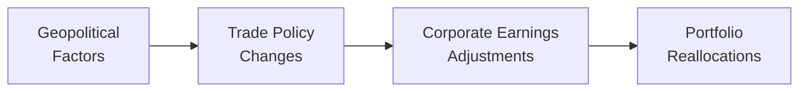

## Overview

Sometimes I think back to when I first tried to figure out why certain countries wield overwhelming influence in global markets while others struggle to have a say. It can feel like a giant puzzle—pieces scattered across continents, shaped by politics, geography, technology, and of course, economics. Well, guess what: that puzzle is called geopolitics, and it’s intimately linked with the unstoppable force known as globalization. In this section, we’ll piece together how geopolitical power dynamics affect everything from trade policy to investment allocations, why globalization both unites and divides, and how to keep these forces in check when building or managing portfolios.

## Defining Geopolitics

Geopolitics is all about the relationship between power structures, geography, and economics. Analysts use geopolitics to understand how governments influence trade, security alliances, resource distribution (like oil, rare minerals, or agricultural commodities), and ultimately financial markets. For instance, a territorial dispute between two neighboring countries can trigger export restrictions that send commodity prices soaring. Such events can ripple across foreign exchange rates, stock prices, and bond markets.

In the context of capital allocation, geopolitical considerations help you figure out regional risk exposures. For example, holding sovereign bonds from a nation that faces rising political tension may introduce default or currency risks. As a CFA candidate preparing for advanced portfolio decisions, factoring in the geopolitics dimension means being aware of how unexpected policy shifts—like trade sanctions or political alliances—could reshape your investment landscape.

## Globalization as an Economic Force

Globalization can be a mouthful: it’s the interconnectedness of economies, populations, and cultures through cross-border flows of trade, technology, and investment. At its core, globalization has enabled companies to expand supply chains across continents, individuals to access goods and services from anywhere, and investors to diversify capital around the globe. This forging of deeper networks has resulted in unprecedented growth opportunities, especially for emerging markets tapping into global value chains.

Yet globalization isn’t just about shiny technology or big cargo ships crossing oceans. It also includes social, cultural, and political dimensions. Each of these layers influences economic outcomes. If a major economy tightens immigration rules, for instance, that can affect labor supply in technology sectors or agriculture, reverberating through production costs, corporate earnings, and finally investment returns.

One crucial hallmark of globalization is the concept of interdependence—nations rely on each other for specific goods, resources, or capital. This can be a boon during periods of expansion, as countries specialize in what they do best. But it can also reveal vulnerabilities during crises—remember how financial shocks in one region can escalate into global recessions?

## Historical Context

While it might feel like a modern phenomenon, globalization has been around in varying degrees for centuries. Ancient trade routes connected Asia, the Middle East, and Europe, enabling the exchange of spices and textiles. The industrial revolution in the 18th and 19th centuries supercharged cross-border commerce, fostering the growth of colonial empires and marking a new era of resource extraction and global supply.

In the late 20th century, technology took globalization to the next level. Container shipping, telecommunications innovations, and the internet drastically reduced barriers to international operations. Meanwhile, organizations like the World Trade Organization (WTO) and policies aimed at trade liberalization encouraged countries to open their markets. By the early 21st century, capital could flow across countries with an ease unimaginable a few decades before. But with these advances came new tensions and complexities, including debates on how wealth distribution, environmental challenges, and cultural identities fared in this integrated world.

## Shifts in Political Power

Globalization can reshape or even concentrate political power. Let’s think of an example: a country with a near-monopoly on a crucial resource—like rare earth metals used in smartphones and electric vehicles—can wield enormous influence over global manufacturing. Allies might form around securing supply lines, and entire trade deals can hinge on that resource.

Similarly, nations with leading technological sectors gain special leverage. By exporting advanced machinery, software, or semiconductors, these countries shape global regulations—dictating everything from data privacy standards to intellectual property rights. Consequently, smaller nations or those with less developed industries might find themselves conforming to rules set elsewhere.

For investors, changes in political alliances or economic blocks can be a major signpost. A shift in trade policy could instantly affect the viability of foreign direct investment in certain regions. Understanding who holds power in the global arena—and how that power might change—becomes crucial in forecasting interest rates, currency moves, or capital flow patterns.

## Benefits of Globalization

Even though it’s occasionally criticized, globalization has delivered notable economic and societal gains:

• Larger market access: Companies can expand overseas, diversifying revenue streams and reducing dependency on a single domestic market.

• Lower costs and more diverse products: Consumers benefit from the availability of goods made in cost-efficient regions. Suppose a budget-conscious consumer can buy a smartphone assembled using inexpensive labor and parts from all over the world. That synergy typically lowers production costs and final prices.

• Capital and technology transfer: Multinational corporations bring expertise, employment, and investment into emerging markets. This can accelerate industrial development and skill training. Over time, local governments can harness upgraded infrastructure, fueling domestic growth.

• Efficiency through specialization: By focusing on industries where they have a competitive edge, countries can improve overall productivity. Emerging markets, for instance, can excel in manufacturing labor-intensive goods, while advanced economies concentrate on high-tech services.

## Criticisms and Challenges

Globalization isn’t all rosy. Some folks argue it can make the rich richer, while those without enough skills or resources lose out. Consider income inequality: an emerging market may benefit from foreign investment, but it might also see local labor displaced if it lacks robust policy frameworks (e.g., training programs, social safety nets). Additionally:

• Heightened vulnerability to external shocks: When countries integrate financially, a banking crisis in one region can quickly spread worldwide.

• Cultural homogenization: Traditions erode if local industries are replaced by global franchises. Think about small, family-run stores overshadowed by large international brands.

• Environmental implications: Some corporations shift production to nations with lax pollution rules. This generates an uneven distribution of environmental costs. For example, heavy-polluting industries might move overseas to reduce regulatory hurdles.

• Loss of policy control: As supply chains become entangled across borders, governments may find it harder to independently craft fiscal or monetary policies without triggering cross-border repercussions.

From a portfolio management perspective, these challenges represent both risks (exposure to social or political backlash) and opportunities (chances to invest in sustainable, forward-looking projects). Analysts increasingly apply Environmental, Social, and Governance (ESG) criteria to navigate globalization’s darker side and encourage more equitable growth.

## Potential Reverse Globalization Trends

We often assume globalization is linear and unstoppable. But history suggests it can calm down or even reverse. Trade tensions, national sovereignty concerns, or economic crises might spark protectionist policies. Sometimes it’s a slow burn—like renegotiating a trade agreement—other times it’s more abrupt, such as imposing hefty tariffs on steel or advanced technologies.

We saw glimpses of this phenomenon when certain global supply chains were disrupted by political events or severe pandemics. Companies realized that being overly reliant on a single region for manufacturing could create choke points. Diversification—or even some forms of reshoring—became attractive strategies to mitigate geopolitical risk. As an investor, paying attention to these currents helps you identify which industries could be especially vulnerable if protectionist measures ramp up, and which might benefit from the shift back home.

## Impact on Investment Decisions

Okay, so how should you navigate geopolitics and globalization when allocating capital? Well, first, you want to understand the macroenvironment. A peaceful region with robust legal institutions, stable currency, and open markets is typically more welcoming for foreign direct investment than one wracked by political strife or uncertain regulations.

In equity markets, multinational corporations that rely heavily on global supply chains might be exposed to increased geopolitical risk—think about a smartphone manufacturer that sources components from multiple countries, each with different trade policies. Unexpected tariffs or export bans can reduce margins. If you’re analyzing such a company, you’ll want to consider the potential blow to future cash flows.

Meanwhile, from a bond perspective, sovereign debt in politically volatile nations could command higher yields due to increased default risk. Interestingly, a simple shift in electoral outcomes might drastically alter the government’s spending priorities, tax regimes, and even monetary policy direction. These uncertainties can generate large swings in currency valuations.

### Scenario Analysis and Portfolio Diversification

To mitigate geopolitical risks, advanced portfolio strategies often include scenario analysis. You create hypothetical situations—like an escalation in trade disputes between major economies—and see how that scenario trickles down to GDP growth, interest rates, and corporate profits in various regions. By ascribing probabilities to each scenario, you can estimate the potential performance range of your holdings.

Additionally, diversification remains critical. Globalization can sometimes amplify correlations among markets, but there are still pockets of uncorrelated or less-correlated asset classes—like certain commodities, real estate in stable regions, or alternative investments (e.g., private equity in diversified geographies). A well-constructed global portfolio can cushion your returns against local or regional turmoil.

### Ethical and Professional Considerations

From the standpoint of the CFA Institute Code of Ethics and Standards of Professional Conduct, analyzing geopolitics requires independence and objectivity—Standard I(B) specifically addresses these concerns. It’s vital to avoid undue influence, including political or personal biases that might cloud your judgment about a given market or investment. Additionally, one must exercise diligence and thoroughness (Standard V(A)) in assessing possible risks arising from geopolitical shifts.

## Mermaid Diagram on Geopolitics and Capital Flows

Below is a simplified diagram illustrating how geopolitics can influence trade policy, subsequently impacting corporate earnings, and therefore shifting portfolio allocations:

This flowchart is, of course, highly simplified. In reality, each arrow might connect back in complex loops—responding to economic feedback, policy changes, and new market signals.

## Glossary

• Geopolitics: The study of how geography, economics, and demography influence politics and power relations among nations.  
• Globalization: The process of increased interconnectedness and interdependence among countries, economically, socially, and politically.  
• Interdependence: Mutual reliance between two or more groups, especially countries or economic entities.  
• Protectionism: Government policies or practices that restrict or restrain international trade to protect local businesses and jobs.  
• Supply Chain: A system of organizations, people, activities, information, and resources involved in supplying a product or service to a consumer.  
• Emerging Markets: Nations with social or business activity in the process of rapid industrialization and growth, often attracting foreign investment.  
• Externalities: Costs or benefits incurred or received by a third party who has no control over the creation of those costs or benefits.  
• Trade Liberalization: The removal or reduction of trade barriers such as tariffs or quotas.

## Exam Tips and Strategies

• Always combine macro analysis with company-specific due diligence: Even if the geopolitical environment seems stable, investigate whether specific companies have supply chain choke points.  
• When constructing global portfolios, run multiple stress test scenarios based on plausible geopolitical shocks—like new tariffs or political instability.  
• Keep ethics on the radar. Make sure your research is unbiased and free from external pressures.  
• Remember that while globalization seemingly integrates markets, political decisions can quickly change the rules of the game. You might see abrupt capital outflows, shifts in foreign currency regimes, or unanticipated country risk premium spikes.  
• Pay close attention to correlation changes during crises. Markets might move together—just when you need diversification most. Proper asset allocation remains essential.

## References and Further Reading

- Baldwin, R. (2016). The Great Convergence: Information Technology and the New Globalization. Harvard University Press.  
- Stiglitz, J. (2003). Globalization and Its Discontents. W. W. Norton & Company.  
- WTO (World Trade Organization): https://www.wto.org  
- IMF (International Monetary Fund): https://www.imf.org  

---

## Test Your Knowledge: Geopolitics and Globalization



### Which of the following describes geopolitics most accurately?

- [ ] The study of interbank lending rates in mature economies
- [x] The analysis of how geography, political structures, and power dynamics impact economic and international relations
- [ ] A focus exclusively on cultural shifts in emerging markets
- [ ] The exploration of how artificial intelligence shapes financial transactions

> **Explanation:** Geopolitics involves understanding how location, resources, and power struggles among nations influence economic and political outcomes, rather than a narrow examination of interest rates or culture alone.

### Which best illustrates an example of globalization?

- [x] A technology firm sourcing raw materials from Country A, manufacturing in Country B, and selling globally
- [ ] A local bakery selling only within its neighborhood
- [ ] A farm relying primarily on domestic labor with no import/export activities
- [ ] A government increasing domestic tariffs on all foreign goods

> **Explanation:** Globalization entails expanding supply chains and markets across borders. The technology firm scenario best captures this phenomenon.

### Which of the following is commonly cited as a direct benefit of globalization?

- [x] Access to larger markets and expanded consumer choice
- [ ] Guaranteed protection from economic downturns
- [ ] Absolute elimination of cultural conflicts
- [ ] Permanent abolition of currency risks

> **Explanation:** Globalization connects countries and broadens trade. That doesn’t mean zero volatility, cultural conflicts, or currency risk; rather, it generally increases market access and consumer product choices.

### A country with significant rare earth metal reserves has been leveraging its resources to influence global manufacturers. This scenario best describes:

- [ ] Income inequality
- [x] Shifts in political power due to resource advantage
- [ ] Decreased demand for industrial goods
- [ ] The formation of a currency union

> **Explanation:** Possessing strategic resources often gives a country geopolitical clout, influencing trade negotiations and political alliances.

### Which of the following is a potential negative effect of globalization?

- [x] Increased environmental pollution in regions with lax regulations
- [ ] Reduced opportunity for cross-border investment
- [ ] Universal income equality
- [x] Complete elimination of cultural identities

> **Explanation:** Globalization can incentivize resource-intensive production to move to regions with weaker regulations, creating environmental concerns. It also could erode small local markets or cultures.

### What is protectionism?

- [x] Government measures to limit foreign competition and protect domestic industries
- [ ] The policy of making a country’s borders entirely open to refugees
- [ ] A method for ensuring labor unions dominate overseas markets
- [ ] An initiative to reduce industrial output worldwide

> **Explanation:** Protectionism refers to policies like tariffs or quotas that favor domestic producers over foreign competition.

### In the context of global supply chains, which statement is most accurate?

- [x] A complex, widespread supply chain can boost efficiency but introduce geopolitical vulnerability
- [ ] Relying on a single domestic supplier always reduces economic risk
- [x] Companies that do not engage with global supply chains are less susceptible to macro events
- [ ] Financial crises do not affect globally diverse supply chains

> **Explanation:** Global supply chains often enhance efficiency but can become vulnerable when geopolitical tensions disrupt cross-border flows. Having a single supplier can be risky in a crisis.

### How does geopolitics commonly affect asset prices?

- [x] It can lead to sudden shifts in trade policies, altering corporate revenue projections
- [ ] It has no bearing on interest rates or currency values
- [ ] It permanently lowers volatility across markets
- [ ] It simplifies forecasting for the long term

> **Explanation:** Changes in political alliances or trade restrictions can disrupt existing business models, impacting earnings, cash flows, interest rates, and currency valuations.

### What is a primary consideration for investors worried about protectionist measures?

- [x] Evaluating supply chain diversification and resilience
- [ ] Ending all foreign investments for safety reasons
- [ ] Only investing in global technology stocks
- [ ] Ignoring macroeconomic trends in favor of purely quantitative models

> **Explanation:** When protectionist policies gain traction, investors should scrutinize whether the companies or sectors they invest in have alternative production options and diversified supply chains.

### True or False: Geopolitical changes can rapidly alter the risk profile of a global portfolio.

- [x] True
- [ ] False

> **Explanation:** Diplomatic rifts, trade embargoes, sanctions, and other geopolitical events can quickly shift the risk and return prospects of international assets, making it essential to stay informed.


