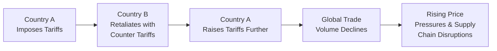

## Nature of Trade Disputes

Trade disputes can often feel like a complicated dance among countries—only, the stakes are usually much higher than missing a beat on the dance floor. When governments or major trade blocs suspect unfair competition—like dumping, hidden subsidies, or those pesky bureaucracy-laden non-tariff barriers—it’s as if someone stomped on their toes and refused to say sorry. 

Before we dive into specifics, let’s remember that disputes arise largely because countries want to protect local industries, maintain domestic employment, and ensure national security (among other goals). National leaders might impose protectionist measures if they see foreign producers gaining an “unfair” advantage—perhaps by selling products below cost or benefiting from big government subsidies. These disagreements spark friction in bilateral or multilateral relationships, ultimately prompting one of two outcomes: resolution through official mechanisms like the World Trade Organization (WTO) dispute settlement process or escalation in the form of retaliatory measures such as tariffs or quotas.

• Bilateral vs. Multilateral: Some disputes are strictly between two nations (say, Country A and Country B). Others involve groups of countries bound by trade pacts, like the European Union or the Comprehensive and Progressive Agreement for Trans-Pacific Partnership (CPTPP).  

• WTO Dispute Mechanism: The WTO steps in when member states can’t sort out their grievances. The preferred route is consultation and negotiation, but more formal adjudication happens when tensions escalate.

• Retaliatory Strategies: If diplomacy fails, well, it can get a bit nasty. Countries might respond by tightening regulations, imposing fresh tariffs, or restricting market access.  

Trade disputes matter to investors because they ripple across equity, bond, and currency markets. If you’ve spent even a moment scanning financial headlines, you might’ve noticed how quickly trade spats (and rumors of them!) can move stock prices, especially for companies that rely heavily on foreign income or internationally sourced components. 

## Tariff Wars

You might recall reading about (or living through!) major tariff clashes where nations slap exponential tariff hikes on one another’s goods. It’s like a tit-for-tat game, but the scoreboard shows falling export volumes, price spikes for consumers, and overall economic pain.

A tariff war typically starts with one country imposing customs duties on certain imports—often the result of a political promise to protect domestic jobs or retaliate against foreign dumping. The ‘targeted’ country then responds in kind, escalating to higher or broader tariffs. Before you know it, companies start complaining about cost hikes, supply chain headaches, and last-minute scrambles to reroute orders.

I remember once chatting with a textile exporter who had meticulously built a supply chain spanning three countries. The moment new tariffs were announced between two of those countries, she scrambled to find alternate suppliers. It was either that or risk losing her largest client because of massive price markups. Stories like hers aren’t uncommon: trade policy uncertainty can put everyone from small business owners to CFOs of multinational giants into serious planning mode.

Below is a simple diagram showing how tariff wars escalate and affect global trade flows:

And from a purely arithmetic perspective, the final price of an imported good facing a tariff τ could be represented as:


P_{\text{import\_with\_tariff}} = P_{\text{import}} \times (1 + \tau)


In reality, the pass-through to consumers depends on factors such as price elasticity of demand, availability of substitutes, and strategic pricing by companies. Still, this basic equation illustrates why higher tariffs often translate to more expensive imports.

## Economic and Market Consequences

Trade disputes and tariff wars don’t just amount to a few testy press releases. They can reshape entire sectors or, in severe cases, roil global financial markets and hamper economic growth. Some key consequences:

• Higher Consumer Prices: When tariffs or trade barriers boost input costs, businesses pass them on to end customers—especially if competition is limited. The result is that consumers pay more for imported cars, electronics, or even everyday items like groceries.

• Retaliatory Tariffs and Export Competitiveness: Exporters targeted by retaliatory tariffs might find their overseas sales sinking. If, say, your largest buyer imposes a 25% tariff on your goods, that is a significant price hurdle that can damage profits and market share.

• Shifts in Trade Partners: When friction persists, companies can pivot to alternative suppliers or customers. This realignment is rarely smooth: it can be costly, time-consuming, and uncertain—especially when regulatory frameworks differ across regions.

• Volatility in Equity and Currency Markets: Markets hate uncertainty. Trade tensions often drive up equity market volatility, as investors fret over global supply chain disruptions. At the same time, traders in foreign exchange markets may price in potential economic slowdown, leading to short-term gyrations in exchange rates. (You might connect the dots with Chapter 6.1 – Nominal versus Real Exchange Rates and see how these shifts can affect competitiveness.)

In more extreme or prolonged disputes, industries could migrate from one country to another. Firms might build new factories in “safe harbor” countries to avoid climbing tariffs, which affects local employment and capital spending. From an investor’s point of view, reading the geopolitical tea leaves becomes more important than ever.

## Sanctions as Geopolitical Tools

Sanctions, on the other hand, serve as a separate but related geopolitical instrument. While tariffs typically target broad categories of goods for purely commercial reasons, sanctions can be narrower or more draconian—prohibiting trade, financial transactions, or even travel with specific entities. Governments impose sanctions to accomplish diplomatic or security objectives, such as deterring nuclear proliferation or punishing human rights abuses.

When sanctions hit the finance sector, the targeted country (or entity) might lose access to international banking, global bond markets, and essential foreign investment. That is a huge deal if you’re a corporation that relies on cross-border funding. Seemingly overnight, you could be cut off from operations in critical foreign markets. These measures don’t just sting large corporations; they can cause entire economies to grind to a halt if they depend heavily on global capital or imports of strategic goods like advanced technology.

## Secondary Sanctions and Extraterritorial Application

A tricky twist in modern sanctions policy is the concept of extraterritoriality. In other words, your company might be based in Country C—neutral and uninvolved in a dispute between Country A and Country B—but if you do business with the sanctioned party, you could still face penalties from the original sanctioning government. For multinational corporations, banks, and investors, this extraterritorial aspect adds a new layer of compliance risk.

In practice, many businesses prefer to forego potentially profitable deals in sanctioned regions rather than risk losing access to major financial centers. After all, incurring multibillion-dollar penalties or being locked out of crucial markets like the U.S. or Europe can severely damage or even destroy a thriving corporation.

Compliance professionals and risk managers are thus tasked with keeping real-time tabs on the ever-shifting sanctions landscape. They might rely on specialized data analytics tools, hire legal consultants, and maintain internal watchlists to ensure no transactions slip through the cracks. For context and historical background, consider referencing Chapter 9 (Effects of Regulations) for a broader overview of how such rules shape corporate strategies.

## Case Studies

Historical events provide valuable insights into how trade disputes and sanctions can reshape economies and capital markets:

• Tariff Wars during the Great Depression: The infamous 1930 Smoot-Hawley Tariff in the United States triggered a wave of retaliatory tariffs worldwide. Global trade plummeted, deepening an already painful economic crisis and illustrating how “beggar-thy-neighbor” policies can backfire.

• Steel and Aluminum Tariffs: More recently, major economies have imposed tariffs on steel and aluminum, citing national security. Retaliatory duties followed on products ranging from agricultural goods to consumer electronics. The net result has been supply chain reconfigurations, higher input prices for manufacturers, and noticeable disruptions for international firms.

• Targeted Sanctions on Specific Countries: Governments have used financial or trade sanctions in response to issues like nuclear proliferation, regional conflicts, and alleged human rights violations. One well-known example in the modern era involves sanctions against Iran, which heavily restricted its banking sector’s capacity to transact in U.S. dollars and limited its ability to export oil.  

In each of these cases, you can see how policy decisions—often grounded in domestic or geopolitical considerations—produced profound effects on global commerce, commodity flows, and investor sentiment. You might keep an eye out for new developments in official statements, as trade disputes can escalate very quickly if relations deteriorate.

## Investment Implications

From a portfolio management viewpoint, trade disputes, tariffs, and sanctions factor heavily into both macro and micro analysis. In the short run, the market might overreact or underreact, creating opportunities for investors who can accurately parse the news flow.

• Policy Analysis: Monitoring official statements, bilateral negotiations, or the outcome of high-profile meetings (like G-20 summits) can alert you to policy shifts that are likely to roil markets. For instance, if you see rumor of impending steel tariffs, you might evaluate whether to exit positions in firms that heavily import steel or pivot toward stocks that stand to benefit from import protections.

• Supply Chain Costs and Commodity Prices: Commodity-intensive industries, such as automotive, construction, or agriculture, are often first to feel the pinch of new trade barriers. Sometimes, hedging with derivative instruments (e.g., futures or options) can mitigate short-term fallout. Skeptical about commodity hedging? Check out the discussion on hedging and speculation in Chapter 6.6—Currency Hedging, Speculation, and Carry Trades—for parallels in risk management approaches.

• Diversification: If you sense high volatility in specific sectors or countries, diversifying across geographies, asset classes, or industries helps cushion the portfolio. That’s a concept you’ve probably seen repeated throughout your CFA studies, but it’s especially important in uncertain geopolitical climates.

• Real-Time Monitoring and Tactical Asset Allocation: Trade negotiations can turn on a dime. Investors with flexible strategies and robust risk models can reposition quickly, leaning away from markets expected to experience significant tariffs or sanctions. That might involve re-weighting emerging market debt, shifting away from certain high-yield industries, or increasing allocations to “safe havens” like government bonds or precious metals, depending on the scenario at hand.

Exam Tip: Don’t be surprised if you encounter item sets that describe a hypothetical scenario of escalating tariffs. You might be asked to evaluate the impact on supply chain costs or recommend portfolio adjustments that reflect shifting market conditions. For instance, “Given a new set of steel tariffs, identify two immediate portfolio risks for an automotive firm that sources 80% of steel from Country X.” Being comfortable performing high-level scenario analysis and identifying key macro linkages is essential at the advanced stages of the CFA Program.

## Strategies for Stakeholders

What can stakeholders—businesses, policymakers, or investors—do in such uncertain conditions?

• Adaptive Supply Chain Management: Shifting or diversifying suppliers across multiple regions helps reduce dependence on a single trade route. Although multi-sourcing can add administrative burdens, it can be a lifesaver when one market closes due to tariffs or sanctions.

• Hedging Currency Volatility and Commodity Price Risk: Companies especially impacted by exchange rates or commodity fluctuations might actively use forwards, futures, and options. The ultimate aim is to lock in manageable input costs and revenue streams, even if the broader market is in turmoil.

• Proactive Legal and Regulatory Compliance: In a world of secondary sanctions, it pays to stay on top of evolving rules. Firms often maintain specialized compliance teams or sign up for vendor services that provide up-to-the-minute changes in sanctions lists. Inadvertently running afoul of extraterritorial laws can be incredibly expensive and damaging to reputation.

• Flexible Portfolio Allocation: Investors might pivot between asset classes as trade-war tensions flare or ease. If a global supply chain meltdown is likely, you might reduce equity exposure in heavily impacted industries and move into less correlated assets or defensive holdings.

While none of these strategies are foolproof, they at least offer a structured approach to mitigate risk in an environment laden with political motivations and abrupt policy reversals.

## Glossary

• Dumping: Selling products abroad at lower prices than those in the domestic market—or even below cost—often to gain market share in foreign markets.  
• Embargo: An official ban on trade or other commercial activities with a particular country.  
• Retaliatory Tariffs: Tariffs imposed in response to another country’s protectionist measures, aimed at discouraging or punishing that behavior.  
• Extraterritorial Law: Legal regulations that extend beyond a country’s borders, affecting foreign entities and activities.  
• Non-Tariff Barriers: Trade restrictions other than tariffs, such as import quotas, licensing requirements, or stringent technical standards.  
• Subsidy: A financial contribution by a government that confers a benefit—like direct payments, tax breaks, or favorable financing—to help domestic industries compete.  
• WTO Dispute Mechanism: The forum and procedures through which WTO member states resolve trade conflicts and challenges to existing measures.  
• Compliance Risk: The risk of legal penalties or financial losses due to non-compliance with laws, regulations, or guidelines.

## References & Further Reading

• Krugman, P. R., & Obstfeld, M. (2018). “International Economics: Theory and Policy.” Pearson.  
• WTO Dispute Settlement Database:  
  https://www.wto.org/english/tratop_e/dispu_e/dispu_e.htm  
• U.S. Department of the Treasury, “Sanctions Programs and Information”:  
  https://home.treasury.gov/policy-issues/office-of-foreign-assets-control-sanctions-programs-and-information  

## Final Exam Tips and Closing Thoughts

• Look for triggers of trade disputes: changes in political leadership, election promises, or major shifts in industrial policy.  
• Practice scenario analysis: outline how an escalating tariff war could ripple through companies’ supply chains, cost structures, and profitability.  
• Keep track of real-time headlines: crucial for your exam and actual investing. Markets often move on trade policy rumors alone.  
• Remember the big picture: while local protective measures might appear small, their psychological impact on investor sentiment and global partnerships can be huge.  
• Anticipate follow-up: trade disputes can morph into deeper geopolitical standoffs, broadening from tariffs to sanctions and extraterritorial enforcement.

When preparing for the exam, it’s a great idea to break down hypothetical trade-war scenarios into manageable components—who’s imposing the tariffs, how severe they are, and which industries are hit the hardest. Then practice your portfolio adjustments within that context. Although these topics can feel a bit overwhelming, a well-structured approach to analyzing trade disputes will help you stay calm under exam conditions and in real-life market decision-making.

## Practice Questions: Trade Disputes, Sanctions, and Tariff Wars



### Which of the following best describes a common cause of trade disputes among nations?

- [ ] Mutual desire to reduce import restrictions
- [x] Accusations of unfair practices, such as subsidies or dumping
- [ ] Excess demand for currency hedging tools
- [ ] Universal compliance with WTO regulations

> **Explanation:** Trade disputes commonly arise when countries believe that counterparts are engaging in unfair practices like dumping or subsidizing certain industries, leading to imbalances in competition.

### Which of the following is most likely an immediate effect of a tariff war?

- [x] Increased input costs for industries reliant on imported components
- [ ] Lower global inflation rates
- [ ] Rapid expansion of bilateral trade
- [ ] Immediate surge in investor confidence

> **Explanation:** Tariff wars generally raise the cost of imports, which in turn elevates the prices of goods dependent on those imports, potentially fueling inflationary pressures and dampening investor sentiment.

### A secondary sanction often involves:

- [ ] Tariff reductions in exchange for diplomatic concessions
- [x] Penalties on third-country firms for transacting with sanctioned entities
- [ ] Limiting domestic companies’ exports when domestic inflation is low
- [ ] Eliminating new capital investment in emerging markets

> **Explanation:** Secondary sanctions penalize third-party firms or individuals that do business with sanctioned nations or entities, illustrating the extraterritorial reach of certain legal frameworks.

### Which of the following strategies would best mitigate the direct impact of trade disputes on a firm’s supply chain?

- [ ] Concentrating all production in one country
- [x] Diversifying suppliers across multiple regions
- [ ] Increasing reliance on a single global distributor
- [ ] Maintaining a just-in-time inventory model only

> **Explanation:** When trade tensions escalate, having multiple sourcing options across different regions can reduce the risk of serious disruption if tariffs or other barriers suddenly apply to one supplier or location.

### Which statement about retaliatory tariffs is correct?

- [x] They are enacted in response to a trading partner’s imposition of tariffs
- [ ] They reduce compliance risk for multinational companies
- [x] They can target specific industries to exert political pressure
- [ ] They always lower export prices for the imposing country

> **Explanation:** Retaliatory tariffs directly respond to an initial tariff imposed by another country and often deliberately target politically sensitive sectors.

### Investors can manage the risks of sanction-related disruptions by:

- [x] Monitoring official government releases and sanctions lists
- [ ] Focusing exclusively on forward rate agreements in currency markets
- [ ] Avoiding any investment in multinational companies
- [ ] Reducing compliance staff in high-risk regions

> **Explanation:** With sanctions often shifting, real-time monitoring of government announcements helps avoid inadvertent compliance breaches and stay ahead of potential industry disruptions.

### When considering currency markets during heightened trade tensions, an investor should:

- [x] Pay attention to possible safe-haven flows
- [ ] Ignore currency movements and rely solely on forward contracts
- [x] Evaluate how tariffs might affect inflation and interest rates
- [ ] Assume no spillover from trade disputes to currency pairs

> **Explanation:** Heightened trade tensions typically spark safe-haven demand for certain currencies. Additionally, tariffs can influence inflation expectations, thereby affecting monetary policy and exchange rates.

### In the context of sanctions as geopolitical tools, which of the following is a key reason for their effectiveness?

- [x] They can severely restrict a nation’s access to global financial markets
- [ ] They typically entail a permanent ban on tourism
- [ ] They incentivize more foreign direct investment in the sanctioned country
- [ ] They reduce the compliance burden for international banks

> **Explanation:** Sanctions can cut off targeted nations or entities from crucial global financial markets, limiting their ability to fund government or corporate obligations.

### From the perspective of a supply chain manager, how do tariff wars typically reshape sourcing decisions?

- [x] By encouraging diversification of import countries
- [ ] By eliminating the need for more than one supplier
- [ ] By fostering full reliance on the initial trade partner
- [ ] By removing all cross-border complexities

> **Explanation:** Tariff wars often drive companies to reduce risk by spreading sourcing across multiple countries instead of relying heavily on one partner subject to tariffs.

### A true statement regarding how trade disputes could appear in a CFA exam context is:

- [x] They may be placed in scenario-based questions requiring portfolio adjustments
- [ ] They are confined to historical questions and have no contemporary relevance
- [ ] They cannot be modeled via scenario or sensitivity analysis
- [ ] They are unrelated to the commodity price fluctuations

> **Explanation:** Trade disputes appear in scenario-based exam questions, often requiring candidates to propose portfolio or risk management responses given changes in tariffs and other trade-related policies.


