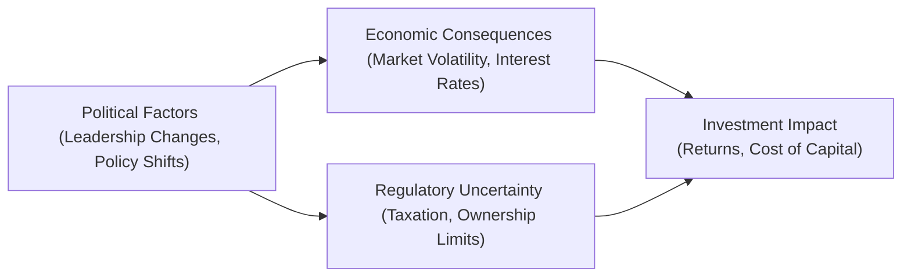
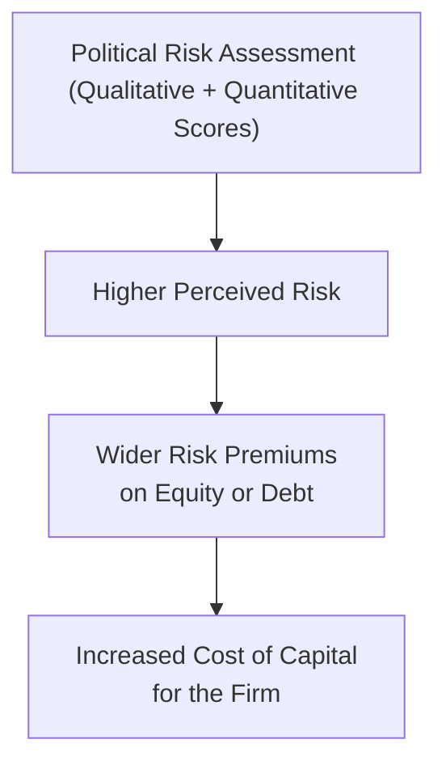

## Defining Political Risk

Sometimes I think back to a consulting project I tackled in an emerging market—one day the local government simply announced new rules on foreign companies. Everyone scrambled to figure out what it meant for taxes, staffing, and operational permits. That moment, for me, really underscored that “political risk” isn’t some abstract concept; it shapes real business decisions and portfolio outcomes every day.

Political risk boils down to the possibility that changes in leadership, social unrest, sweeping government policies, or erratic regulatory frameworks will alter market conditions—and potentially hurt investment returns or business operations. For CFA exam candidates, dissecting political risk is important because it can show up in scenario questions, requiring you to evaluate how shifts in the political environment might affect capital allocation and enterprise valuation.

Political risk is especially pronounced in emerging and frontier markets. However, even in developed markets, sudden political events—like election outcomes or trade policy disputes—can introduce volatility that upends investor assumptions.  

Below is a handy visual overview of the components of political risk in an investment context:

## Types of Political Risk

Political risk can manifest in various forms, sometimes subtly and sometimes with drastic consequences:

• Regime Change Risk  
  – This revolves around uncertainty over who holds power in government. An unexpected leadership shift could bring a complete overhaul of business-friendly policies or ramp up protectionism.

• Expropriation or Nationalization Risk  
  – Governments might seize private assets—like oil fields, factories, or mines—turning them into public property with little or no compensation to owners. This is particularly feared in resource-intensive industries such as energy or mining.

• Regulatory Unpredictability  
  – Governments often revise regulations on taxes, labor, or the environment. But if these changes are abrupt or frequent, businesses struggle to plan long-term capital expenditures.

• Policy Changes Affecting Foreign Ownership or Capital Repatriation  
  – Some jurisdictions impose new limits on foreign companies’ ownership stakes or new rules on repatriating profits back home. This can significantly alter the risk–return profile for international investors.

## Regulatory Uncertainty

Regulatory uncertainty refers to the cloudiness around how laws, rules, or their enforcement may evolve. It’s one thing to know a new tax is coming—at least you can price it in. It’s another to face a sense that rules might shift unpredictably with no clear timeline or rationale. 

A few real-life examples:

- Sudden Introduction of Environmental Standards: A government announces new emission caps on industrial production, but the guidelines are vague, leaving firms wondering about compliance measures or penalties.  
- Shifting Tax Regimes: Rapid changes in corporate tax structures, especially in jurisdictions heavily reliant on foreign investment, can disrupt the feasibility of multinational projects if not properly hedged.

Companies, analysts, and portfolio managers often track legislative agendas and public sentiment. Monitoring news, ministerial announcements, or even local polls and labor union demands can give an early hint about potential regulatory trends.

## Quantifying Political Risk

It’s one thing to know a particular country is “a bit risky,” but you need to somehow measure that risk—both qualitatively and quantitatively. Credit rating agencies like Moody’s or Fitch include political considerations when rating sovereign debt, but you can also lean on specialized consultancies or country risk indexes (e.g., Political Risk Services, Economist Intelligence Unit).

Common steps to quantify political risk include:

1. Country Stability Indicators  
   – Variables like the frequency of protests, changes of government, corruption levels, and perceived rule of law.  

2. Risk Scoring Models  
   – Weighted approaches that might combine data on corruption (as measured by, say, the Corruption Perceptions Index), transparency in regulatory processes, plus economic measures such as inflation, unemployment, or currency stability.

3. Scenario Analysis  
   – You might run ex-ante projections for “Best Case,” “Base Case,” and “Worst Case.” For instance, you could model how a 10% rise in tariffs or capital controls might reduce cash flows—and then discount accordingly.

4. Contingent Valuation  
   – You can assign probability weights to different political outcomes and incorporate these into your expected returns. That helps produce a more robust measure of your risk-adjusted cost of capital.

Below is a simplified flow to illustrate how political risk can ultimately drive up the cost of capital if not mitigated:

## Risk Mitigation Techniques

To manage political risk, organizations can deploy several strategies. Although no approach completely eliminates the uncertainty, these measures can significantly reduce potential losses:

• Political Risk Insurance  
  – Agencies like the Multilateral Investment Guarantee Agency (MIGA) under the World Bank Group provide insurance covering expropriation, breach of contract, and currency inconvertibility.

• Hedging Currency Exposure  
  – If a regime shift might destabilize a currency, forward contracts or options can shield your foreign-based revenue. This might not solve the underlying political tension, but it helps mitigate the short-term financial hit.

• Local Partnerships or Joint Ventures  
  – Aligning with a local partner can help demonstrate your long-term commitment to local development, potentially reducing the risk of government hostility. A well-connected partner may also help you stay ahead of policy shifts.

• Lobbying and Stakeholder Engagement  
  – Working with local stakeholders to highlight mutual benefits—job creation, infrastructure support, tax revenues—can sometimes influence the policy-making process. Of course, you must remain mindful of ethical standards and anti-corruption regulations under global codes of conduct—including the CFA Institute Code of Ethics and Standards of Professional Conduct.

## Impact on Multinational Operations

Political risk and regulatory uncertainty can be particularly impactful for multinational corporations (MNCs). Let’s say you’re the CFO of an energy giant—unexpected tax hikes or mandatory domestic content requirements (forcing you to use local suppliers) can alter cost structures. Similarly, changes in labor laws or visa policies might necessitate relocating specialized expatriate staff and upending global supply chains.

Enterprise Risk Management (ERM) frameworks often incorporate political and regulatory risk components, ensuring that senior management and board members explicitly consider “macro” uncertainties alongside more traditional operational and market risks.

## Link to Corporate Governance

Let’s be real: stable and transparent governance environments are a magnet for foreign direct investment. Markets with clear accountability, reliable legal systems, and minimal bureaucracy give investors more confidence in preserving capital and reaping fair returns. 

On the flip side, countries that rank poorly on the Corruption Perceptions Index typically parade red flags like nepotism, opaque procurement processes, or slow-moving courts. If your firm invests there, you may face hidden costs—from paying “facilitation fees” to dealing with arbitrary contract disputes.

In your exam context, you might see question vignettes asking how to incorporate political governance factors into your equity or fixed-income valuation. Integrating corporate governance analysis into your investment approach is crucial, often featuring as part of the Environmental, Social, and Governance (ESG) framework.

## Investor Considerations

• Evaluate Jurisdictional Risk Before Allocation  
  – Before you pump capital into a new region, be sure to weigh the likely social, legal, and political climate.  

• Geographic and Industry Diversification  
  – If political turbulence threatens one sector or region, gains in another might offset your losses.  

• Keep Tabs on Political Developments  
  – Major elections, referenda, and policy announcements can have an immediate effect on asset pricing. Regularly monitoring relevant news can help you manage exposures dynamically.

• Stay Informed of International Regulatory Convergence  
  – Bodies like the IMF, World Bank, or the WTO often issue guidelines that shape local regulatory frameworks over time. Knowing where global agencies stand can clue you in to upcoming shifts or best practices.

## Glossary

• Nationalization: Government takeover of private assets for public ownership.  
• Expropriation: Seizure of privately held property by the government, often without adequate compensation.  
• Enterprise Risk Management (ERM): A structured process to identify, assess, and manage all significant risks facing an organization.  
• Joint Venture: A strategic alliance where two or more entities pool resources to form a new business or project.  
• Corruption Perceptions Index (CPI): Annual ranking published by Transparency International measuring perceived levels of public sector corruption globally.  
• Sovereign Risk: The risk that a government may default on its debt obligations or break agreement terms with foreign investors.  
• Ex-Ante vs. Ex-Post: Ex-ante (before the event) vs. ex-post (after the event) analysis of policy changes and their effects.  
• Capital Repatriation: Moving profits or assets from a foreign country back to an investor’s home country.

## References and Further Reading

• Alon, I., & Herbert, T. (2009). “A Stranger in a Strange Land: Micro Political Risk and the Multinational Firm.” Business Horizons.  
• The Economist Intelligence Unit: https://www.eiu.com  
• Transparency International: https://www.transparency.org  
• CFA Institute Code of Ethics and Standards of Professional Conduct: https://www.cfainstitute.org/en/ethics  
• World Bank Group – MIGA Political Risk Insurance: https://www.miga.org  

## Final Exam Tips

• Recognize Scenario Triggers: In the Level I exam context, a vignette about a leadership switch or new trade restriction is a classic signal to incorporate political risk in your calculations or commentary.  
• Practice Cross-Reference Skills: Political risk often intersects with currency risk, portfolio construction, or corporate finance. Stay agile in linking these areas.  
• Adopt a Three-Step Approach on Essay Questions: (1) Identify the political risk driver (regime change, expropriation, etc.), (2) Evaluate its financial impact (e.g., cost of capital, capital flows), (3) Propose a mitigation strategy (insurance, JV, lobbying).  
• Know the Ethical Boundaries: When describing lobbying or local stakeholder engagement, remember the CFA Institute’s guidance on independence, prudence, diligence, and integrity.  
• Be Prepared to Calculate or Apply a Risk Premium: If the exam question references a country with high political instability, you might add a “country risk premium” in a discounted cash flow or Weighted Average Cost of Capital (WACC) scenario.

## Test Your Knowledge: Political Risk and Regulatory Uncertainty



### Which of the following scenarios best illustrates regulatory unpredictability?

- [ ] A country that gradually lowers corporate taxes over five years based on a clear, published schedule.
- [x] A government that abruptly changes tax policy three times in 12 months with minimal parliamentary debate.
- [ ] A developing country stabilizing its interest rates for the past decade.
- [ ] A nation that offers tax holidays to foreign investors for renewable energy projects.

> **Explanation:** Regulatory unpredictability is marked by frequent, abrupt, or unclear policy changes, making it difficult for businesses and investors to plan.

### In the context of political risk, “expropriation” refers specifically to:

- [ ] A political leader’s personal grievances influencing tax laws.
- [ ] Domestic firms refusing to cooperate with multinational enterprises.
- [x] Government seizure of private assets, often with little or no compensation.
- [ ] Tariff escalation through extended trade disputes.

> **Explanation:** Expropriation is when the government takes ownership of private property or assets, typically at a valuation less than fair market worth (or zero).

### Which of the following is a key tool for mitigating losses arising from political instability?

- [x] Political risk insurance offered by organizations like MIGA.
- [ ] Standard cargo shipping insurance covering transportation risks.
- [ ] Simple cash-flow forecasting models that assume zero inflation.
- [ ] Equity put options on domestic stock exchange indexes only.

> **Explanation:** Political risk insurance (for expropriation, breach of contract, currency inconvertibility, etc.) helps cushion firms from state-induced losses.

### How does local partnership or joint venture help mitigate political risk?

- [x] It aligns interests with local stakeholders and can reduce hostility toward foreign ownership.
- [ ] It reduces exposure to currency fluctuations entirely.
- [ ] It guarantees immunity from new tax laws in the host country.
- [ ] It ensures official endorsement from the country’s ruling party.

> **Explanation:** Local partnerships, by involving domestic ownership or expertise, might face less resistance and can offer insights into upcoming policy shifts.

### Which statement best describes a benefit of scenario analysis in political risk assessment?

- [ ] Guarantees accuracy in predicting local tariffs.
- [ ] Eliminates the need for a diversified investment approach.
- [ ] Substitutes for fundamental valuation analysis entirely.
- [x] Evaluates multiple “what-if” situations to estimate impacts on cash flows and viability.

> **Explanation:** Scenario analysis allows managers to gauge how different political or regulatory outcomes (good or bad) could affect profitability.

### A sudden shift in labor law imposing higher minimum wages on foreign-linked factories is an example of:

- [ ] Currency devaluation risk.
- [x] Regulatory or policy change risk.
- [ ] Sovereign default risk.
- [ ] Technological obsolescence risk.

> **Explanation:** This scenario shows how a government policy (labor law) can increase costs for foreign enterprises.

### The Corruption Perceptions Index is helpful in assessing political environments because:

- [ ] It measures a country’s total foreign exchange reserves.
- [x] It provides a ranking of perceived corruption, hinting at potential legal or ethical complications.
- [ ] It sets legal requirements for international corporates.
- [ ] It directly forecasts currency exchange rates.

> **Explanation:** The CPI is published by Transparency International and offers insight into corruption-related risks that often coincide with unpredictable regulations.

### In calculating Weighted Average Cost of Capital (WACC) for a project in a high-risk country, you might:

- [ ] Ignore the role of political factors since they can’t be easily quantified.
- [ ] Always reduce the WACC to encourage investment in developing markets.
- [x] Add a country risk premium to the equity component to reflect political uncertainty.
- [ ] Replace equity with short-term debt entirely.

> **Explanation:** Adjusting the equity premium to accommodate country-specific risk is a common approach to reflect the uncertainties in that market.

### In general, how might political risk affect multinational capital budgeting decisions?

- [ ] Political risk is irrelevant for capital budgeting.
- [ ] Political risk always leads to the rejection of the new project.
- [ ] Political risk is only considered after the project has already launched.
- [x] Political risk may lower the project’s net present value if the perceived risk premium is elevated.

> **Explanation:** Political risk can push up the discount rate or inflate the cost of capital, reducing a project’s NPV. Investors price in higher uncertainty accordingly.

### A government’s sudden decision to impose capital controls represents:

- [x] True
- [ ] False

> **Explanation:** Capital controls, which limit the flow of money in and out of a country, are indeed an example of regulatory uncertainty (and can be considered a political risk factor).


