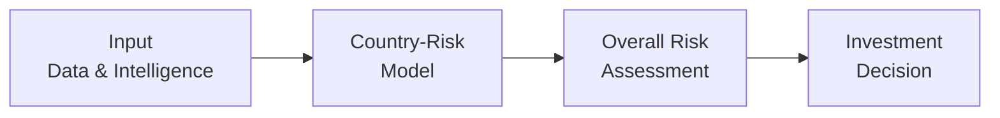

## Introduction

We’ve all heard that phrase, “Geopolitics is the new macro,” right? Okay, maybe we’ve heard it in a more formal setting, but the point stands: these days, geopolitical shifts can swing equity markets, disrupt supply chains, and drive currencies crazy faster than you can say “trade sanctions.” In the context of global investing and economic forecasting, few things matter more than understanding geopolitical risks and how they feed into broader economic vulnerabilities.

The aim here is to walk you through a systematic way of assessing geopolitical risk. We’ll talk about the sectors that get hammered the moment tensions rise, the macroeconomic indicators that hint at a country’s resilience or fragility, and how investors might position portfolios amid rising global uncertainty. Whether you’re new to analyzing global tensions or you’re a seasoned pro, hopefully you’ll find a few practical takeaways—and maybe a personal anecdote or two. Let’s dive in.

## Frameworks for Assessing Geopolitical Risk

In practice, analysts often rely on country-risk models, which are basically fancy scorecards capturing political, economic, and security-related factors. Personally, I once sat in on a meeting where an entire real-time scorecard updated whenever major political news broke—think “breaking news” alerts tied to a weighted formula. It was surprisingly effective at keeping the team on their toes.

Below is a generic outline of how such frameworks come together:

• Political Stability: Includes factors like strength of institutions, election cycles, and prevalence of corruption.  
• Governance Indicators: Sourced from organizations like the World Bank’s Worldwide Governance Indicators, which measure rule of law, regulatory quality, and control of corruption.  
• Economic Trends: GDP growth, inflation, fiscal balance, trade balances, and currency stability.  
• Security Conditions: Likelihood of civil unrest, terrorist activity, or external military conflict.

You might consider these items as building blocks within a country-risk model. Let’s visualize this in a simple flowchart:

• A gathers data from sources like on-the-ground intelligence, economic publications, and global news.  
• B processes that info with qualitative and quantitative frameworks (e.g., weighting political vs. economic criteria).  
• C produces a final assessment or “score.”  
• D guides the decision: invest, reduce exposure, or monitor further.

## Vulnerable Sectors

When geopolitical tensions spike, not all industries are hit equally. Some become immediate casualties of policy shifts, embargoes, or supply disruptions. Let’s break down a few prime examples:

• Infrastructure-Heavy Sectors: Utilities, energy, and telecom companies rely heavily on stable operating environments. If conflict arises, these sectors can experience service disruptions, nationalization, or sabotage.  
• Defense and Strategic Industries: Think semiconductor technology or aerospace. If a technology export ban is imposed, or if governments start prioritizing domestic suppliers for national security reasons, it can dramatically reshuffle industry dynamics.  
• Supply Chains Reliant on Politically Sensitive Regions: Firms importing raw materials (e.g., rare earth metals) from hotly contested territories face rising costs, sudden shortages, or forced supplier changes whenever geopolitical friction surfaces.

I remember analyzing a Southeast Asian telecom investment once: a change in local leadership meant new regulations on foreign ownership. Overnight, share prices dipped nearly 15%. That was a big aha moment for me—geopolitics can be as abrupt as a heart attack when it comes to certain industries.

## Macroeconomic Indicators

Although analyzing heated political commentary or rumor mills might feel more relevant at times, macroeconomic indicators still serve as the broad yardstick of a country’s health and resilience. Let’s zoom in:

• GDP Growth: A robust growth rate is sometimes a cushion against sudden shocks. If a country’s economy is vibrant and diversified, it’s less likely to be thrown off track by a single geopolitical disruption.  
• Inflation: Spiraling inflation (often caused by supply disruptions or currency devaluations) may lead to social unrest, particularly if wages don’t keep pace.  
• Fiscal Balance: Persistent deficits can limit a government’s fiscal firepower to respond to crises.  
• Oil and Commodity Prices: For resource-dependent countries, sudden price drops (or spikes, in an importing nation) can quickly shift political sentiment and financial stability.

It’s not just about the raw numbers here: the trend matters as much as the absolute value. If GDP is slipping quarter over quarter, small shocks can become amplified, sparking a credit crunch or capital flight.

## Conflict and Tension Hotspots

From border disputes to maritime tensions, certain areas of the globe remain consistently fragile. A sudden escalation in maritime disputes—take for instance contested shipping lanes—can hamper trade routes crucial for global commerce. Think about how the Strait of Hormuz disruptions can temporarily affect global oil prices and supply lines.

• Historical Claims: Conflicts over historical or cultural claims can flare up quickly—these are often deeply rooted and can lead to widespread demonstrations or sanctions.  
• Cultural Factors: Linguistic or religious divides can fuel internal tensions, especially if there’s a perception of unequal treatment or disenfranchisement.  
• Disputed Territories: The official boundaries might not match the “on-paper” sovereignty, leading to frequent flashpoints and security crises.

Larger asset managers and multinational organizations usually pay for specialized geopolitical intelligence to monitor these hotspots. They track changes in local laws, election outcomes, and even public sentiment on social media to anticipate potential escalations.

## Systemic vs. Idiosyncratic Risk

When you’re building a global portfolio, you frequently distinguish between risks that affect the entire market (systemic) versus those that only impact a specific corner of the market (idiosyncratic). Geopolitical risk can be both:

• Systemic Risk: This is the big one—anything that can shake the entire global financial system. Examples include major conflicts between superpowers, global trade wars, or global crises like a pandemic. Pandemics, in particular, taught us that supply chain disruptions have ripple effects far beyond one country’s borders.  
• Idiosyncratic Risk: This would be limited to a specific region or country. For instance, political turmoil in a single country that leads to capital controls or unexpected nationalization of certain industries. In such cases, geographic diversification might help mitigate that risk.

## Role of Intelligence and Data

Gone are the days when analysts just sipped coffee while reading newspapers. In modern finance, machine learning tools parse endless streams of tweets, satellite images, and real-time shipping data to find clues. For instance:

• Satellite Imagery: Tracking the buildup of military equipment near border regions or identifying changes in supply chain traffic patterns.  
• Social Media Analytics: Public sentiment can shift quickly, and a well-tracked protest movement may be a bellwether for future policy changes.  
• Local On-the-Ground Intelligence: Large corporations might hire local experts or partner with security firms that understand a region’s specifics, from cultural nuances to local bureaucratic friction.

All these data points feed into those country-risk models, refining them with near real-time updates.

## Scenario Analysis

Scenario analysis can be your best friend when trying to wrap your head around how a geopolitical event might play out. By projecting multiple versions of the future—best-case, moderate, and worst-case—you can gauge the potential impact on trade, currency stability, corporate earnings, or investor confidence.

Let’s do a quick example. Suppose you’re analyzing an emerging country reliant on oil exports, with tensions rising along its border region:

• Best-Case Scenario: Diplomatic talks de-escalate tensions, oil production remains stable, and capital inflows continue.  
• Moderate Scenario: Tensions simmer without full-blown conflict, but cross-border trade slows. Corporate earnings in certain sectors dip, currency sees mild depreciation.  
• Worst-Case Scenario: Armed conflict disrupts infrastructure, leading to supply shocks. Exports collapse, foreign investors flee, currency crashes, and inflation skyrockets.

Think of scenario analysis like running a stress test on your portfolio, but for politics. If you can plan a contingency for each scenario, you’re less likely to be blindsided.

## Investment Positioning

From a portfolio management perspective, the million-dollar question is: “How do we navigate these risks?” or “Which moves can we make to truly hedge our bets?” Let’s look at some common approaches:

• Geographic Diversification: This is the classic approach—spreading investments across multiple regions to reduce exposure to any single country’s political upheavals.  
• Safe-Haven Assets: During high uncertainty, assets such as U.S. Treasuries, gold, or certain reserve currencies might hold or even increase in value.  
• Hedging with Derivatives: Sometimes credit default swaps (CDS) on government debt serve as an early warning signal. If market participants believe a country is more likely to default due to geopolitical turmoil, CDS spreads will widen. You can also buy options on currency pairs to protect against big moves in foreign exchange.  
• Monitoring Key Indicators: Keep a close eye on leading indicators such as bond spreads, credit default swaps, and short-term commodity price spikes.  
• Regulatory and Policy Watch: Even subtle changes (like restrictions on capital flows or foreign ownership) can cause big moves in local markets. People often underestimate regulatory red flags until it’s too late.

## Best Practices and Pitfalls

• Don’t Overreact to Every Headline: Geopolitical news can be sensational. Evaluate carefully before rebalancing.  
• Avoid Concentrated Bets in Frontier or Conflict-Prone Markets: Unless you have robust local expertise and risk tolerance, concentrate your exposures in more stable areas.  
• Revisit Scenario Plans Regularly: Political environments can shift quickly; your “worst-case” scenario might unexpectedly turn into a Tuesday morning reality.  
• Keep Communication Channels Open: If you work on a team, share new insights. Sometimes the smallest data point can change the entire risk perspective.

## Practical Examples and Case Studies

1. Trade War Impacts on Tech Supply Chains: During heighted tensions between major global powers, tariffs and export bans on sensitive technologies can disrupt the entire semiconductor supply chain. Manufacturing managers in the U.S. or Europe might scramble to find alternative suppliers in less contentious regions, potentially incurring higher costs.  
2. Middle East Energy Supply Shocks: We’ve seen how heightened tensions in the Gulf region can lead to immediate spikes in oil prices, which in turn can reverberate into global equities. Countries heavily dependent on oil imports (or exports) are forced to adjust their fiscal policies, sometimes creating a knock-on effect on their exchange rates and bonds.  
3. Currency Crises in Emerging Markets: If global confidence deteriorates due to political unrest, currency flight can ensue, fueling inflation and leading central banks to raise interest rates dramatically. This scenario affects equity markets, bond yields, and ultimately overall economic growth.

## Connecting to Other Chapters

• From Chapter 5 on International Trade and Capital Flows, remember how tariffs, quotas, and trade agreements interplay with geopolitical risk. If tensions rise, consider how trade surpluses or deficits might shift.  
• From Chapter 6 on Currency Exchange Rates, watch for how exchange rate regimes can break under geopolitical stress. Pegged currencies can come under speculative attacks if investors sense fragility.  
• From Chapter 7 on Monetary and Fiscal Policy, you’ll see that central banks might adopt unconventional policies (like capital controls) under extreme stress.

## Conclusion and Final Exam Tips

Assessing geopolitical risk is part art, part science. While we have frameworks, data analytics, and scenario planning, the reality is that politics can be as unpredictable as the weather. Still, by remaining systematic—using country-risk models, analyzing macro indicators, and constantly reassessing scenario outcomes—you can handle much of the associated uncertainty.

For the exam, remember to:

• Discuss the trade-off between systemic and idiosyncratic risk in any essay question on portfolio construction.  
• Highlight how scenario analysis helps manage unpredictability.  
• Illustrate how real-time data (e.g., social media sentiment, satellite imagery) can refine traditional risk models.  
• Be prepared to discuss safe-haven assets and hedging strategies in item-set questions.

When the question prompt says, “Identify and evaluate geopolitical risks that might affect this portfolio,” you’ll want to highlight currency risk, potential disruption in supply chains, and the possibility of capital controls—essentially tying in everything we’ve covered.

## References

• The World Bank “Worldwide Governance Indicators”: https://info.worldbank.org/governance/wgi/  
• Ulrichsen, K. (2017). “The Gulf States in International Political Economy.” Palgrave Macmillan.  
• Heritage Foundation “Index of Economic Freedom”: https://www.heritage.org/index/  

--------------------------------------------------------------------------------

## Test Your Knowledge: Geopolitical Risk Assessment Quiz



### Which component is most commonly included in a country-risk model for assessing geopolitical risk?

- [ ] Relative strength of corporate financial statements
- [x] Governance indicators like rule of law and control of corruption
- [ ] Historical equity market returns
- [ ] Productivity measures in manufacturing

> **Explanation:** Governance indicators (e.g., rule of law, corruption control) are a central part of any country-risk model, as they shape the broader political and economic environment.

### Which sector typically faces the greatest immediate threat if a region becomes embroiled in sudden armed conflict?

- [ ] Consumer discretionary
- [ ] Retail
- [ ] Pharmaceuticals
- [x] Infrastructure-heavy sectors such as utilities and energy

> **Explanation:** Infrastructure-dependent industries like utilities, telecom, and energy are exposed to direct operational disruptions, sabotage, or takeover in times of conflict.

### Which of the following macroeconomic indicators can best signal a country’s capacity to manage sudden revenue shortfalls or shocks?

- [ ] Inflation
- [ ] Unemployment
- [x] Fiscal balance
- [ ] Exchange rate stability

> **Explanation:** Fiscal balance reflects a government’s ability to generate sufficient revenue relative to spending. A healthy fiscal balance often implies greater room for emergency spending or crisis intervention.

### An example of systemic geopolitical risk would be:

- [ ] A coup d’état in a small central African nation
- [ ] Political instability in one major city within a large country
- [x] A full-scale global trade war among several major economies
- [ ] A localized maritime border dispute between small island nations

> **Explanation:** A global trade war has the potential to upset international trade flows and disrupt the global financial system, impacting nearly every major market.

### Which practical technique helps investors project the economic and market impact of varying degrees of geopolitical escalation?

- [x] Scenario analysis
- [ ] Beta decomposition
- [ ] Duration matching
- [ ] Correlation mapping

> **Explanation:** Scenario analysis explores alternative futures (e.g., moderate vs. worst-case) to gauge how different levels of escalation might affect the wealth of investors.

### In examining risk specific to emerging markets, analysts might pay special attention to:

- [ ] Momentum indicators for specific equities
- [x] Social media sentiment and on-the-ground intelligence
- [ ] Forward price-to-earnings ratios only
- [ ] Historic trends in developed market yield curves

> **Explanation:** Emerging markets can be highly sensitive to local sentiment, which may shift rapidly. Local intelligence often proves more useful than general market indicators.

### If an investor wants an early warning signal of rising sovereign credit risk tied to geopolitical developments, they might monitor:

- [ ] Growth stocks in advanced economies
- [x] Sovereign credit default swap (CDS) spreads
- [ ] Price-to-book ratios in local equity benchmarks
- [ ] Volumes on local real estate transactions

> **Explanation:** Changes in CDS spreads often reflect the market’s changing perceptions of a government’s default risk, which can be driven by geopolitical instability.

### Which best describes a “safe-haven” asset in times of high geopolitical uncertainty?

- [x] An investment expected to preserve or gain value during market turbulence
- [ ] An asset with the highest trailing 12-month returns
- [ ] A commodity subject to volatile price swings
- [ ] A speculative cryptocurrency

> **Explanation:** Safe-haven assets (like gold or U.S. Treasuries) are perceived to provide stability or retain value when broader markets sell off.

### A “best-case scenario” in a conflict-prone region typically assumes:

- [x] Diplomatic resolutions prevent or reduce escalation
- [ ] Armed conflict breaks out, spurring foreign intervention
- [ ] Supply chains are disrupted for an extended period
- [ ] The country quickly defaults on its debt

> **Explanation:** Best-case scenarios assume de-escalation, limiting the direct economic effects of conflict and preserving business operations and investor confidence.

### Considering potential geopolitical disruptions, an investor’s recommended approach is to:

- [x] Diversify geographically to reduce concentrated exposure
- [ ] Put all funds into a single commodity
- [ ] Avoid any international investing altogether
- [ ] Focus solely on small-cap emerging-market stocks

> **Explanation:** Geographic diversification is a well-known strategy to reduce idiosyncratic risk, especially when geopolitical tensions threaten a particular region.


