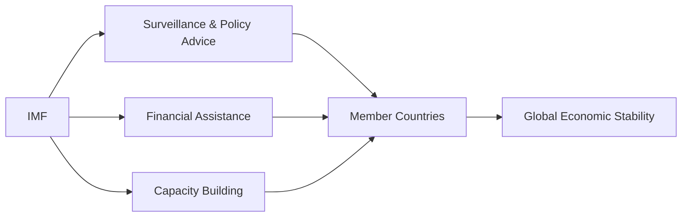

## Introduction
International organizations like the International Monetary Fund (IMF), the World Bank, and the World Trade Organization (WTO) play pivotal roles in fostering global economic expansion and stability—at least that’s the official intent. Since we’re looking at how geopolitics can shake up economies and investment markets, it’s worth zooming in on how these institutions operate, the power they wield, and why you as an investor or analyst might keep your ears—and eyes—on their next big moves. After all, an IMF lending program can flip an economy’s fortunes (and credit risk levels) practically overnight; a major World Bank infrastructure project might open up entire new markets; and a WTO ruling on trade disputes could pivot global supply chains.

Sometimes you might hear chatter about these organizations being too “Western-centric” or imposing harsh policy conditions. Sure, criticisms abound, and we’ll dig into them. But from a CFA exam standpoint (especially at the advanced level where you’re focusing on portfolio-level decisions), you want to keep an eye on each body’s mandate, the ways they interact with national governments, and how their decisions or interventions ripple through financial markets. Let’s explore it all, while keeping things slightly conversational—picture us sitting over coffee, talking about the IMF’s latest stability report, rolling our eyes a bit at the complexities, but still super curious, because this stuff shapes global capital markets.

## The International Monetary Fund (IMF)

### Mandate
The IMF is fundamentally about ensuring global monetary cooperation and stability. Wait, that probably sounds a bit nebulous, right? Well, think about it this way: the IMF aims to keep crises in check—currency crises, debt crises, you name it—so that the global economy doesn’t spiral out of control. According to its charter, the IMF was set up to:

• Facilitate the expansion and balanced growth of international trade.  
• Promote exchange stability.  
• Provide confidence to members by making IMF financial resources temporarily available.  
• Lessen the degree of disequilibrium in the international balance of payments (BOP).  

In plain English: the IMF is like a lender of last resort (sort of) for countries running big external imbalances that threaten their growth or even their solvency. A stable global system is presumably in everyone’s interest—especially for internationally diversified investment portfolios.

### Key Functions
If you had asked me a decade ago how to best summarize the IMF, I might have simply said: “They’re the folks who bail you out if your currency collapses.” Over time, however, I’ve realized the IMF does a lot more than crisis lending.

• Surveillance & Policy Advice: The IMF oversees the international monetary system, regularly analyzing each member country’s policies to mitigate risk. They publish flagship reports like the “World Economic Outlook,” which are jam-packed with global economic forecasts and insights.  
• Lending: When a country can’t meet its external payment obligations, the IMF steps in with loans. Remember the European debt crisis in the early 2010s? The IMF was a major player, providing highly conditional financing to Greece, Portugal, and others.  
• Capacity Development: Often overshadowed, but the IMF also helps countries improve governance, tax systems, monetary policies, and data accuracy.  

Below is a simple Mermaid diagram illustrating how the IMF interacts with member countries and the broader global economy:

### Real-World Impact
One classic example is the Asian financial crisis of the late 1990s, where the IMF stepped in with multi-billion-dollar rescue packages for countries like Thailand and Indonesia. The conditions that accompanied these loans—commonly referred to as “IMF conditionality”—sometimes led to widespread debate (and even protests) about the social and economic costs of austerity measures (e.g., cutting government spending, raising taxes). For portfolio managers, these interventions can be a double-edged sword: currency stabilization might restore investor confidence, but harsh fiscal austerity could suppress growth in the short run.

## The World Bank

### Focus
If the IMF is about macroeconomic stability, the World Bank is all about development—long-term, large-scale efforts to reduce poverty and foster sustainable growth, especially in emerging and low-income countries. It’s a group of institutions (technically, the World Bank Group), with the International Bank for Reconstruction and Development (IBRD) and the International Development Association (IDA) being the biggest arms.

### Projects
Here’s a quick breakdown of what the World Bank typically funds:  
• Infrastructure: Highways, power plants, water supply, and other capital-intensive projects that might otherwise struggle to get financing.  
• Education and Healthcare: School buildings, teacher training, disease eradication programs—these have potential ripple effects on a nation’s growth.  
• Policy Reforms: Sometimes played out through “Development Policy Financing,” where lending is linked to specific policy actions, reminiscent of IMF conditionality.  

It’s not uncommon for the World Bank to partner with other groups—both government agencies and private sector players—to mobilize bigger pools of capital or to share the risk. That means large multi-billion-dollar projects popping up in, say, Sub-Saharan Africa or South Asia, financed in part by the World Bank. From an investor standpoint, these infrastructure expansions can create new opportunities for multinational corporations or local enterprises (think new roads facilitating trade or improved communications making it easier for firms to operate).

### Collaborations
The World Bank often teams up with regional development banks like the Asian Development Bank (ADB) or the African Development Bank (AfDB) to maximize project impact. It can also collaborate with private sector entities via instruments like Public-Private Partnerships (PPPs).

## The World Trade Organization (WTO)

### Purpose
If you’re trading a currency or building a global equity portfolio, you might not realize how much the rules and norms of the WTO shape your world. Essentially, the WTO is the steward of global trade. It took over from the old GATT (General Agreement on Tariffs and Trade) framework. Its mission? Promote smooth, predictable, and free trade among nations.

Let’s say a country imposes tariffs on steel imports. If a trading partner says “Hey, that violates WTO rules,” they can bring a dispute to the WTO’s dispute-settlement mechanism. The goal is to have a fair resolution grounded in agreed-upon trade rules, thereby avoiding a full-blown trade war.

### Dispute Settlement
This mechanism works (in theory at least) by forming expert panels to evaluate alleged violations, propose remedies, and even authorize retaliatory measures if the losing party doesn’t comply. For investors, a negative ruling against a major export player might lead to sudden changes in shipping patterns, tariff structures, or supply chains, impacting everything from commodity prices to corporate earnings.

### Monitoring
The WTO also keeps tabs on national trade policies, pushing for transparency and best practices. Annual reviews can highlight potential friction points or open up new avenues for negotiations.

## Critiques and Reforms
All three institutions face criticisms. Some argue that these organizations reflect the power imbalances of a post-World War II world. For instance, the IMF’s quota system is said to give outsized influence to rich nations. Critics of the World Bank’s large-scale infrastructure projects highlight environmental and cultural disruptions. The WTO has also been called out for not adequately factoring in labor rights or environmental protections when pushing for freer trade.

Proposals for reform include:  
• Greater voice for emerging markets (e.g., increasing the shares of voting power).  
• More transparency in governance and decision-making.  
• Rethinking loan conditions or trade rules to minimize social costs.  

It’s a long list, and actual reforms often move at a snail’s pace because each member country has its own interests.

## Influence on Geopolitics
These institutions are not just economic powerhouses; they can deeply influence a country’s political trajectory, too. The IMF’s condition-based lending can effectively force governments to enact certain reforms that might be politically unpopular. The World Bank’s big-ticket infrastructure loans can shift power dynamics among local elites or between regional economies (like who controls new transport routes, for instance). The WTO’s rulings on sensitive trade issues can escalate tension—think of the US-China tariff disputes in recent years—or defuse it, depending on the resolution.

When tensions are high, governments might question whether the IMF or World Bank is truly neutral or if they reflect the agendas of certain powerful members. Same goes for the WTO: you’ll hear the phrase “weaponizing trade” in policy circles. In short, expect some friction—geopolitics is as much about who sets the rules as who follows them.

## Cooperative vs. Competitive Dynamics
In calm waters, these organizations provide a framework through which countries can collaborate. Economies coordinate monetary policies, benefit from development financing, and settle trade differences rationally. That’s the cooperative approach—multilateralism at its best.

But in more competitive or fractious times, countries may bypass the established system. For example, if the WTO is perceived as being slow to handle disputes, two countries might form their own bilateral agreements, or large economies might find alternative ways to apply pressure (sanctions, blockades, or new trade blocs). Meanwhile, the neutrality and legitimacy of these organizations can come under question if certain nations think they don’t get a fair shake. As an investor, you’d be wise to track how the major players perceive these institutions, because that’ll shape the rules of engagement for global investing.

## Investor Considerations
So how does all this connect to the daily grind of analyzing markets and constructing portfolios? Let’s break it down:

• IMF Announcements: An IMF loan deal for a country dealing with a debt crisis can signal a turning point. The conditionalities might present near-term risks (austerity, currency devaluation) but longer-term stabilization.  
• World Bank Projects: Infrastructure expansions can unlock new industries, sharpen a country’s competitive edge, or jump-start the local bond market. Watch out for the potential crowding-in of private capital.  
• WTO Rulings: A major trade dispute settlement can cause big price swings for commodities, or shift the fortunes of export-oriented sectors. A heads-up on upcoming trade negotiations can be integral to risk management.  

Pay attention to policy statements, annual or semi-annual IMF/World Bank meetings, and any big official announcements from the WTO on trade disputes. These can act as catalysts or headwinds for specific assets, industries, or entire markets.

## Interaction with Regional Organizations
Don’t forget that these big three also interact with a host of regional bodies:  
• Regional Development Banks (e.g., Inter-American Development Bank, Asian Development Bank): They often co-finance development projects with the World Bank, providing more localized expertise.  
• Regional Trade Blocs (e.g., European Union, ASEAN, Mercosur): They intersect with WTO rules but can have their own internal policies that shape trade flows.  

You might see scenarios where a regional bank steps in first with emergency financing, and then the IMF joins in with a more comprehensive package. This synergy (or sometimes rivalry) among institutions can change the speed and nature of economic interventions.

## Best Practices and Pitfalls from a Portfolio Perspective
• Diversify across regions, especially if you anticipate that certain countries or sectors could benefit from World Bank–financed projects or might see volatility tied to IMF conditional loans.  
• Monitor official communications. The IMF and World Bank release their flagship reports—these often move markets or spark macroeconomic re-evaluations.  
• Consider hedging strategies for countries that might be on the brink of a trade dispute escalated via the WTO. A single unfavorable ruling could hike tariffs and disrupt supply chains.  

A personal note: I remember talking to a portfolio manager in London who kept a separate “risk event calendar” pinned to her office wall that was just for IMF announcements and WTO dispute resolution sessions. She said she learned to pay close attention after seeing a big currency swing in an emerging market that literally shifted half her bond portfolio’s monthly return in a matter of days. That might sound nerve-wracking, but it’s reality if you invest globally.  

## Glossary
• Conditionality: Policy changes required by an institution (often the IMF) in exchange for financial assistance.  
• Structural Adjustment Programs (SAPs): Early forms of policy conditions from the World Bank and IMF encouraging trade liberalization and fiscal discipline in developing countries.  
• Balance of Payments (BOP): A record of all economic transactions between a country’s residents and the rest of the world during a period.  
• Trade Facilitation: Simplifying and speeding up lawful international trade procedures, including customs and transit.  
• Quota System (IMF): Determines each member’s financial contribution, voting power, and access to IMF financing.  
• General Agreement on Tariffs and Trade (GATT): The precursor to the WTO that aimed to reduce or eliminate trade barriers.  
• Aid Conditionalities: Economic or institutional reforms required in return for financial support.  
• Multilateralism: Cooperation among multiple nations on issues of common interest.

## References & Further Reading
• [IMF](https://www.imf.org) — For the latest economic outlooks and policy advice.  
• [World Bank](https://www.worldbank.org) — Research, data, and news on global development projects.  
• [WTO](https://www.wto.org) — Official information on trading rules and disputes.  
• Rodrik, D. (2012). “The Globalization Paradox: Democracy and the Future of the World Economy.” W. W. Norton & Company.

## Exam Tips
• Be prepared to discuss how each institution influences a country’s macroeconomic environment—helpful for scenario-based essay questions.  
• Link the roles of the IMF, World Bank, and WTO to risk management strategies. For instance, how might an investor hedge or capitalize on an upcoming IMF deal or a WTO ruling?  
• Use real-world examples of these institutions’ interventions. This will show deeper understanding in exam essay responses.  
• Practice time management by structuring short-form and long-form responses that incorporate how global governance structures can shift portfolio allocations or cost of capital.  

## Test Your Knowledge of the Role of International Organizations



### Which of the following best summarizes the primary mandate of the IMF?

- [ ] Provide low-interest loans for infrastructure development projects.  
- [x] Ensure international monetary stability and prevent balance-of-payments crises.  
- [ ] Monitor international dispute settlement procedures for trade conflicts.  
- [ ] Promote research-oriented knowledge sharing to reduce global poverty.  

> **Explanation:** The IMF’s core mission is to maintain global financial stability by overseeing the international monetary system, offering balance-of-payments support, and providing policy advice to member nations.

### Which institution focuses chiefly on large-scale, long-term development projects such as infrastructure, education, and healthcare?

- [ ] IMF  
- [x] World Bank  
- [ ] WTO  
- [ ] BIS  

> **Explanation:** The World Bank aims to reduce poverty and foster development by funding (often large) projects that build sustainable infrastructure and improve public services in low- and middle-income countries.

### The WTO’s dispute settlement mechanism primarily serves which purpose?

- [ ] Determining the fiscal policies for emerging markets.  
- [ ] Providing short-term loans to economies in crisis.  
- [x] Resolving trade disagreements between member nations under agreed rules.  
- [ ] Enforcing structural adjustment programs in developing nations.  

> **Explanation:** The WTO’s dispute settlement mechanism enforces global trade rules and resolves conflicts regarding alleged rule breaches among its member countries.

### What is a common criticism of the governance structures of these international organizations?

- [ ] They hold too many conferences in developing countries.  
- [x] They may favor wealthier nations in decision-making processes.  
- [ ] They exclusively focus on environmental sustainability.  
- [ ] They appoint leadership based on direct citizen voting.  

> **Explanation:** Critics argue that the existing voting quorums and leadership selection methods in these institutions often favor larger or wealthier countries, potentially marginalizing lower-income members.

### From an investor’s perspective, an IMF stabilization program can be seen as:

- [x] A signal of potential economic reform and future currency stabilization.  
- [ ] An immediate guarantee of GDP expansion and bullish stock markets.  
- [x] An indicator that there may be stringent austerity measures ahead.  
- [ ] A sign that the country’s default risk is eliminated altogether.  

> **Explanation:** Although an IMF program can reassure investors that economic reforms are in play and currency stability is a priority, the conditions (austerity measures, structural reforms) can tighten fiscal policy and temporarily dampen growth. It does not outright remove default risk.

### Which institution was originally formed as part of the Bretton Woods agreement specifically to manage exchange rates and the global monetary system?

- [x] The IMF  
- [ ] The World Bank  
- [ ] The WTO  
- [ ] The OECD  

> **Explanation:** The IMF emerged from the Bretton Woods Conference to serve as the linchpin of the post–World War II international monetary system.

### A country that obtains large-scale financing for roads and power generation from the World Bank likely experiences:

- [x] Extended repayment horizons and lower interest rates than typical market loans.  
- [ ] Complete erasure of loan conditions and sovereign obligations.  
- [x] Heightened oversight in project implementation and procurement processes.  
- [ ] No need for collaboration with other regional development banks.  

> **Explanation:** World Bank financing often features relatively favorable loan terms and periodic monitoring. However, the borrower must adhere to procurement standards and often obtains co-financing from regional partners.

### The WTO seeks to ensure global trade flows as freely as possible, which also implies:

- [x] Lowering trade barriers and promoting transparent policy measures.  
- [ ] Promoting bilateral rather than multilateral agreements.  
- [ ] Restricting foreign direct investment flows.  
- [ ] Prioritizing currency stabilization over trade issues.  

> **Explanation:** The WTO’s central purpose is to reduce trade barriers (tariffs, quotas) and encourage transparent, rules-based access to global markets.

### Which of the following statements about “conditionality” is most accurate?

- [x] It involves policy measures required by a lending institution in exchange for financial support.  
- [ ] It refers to a specific trade regulation that simplifies cross-border procedures.  
- [ ] It is the practice of automatically approving loans with no questions asked.  
- [ ] It describes the universal principle of non-discrimination in trade.  

> **Explanation:** Conditionality means that an institution, such as the IMF or World Bank, will attach requirements—think budget cuts or structural reforms—to a loan. These conditions can significantly influence a country’s socioeconomic framework.

### True or False: The WTO’s settlement rulings are legally binding on member nations, and if a country fails to comply, the complaining party can be authorized to impose countermeasures or retaliatory tariffs.

- [x] True  
- [ ] False  

> **Explanation:** WTO dispute rulings are enforceable under the organization’s framework; a winning complainant may be allowed to impose retaliatory penalties if the losing party does not adapt its policies or comply with the WTO’s rulings.


