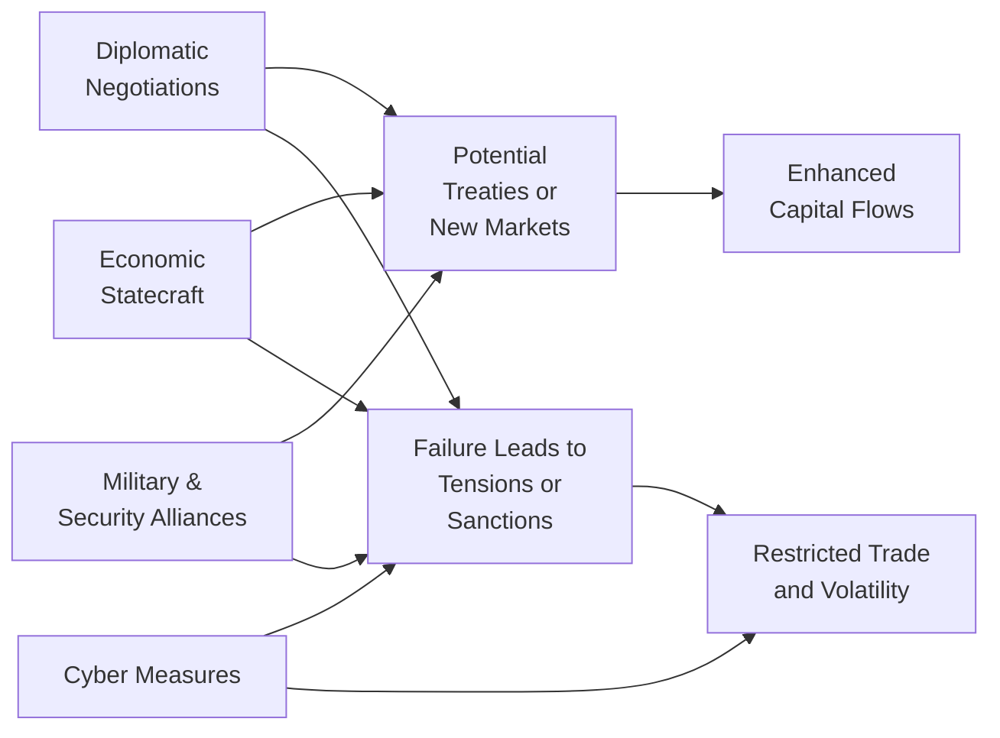

Geopolitics often shapes the ebb and flow of investment opportunities worldwide, sometimes in surprisingly subtle ways. I remember being totally stunned a few years back—yes, personally—when a sudden announcement of new trade sanctions caused a sharp sell-off in a region's equity market, even though local fundamentals were still solid. Clearly, the political dimension can overshadow other elements of asset pricing. Below, we’ll walk through the key tools of geopolitics and diplomacy, demonstrating how they influence economic stability, investment prospects, and the global order. Throughout, we’ll also keep an eye on the inherent risks and opportunities for portfolio managers and policy analysts—and occasionally, I might say “um” or “well,” just to highlight that, hey, these topics can be tricky.

## Diplomatic Negotiations

Diplomatic negotiations are some of the most enduring and recognizable tools in geopolitics. Countries engage in diplomacy to:

• Negotiate treaties (e.g., trade agreements, climate accords)  
• Resolve cross-border disputes (sometimes over territory or trade issues)  
• Secure alliances for mutual defense or economic cooperation  
• Coordinate fiscal or monetary policies in times of crisis

Think of the negotiation process as a structured attempt to manage conflict and preserve relationships. It might sound like a negotiating strategy you’d go through when buying a house—except the stakes are often measured in billions of dollars or even in matters of war and peace. 

From an investment perspective, diplomatic breakthroughs (such as a multilateral free trade deal) can lower tariff barriers, encourage cross-border capital flows, and reduce trade frictions. These outcomes might boost earnings for export-oriented firms and push up equity valuations in the participating countries. On the other hand, a breakdown in diplomatic talks can rattle markets, especially if it signals future sanctions or tariffs.

Diplomatic negotiations also shape the narrative around policy shifts. For instance, if two major powers settle a dispute through formal negotiations, you’ll likely see more favorable conditions for foreign direct investment (FDI). Investors who track the trajectory of these negotiations—sometimes gleaned from official statements, press conferences, or behind-the-scenes intelligence—can better foresee industry winners and losers. 

## Economic Statecraft

Economic statecraft might sound like a fancy term, but it’s basically how a government uses economic tools—carrots and sticks—to advance its national interests. Let’s highlight a few:

### Tariffs, Quotas, and Embargoes

Tariffs are taxes levied on imports, making foreign goods more expensive relative to domestic products. Quotas cap the volume of a particular good that can be imported, and embargoes are outright bans on trade with specific countries. These methods are used both punitively and protectively.

It’s worth remembering that imposing tariffs or quotas can trigger reciprocal measures. We’ve seen “trade wars” in recent years, where countries lob tariffs back and forth. Market participants (including you and me) often struggle to price in this back-and-forth dynamic. For instance, if you hold shares in a manufacturing firm heavily reliant on imported materials, a tariff can quickly raise production costs, compress margins, and thus reduce the stock’s fair value.

### Foreign Aid and Favorable Trade Deals

Incentivizing allies through foreign aid or advantageous trade deals is another powerful lever. A government might provide low-interest loans or direct grants to a partner country in exchange for strategic military access or policy alignment. Imagine a scenario where a large nation invests billions into the infrastructure of a smaller, resource-rich country, effectively gaining influence over commodity flows or local political decisions. This can spur infrastructure booms, create local jobs, and even strengthen bilateral relationships—until or unless the smaller country struggles with debt sustainability. Then you could see credit downgrades, currency volatility, and so on.

### Soft Power

Soft power is about influence without coercion—often manifesting as cultural outreach, educational exchanges, or global media initiatives. A prime example could be a country's push to get its local language or technology standards adopted worldwide. If successful, that adoption might boost market opportunities for firms from that country. The ripple effects can be found in everything from the spread of entertainment content (think streaming services) to the widespread adoption of a country’s software or payment platforms.

## Cyber Measures

Although you might not see the term “cyber espionage” too often in classic finance textbooks, let’s face it: we live in a digitally intertwined world. Cyberattacks, hacking, and information warfare are the new frontiers in geopolitical confrontation. These can be orchestrated by nation-states, proxy groups, or even rogue actors.

In purely financial market terms, a major hack that compromises corporate data—or disrupts a country’s payment systems—might erode consumer trust and hamper cross-border transactions. For instance, a state-sponsored attack on a major bank’s electronic payment infrastructure could freeze transaction flows. Investors with exposure to that bank, or to the broader region’s financial institutions, may see immediate hits to share prices.

We’ve also witnessed the potential for cyber-driven misinformation campaigns that influence public sentiment and risk perceptions. A well-timed hacking scandal can amplify reputational damage and shift capital flows. For that reason, portfolio and risk managers are increasingly factoring in a firm’s or region’s cyber resilience when making investment decisions.

## Military and Security Alliances

Military alliances, such as NATO or other regional defense pacts, can significantly shift the balance of power. While alliances are often justified as deterrence, they can also provoke or intensify opposing alliances. 

A strong security alliance might protect crucial shipping lanes for oil or raw materials, ensuring stable supply chains and reinforcing trade. This can have a stabilizing effect on commodity prices—at least in that region. Conversely, if tensions escalate between rival alliances, it may trigger fears of full-blown conflict, hamper supply route reliability, and potentially cause commodity prices to spike. 

Military alliances also overlap with economic relationships. If a country invests heavily in defense collaboration with an ally, you might see technology transfer deals that boost domestic defense firms. Investors aware of upcoming security pacts can position themselves—perhaps anticipating an uptick in defense sector profits.

## Impact on Global Governance

Tools of diplomacy and geoeconomic tactics often reflect—and simultaneously reshape—global governance structures. Multilateral organizations like the United Nations, the World Trade Organization (WTO), or the International Monetary Fund (IMF) can be buttressed by successful diplomatic solutions. If member states use these institutions effectively to solve crises, investor confidence in global cooperation rises. That can reduce perceived systemic risk and encourage capital inflows to emerging markets.

Yet, unilateral actions—like imposing sanctions without broad international support—can strain these institutions. In an environment of fractured governance, cross-border disputes become more common, supply chains get complicated, and global investors face a higher “geopolitical risk premium.” 

Sometimes a single unilateral decision can undermine the credibility of a global forum. If investors perceive a shift to go-it-alone policies, they might prioritize stable regions or certain “safe haven” currencies. For instance, if a major economy repeatedly circumvents international arbitration over trade disputes, capital might flow away from smaller or more vulnerable economies that can’t effectively respond to pressure.

## Strategic Partnerships

Countries also deepen ties through major infrastructure or development initiatives. China’s Belt and Road Initiative (BRI) is probably the most cited case in recent years. By funding infrastructure projects—roads, railways, ports—across Asia, Africa, and parts of Europe, China gains not only economic returns but also significant geopolitical influence. 

From a capital markets lens, large-scale projects can reshape trade corridors, spur local economic development, and possibly elevate a region’s competitiveness. But these same projects can result in substantial debt obligations for recipient countries. If those nations fail to repay their loans, the sponsor country (in this example, China) can gain a strategic foothold in that region—sometimes controlling critical ports or resources. For bond investors or equity holders, it’s key to monitor a country’s external debt level and repayment capacity. Default risk might skyrocket if the infrastructure fails to produce the expected returns.

## Public Opinion and Media

Governments carefully craft messages to shape domestic and global audiences’ perceptions. Some states invest in extensive propaganda or state-controlled media channels, aiming to rally domestic support for geopolitical maneuvers—like imposing new tariffs or forging new alliances. 

This tool is subtle but powerful: if the government can sustain public approval for a tough foreign policy stance, it may be emboldened to intensify a trade war or maintain sanctions longer. For investors, the political sentiment at home can act as a barometer, influencing how likely new measures are to pass. Sudden reversal of public support—fueled by shifting media campaigns—can derail ongoing negotiations or cause abrupt changes in capital flows. 

If you’ve ever seen how quickly a social media uproar can lead to a complete shift in policy direction, you’ll appreciate how vulnerable markets can be to the rapid churn of the news cycle.

## Risk and Opportunity for Investors

Geopolitics is a double-edged sword for capital markets. On the risk side, escalations in tension can shut down previously open markets, hamper supply chains, and trigger abrupt capital flight. Tariffs, sanctions, or regional conflicts can weigh on asset values or cause massive volatility. 

On the opportunity side, diplomatic breakthroughs—such as normalized relations—can open the gates for fresh investment or new lines of credit. Sometimes a dramatic improvement in relations leads to a “peace dividend,” where defense spending is reallocated to social or infrastructure development. If you, as a portfolio manager, spot the early signs of such improvements, you can position your portfolio to capitalize on newly accessible markets or undervalued assets.

Balancing the risk and reward means actively following:

• Policy announcements and official statements  
• Defense agreements and alliances  
• Intelligence briefings or think-tank analyses  
• Trade negotiations and legislative processes

Savvy analysts also consider early indicators—like the presence of foreign diplomats at trade expos, or local media coverage hinting at softer stances—when forecasting potential market moves.

## Visualizing Geopolitical Tools and Their Market Impact

Below is a simple Mermaid.js diagram that illustrates how various geopolitical tools might propagate through economies and investment markets. Note the chain reactions:

In this diagram:  
• Diplomatic negotiations, if successful, might open new markets or bring about treaties, leading to enhanced capital flows and more stable investment climates.  
• If negotiations fail, sanctions or restricted trade can create turbulence.  
• Economic statecraft, cyber measures, and military alliances can all tilt outcomes toward agreement (B) or tension (C).  

## Best Practices and Pitfalls

• Conduct Scenario Analysis: Consider multiple potential outcomes of a geopolitical event. For instance, if a tariff war escalates, Factor A could happen; if it de-escalates, Factor B might take the lead.  
• Monitor Cross-Border Correlations: Markets are intertwined. One region’s political shift might affect commodity supplies in another region, which can then ripple across the globe.  
• Assess Country-Specific Indicators: Look at foreign exchange reserves, interest rate differentials, or trade balances to gauge how much a country can adapt to external pressures.  
• Beware of Overreliance on Headlines: Media coverage can be sensational. Always dig beneath sensational headlines to gauge actual policy changes or legislative steps in progress.

## Final Exam Tips

• Linking Tools to Asset Allocation: In essay or structured-response questions, examiners might ask how a major geopolitical tool (like widespread tariffs) could influence your tactical asset allocation. Demonstrate your ability to connect macro-level policy changes with potential movements in equity, fixed-income, and currency markets.  
• Stress Testing in Portfolio Management: Expect scenario-based prompts where you’ll need to evaluate how an investor’s portfolio might respond to a sudden cyberattack or the unraveling of a major military alliance. Show that you can logically step through the chain reaction of events and propose risk mitigation strategies (e.g., using derivatives, shifting allocations).  
• Integrating Research Sources: The exam might have item-set style questions with excerpts from think-tank reports, official statements, or news articles. Your job will be to interpret the likely investment implications. Practice spotting relevant facts, ignoring noise, and synthesizing a coherent investment outlook.  
• Ethics and Professional Standards: Remain mindful of the CFA Institute Code and Standards. Geopolitical events sometimes raise insider information or market manipulation concerns. Show that you can uphold professional ethics even in the face of political turmoil.  
• Time Management: Multi-part questions on the CFA Level III exam can be dense. Use bullet points or short paragraphs. Outline your reasoning methodically—especially for constructed-response questions—to ensure clarity.

## Key Terms

• Statecraft: The art of conducting state affairs, focusing on how leaders wield power and policy tools to achieve objectives.  
• Soft Power: The capacity of a country to persuade others without force or coercion, often through cultural or educational means.  
• Hard Power: The use of military or economic means to influence other entities.  
• Information Warfare: Using and managing information (sometimes in misleading ways) to gain advantage in geopolitical struggles.  
• Belt and Road Initiative (BRI): A major China-led infrastructure and investment project spanning multiple continents.  
• Propaganda: Information, especially biased or misleading, used to promote a particular political cause or point of view.  
• Unilateralism: A policy where a state acts largely on its own interests, with minimal consultation with other global players.  
• Bilateral vs. Multilateral Diplomacy: Negotiations involving two nations vs. joint discussions among multiple parties.

## References and Further Reading

• Nye, J. (2004). “Soft Power: The Means to Success in World Politics.” PublicAffairs.  
• Allison, G. (2017). “Destined for War: Can America and China Escape Thucydides’s Trap?” Houghton Mifflin Harcourt.  
• Council on Foreign Relations: https://www.cfr.org  
• World Trade Organization (WTO): https://www.wto.org  
• United Nations Conference on Trade and Development (UNCTAD) for global trade data: https://unctad.org  
• Official websites of major central banks for policy statements (e.g., Federal Reserve, ECB, PBOC)

## Tools of Geopolitics and Diplomacy Quiz



### How can successful diplomatic negotiations most directly benefit investment markets?

- [x] They can open new trade agreements and foster a surge in capital flows.  
- [ ] They immediately guarantee lower interest rates for all participating countries.  
- [ ] They prevent all forms of future conflicts.  
- [ ] They eliminate the risk of currency volatility.  

> **Explanation:** Diplomatic negotiations often finalize treaties and agreements that ease trade barriers, attracting increased investment flows. Interest rates, conflicts, and currency volatility remain determined by a variety of factors beyond just negotiations.

### Which of the following best characterizes economic statecraft?

- [ ] Restricting domestic consumption in favor of exports.
- [x] Using economic tools such as tariffs, quotas, or foreign aid as a means to advance national interests.
- [ ] Launching direct military intervention to stabilize a market.
- [ ] Setting central bank interest rates based on inflation targets.

> **Explanation:** Economic statecraft involves using policies like tariffs, trade deals, or foreign aid to influence global relationships. It is distinct from military approaches and monetary policy tools.

### Why might cyber measures be considered a critical geopolitical tool in modern finance?

- [ ] They reduce the need for physical shipping lines.  
- [x] They can disrupt financial systems, undermine consumer confidence, and impact cross-border transactions.  
- [ ] They are exclusively used for surveillance of commodities markets.  
- [ ] They eliminate currency exposure for multinational corporations.  

> **Explanation:** Cyber espionage and hacking can freeze or manipulate payment networks, compromise bank data, or spread misinformation, leading to volatility in markets and disruptions in global trade flows.

### What is a primary reason military alliances can affect commodities markets?

- [x] They may protect or disrupt shipping lanes for key resources.  
- [ ] They set global commodity price targets.  
- [ ] They replace the need for futures and derivatives in hedging.  
- [ ] They instantly regulate supply-demand ratios of all global commodities.  

> **Explanation:** Alliances help secure or threaten transit routes, significantly impacting resource availability and subsequent commodity pricing in world markets.

### How can unilateral sanctions imposed by a major economy affect global governance?

- [x] They can undermine multilateral institutions if done without broad international support.  
- [ ] They always strengthen institutions like the WTO.  
- [x] They can create a higher geopolitical risk premium in global markets.  
- [ ] They eliminate the need for diplomatic negotiations.  

> **Explanation:** Unilateral measures can marginalize multilateral entities, introducing power imbalances and uncertainty. Markets often respond by increasing the risk premium for affected regions.

### Which of the following describes the Belt and Road Initiative (BRI)?

- [ ] A bilateral trade pact solely between China and the United States.  
- [ ] A military alliance among Asia-Pacific nations.  
- [x] A China-led infrastructure and investment project spanning multiple regions.  
- [ ] A global philanthropic organization aimed at poverty alleviation.  

> **Explanation:** The BRI is a large-scale, multi-continent infrastructure project that aims to enhance connectivity and trade. It is not a military alliance nor limited to bilateral arrangements.

### Which statement best reflects the use of propaganda in geopolitics?

- [x] Governments may influence public opinion domestically and abroad through media control or biased information.  
- [ ] Propaganda is illegal globally and carries fines by the UN.  
- [ ] Propaganda only works when targeting foreign audiences in conflict zones.  
- [ ] Propaganda is exclusively a WWII-era phenomenon, irrelevant today.  

> **Explanation:** Propaganda continues to shape or sway public opinion by disseminating information tailored to political purposes, making it an ongoing geopolitical tool worldwide.

### When should investors pay the most attention to public opinion influenced by state-controlled media?

- [x] When rapid shifts in popular sentiment might lead to abrupt policy changes.  
- [ ] Only when official inflation data are released.  
- [ ] Strictly during election years.  
- [ ] Never; public opinion has no bearing on international markets.  

> **Explanation:** Public opinion significantly sways political leaders. If support for a particular economic policy shifts rapidly, a government may respond by altering trade relationships or regulations, affecting markets.

### Why do bilateral or multilateral diplomatic negotiations matter to capital flows?

- [x] They can establish new trade corridors or reduce tariffs, opening channels for increased foreign investment.  
- [ ] They force corporations to adopt uniform accounting standards.  
- [ ] They standardize global interest rates for all member nations.  
- [ ] They replace national tax systems with a single global rate.  

> **Explanation:** Diplomatic negotiations often aim to smooth cross-border trade and investment, directly influencing how and where capital can flow.

### True or False: The adoption of large-scale trade agreements always eliminates currency volatility among member nations.

- [x] True  
- [ ] False  

> **Explanation:** This statement is actually false in real-world contexts, but watch out for tricky wording on the exam. Large trade agreements can reduce some aspects of economic uncertainty, but they do not guarantee the elimination of currency volatility.  


