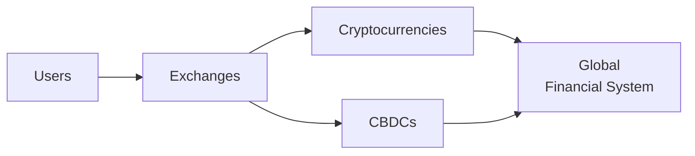

## Basic Definition and Growth

I still remember the first time I heard someone mention “Bitcoin.” I was at a networking event, and I had that moment of, “Um, digital money that isn’t tied to a country? How would that even work?” Fast-forward a few years, and digital currencies—often known as cryptocurrencies—are everywhere, from major news headlines to central bank research papers. 

In broad terms, digital currencies are monetary assets that exist only in electronic form. Unlike traditional banknotes and coins, which you can hold in your wallet, digital currencies use either decentralized structures such as blockchains (in the case of cryptocurrencies like Bitcoin) or centralized digital frameworks (as in the case of certain central bank digital currencies, or CBDCs).

Cryptocurrencies rely heavily on cryptographic proof and distributed ledgers to record transactions. A well-known example is Bitcoin, launched in 2009, which uses blockchain technology to validate and secure transactions without a central authority. Many other cryptos have followed, some focusing on privacy (like Monero), others on programmability (like Ethereum), and others pegged to fiat currencies (stablecoins such as Tether or USDC) to minimize volatility. 

Meanwhile, central banks worldwide have recognized that if the future is digital, they need to remain relevant. Many are investigating—and some have started piloting—their own CBDCs. By issuing a digital version of their national currency, central banks can improve payment efficiency, lower transaction costs, and enhance financial inclusion, among other potential benefits. 

However, the growth of digital currencies has introduced an enormous set of questions that are not just financial, but geopolitical in nature. Understanding how these assets transform our global financial system is crucial for investors, policymakers, and anyone interested in the evolving landscape of money.

## Geopolitical Dimensions

### Monetary Sovereignty

Monetary sovereignty gives nations control over their currency issuance, interest rates, and monetary policy. But if people prefer to use a global digital currency (like Bitcoin or a foreign CBDC), a country could lose some control over its domestic monetary policy. In extreme cases, widespread adoption of a foreign digital currency might make it tougher for local authorities to set interest rates, influence the money supply, or implement capital controls.

From a real-world perspective, think about how some small economies already use the U.S. dollar extensively. Now imagine if, instead of the U.S. dollar, locals started using a cryptocurrency that they trust more than their own local currency. That dynamic can circumvent a central bank’s influence. 

### Strategic Development of CBDCs

In response, many central banks are pushing forward with research and pilot programs on CBDCs. Each country’s approach is slightly different, and there’s often a national pride element involved—nobody wants to lag behind in digital financial innovation. National CBDCs aim to blend the convenience and innovation of digital currencies with the central bank’s oversight, ensuring (at least in theory) that policymakers preserve the ability to enact monetary policy effectively and track money flows for anti-money-laundering (AML) and counter-terrorist financing (CTF).

Some major economies (like China with its digital yuan) see CBDCs as a way to reduce reliance on existing global payment structures (such as those dominated by Western financial networks). Meanwhile, smaller economies might view CBDCs as a way to promote inclusion or lower the costs of cross-border remittances, which can be significant for emerging markets.

## Regulatory Environment

The regulatory environment around digital currencies is anything but uniform. On one end of the spectrum, some countries have embraced digital assets with dedicated legal frameworks clarifying ICOs (initial coin offerings), security tokens, stablecoins, and more. Singapore, Switzerland, and certain U.S. states (like Wyoming) are examples of crypto-friendly jurisdictions that aim to become hubs of digital innovation.

On the other end, some governments outright ban the use of cryptocurrencies. For instance, a few countries have declared cryptocurrencies illegal, concerned about capital flight, consumer protection, or the undermining of monetary authority. 

Between these extremes lie most major economies, where regulators constantly evaluate how to balance financial stability, consumer protection, and innovation. For investors, the ability to trade, hold, or issue tokens often depends on understanding local regulations. Differing rules around AML/KYC requirements, taxation, and licensing can create a patchwork of compliance challenges—but also open up cross-border arbitrage opportunities. 

Regulatory clarity (or uncertainty) can dramatically impact asset prices. News of a favorable framework in a major economy can spur bullish sentiment, while crackdowns or harsh regulations often trigger market sell-offs.

## Undermining Sanctions and Capital Controls?

Digital currencies can allow users to move value quickly across borders without relying on traditional payment rails like SWIFT or major correspondent banks. This functionality raises a key geopolitical issue: Could individuals, corporations, or even governments use digital currencies to circumvent economic sanctions or capital controls?

For instance, if a sanctioned country has limited access to international financial markets, it might turn to decentralized cryptocurrency networks to bypass restrictions. While liquidity or acceptance might still be challenging, the mere existence of an alternative transfer network is enough to concern policymakers who want to maintain robust sanctions regimes. Similarly, countries with strict capital controls sometimes see a surge in peer-to-peer cryptocurrency trading as citizens look for ways to move their wealth abroad. 

Even stablecoins, pegged to major currencies like the U.S. dollar, can facilitate cross-border transactions mostly outside official channels. This tension heightens the regulatory focus on exchanges and wallet providers to ensure they comply with AML/KYC protocols, lest they become conduits for unlawful financial flows.

## Financial Inclusion or New Divides?

One of the most compelling arguments in favor of digital currencies is that they open doors for millions of unbanked or underbanked individuals. Imagine a remote area with poor banking infrastructure, where people nonetheless carry smartphones. Digital wallets could empower them to receive salaries, make payments, or save in a secure digital asset—without needing a physical bank branch. 

However, critics note that this vision often glosses over practical challenges, like internet access, digital literacy, or the risk of hacking. If technology is required to use these currencies, those without stable internet connections or modern devices are left behind. Plus, not everyone feels confident transacting in a digital environment. We may wind up with a “digital divide,” where those with the right devices and knowledge benefit, and others fall further behind.

In countries exploring CBDCs for financial inclusion, the central bank might design accessible interfaces, partner with mobile network operators, or use offline payments for areas with limited connectivity. These pilot programs will likely set important precedents for how digital currencies might advance inclusive finance.

## Volatility and Market Speculation

Cryptocurrency prices can swing wildly in a matter of hours. Many factors drive this volatility: speculation by momentum traders, leverage used on unregulated exchanges, shifting regulatory stances, and social media hype. 

From a geopolitical standpoint, whenever a major government announces new restrictions or grants new approvals, prices can surge or plummet. Investors with exposure to digital currencies must pay close attention to policy news from big players (e.g., G7/G20 countries, the EU, or major emerging markets). Even a rumor about possible legislation can spark dramatic market moves.

Yet volatility isn’t entirely a drawback. Speculators thrive on big price swings, seeing them as opportunities for large gains (though also risking large losses). For markets, some argue speculation actually increases liquidity. For risk managers, however, this volatility can be a headache, forcing them to consider position limits, stringent margin requirements, and robust scenario analysis.

## Security and Cyber Threats

Digital assets can be stolen if user wallets, crypto exchanges, or the underlying technology have weaknesses. Organized cybercriminals, unscrupulous hackers, or even state-sponsored actors can target digital currency infrastructure. After all, if someone gains access to your private keys, they effectively own your coins. 

High-profile hacks—like the Mt. Gox exchange collapse in 2014—have repeatedly shaken investor confidence. Today, many large exchanges use “cold storage” (keeping most digital assets offline) and invest heavily in cybersecurity. Still, vulnerabilities can happen in smart contracts, user endpoints, or even cryptographic algorithms if quantum computing becomes viable in breaking current encryption standards.

Countries are also exploring the idea of using (or hacking) digital networks to quell political opposition or disrupt an adversary’s economy. This dynamic adds a new frontier to digital warfare. The bottom line is: good cybersecurity practices and robust regulatory oversight are indispensable for long-term stability and trust in digital currency ecosystems.

## Portfolio Implications

At this point, you may be thinking: “Great, but what does all this mean for investment portfolios?” Well, digital currencies present both an opportunity and a risk. 

On the plus side, some cryptocurrencies have shown relatively low correlations with traditional assets—at least from time to time—making them potential diversification tools. Even a small allocation to Bitcoin or Ethereum in a portfolio may enhance its risk-return profile. Recently, institutional acceptance of digital assets has led major firms to invest in Bitcoin as a hedge against inflation or a store of value, although the debate on whether crypto truly is an “inflation hedge” remains ongoing.

On the other hand, regulatory uncertainty, liquidity issues, and cybersecurity threats can lead to steep drawdowns or abrupt changes in market conditions. Emphasizing risk management is paramount. Investors might look at:

• Monitoring central bank policy statements regarding CBDCs and crypto regulations.  
• Diversifying across multiple cryptocurrencies and stablecoins, if allowed by local regulations, to spread out risk.  
• Using safe custody solutions, such as hardware wallets or insured institutional custody providers.  
• Hedging large positions via derivatives, if available in regulated markets.  

In short, digital currencies can play several roles in a portfolio, from speculative growth assets to alternative diversifiers. But prudent due diligence—including a thorough read of relevant regulations, market infrastructure, and geopolitical signals—is indispensable.

Here’s a simple diagram depicting some of the main actors in the digital currency ecosystem and how they connect to the broader global financial system:

## Exam Relevance and Practical Tips

• On your CFA exam (and in real-world investment practice), be prepared for scenario-based questions about sudden regulatory shifts or central bank announcements that could impact digital currency markets and thus broader capital markets.  
• Practice analyzing the correlation and volatility of digital assets in hypothetical portfolio allocation questions.  
• Keep an eye on conceptual frameworks like AML, KYC, and capital controls—these topics often appear in exams testing your understanding of how regulatory environments shape investment decisions.

## Glossary

• CBDC (Central Bank Digital Currency): A digital form of a country’s official currency, issued and regulated by its central bank.  
• Bitcoin: The first decentralized cryptocurrency, based on blockchain technology.  
• Blockchain: A distributed ledger technology that records transactions across multiple nodes in a secure, verifiable manner.  
• Stablecoin: A cryptocurrency pegged to a stable asset like the U.S. dollar to reduce price volatility.  
• Capital Controls: Measures taken by governments to regulate capital flows, such as limits on foreign currency transactions.  
• AML/KYC (Anti-Money Laundering / Know Your Customer): Regulations requiring verification of identities to prevent illegal financial activities.  
• Hashing: A cryptographic process that converts data into a fixed-size string of characters.  
• Cold Storage: Offline storage of digital currency, which protects assets from internet-based threats.

## References and Further Reading

• Narayanan, A., Bonneau, J., Felten, E., Miller, A., & Goldfeder, S. (2016). Bitcoin and Cryptocurrency Technologies. Princeton University Press.  
• BIS (Bank for International Settlements). Various Reports on Central Bank Digital Currencies. Available at:  
  https://www.bis.org  
• CFA Institute. Cryptoassets: The Guide to Bitcoin, Blockchain, and Cryptocurrency for Investment Professionals. Available at:  
  https://cfainstitute.org  

-----

## Knowledge Check: Digital Currencies and Global Financial Markets



### Which factor often motivates central banks to launch their own digital currencies (CBDCs)?

- [ ] To increase the volatility of the global financial system.
- [x] To sustain monetary policy effectiveness and maintain financial stability.
- [ ] To eliminate digital payments entirely.
- [ ] To ban all forms of cryptocurrency.

> **Explanation:** Central banks develop CBDCs to ensure they can still track financial flows, conduct monetary policy effectively, and preserve financial stability in a rapidly digitizing world.

### How might decentralized cryptocurrencies undermine a country's monetary sovereignty?

- [ ] By merging directly with the national currency.
- [ ] By always working hand-in-hand with central bank policies.
- [x] By facilitating currency exchange and transactions outside the control of monetary authorities.
- [ ] By requiring citizens to hold only government-issued digital wallets.

> **Explanation:** Decentralized cryptocurrencies can bypass regulation and limit the government’s ability to control its currency supply and monetary policy, thereby weakening monetary sovereignty.

### Why do some analysts argue that the volatility of cryptocurrencies can be beneficial?

- [ ] High volatility makes them behave like stable currencies.
- [x] Volatility can offer ample speculative trading opportunities and sometimes increase market liquidity.
- [ ] Volatility only benefits central banks planning to adopt these currencies.
- [ ] Volatility has no potential benefits, only risks.

> **Explanation:** Although volatility poses risks, it can attract traders who profit from price swings and provide liquidity to the marketplace.

### What is one significant concern regarding digital currencies in the context of sanctions?

- [ ] They make it impossible to transfer funds internationally.
- [ ] They strictly follow traditional SWIFT protocols.
- [x] They may enable cross-border flows that bypass conventional sanction mechanisms.
- [ ] They are only accepted in sanctioned countries.

> **Explanation:** Digital currencies, especially decentralized ones, can circumvent traditional financial networks, potentially weakening or undermining sanctions.

### Which statement best describes the role of stablecoins within the digital currency space?

- [x] Stablecoins aim to reduce price volatility by pegging their value to a reserve asset like the U.S. dollar.
- [ ] Stablecoins are a form of intangible derivative that tracks commodity indices.
- [ ] Stablecoins help central banks ban cryptocurrencies.
- [x] Stablecoins can facilitate cross-border transactions with fewer fluctuations in value.

> **Explanation:** Stablecoins are designed to minimize volatility by pegging to a stable asset. They’re also widely used for cross-border transfers due to their steady valuation.

### In the context of portfolio management, which of the following is an important advantage of including cryptocurrencies?

- [x] Potential diversification benefits due to relatively low correlation with traditional assets.
- [ ] Guaranteed returns regulated by central banks.
- [ ] Complete elimination of investment risk.
- [ ] Prevention of currency appreciation in global markets.

> **Explanation:** Some cryptocurrencies have shown low correlation with stocks and bonds, offering potential diversification benefits. Other options listed are not typical features of cryptocurrencies.

### Why might regulatory clarity be important for institutional investors considering digital currencies?

- [ ] It ensures digital assets will always yield positive returns. 
- [x] Clear regulations reduce legal uncertainty and promote secure, legitimate market participation.
- [x] It provides a framework for compliance with AML/KYC and other laws. 
- [ ] It prevents central banks from introducing new currencies.

> **Explanation:** Institutional investors need clarity to manage legal risks and ensure compliance with regulations, so they can integrate digital assets safely into portfolios.

### What is the primary role of “cold storage” in digital currency management?

- [x] It stores digital assets offline to protect them from hacking attempts.
- [ ] It accelerates payment settlement times.
- [ ] It allows government authorities to freeze digital assets at any time.
- [ ] It pegs a cryptocurrency to an underlying commodity.

> **Explanation:** Cold storage involves keeping private keys offline, significantly reducing exposure to cyber threats targeting online infrastructure.

### How can digital currencies enhance financial inclusion?

- [x] By lowering barriers to entry for unbanked or underbanked individuals, especially if they have internet access.
- [ ] By requiring all users to have accounts at major international banks.
- [ ] By eliminating the need for AML/KYC checks.
- [ ] By restricting cryptocurrency usage only to large institutions.

> **Explanation:** Digital platforms and mobile wallets can provide accessible financial tools to individuals with limited traditional banking access.

### True or False: One of the risks associated with digital currencies includes the potential for state-sponsored cyberattacks on cryptocurrency networks.

- [x] True
- [ ] False

> **Explanation:** Yes, state-sponsored or criminal actors may target cryptocurrency exchanges, wallets, or the networks themselves, prompting the need for robust cybersecurity measures.


