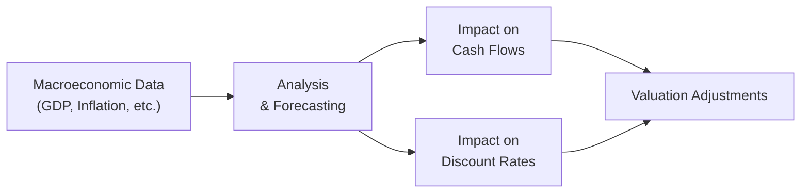

## Introduction

When I first started studying finance, I remember feeling overwhelmed by the sheer number of macroeconomic indicators out there—GDP growth, unemployment reports, inflation data, interest rates... you name it. Every day, market commentators seemed to say, “Oh, the latest jobs report is out!” or “The Fed signaled it may tweak its policy rate!” It was like standing in front of a giant mosaic and not knowing which piece to look at first. But, over time, I realized these big-picture puzzle pieces aren’t just random lines on a chart. They genuinely shape the way we value assets—whether it’s a growth stock, a government bond, or even real estate.

In this section, we’ll explore exactly how macroeconomic data can be translated into asset valuation inputs. We’ll look at how the business cycle affects corporate earnings, how interest rate policy trickles down into the discount rates we use in valuation models, and how we can use scenario analysis to stay nimble when the economy flexes in unexpected directions.

## The Role of Macroeconomic Indicators in Valuation

Macroeconomic indicators offer a quick snapshot of the health and trajectory of a national (or global) economy. They often serve as signals that help us forecast everything from corporate earnings to risk premiums. Let’s walk through some of the most common data points and see how they land in the valuation equation:

### GDP Growth

Gross Domestic Product (GDP) growth is often considered a cornerstone metric. When GDP accelerates, consumers and businesses typically have more disposable income to spend, and corporate revenues can rise. Higher revenues can translate into boosted cash flows, which ultimately may lift prevailing valuations. Conversely, a downturn in GDP often coincides with shrinking corporate earnings and subdued share prices.

### Inflation and Price Stability

Inflation is like that slow leak in your tire—if it’s moderate and controlled, you might not even notice; but if it spikes, you could be in for a bumpy ride. Moderate inflation can signal healthy demand for goods and services. But rapid inflation erodes purchasing power. Firms forced to pay higher input costs might see margin pressures unless they can pass those cost increases on. This affects stock valuations, especially those of firms that lack pricing power. Meanwhile, in the bond market, unexpected inflation can gnaw away at fixed coupon payments, lowering bond prices.

### Interest Rates and Central Bank Policy

Interest rates set by central banks (policy rates) are absolutely key in valuation models. A lower interest rate environment (especially when the policy rate is near zero) typically reduces the discount rate you’d use in, say, a dividend discount model. A lower discount rate drives up the present value of future cash flows—pushing asset prices upward. On the flip side, a hike in policy rates often raises required returns and depresses the present value of future cash flows, creating downward pressure on valuations.

### Unemployment

While we often think “earnings” when focusing on macro data, tracking the labor market can be just as crucial. High unemployment might mean lower consumer demand, prompting conservative revenue forecasts in valuation. On the other hand, a tight labor market can push wages up, possibly squeezing corporate margins if companies can’t offset rising labor costs with higher prices.

## Linking the Business Cycle to Asset Valuation

Knowing where we are in the business cycle can provide critical context for interpreting all the macro data swirling around. Are we in an expansion where businesses ramp up output and consumers ramp up spending? Or in a contraction where cost-cutting is the norm?

• Expansion Phase: Rising GDP, stronger corporate earnings, more robust consumer and business spending often hold promise for higher asset valuations.  
• Peak: Growth may plateau; any signals of policy tightening or inflation overshoot can dampen valuations.  
• Contraction/Recession: Slowing or negative GDP growth, rising unemployment, and depressed consumer confidence weigh on asset prices, though bond markets may rally if interest rates fall.  
• Trough: Economic indicators bottom out; forward-looking investors might spot undervalued opportunities that can surge as the economy recovers.

This cyclical nature is aligned with Chapter 3 on Business Cycles (see “Phases of the Business Cycle” and “Economic Indicators”) for a refresher. An investor who correctly identifies a shift from recession to early expansion could position themselves in more cyclical stocks or increase their equity exposure in anticipation of a bounce-back in corporate earnings.

## Top-Down vs. Bottom-Up Analysis

### Top-Down Approach

A top-down approach starts with big-picture macro trends before drilling down to specific sectors or companies. For instance, if you suspect an interest rate hike is on the horizon, you might tilt away from highly leveraged companies or rate-sensitive sectors such as utilities or real estate investment trusts (REITs). Conversely, you might favor cyclical sectors that typically outperform when the economy is strong, like technology or consumer discretionary.

### Bottom-Up Approach

A bottom-up approach flips the lens. It begins at the level of individual companies—analyzing their financial statements, strategic positioning, and competitive landscape. Then it zooms out to understand sector-wide or macro headwinds and tailwinds. If a company’s fundamentals look promising but your macro view warns of an impending slowdown, that tension might lead you to adjust position sizes or incorporate more conservative assumptions in your valuation models.

In practice, many analysts blend the two. You might have a strong top-down read suggesting a recession is due in six months. You then evaluate if your bottom-up pick—a consumer goods firm—can weather slumping demand. By reconciling both perspectives, you form a holistic valuation approach.

## Translating Macroeconomic Indicators into Valuation Models

### Discount Rates

One of the most direct ways macroeconomics shapes asset valuation is through interest rates and the resulting discount rates. In a discounted cash flow (DCF) model, we discount future cash flows by a rate that reflects the time value of money plus any risk premium:


P_0 = \frac{D_1}{r - g}


Here, \\( D_1 \\) is the expected dividend one period from now, \\( g \\) is the expected growth rate of dividends, and \\( r \\) is our required rate of return (which includes risk-free rate + risk premium).

• When monetary policy is loose and risk-free rates are lower, \\( r \\) can drop. That boosts \\( \frac{D_1}{r - g} \\).  
• If the central bank signals hikes, \\( r \\) rises, pulling valuations down.

### Cash Flows (Revenue Growth, Profit Margins)

Macroeconomic measures of demand, like consumer confidence or retail sales, can feed directly into your revenue growth assumptions. For instance, an uptick in consumer sentiment could lead you to forecast that a retailer’s sales grow above trend. Meanwhile, if inflation jumps, you’ll incorporate higher input costs into your model, potentially squeezing profit margins if the firm has limited pricing power.

### Scenario Analysis

Economic forecasting can be, well, a little uncertain. Actually, scratch that—it can be downright unpredictable sometimes. Because no crystal ball is perfect, analysts often run scenario analyses, adjusting macro variables such as GDP growth, inflation, or interest rates to see how valuations shift.

Below is a simple Python snippet (a playful demonstration) to show how we might experiment with different growth and discount rate assumptions:

```python
import numpy as np

# Baseline assumption
growth_rates = [0.02, 0.03, 0.04]     # 2%, 3%, 4%
discount_rates = [0.06, 0.07, 0.08]   # 6%, 7%, 8%
dividend = 2.0

for g in growth_rates:
    for r in discount_rates:
        if r > g:
            price = dividend / (r - g)
            print(f"Growth={g:.0%}, Discount={r:.0%} => Valuation: ${price:.2f}")
        else:
            print(f"Growth={g:.0%}, Discount={r:.0%} => Model not valid")
```

This simple exercise can be expanded with actual corporate cash flow forecasts, inflation adjustments, risk premiums, and more. It’s a handy way of seeing how changes to discount rates and growth rates push modeled valuations around.

### Tracking Leading Indicators

Leading indicators—such as manufacturing orders, building permits, or consumer confidence—can give us a head start on potentially shifting economic conditions. If these indicators start softly rolling over, it might suggest we’re heading for a slowdown even before official GDP data confirms it. Updating your valuation models in anticipation of such changes (especially in sensitive industries like construction or consumer durables) can help you stay ahead of the market curve.

Check out Chapter 3 on “Economic Indicators” (in particular the “Leading, Coincident, Lagging” subtopic) for deeper context on how to recognize these signals.

## Visualizing the Process

Below is a simple Mermaid diagram showing how macroeconomic data flows into asset valuation:



• From left to right, macroeconomic data (like GDP, inflation, policy rates) feed into your analysis.  
• That analysis influences both your cash flow projections and discount rate inputs.  
• The combined effect modifies the valuation of the asset.  

## Best Practices and Common Pitfalls

• Keep an eye on policy: Monetary and fiscal policy can quickly change the trajectory of interest rates or tax rates, steering valuations.  
• Avoid one-size-fits-all assumptions: Different industries have different sensitivities to macro shocks. A tech startup might be hammered by a rate hike, while a consumer staples firm might be more resilient.  
• Update often: Macroeconomic conditions shift, so the assumptions in your valuation models should be periodically revisited.  
• Watch out for data lags: Official GDP figures often come out well after the quarter ends. Leading indicators can guide you in real time.  
• Overreliance on a single metric: Don’t base everything on a single data point. Use a combination (GDP, interest rates, inflation, consumer confidence, etc.) for a well-rounded view.

## Putting it All Together

Linking macroeconomic data to asset valuation is both an art and a science. The art comes in interpreting ambiguous signals (like a sudden central bank policy pivot) and weighing them against each other. The science is in plugging these inputs—growth rates, discount rates, inflation assumptions—into quantitative models. 

When you blend a savvy top-down read with targeted bottom-up analysis, you’re better equipped to build valuations that reflect reality (or at least the best available reflection of it). And because reality can change fast, you’ll want to keep scenario analysis front and center. Don’t be afraid to say, “Well, perhaps the Fed might keep rates depressed longer than expected,” or “Hmm, maybe inflation will be stickier.” That’s what scenario analysis is for—testing multiple plausible futures so you’re not caught off guard.

## Practical Exam Tips

• Master the relationships: Be crystal clear on how changes in GDP, inflation, or interest rates typically influence cash flows and discount rates.  
• Learn from the past: Historical data can reveal patterns, but interpret carefully—unique shocks (like the pandemic) can break historical norms.  
• Show your work: On exam questions involving macro-driven models, lay out your rationale step by step: “As GDP growth increases, I assume revenue growth improves, which elevates future cash flows…”  
• Apply scenario analyses: Even if you’re not explicitly asked, consider presenting a base case, upside, and downside to demonstrate your thoroughness.  
• Time management: If you’re in the middle of a constructed-response question, do not dwell too long on explaining every macro detail—focusing on the direct link to valuations can net you points more efficiently.

## References

• Bodie, Z., Kane, A., & Marcus, A. (2021). Investments (12th ed.). McGraw-Hill.  
• Federal Reserve Economic Data (FRED). (n.d.). Retrieved from https://fred.stlouisfed.org/  
• The Economist. (n.d.). “Global Macro Matters.” Retrieved from https://www.economist.com/  

## Test Your Knowledge: Linking Macroeconomic Data to Asset Valuation



### Which macroeconomic indicator is often used as a key measure of overall economic activity?

- [x] GDP growth
- [ ] Inflation
- [ ] Current account deficit
- [ ] Corporate tax rates

> **Explanation:** GDP growth is a primary measure that aggregates all goods and services produced within a country, making it a central gauge of economic health.

### When the central bank lowers the policy rate, what is the most direct effect on valuation models?

- [ ] Decrease in corporate cash flows
- [x] Decrease in discount rates
- [ ] Increase in inflation risk
- [ ] Increase in required equity risk premium

> **Explanation:** Lower policy rates typically reduce the risk-free rate, which in turn lowers the discount rate used in valuation models, pushing valuations higher.

### In a discounted dividend model (DDM), which two macroeconomic factors directly influence the calculation?

- [x] GDP growth forecasts and interest rates
- [ ] Consumer spending trends and unemployment rates
- [ ] Trade balances and government debt levels
- [ ] Currency exchange rates and net exports

> **Explanation:** The DDM uses a discount rate (influenced by interest rates) and a growth rate (often tied to broader economic growth) to determine present values.

### What is the primary purpose of scenario analysis in macro-driven valuation?

- [ ] To confirm only the baseline projection is accurate  
- [ ] To eliminate investment uncertainty  
- [x] To evaluate how changes in macro variables affect valuation  
- [ ] To constrain management’s strategic choices  

> **Explanation:** Scenario analysis lets analysts see how varying assumptions—like faster GDP growth or unexpected rate hikes—impact value estimates.

### Which sector is typically more resilient to interest rate increases?

- [ ] Utilities
- [x] Consumer staples
- [ ] Homebuilding
- [ ] Commercial banks

> **Explanation:** Unlike utilities or homebuilders, consumer staples often exhibit steadier cash flows and have less sensitivity to borrowing rates, making them relatively resilient.

### What risk might a firm face if inflation rises rapidly but it cannot pass those cost increases on to customers?

- [ ] Lower interest expenses
- [x] Margin compression
- [ ] Zero cost of goods sold
- [ ] Accelerated revenue growth

> **Explanation:** Firms that lack pricing power might see profits squeezed because higher input costs reduce margins when they cannot raise prices proportionally.

### Which economic phase typically offers growth stocks the greatest boost to revenues?

- [ ] Recession
- [ ] Stagflation
- [x] Expansion
- [ ] Peak

> **Explanation:** During expansion, consumer and business spending is rising, which can stimulate higher revenue growth, particularly for growth-oriented companies.

### In top-down analysis, an analyst would typically start by:

- [x] Assessing overall economic trends
- [ ] Examining individual firm balance sheets
- [ ] Calculating a company’s liquidity ratios
- [ ] Performing financial statement analysis on a single company

> **Explanation:** Top-down analysis begins with a macroeconomic “big picture,” then narrows down to sectors and individual securities.

### Why might a company in the construction sector watch building permits (a leading indicator) closely?

- [x] They provide an early signal of future demand
- [ ] They are legally required for annual reports
- [ ] They indicate short-term interest rate changes
- [ ] They forecast currency exchange movements

> **Explanation:** Building permits often signal future construction activity, which helps companies in this sector gauge potential changes in revenue pipelines.

### In a scenario where inflation remains above target for a prolonged period, is it typical for central banks to keep interest rates low?

- [x] False
- [ ] True

> **Explanation:** Prolonged high inflation often prompts central banks to raise rates to cool down the economy, rather than keep them low.


