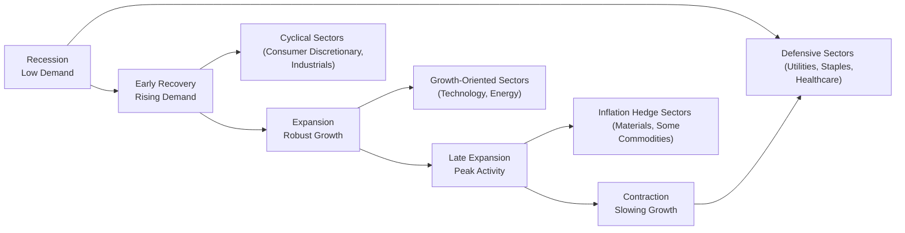

When we talk about sector rotation, we’re really talking about how different industry sectors often exhibit patterns of outperformance or underperformance at various points in the business cycle—expansion, boom, contraction, and recovery. You might have heard someone say, “Hey, consumer discretionary stocks look really good when the economy is starting to rebound,” or “Utilities tend to hold up better when everything else is falling apart.” Well, that’s exactly what sector rotation tries to capture. Using cyclical indicators, we can attempt to time these rotations in a portfolio, positioning ourselves ahead of changes in the economic environment.

Below, we’ll unpack the mechanics of sector rotation, highlight some practical indicators, and discuss how structural trends can sometimes override the usual cyclical patterns. We’ll also dig into the differences between cyclical and defensive sectors, share a few personal insights, and hopefully make it all feel like a friendly conversation over a cup of coffee. Don’t worry, this might sound a bit complicated at first, but we’ll take it step by step.

## Understanding the Concept of Sector Rotation

One day, I remember trying to figure out why technology stocks were booming even though economic data seemed only so-so. Well, that’s part of the magic—and sometimes the mystery—of markets. Sector rotation strategies operate on the principle that industries respond to macroeconomic changes in relatively predictable ways. As the business cycle transitions from one phase to another, certain sectors become more (or less) attractive:

• Early Recovery: Cyclical industries such as consumer discretionary and industrials often benefit from pent-up demand.  
• Mid-Expansion: Technology and growth-oriented sectors might take the lead as corporate earnings accelerate and consumer/business spending rises.  
• Late Expansion: Commodities, energy, and materials can do well when inflationary pressures build and demand for raw inputs remains high (or supply is constrained).  
• Recession/Contraction: Defensive sectors—think utilities, consumer staples, and healthcare—tend to be more resilient because demand for essentials (like electricity, medication, basic food) rarely collapses.

This rotation doesn’t happen overnight, nor does it always stick to a perfect textbook timeline. Still, analysts often rely on established frameworks and known “rules of thumb” to tilt their portfolios when economic conditions appear ready to shift direction.

## Key Cyclical Indicators

Now, you might be wondering: “How exactly do we figure out if the economy is about to shift gears?” That’s where cyclical indicators come into play. These indicators can help investors anticipate turning points (or confirm them after the fact). Below are a few important ones:

### Purchasing Managers’ Index (PMI)
The PMI is a monthly survey of purchasing managers in manufacturing and services. When it’s above 50, it signals an expanding environment; below 50 suggests contraction. If you see PMI surging above 50 for consecutive months, that’s usually a sign of robust economic activity, which often benefits cyclical sectors like industrials. Conversely, a PMI decline can flag shrinking demand, prompting a pivot toward defensive holdings.

### Consumer Confidence Index (CCI)
I don’t know about you, but when my friends and family feel more secure in their jobs and personal finances, they’re far more likely to go on a spending spree—new car, bigger TV, or that fancy vacation. Consumer confidence measures how optimistic (or pessimistic) people feel about the economy. High consumer confidence can point to strong consumer spending, which can support consumer discretionary stocks. A drop in confidence usually foreshadows reduced spending, a potential cue to shift allocations toward more stable (defensive) sectors.

### Housing Starts
Housing starts track the number of new residential construction projects. Rising housing starts can indicate that consumers have enough disposable income and credit availability to purchase homes, which bodes well for home builders, building material companies, and related industries. When housing starts slow, it suggests demand for big-ticket purchases might be weakening, which in turn might suggest a more cautious tilt in sector allocations.

### Other Leading Indicators
• Yield curve shape (steepening vs. flattening).  
• New orders for durable goods.  
• Credit spreads (tightening vs. widening).  

These indicators, collectively, help form a broader economic picture. While none of them is guaranteed to predict future performance perfectly, they provide data that can guide thoughtful sector rotation strategies.

## Cyclical vs. Defensive Sectors

If there’s one big lesson, it’s that not all sectors are created equal. Broadly, we can think of sectors as either “cyclical” or “defensive,” though many industries fall somewhere in between.

### Cyclical Sectors
These are industries whose fortunes rise and fall with the overall health of the economy. Examples:  
• Consumer Discretionary (retailers, auto manufacturers)  
• Industrials (machinery, transportation)  
• Materials (chemical producers, metals & mining)  
• Technology (especially high-growth segments sensitive to corporate budgets)  

When the economy is growing quickly or recovering from a bottom, cyclical sectors often see sales rebound strongly. But, of course, when the economy softens, these can be among the first to feel the pain.

### Defensive Sectors
“Defensive” sectors are less sensitive to economic fluctuations. For instance:  
• Utilities (everyone still needs electricity, no matter the economic climate)  
• Consumer Staples (toothpaste, toilet paper, and groceries remain essential)  
• Healthcare (medical treatments and prescriptions remain in demand)  

These sectors might not skyrocket during expansions, but they help cushion a portfolio when the economy stumbles.

## Overlaying Structural Trends

It’s not just enough to look at cyclical patterns: structural trends can sometimes overshadow the economic cycle. As a personal anecdote, I recall watching tech stocks outperform everything for years, even though certain cyclical signals were screaming caution. Why? Because of a structural shift toward digitization, cloud computing, and e-commerce—these trends had legs far beyond the short-term business cycle.

Factors such as demographics (e.g., aging populations), technology adoption (e.g., remote work, artificial intelligence), and evolving consumer tastes can create long-lasting tailwinds or headwinds for particular sectors. When building a sector rotation strategy, it’s important to keep an eye on these broader developments. After all, a long-term structural shift that drives persistent earnings growth can trump a weaker cyclical outlook.

## Combining Fundamental and Macroeconomic Analysis

Sector rotation is not just a macro game; you still need to care about valuation and company fundamentals. Even if we love the prospects of industrials during a mid-cycle expansion, we have to watch out for overvalued or fundamentally weak companies within that sector.  

Here are a few key points:  
• Relative Valuations: Compare sector valuations (e.g., P/E, P/B, EV/EBITDA) to historical averages and to the market as a whole.  
• Earnings Revisions: Analysts upgrading (or downgrading) earnings estimates can be a clue as to which names might outperform.  
• Balance Sheet Strength: A highly leveraged company may be more volatile and riskier in downturns, even if it belongs to a favored sector.  

This fundamental overlay helps you avoid blindly buying an entire sector or index without regard to potential pitfalls, like high valuations or balance sheet fragility.

## Global Rotation Strategies

We live in an increasingly globalized world. Different regions may not be in lockstep when it comes to their economic cycles. For instance, the U.S. might be in a late expansion even as parts of Europe remain in a mid-cycle or early recovery. That’s where global sector rotation comes in:

• Diversify regionally: If you believe Asia is set for a strong rebound, you might overweight cyclical sectors in those markets while underweighting them in regions you expect to slow down.  
• Currency considerations: Fluctuations in foreign exchange rates can accentuate or diminish gains from sector rotation in other regions. Keep an eye on interest rate differentials and central bank policies.  

Such an approach can be complex, but it also offers extra avenues for alpha if executed carefully.

## Potential Pitfalls and Best Practices

It’s easy to get excited about sector rotation—who doesn’t love the idea of timing the market just right? But there are some pitfalls:

• Timing is Hard: Even professional managers with sophisticated models can miss turning points.  
• Transaction Costs: Rapidly rotating between sectors can rack up frictional costs (commissions, bid-ask spreads, taxes).  
• Overreliance on Single Indicators: It’s risky to base a sector move on just one data point—always confirm with multiple indicators.  
• Valuation Bubbles: A sector’s high momentum might hide underlying overvaluation; don’t forget to check fundamentals.  

Best practices include diversifying, continuously reviewing economic indicators, and maintaining a balanced view that incorporates both macro analysis and micro (company-level) research.

## Visualizing Sector Rotation Across the Cycle

Let’s illustrate a basic roadmap of how sectors typically rotate across a generic business cycle. This isn’t foolproof, but it can be a useful mental model:

## Regulatory and Reporting Nuances

While sector rotation is primarily a top-down strategy, it’s also important to remember that companies report financial results under different standards (e.g., IFRS vs. U.S. GAAP). Subtle differences in revenue recognition, inventory accounting, or asset valuation might alter perceived valuations or growth rates. When selecting companies within favored sectors, always ensure you’re making apples-to-apples comparisons, especially across international boundaries.

## Exam Relevance: Why It Matters

At the CFA exam (especially in scenario-based questions), you might be asked to identify which sectors could outperform given a particular set of economic indicators—like a rising PMI or declining consumer confidence. You might also face questions about how to reconcile sector overweights with specific risk constraints or how to incorporate structural trends. The key is to connect the macroeconomic narrative with the relevant sector exposures and fundamental valuations.

• Be ready to interpret leading indicators rapidly.  
• Understand characteristic behaviors of each sector under different economic scenarios.  
• Acknowledge that structural shifts can defy typical cyclical logic.  

## Practical Tips for the Exam

• Manage your time: Essay or constructed-response questions can be lengthy. Summarize your rationale clearly and tie it back to the data.  
• Use the correct terms: If a question asks about “cyclical vs. defensive” classification, be sure to label them properly.  
• Show your calculations where relevant: Particularly with sector weighting changes, show the basis (like expected returns, valuations, or macro inputs).  
• Expect scenario-based intricacies: The exam may combine expansions in one region with contractions in another, testing your ability to handle global sector rotation.  

## Conclusion

Sector rotation and the use of cyclical indicators represent a powerful way to align your portfolio with overarching economic trends. Whether you’re a quantitative guru with advanced forecasting models or someone who prefers a more qualitative approach—knowing how the business cycle influences different sectors is a cornerstone of strategic asset allocation. Just remember that big, long-term secular trends can sometimes override short-term cyclical patterns, and even within a thriving sector, stock selection still matters.

Above all, keep your eyes on multiple indicators (PMI, consumer confidence, housing starts, among others), watch out for overvaluation, and don’t forget to confirm your macro thesis with strong fundamentals. By blending these elements, you’re in a great position to capture opportunities as the cycle turns.

## References

• Stovall, Sam. “Sector Investing: A Guide to Industry Strategy.”  
• Institute for Supply Management (ISM) Reports (for PMI data):  
  https://www.ismworld.org/  
• Deloitte’s Insights on Global Sector Performance:  
  https://www2.deloitte.com/  

----------

## Test Your Knowledge of Sector Rotation & Cyclical Indicators



### Which sector typically outperforms during economic downturns or contractions?

- [ ] Consumer Discretionary
- [ ] Industrials
- [x] Utilities
- [ ] Technology

> **Explanation:** Utilities is considered a defensive sector and tends to outperform when economic growth slows, because demand for services like electricity and water remains fairly stable.

### Which of the following indicators is generally viewed as a leading signal of manufacturing sector health?

- [ ] Unemployment rate
- [x] Purchasing Managers’ Index (PMI)
- [ ] Consumer Price Index (CPI)
- [ ] GDP deflator

> **Explanation:** PMI surveys track the activity and outlook of purchasing managers, making it a valuable leading indicator of manufacturing sector performance.

### An investor observes that the Consumer Confidence Index has reached historically high levels. Which sector might they consider overweighting based on this indicator alone?

- [x] Consumer Discretionary
- [ ] Healthcare
- [ ] Utilities
- [ ] Energy

> **Explanation:** High consumer confidence suggests robust consumer spending, which often helps consumer discretionary stocks (e.g., retailers, automobiles, travel).

### During a late-expansion phase, which sector often benefits from rising inflationary pressures and strong demand for raw materials?

- [ ] Financials
- [x] Materials
- [ ] Real Estate
- [ ] Healthcare

> **Explanation:** Materials (including chemicals, metals, and mining) can see increased demand and pricing power when inflationary pressures rise and the economy is near its peak.

### When comparing sector valuations, which ratio would most likely be used to measure a company’s capital structure and potential financial risk?

- [ ] Price-to-Earnings (P/E)
- [ ] Price-to-Book (P/B)
- [x] Debt-to-Equity (D/E)
- [ ] Dividend Yield

> **Explanation:** Debt-to-Equity (D/E) assesses how leveraged a company is. In economic downturns, heavily leveraged firms face greater financial risk, even if the sector is otherwise attractive.

### A global macro investor notices that Europe appears to be in early recovery, while the U.S. is in a late-expansion stage. What is a possible sector rotation strategy?

- [x] Overweight European cyclical sectors, underweight U.S. cyclical sectors
- [ ] Overweight U.S. cyclical sectors, underweight European defensive sectors
- [ ] Avoid diversification across regions entirely
- [ ] Overweight only defensive sectors globally

> **Explanation:** If Europe is in early recovery, cyclical sectors there could outperform. Meanwhile, the U.S. late-expansion phase might be closer to peak, making cyclical sectors less attractive.

### Which of the following sectors is generally considered “defensive”?

- [x] Healthcare
- [ ] Technology
- [x] Consumer Staples
- [ ] Energy

> **Explanation:** Defensive sectors such as healthcare and consumer staples provide goods and services that remain in demand regardless of economic conditions.

### What is one major risk of relying heavily on a single macroeconomic indicator to guide your sector rotation decisions?

- [ ] Lower market liquidity
- [ ] Excessive diversification
- [x] False signals leading to poor timing
- [ ] Complete immunity to market drawdowns

> **Explanation:** Overreliance on a single indicator can produce false signals. It’s better to confirm direction with multiple data points, such as PMI, consumer confidence, and more.

### Which statement best describes “structural trends” in the context of sector performance?

- [ ] They are short-term fluctuations in market prices.
- [x] They are long-term economic, social, or technological shifts.
- [ ] They only concern changes in credit spreads.
- [ ] They are limited to government policy changes.

> **Explanation:** Structural trends are long-term changes—like demographic shifts or technological adoption—that can sustain sector outperformance regardless of typical business cycle patterns.

### A steepening yield curve typically indicates an economic expansion is on the horizon.

- [x] True
- [ ] False

> **Explanation:** A steepening yield curve often suggests that bond investors expect stronger economic growth and potentially higher inflation, which commonly aligns with or precedes an expansion phase.


