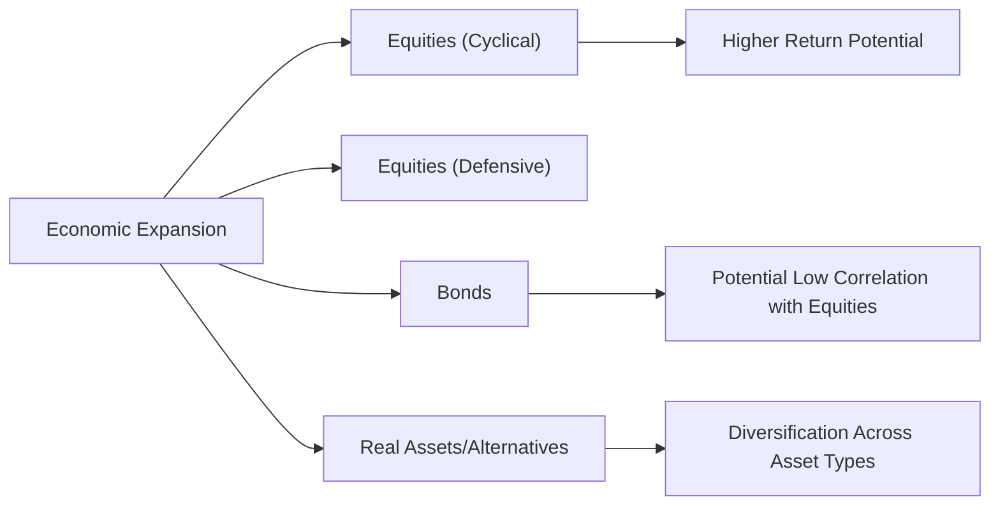

## Introduction

So, let’s talk about diversification in the context of economic cycles. We often think diversification is our go-to solution to limit risk, right? But I remember one of my first experiences in a market downturn—back in the day, I thought I was super smart with a “diversified” equity portfolio, only to watch nearly all my stocks tumble together when recession fears took hold. The reality is: correlations change over time, especially in times of crisis, and downturns are notorious for sending even seemingly distinct asset classes into a synchronized decline. 

This article dives into how economic cycles influence asset correlations and portfolio behavior, while also discussing global diversification opportunities, rebalancing strategies, and the role of cyclical vs. non-cyclical industries. We’ll explore best practices, highlight a few cautionary tales, and hopefully equip you with the knowledge to build robust, multi-asset portfolios that can withstand the twists and turns of global economies. 

## Economic Cycles and Correlation Patterns

Correlation, mathematically expressed as  

\rho_{X, Y} = \frac{\mathrm{Cov}(X, Y)}{\sigma_X \sigma_Y},
  
tells us how two assets move in relation to each other. The correlation coefficient ranges from -1 to +1. Values close to +1 mean assets move nearly in lockstep, whereas -1 implies they move in opposite directions. A correlation near zero indicates minimal relationship in returns.

But here’s the catch: correlations are not static. They shift with economic conditions, monetary policy changes, and even unexpected geopolitical events. During expansions, investors tend to be optimistic, capital flows freely into risk assets, and, ironically, the correlations among “risk-on” investments—like equities in cyclical industries—can remain moderate. However, as soon as fear creeps in and the economy heads south, investors often rush for the exits at the same time, pushing correlations between risky assets higher.

### Why Correlations Increase in Downturns

• Flight to Quality: In recessions, investors dump volatile equities and move into “safe-haven” instruments (e.g., Treasuries, gold). This creates downward pressure on equities broadly, causing many stocks to decline in tandem—even if their fundamentals differ.

• Systemic Risks: During broad economic crises (like 2008’s global financial crisis), liquidity concerns impact nearly every sector. Panic selling can overshadow fundamental differences, making all risky asset classes more correlated.

• Policy and External Shocks: Central banks often respond to recessions with monetary easing, which influences bond yields, credit spreads, and investment flows. These large-scale policy moves can shift correlation structures in unexpected ways.  

Anyway, the key takeaway: The diversification benefit from combining different equity sectors can erode in a downturn because stock correlations often rise when fear hits the market.

## Sectors and the Business Cycle

In the realm of equities, a distinction exists between cyclical industries and non-cyclical (defensive) industries. Understanding how each group behaves throughout the business cycle is essential for fine-tuning a portfolio’s diversification profile.

### Cyclical Industries

Cyclical industries (e.g., automobiles, technology, and consumer discretionary) tend to ride the wave of economic expansions. Think about it: When GDP is growing and people feel optimistic, they spend more on cars, fancy electronics, and discretionary items. However, when a contraction hits, demand for these goods or services drops proportionally—sometimes dramatically—leading cyclical stocks to fall together. 

### Non-Cyclical (Defensive) Industries

Non-cyclical, or defensive, sectors (e.g., healthcare, utilities, consumer staples) typically offer essential goods and services that people need regardless of their economic circumstances. These companies’ revenues are less sensitive to economic downturns. When the economy slows, these sectors may remain more stable, providing a partial hedge to the volatility in cyclical holdings.

## Global Diversification and Asynchronous Cycles

One of the coolest aspects of investing on a global scale is that not all economies move in perfect sync. You might see the U.S. economy expanding while parts of Europe are stagnating, or some emerging markets racing ahead while developed markets are hitting a plateau. 

• Asynchronous Growth: By investing across multiple regions, you can potentially offset losses in one declining market with gains in another that’s surging.

• Currency Dimensions: International exposures introduce currency risk. In expansions, emerging market currencies may strengthen, boosting returns for foreign investors, while in recessions, capital might flow back to developed market safe havens, impacting exchange rates and equity valuations.

• Political and Geopolitical Factors: Different countries have different fiscal and monetary policies. These variations can diversify the portfolio’s overall risk if timed or chosen well. But be aware that global crises—like the 2020 pandemic—can result in a broad, synchronized slowdown, limiting the usual benefits of global diversification.

I once saw a portfolio manager at a large institution use global diversification to significantly reduce drawdowns in one of the cyclical downturns in Europe. She allocated part of her portfolio into Asian markets, which were experiencing a growth spurt due to strong export activity. While Europe struggled, the Asian exposure helped mitigate losses. The moral? Asynchronous growth is real, but you have to keep an eye on local fundamentals and political stability.

## Building a Multi-Asset Portfolio

It’s not just about stocks and more stocks. A truly diversified portfolio harnesses multiple asset classes such as bonds, commodities, real estate, and sometimes even alternatives (private equity, hedge funds, etc.). Each asset class has its own risk-return profile and correlation dynamics relative to equities.

• Bonds: Typically exhibit an inverse or low correlation to equities, especially government bonds. During recessions, interest rates often fall, pushing up bond prices. However, corporate bonds can behave differently if the issuer’s default risk rises in tandem with an economic downturn.

• Real Assets: Real estate, infrastructure, or commodities can behave differently across the business cycle. Commodities may boom during expansions (driven by industrial demand), but can also be quite volatile. Real estate tends to be more stable in mild downturns, but in a severe economic crisis tied to real estate (e.g., 2008), correlations can spike.

• Alternatives: Alternative investments, such as private equity or hedge funds, promise a lower correlation, but that promise doesn’t always hold under stress. Additionally, liquidity constraints can pose challenges during recessions.

### Visualizing a Simple Multi-Asset Relationship



In expansions, cyclical equities (B) might provide higher returns (F), while bonds (D) often provide a stabilizing effect (G). Real assets and alternatives (E) further broaden diversification (H).

## Rebalancing to Maintain Asset Allocation

Even the best-designed allocations can drift away from their target weights due to market movements. In a bull market, equity weights can swell, potentially leaving you overexposed to the very asset class most at risk in the next downturn.

• Periodic Rebalancing: By selling assets that have gone up relative to your target and buying assets that have lagged, you preserve your risk profile and lock in some gains. This is akin to automatically “buying low and selling high.”

• Tax Implications: For taxable accounts, rebalancing might trigger capital gains. In practice, many investors will carefully schedule rebalancings—maybe annually or semi-annually—or use cash flows from distributions to rebalance with fewer tax consequences.

• Psychological Benefits: Rebalancing enforces discipline. It’s tough to sell your winners when you feel like the market is unstoppable, but that discipline helps reduce portfolio vulnerability in the next downturn.

## Stress Testing for Different Economic Phases

Before you get too comfortable, it’s wise to simulate how your portfolio might behave in different macroeconomic scenarios. Stress testing involves looking at severe recessions, inflation spikes, or even deflationary shocks to see if correlations hold as expected.

• Historical Simulations: Use actual crises (e.g., 2008 financial crisis, the dot-com bust, or the pandemic-driven downturn) as a reference point to gauge how each component of the portfolio performed.

• Hypothetical Scenarios: Suppose interest rates rise by 300 basis points, or GDP declines by 3%. Then observe how cyclical stocks, defensive stocks, bonds, and other assets might move in tandem. This helps uncover hidden concentrations.

• Risk Factor Decomposition: Advanced approaches decompose a portfolio’s risk exposures into common factors (e.g., credit spreads, equity beta, inflation risk). During stress tests, you’ll see how these factors might simultaneously shift.

## Balancing Return and Risk

We often talk about the “free lunch” of diversification, but let’s be real: Over-diversification can dilute returns. There’s a trade-off between achieving a comfortable risk profile and potentially missing out on some big gains from strong-performing sectors or asset classes.

The key is to target an “optimal diversification” level, where your portfolio’s risk is aligned with your investment horizon and risk tolerance. For instance, young investors might accept more equity exposure (and a corresponding cyclical tilt), while retirees might emphasize stable income and capital preservation, leaning on high-quality bonds and defensive sectors.

## Quick Python Code Example: Calculating a Portfolio Correlation Matrix

Below is an example of how one might evaluate correlations between different asset classes using Python. In real life, you’d use a much larger dataset with monthly or weekly returns:

```python
import numpy as np
import pandas as pd

data = {
    'CS' : [0.02, 0.03, -0.01, 0.04, -0.02],
    'DS' : [0.01, 0.02,  0.01, 0.01,  0.00],
    'BD' : [0.00, 0.01,  0.01, 0.02,  0.01],
    'CM' : [0.03, -0.02, 0.04, 0.01, -0.01]
}

returns_df = pd.DataFrame(data)
correlation_matrix = returns_df.corr()

print("Correlation Matrix:\n", correlation_matrix)
```

You’ll likely see that the cyclical stock (CS) has higher correlation with defensive stock (DS) during expansionary periods of your dataset, and possibly a different relationship in downturn windows. Breaking your data into different time horizons can highlight how correlations shift over the business cycle.

## Practical Tips and Pitfalls

• Overconfidence in Historical Correlations: Relying solely on historical data can be misleading if structural changes in the market or economy alter correlation patterns.

• Liquidity Issues: Some asset classes (private equity, real estate) might not provide nimble exits during downturns. In a crisis, liquidity dries up, so correlation can spike even though the assets don’t “officially” trade as often.

• Hidden Concentration: If multiple holdings share the same risk factor (e.g., all are sensitive to interest-rate spikes), you may be less diversified than you think.

• The Rebalancing Trap: Rebalancing imposes transaction costs and potential tax consequences. Evaluate the frequency and threshold for rebalancing carefully.

• Factor Investing Overlaps: Another layer that can stealthily erode your diversification is factor overlap (e.g., “value,” “growth,” “momentum”). Different funds might be labeled differently but end up exposing you to the same factors.

## Conclusion

Diversification is more an art than a static formula. Economic cycles play a major role in shaping how correlations behave, and a seemingly robust portfolio can suddenly appear fragile in a financial crisis. By paying attention to cyclical vs. defensive industries, maintaining dynamic global exposures, and rebalancing thoughtfully, you can mitigate much of the risk that stems from synchronized asset movements. 

At the same time, stress-testing the portfolio for extreme but plausible scenarios is vital to ensure you aren’t blindsided by shifting correlation structures. And remember, there’s a sweet spot with diversification—too much can erode potential returns, too little can leave you dangerously exposed.  

In my experience, it’s those times when markets defy our expectations that highlight the real value of a well-thought-out (and well-monitored) diversification strategy. After all, you don’t want to discover your portfolio’s correlation is near +1 the hard way, right when you need protection the most!

## References

• Bernstein, William. “The Intelligent Asset Allocator.”  
• MSCI’s Global Industry Classification Standard (GICS): https://www.msci.com/gics  
• “Global Financial Markets: Correlation and Crisis” (CFA Institute Publications).  
• CFA Institute Curriculum, Various Readings on Asset Allocation and Economic Cycles.

## Test Your Knowledge: Diversification and Economic Cycles



### A portfolio's overall correlation among assets often does which of the following during a severe recession?

- [ ] Declines significantly
- [ ] Remains unchanged due to stable fundamentals
- [x] Increases because investors tend to flee risky assets simultaneously
- [ ] Increases only for bonds

> **Explanation:** Historical crises demonstrate that correlations among risky assets often converge as investors sell off these assets in tandem.  

### Which statement best describes the rationale for global diversification?

- [ ] It completely eliminates currency risk during recessions.
- [x] Different regions may experience asynchronous business cycles, smoothing overall returns.
- [ ] It is only beneficial during economic booms.
- [ ] It always guarantees higher returns.

> **Explanation:** Global markets often follow distinct cycles, so one region’s downturn may offset another’s expansion, resulting in more stable portfolio performance.  

### What is the primary advantage of rebalancing a portfolio periodically?

- [ ] It guarantees higher returns relative to a buy-and-hold strategy. 
- [x] It maintains a target risk exposure by selling outperforming assets and buying underperforming ones.
- [ ] It eliminates tax liabilities on capital gains.
- [ ] It has no real advantage.

> **Explanation:** Rebalancing forces discipline, ensuring that your portfolio’s risk exposure remains aligned with your desired asset allocation.  

### Which is a true statement about cyclical industries during an economic contraction?

- [ ] They usually outperform defensive industries.
- [x] They often experience a sharper decline in revenues and stock prices.
- [ ] They remain unaffected by consumer sentiment.
- [ ] They have zero correlation to overall market movements.

> **Explanation:** Demand for cyclical products declines more rapidly during recessions as consumers cut back on discretionary spending, causing stock prices in these sectors to usually drop more sharply than defensive stocks.  

### When correlations among asset classes rise dramatically, what is the most likely outcome for diversification benefits in a portfolio?

- [ ] Diversification benefits increase
- [ ] Diversification benefits remain unaffected
- [x] Diversification benefits decrease 
- [ ] Diversification eliminates market risk

> **Explanation:** Correlation spikes typically reduce the effectiveness of diversification since assets tend to move together in the same direction.  

### Which of the following is a key motivation for including bonds in a multi-asset portfolio?

- [x] Bonds often have a lower or negative correlation with equities, adding stability.
- [ ] Bonds have no impact on overall portfolio volatility.
- [ ] Bonds always outperform equities during expansions.
- [ ] Bonds reduce returns without meaningful risk reduction.

> **Explanation:** Government bonds, in particular, can offer diversification benefits because they frequently respond differently to economic changes than equities do.  

### Stress testing a portfolio helps investors do which of the following?

- [ ] Predict the exact timing of a recession.
- [x] Identify how portfolio assets might perform under extreme market scenarios.
- [ ] Guarantee that correlations will remain constant.
- [ ] Remove economic cycle effects entirely.

> **Explanation:** Stress testing uses hypothetical or historical scenarios to see how different assets or factors in a portfolio might shift under adverse conditions.  

### Which statement best describes a potential downside of over-diversifying a portfolio?

- [ ] It increases overall portfolio risk due to hidden correlations.
- [x] It may dilute potential returns by adding too many low-return assets.
- [ ] It reduces the investor’s tax liabilities.
- [ ] It prevents correlations from changing.

> **Explanation:** Too many holdings, particularly those with similar beta or factor exposures, can spread the investor’s resources thin, potentially reducing total return without significantly enhancing risk control.  

### Which is an example of a defensive (non-cyclical) industry?

- [x] Utilities
- [ ] Automobiles
- [ ] Airlines
- [ ] Consumer electronics

> **Explanation:** Utilities are typically classified as defensive or non-cyclical because demand does not vary significantly with economic cycles.  

### True or False: Relying exclusively on historical correlations can be misleading if market structures or policies change significantly.

- [x] True
- [ ] False

> **Explanation:** Correlations evolve over time as market conditions, policies, and investor behaviors shift. Historical data may not fully capture future patterns.


