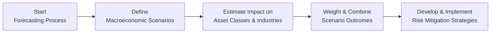

Scenario analysis is a powerful technique for assessing how economic shifts might ripple through investment portfolios. Essentially, we try to imagine future states of the world—like a recession, a sudden commodity price spike, or a surge in inflation—and then evaluate how each scenario could affect individual assets or entire portfolios. Even though we can’t predict the future with absolute certainty (I wish we could!), scenario analysis helps us get ready for a range of possibilities. In the following sections, we’ll unpack the why, how, and what-if of scenario analysis while highlighting risk management strategies that can help keep portfolios afloat when the unexpected happens.

## Core Ideas Behind Scenario Analysis

The heart of scenario analysis is story-telling—structured, data-driven stories, but still stories about potential futures. These stories aren't limited to just your baseline forecast. Instead, they encourage you to outline multiple plausible versions of how market, economic, and political conditions might evolve. That means looking at:

• Recessionary environments  
• High-inflation or stagflation scenarios  
• Commodity or oil shocks  
• Unexpected geopolitical or policy-driven changes  
• Technological upheavals  

Importantly, scenario analysis goes hand in hand with risk management. You’re not just predicting outcomes; you’re also asking, “If this scenario unfolds, what’s my plan?” or “How might my asset allocation change?” This is where strategic hedging, diversification, and rebalancing come into play.

## Constructing Plausible Scenarios

When building scenarios, it’s best to combine historical insights, current conditions, and forward-looking assumptions. For instance, you might recall from Chapters 3 and 7 how macroeconomic conditions—like GDP growth, inflation, and monetary policy—often drive markets. Let’s consider a recession scenario:

1. You assume a substantial drop in GDP growth along with rising unemployment.  
2. You foresee a flight to quality increasing demand for government bonds.  
3. You anticipate central banks might cut interest rates.  

Your scenario tries to paint a coherent picture of each driver. In a more extreme scenario—say a global supply shock—your analysis might highlight surging prices, monetary tightening, and pressures on corporate profit margins.

While it’s tempting to just guess at random possibilities, scenario construction should be systematic. Start with known fundamentals (interest rates, inflation, real economic activity) and then factor in potential triggers (changes in fiscal policy, geopolitical tensions, commodity price trends). Keep track of the assumptions you’ve baked into the scenario. Document them carefully so you can revise them if new data emerges.

## Identifying Macroeconomic Drivers

Different economies respond in different ways to the same shock. That said, a few drivers commonly appear in scenario analysis:

• Interest Rates: Central bank policy shifts can directly influence bond yields, corporate borrowing costs, and foreign exchange markets.  
• Inflation and Commodity Prices: Be aware of how input cost changes impact certain industries (e.g., manufacturing, airlines, consumer goods).  
• GDP Growth and Economic Cycles: Pay attention to consumer demand, corporate earnings, and sector rotations in expansions and recessions.  
• Labor Market Trends: Changes in unemployment or wage growth can signal shifts in consumption.  
• Fiscal Policy: Government spending and taxation can either stimulate or restrain economic momentum.  
• Geopolitical Events: Trade wars, sanctions, and political upheavals can quickly disrupt global supply chains and investment flows.

In scenario planning, you pick the variables most relevant to the situation you’re trying to model. For instance, a scenario focusing on “commodity shock” might emphasize global oil supply disruptions, changes in inflation expectations, and potential policy responses. Another scenario centered on “soaring inflation” might delve into wage-growth dynamics, central bank interest rate hikes, and currency swings.

## Quantitative versus Qualitative Approaches

Scenario analysis can be both data-heavy and story-driven:

• Quantitative Methods: Examples include econometric models, factor-based risk models, and Monte Carlo simulations. These approaches help you pinpoint correlations, historical patterns, and the range of possible outcomes. A simple illustration is regressing asset returns on key macro factors (e.g., inflation or interest rates) to estimate how a portfolio might behave if those factors change.  

• Qualitative Inputs: Expert judgments, roundtable discussions, and industry outlook reports are also vital. This method acknowledges that no single statistical model perfectly captures the unpredictability of real-life shocks (like political events, policy errors, or even pandemics).  

Typically, advanced scenario analysis marries both quantitative and qualitative approaches. You might pull time-series data on historical recessions to see how equities, bonds, and commodities performed, then layer in your own logic about how the next recession might be different. That combination ensures your scenario is grounded in reality but also flexible enough to incorporate new insights.

## Historical Performance of Asset Classes and Industries

We often look to the past to see how markets reacted under similar macroeconomic conditions. For instance:

• Equities: In high-growth, low-inflation scenarios, equities often shine. But in a recession, corporate earnings tend to fall, and equity valuations can tumble.  
• Bonds: Treasuries often act as a safe haven during market turmoil. Corporate bonds might underperform if credit spreads widen due to liquidity concerns.  
• Commodities: Commodity prices—particularly oil, metals, and agricultural products—rise when global demand outpaces supply. On the flip side, demand collapses can hammer prices in recessions (although supply disruptions can offset this).  
• Real Estate: This can be sensitive to interest rates and lending conditions. In a high-inflation/higher-rate scenario, real estate might face a slowdown in sales volume, though certain types (like rental properties) may find inflation pass-through options.  

Of course, each crisis or economic cycle is unique, but historical episodes can at least serve as a reference point. It’s wise to identify parallels and divergences. For example, a 1970s-style stagflation scenario might not replicate precisely, but cautionary tales of how inflation eroded real returns—and how certain commodity exposures provided partial hedges—can inform strategy.

## A Quick Mermaid Flow of Scenario Analysis

Below is a simple visual of the scenario analysis process:



1. Define your “worlds” (e.g., recession, high growth, inflation spike).  
2. Estimate the impact on various asset classes, referencing both data-driven factor models and expert insights.  
3. Assign probabilities if you feel comfortable quantifying your confidence in each scenario.  
4. Use results to shape your hedging or asset rebalancing strategies.

## Risk Management Tools

Scenario analysis is only as useful as the actions you take. If you identify a possible market downturn but fail to adjust your portfolio, scenario planning becomes more of a theoretical exercise than a practical one. Some risk management choices include:

• Hedging with Derivatives: Buying put options on an equity portfolio or interest rate swaps for fixed income positions. Currency forwards or options can hedge against exchange rate uncertainties.  
• Shifting Geographic Exposures: If your recession scenario suggests advanced economies might falter, you might rebalance some capital toward emerging markets (or vice versa).  
• Downside Protection: Protective puts, stop-loss orders, or tail-risk hedging strategies can limit catastrophic losses.  
• Factor or Thematic Exposure: If your inflation scenario signals strong commodity performance, you might tilt your portfolio toward resource stocks or commodity-linked funds.  
• Cash Buffers: Don’t underestimate the value of holding some cash and short-term instruments. If your scenario is uncertain, liquidity can be invaluable when opportunities or risks present themselves unexpectedly.

Scenario analysis also helps you decide on the intensity of hedges. Maybe you don’t want to over-insure your portfolio and reduce potential upside. Or maybe you feel the risk is dire enough to adopt a more defensive stance. The approach depends on your investment horizon, risk tolerance, and portfolio objectives (e.g., are you a pension fund preserving capital for retirees, or a hedge fund seeking opportunistic plays?).

## Probability Weighting and Expected Outcome Distributions

If you’re comfortable assigning probabilities to each scenario, you can estimate expected portfolio outcomes. In a simplified example:

• Scenario A (recession): Probability 30%, Portfolio Return = −5%  
• Scenario B (baseline growth): Probability 50%, Portfolio Return = +6%  
• Scenario C (high growth): Probability 20%, Portfolio Return = +10%

Then the expected return, E(R), is:


E(R) = 0.3 \times (-5\%) + 0.5 \times 6\% + 0.2 \times 10\% = 0.3 \times (-0.05) + 0.5 \times 0.06 + 0.2 \times 0.10.



E(R) = -0.015 + 0.03 + 0.02 = 0.035 \quad (3.5\%).


Though the point estimate might say 3.5%, your real benefit is seeing a range of outcomes. You’ll notice that if Scenario A occurs, things get unpleasant with −5%, whereas Scenario C might yield stronger returns if the economy booms. Having distributions of potential results fosters a deeper conversation on how to structure the portfolio for both survival and growth.

Here’s a bite-sized Python snippet that illustrates the same concept:

```python
import numpy as np

p = np.array([0.3, 0.5, 0.2])

r = np.array([-0.05, 0.06, 0.10])

expected_return = np.sum(p * r)
print("Expected return:", expected_return)
```

When you run this code, you’d see that the expected return prints out at 0.035 (or 3.5%). Of course, real-world scenario analysis could include more detailed macro factors and correlations across multiple asset classes.

## Documentation and Trigger Points

To avoid confusion, always document the assumptions and triggers embedded within each scenario. Why is interest rate policy set at 2% in your recession scenario, or 5% in your inflation scenario? What specific events or thresholds could shift the economy from baseline growth to high growth or recession?

Examples of triggers include:  
• Central banks adopting unexpected hikes or cuts in interest rates.  
• Large-scale geopolitical events that disrupt trade flows.  
• Inflation rates breaching certain psychological or policy-relevant benchmarks.  
• Commodity markets facing supply constraints (e.g., an OPEC production cut).  

Documenting these triggers is a big help for future “check-ins” on whether your scenario is becoming more likely. You can then adjust hedges or exposures proactively, rather than waiting for markets to move sharply against you.

## Integrating Scenario Analysis into the Investment Process

If you recall from Section 12.4 (Using Macroeconomic Indicators for Tactical Asset Allocation), we talked about harnessing economic data to fine-tune investment decisions. Scenario analysis is a natural extension. You gather or nowcast economic indicators, watch for divergences or turning points, and then see which scenario is playing out.  
• Do leading indicators point to an economic downturn? Increase hedges or tilt to more defensive sectors.  
• Are inflationary pressures building? Consider inflation-protected securities, commodities, or real assets.  
• Are supply chain constraints normalizing? That might reduce the probability of a stagflation scenario.  

The bottom line? Scenario analysis helps with capital market expectations, fosters discipline, and ensures you’re mentally prepared for multiple paths. 

## Best Practices, Pitfalls, and Personal Reflections

I remember the first time I performed a formal scenario analysis: I got so deep into the weeds of complex assumptions that the final result looked like a spreadsheet labyrinth. My biggest takeaway was that scenario analysis is valuable only if it remains transparent and understandable. If colleagues can’t replicate your scenario framework or interpret your conclusions, you’ve gone too far into complexity.

A few best practices to keep you on track:

• Start simple. Focus on major macro variables.  
• Don’t rely entirely on models without applying well-reasoned judgment.  
• Regularly revisit and adjust scenarios—because the world changes faster than our spreadsheets.  
• Use scenario conclusions to inform real action: rebalancing, hedging, or changing tactical allocations.  

Pitfalls often revolve around incomplete or biased assumptions. Overly rosy or overly dire outlooks can lead to misguided decisions. It’s also easy to ignore something like correlation changes in a crisis, or to oversimplify the link between a macro event and a particular market. Always plan for the unexpected correlation shifts (e.g., all assets dropping simultaneously in severe market stress).

## Glossary

• Scenario Analysis: A structured method to evaluate how changes in key variables affect investment outcomes.  
• Plausible States of the World: Potential future conditions, not just the baseline but also upside and downside extremes.  
• Hedging: Strategies to reduce risk exposure, typically by taking offsetting positions in related assets or derivatives.  
• Trigger: An event or threshold that can materially shift economic conditions (e.g., an abrupt policy change, a geopolitical event).  
• Downside Protection: Methods of limiting losses in adverse scenarios (e.g., purchasing protective puts, using stop-loss orders).

## Final Exam Tips

When showcasing scenario analysis skills in an exam context—especially for a constructed-response or item set question—always outline your key assumptions. If the exam prompt provides a set of conditions, use them in your scenario logic. For instance, if the prompt hints that monetary policy is accommodative, factor that into your baseline scenario, and then create an alternative scenario where policy tightens faster than anticipated. Also:

• Don’t just list scenarios; explain how they affect the portfolio.  
• Highlight what risk management strategies you would adopt in each scenario.  
• Show a clear link between the macro driver (e.g., inflation) and the portfolio factor(s) (e.g., equity exposure, bond duration).  
• Practice clarity: exam graders reward structured, well-organized answers.

## References & Further Reading

• “Scenario Analysis of Global Markets” by the Bank for International Settlements (BIS).  
• “The Practice of Risk Management” by RiskBooks.  
• Articles on scenario planning from CFA Institute:  
  – https://www.cfainstitute.org/en/research  

---

## Mastering Scenario Analysis and Economic Risk: 10 Practice Questions



### 1. What is the primary benefit of including expert opinion in scenario analysis?

- [ ] It replaces the need for any quantitative modeling.  
- [ ] It guarantees more accurate scenario outcomes.  
- [x] It adds judgment-based perspective to complement data-driven methods.  
- [ ] It allows you to ignore historical data altogether.  

> **Explanation:** Expert opinion can capture insights beyond the scope of purely quantitative models, especially for unique or unprecedented economic events.

### 2. Which macroeconomic factor is most likely to increase demand for government bonds?

- [x] Rising risk aversion during a recession.  
- [ ] A boom in consumer discretionary spending.  
- [ ] Strengthening corporate earnings.  
- [ ] Stable unemployment rates.  

> **Explanation:** In a recessionary environment, investors often flee riskier assets in favor of safer holdings like government bonds.

### 3. In assigning probabilities to different economic scenarios, which of the following challenges is most significant?

- [ ] Determining current interest rates.  
- [x] Estimating the subjective likelihood of complex future events.  
- [ ] Calculating the historically observed volatility of an asset.  
- [ ] Summarizing a single best estimate of GDP growth.  

> **Explanation:** Scenario analysis requires managers to attach subjective probabilities to uncertain, potentially rare economic events. Assigning these probabilities is often associated with deep uncertainty and relies partly on judgment.

### 4. Which of these is an example of a trigger that might escalate an inflationary scenario?

- [ ] Decline in wages due to automation.  
- [ ] A stable, long-standing central bank policy.  
- [ ] Decreased government spending in industries with surplus capacity.  
- [x] Abrupt cut in global oil production causing an uptick in commodity prices.  

> **Explanation:** A sudden downturn in oil production can fuel broad-based price increases, making it a potential trigger for an inflation surge.

### 5. An analyst runs a scenario analysis with a recession scenario, an inflationary scenario, and a baseline scenario. The final step the analyst performs is to:

- [ ] Gather historical data on real GDP.  
- [x] Implement corresponding risk management strategies (e.g., hedging).  
- [ ] Determine market share for major firms.  
- [ ] Eliminate outlier scenarios.  

> **Explanation:** The value of scenario analysis is in applying its lessons to actual portfolio decisions, such as implementing hedges or adjusting exposures.

### 6. In a scenario where interest rates rise sharply, which asset class is generally most negatively impacted?

- [ ] Short-term government bills.  
- [ ] Real assets featuring inflation pass-through.  
- [ ] Floating-rate notes.  
- [x] Long-duration fixed-rate bonds.  

> **Explanation:** When interest rates move up, the prices of long-duration fixed-rate bonds drop significantly due to the inverse relationship between yields and prices.

### 7. Under which scenario would allocating more capital to global equities potentially provide resilience?

- [x] Baseline or moderate growth environment.  
- [ ] Deep recession with credit freeze.  
- [x] Mild inflationary expansion.  
- [ ] Severe stagflation with monetary tightening and lower corporate earnings.  

> **Explanation:** In moderate growth or mild inflation, equities often perform reasonably well. They may suffer if a severe recession or stagflation hits.

### 8. Which behavior best illustrates scenario analysis as a continuous process?

- [ ] The manager sets scenario assumptions once and does not revisit them.  
- [ ] The manager uses only one scenario to keep analysis simple.  
- [ ] The manager only reacts after a shock has already happened.  
- [x] The manager regularly updates scenario inputs and triggers with new economic data.  

> **Explanation:** Continuous monitoring and updating of scenario assumptions help reflect real-world changes, making scenario analysis a dynamic tool.

### 9. If an asset manager seeks downside protection for a possible equity market decline, which of the following is a commonly used technique?

- [ ] Writing a covered call on the equity position.  
- [x] Buying protective put options.  
- [ ] Entering into a pay-floating interest rate swap.  
- [ ] Going long on equity futures contracts.  

> **Explanation:** A protective put is a standard option-based strategy to hedge against potential equity market drawdowns.

### 10. Scenario analysis typically includes a “baseline scenario.” True or False?

- [x] True  
- [ ] False  

> **Explanation:** A baseline scenario, often considered the “most likely” path, is a central feature of scenario analysis, accompanied by upside and downside cases.


